# Overview

## Introduction

CCP - Cirrus Cloud Platform, a Cloud Self-Service Portal that captures the overall product specifications to create a comprehensive cloud offering for your business and provides seamless infrastructure provisioning, monitoring, and management of cloud services. CCP platform is a cloud orchestrator or manager designed to provide hyper-scaler-like capabilities to OpenStack and Kubernetes-based deployments. The purpose is to provide better cloud services in terms of features, stability, and performance. Empower your team with the ability to effortlessly deploy, monitor, and control your infrastructure, ensuring optimal performance and efficiency.

This user guide aims to provide an orchestration layer that includes key functionality of an OpenStack and Kubernetes-based public cloud experience. Cloud services include the Resources and Admin sections.

## Scope of Document

The scope of this document is to explain the usability and functionality of the CCP service console to its users.

# Dashboard

The **CCP dashboard** is your central hub for managing cloud infrastructure. It provides a high-level view of your resources and offers quick navigation to deploy, configure, and monitor your environment.

## Global Navigation & Organization

At the top of the interface, you can manage your working context:

**Organization/Project Selector:** Switch between different organizations or specific projects.

**Region Selector:** Choose the specific data center location (e.g., IN-CHN-DEV-01) for your resources.

**Global Search:** Quickly find resources or services using the Ctrl+K shortcut.

**Admin Switch:** If authorized, toggle between User and Admin views to manage system-level settings.

## Quick Actions

Located at the top of the main workspace, these cards allow for one-click deployment of the most common cloud resources:

**Virtual Machines (****VMaaS****):** Spin up new compute instances.

**Storage & File Systems:** Provision block or shared storage instantly.

**Load Balancers:** Set up traffic distribution for your applications.

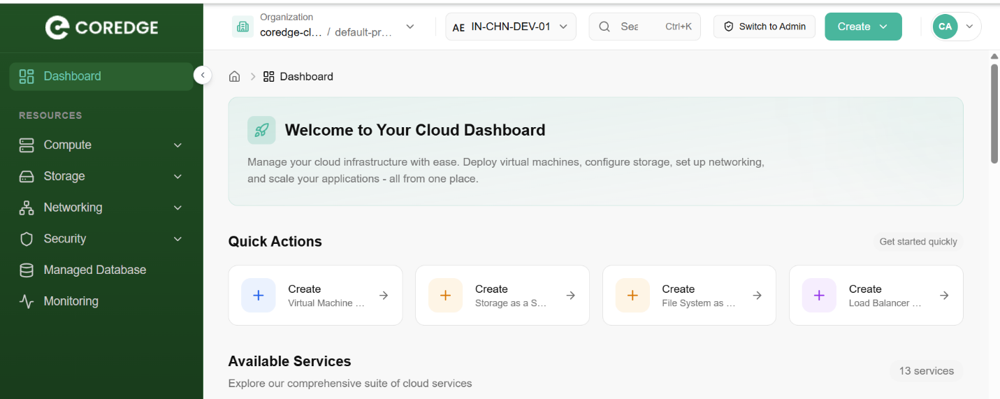

## Available Services

The dashboard categorizes 13+ core services into four primary pillars to help you scale your infrastructure:

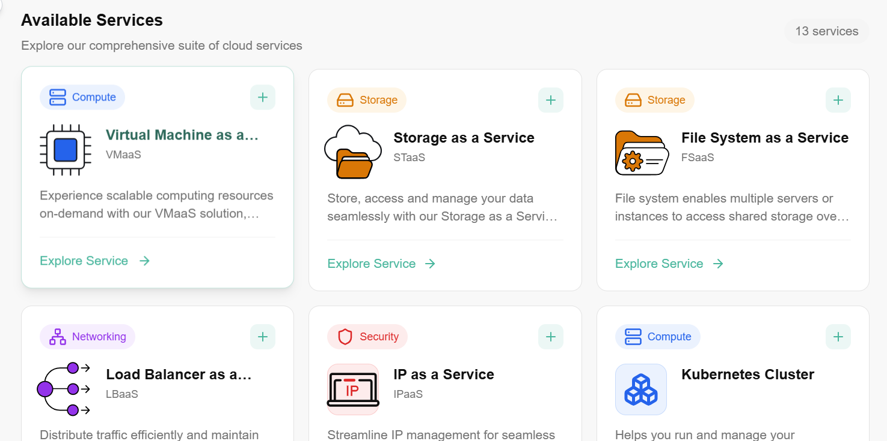

## Support & Resources

At the bottom of the dashboard, you can access essential developer and help tools:

**Documentation:** Comprehensive guides and tutorials.

**Support:** Direct link to contact the technical team for assistance.

**API Access:** View API documentation to automate your workflows via CLI or custom scripts.

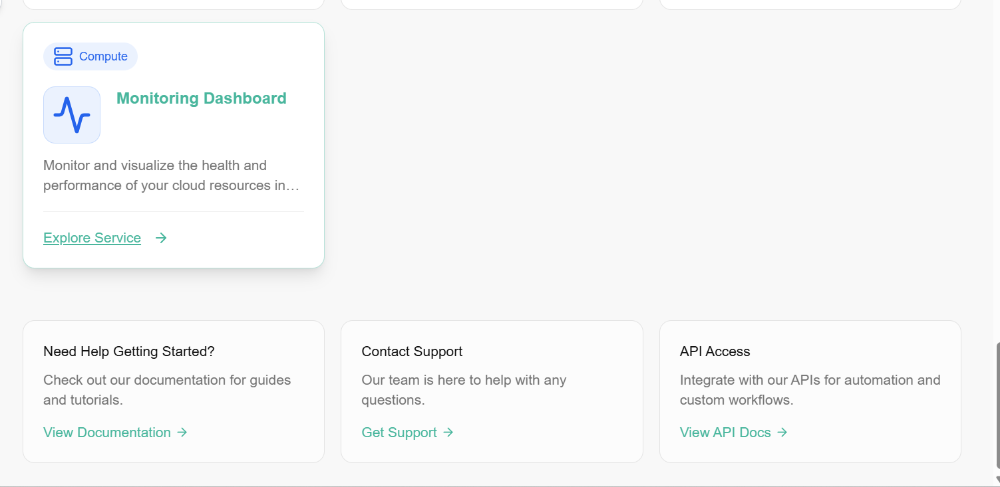

# Resources

## Compute

Compute refer to virtual machines that provide cloud-based processing power. A user can deploy and manage scalable, customizable instances to run applications, websites, and other workloads on the cloud.

### Virtual Machine

Compute is a virtual machine that provides cloud-based processing power. You can deploy and manage these scalable, customizable instances to run applications, websites, and other workloads on the cloud. In CCP, Compute will provide a way to provision and manage on-demand compute instance VMs. You can create instances as needed to meet your computing and application requirements. After creating an instance, you can access it securely from your computer, restart it, attach, and detach volumes, and terminate it when you're done. Any changes made to the instance's local drives are lost when you terminate them. Any saved changes to volumes attached to the instances are retained. Virtual Machines are virtualized computing instances that allow you to run applications and services in a cloud environment. Compute provide scalable, isolated, and customizable computing resources, enabling you to deploy and manage your software efficiently.

#### Procedure to create Virtual Machine

1. Log in to the CCP service platform.
1. From the left navigation panel, navigate resources and select Compute.
1. Click on Compute, click on Virtual Machines tab.
1. On the virtual machine dashboard, click on create Virtual Machine button.
1. Choose Networks - Connects virtual machines within the same region, allowing them to communicate securely and efficiently with each other. Fill out the necessary details. Select VPC, availability zone, and subnet from the drop-down box and click on the next button.
1. Image - Image is a pre-configured snapshot or template of a virtual machine, including the operating system and any pre-installed software used to create new virtual servers. You must select public images and snapshots. Once the image is selected, it will show you its version options. Choose version options from the drop-down box.
1. Select specifications. A user can select the specifications of choice. Select type and flavor.
1. Machine Details - Provide a unique name for your virtual machine. Select the number of VMs you require. Enter the description for your virtual machine.
1. Storage- Root volumes are block storage devices that provide scalable and persistent storage for virtual machines. Select volume type from the drop-down. You can choose root volume according to your requirements. Select root volume (in GiB).
1. Additional volume - Volumes are block storage devices that provide scalable and persistent storage for virtual machines. Optionally, you can select additional volume by deselecting skip button. Fill in details as required.
1. Configure firewall rules for network access control.
1. Select a key pair or username & password for connecting to your virtual machine.
1. Select your machine credentials from the dropdown menu.
1. Execute shell commands during initialization.
1. Apply custom tags to organize your cloud resources (up to 5 labels).
1. Click on create virtual machine button.

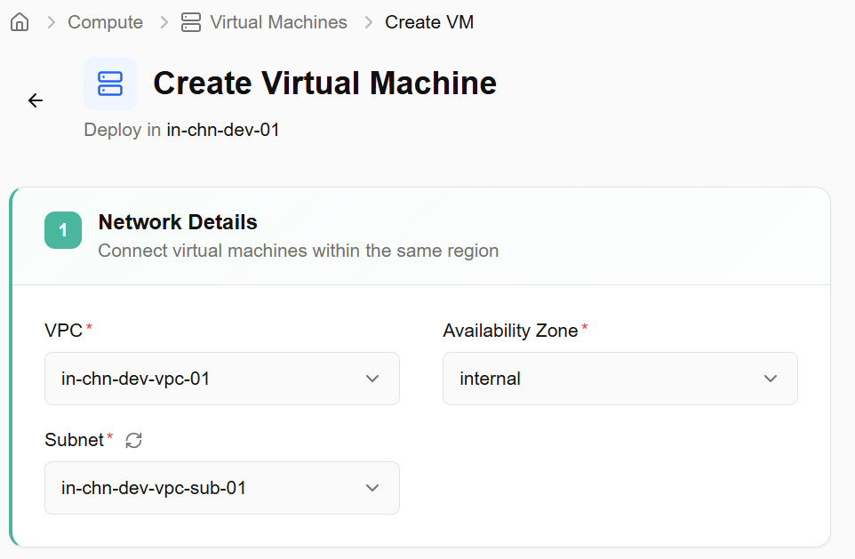

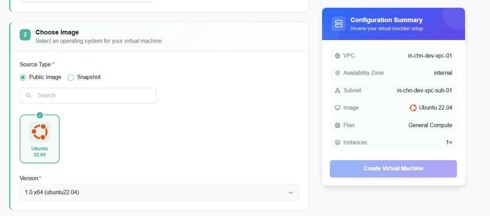

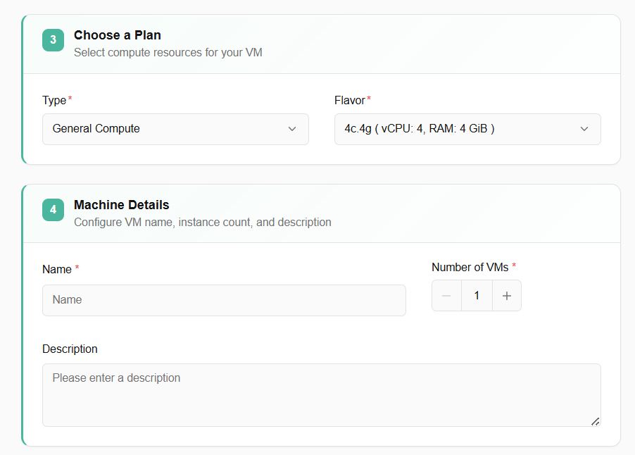

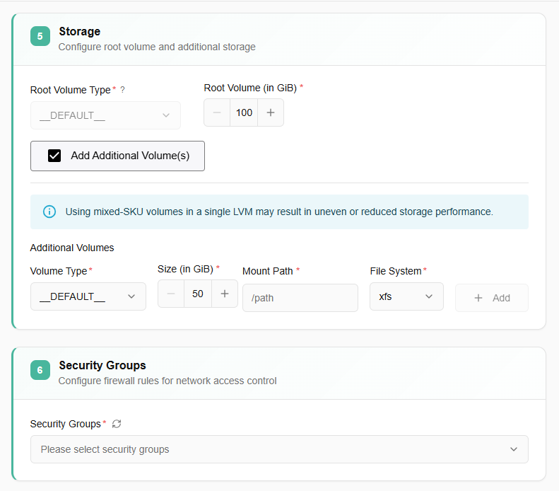

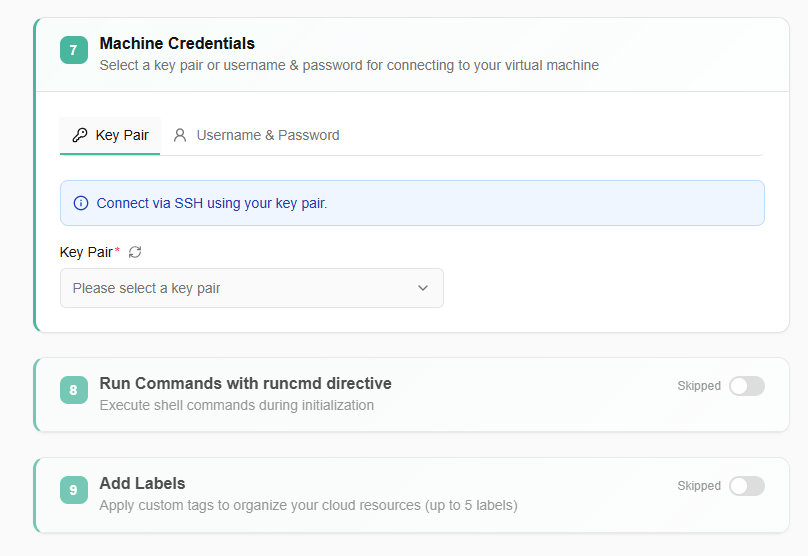

##### Virtual Machine Details

Virtual machine details provide detailed information after a virtual machine is created. A user can perform various actions on their created VM through a compute dashboard. Created virtual machines tile include:

1. Name of a created virtual machine.
1. You can also check status, flavor, flavor group, Private IPs, availability zone, labels, created by, created, and last updated details.
1. Search box helps a user to search for a VM and get its details.
1. Availability zone box helps a user to select VMs AZ.
1. A user can view preferences, export VM data, can switch the preference of card or table view, and can use refresh button to get latest information. All these are available at the top right corner of a virtual machine tile.

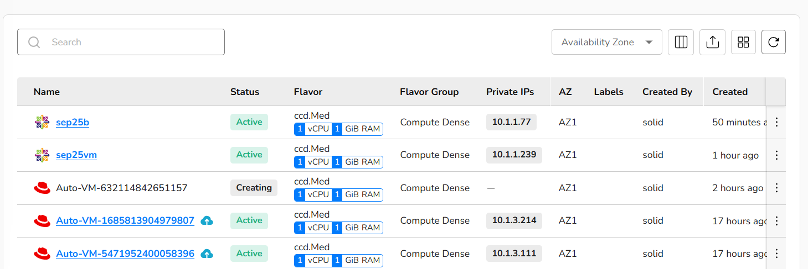

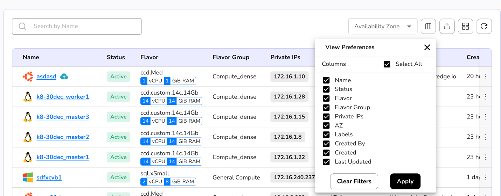

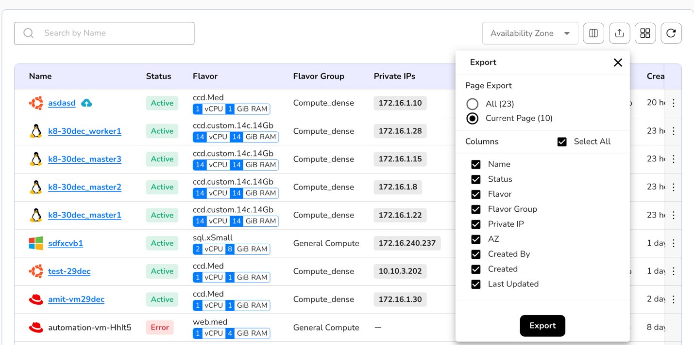

1. If a user clicks on the created virtual machine name, it will provide details of a VM like the private IP of a VM, public IP of a VM, console of a VM, and labels attached to a VM.
1. Detail dashboard of a created virtual machine tile includes overview, snapshots, storage, networks, ports, console logs, and monitoring.
1. A launch console button is also available which helps a user to run commands.

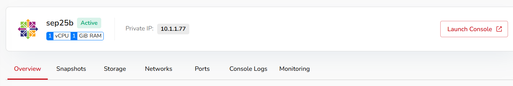

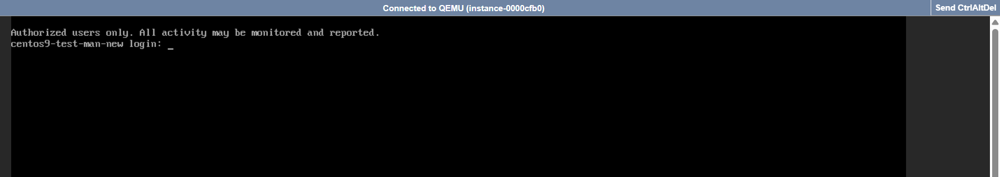

Detailed dashboard of a created virtual machine also includes:

**Overview Section:** An overview section shows you basic details about a VM, like when it was created, the VM's name, its region, its status, the project it is attached to, and so on. The overview section also gives you security group details and volumes attached to virtual machine information.

**Snapshots:** You can take snapshots of a created virtual machine. Snapshots are useful for various scenarios, such as backup, system recovery, and testing. Detailed steps of taking a snapshot are mentioned in this document further.

**Storage:** You can attach a volume to your virtual machine using the storage section.

**Networks:** Attach networks to your virtual machine via the networks section.

**Ports:** A **port** refers to a **communication endpoint** used to send and receive data between the VM and the outside world (like your host computer, other VMs, or the internet).

**Console Logs:** Console logs refer to the recorded information about the system's activities and events that can be accessed through the console or terminal interface.

**Monitoring:** Monitor your virtual machine's CPU and memory utilization through monitoring.

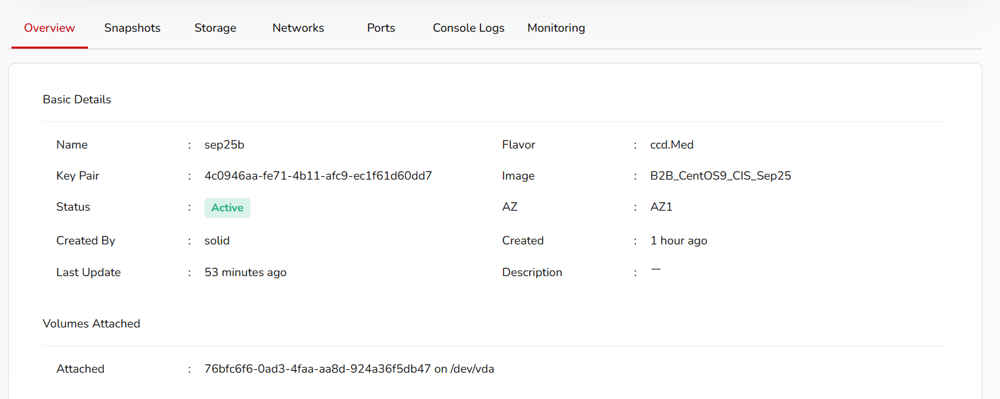

###### Virtual Machine More Details

###### Resize

Resize refers to the process of adjusting the resources allocated to a virtual machine. These resources can include CPU, memory (RAM), and disk space. Resizing a VM allows you to scale its capacity to meet changing workload requirements. To resize a running virtual machine, perform the below steps.

1. Click **three dots** mentioned at the right corner of a created VM tile.
2. Click **resize** option.
3. Go to resize tab, it will provide you with test flavor, undefined, and other options.
4. Select resizing options according to your requirements.
Click **resize** button.

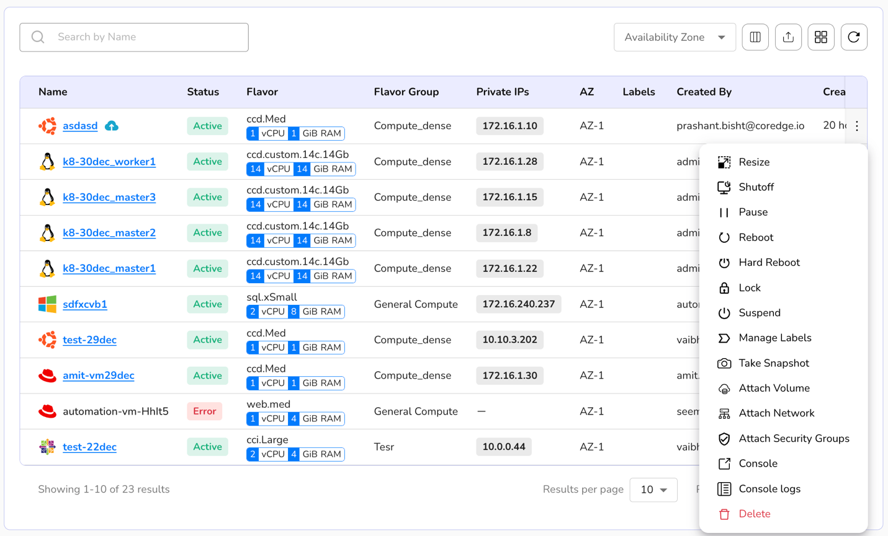

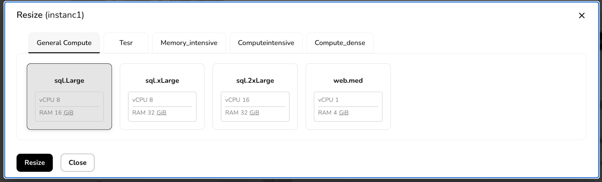

###### Shutoff

Shutoff is used to stop a running virtual machine. When a VM is in a shutoff state, it means that it is not running, and its resources, such as CPU, memory, and storage, are not actively being utilized. In a shutoff state, you can perform maintenance, make configuration changes, or stop the VM to conserve resources. Shutting down a VM allows the operating system within the VM to perform any necessary shutdown procedures before the VM is turned off. It helps prevent data corruption and ensures a clean shutdown. To shutoff a VM, perform the below-mentioned steps.

Click **three dots** at the right corner of a created VM tile.

Click **shutoff** option.

Confirm with **YES** to shutoff a selected VM.

###### Pause

Pause of a virtual machine is a state in which the VM is temporarily halted, but its current state is preserved in memory. When a VM is paused, it means that the execution of the VM is temporarily stopped, and the system's resources are not actively being used by the VM. Unlike shutoff of a VM, pause preserves the VM's current state in memory. This includes the contents of the RAM and the CPU registers. To pause a running VM, perform the below-mentioned steps.

Click **three dots** at the right corner of a created VM tile.

Click **pause** option.

Confirm with **YES** to pause a selected VM.

###### Reboot

Rebooting a virtual machine (VM) is the process of restarting the operating system within the VM. This action is equivalent to a system restart or a power cycle, and it involves shutting down the operating system, stopping all running processes, and then starting the operating system again. To reboot a running virtual machine, perform the below-mentioned steps.

Click **three dots** mentioned at the right corner of a created VM tile.

Click **reboot** option.

Confirm with **YES** to reboot a selected VM.

###### Hard Reboot

A hard reboot refers to forcibly restarting a VM by cutting off its power or abruptly terminating its execution without gracefully shutting down the operating system. In a hard reboot, the VM is abruptly powered off, and then it is powered on again. This contrasts with a soft reboot, where the operating system within the VM is allowed to perform a controlled shutdown before restarting. To hard reboot a running virtual machine, the perform below-mentioned steps.

Click **three dots** mentioned at the right corner of a created VM tile.

Click **hard reboot** option.

Confirm with **YES** to hard reboot a selected VM.

###### Lock

A lock is a mechanism to control access to resources or ensure that certain operations on a VM are carried out in a controlled and predictable way. A lock is used to prevent multiple processes or operations from accessing or modifying a virtual machine simultaneously. A lock ensures that only one operation (e.g., starting, stopping, migrating) can be performed on a VM at a time to prevent conflicts. To lock a running virtual machine, perform the below-mentioned steps.

Click **three dots** mentioned at the right corner of a created VM tile.

Click **lock** option.

Confirm with **YES** to lock a selected VM.

###### Suspend

Suspend refers to a state in which the current state of the VM is saved to disk, and the VM is effectively paused. The suspend operation allows you to freeze the VM's state, including the contents of RAM, and then later resume the VM from exactly where it left off. To suspend a running virtual machine, perform below mentioned steps.

Click **three dots** mentioned at the right corner of a created VM tile.

Click **suspend** option.

Confirm with **YES** to suspend a selected VM.

###### Manage Labels

Labels are essentially key-value pairs that you can associate with your VMs. You can manage labels on a virtual machine. To manage labels, perform the below steps:

Click **three dots** mentioned at the right corner of a created VM tile.

Click **manage labels** option.

Add label. You can add a maximum of five labels.

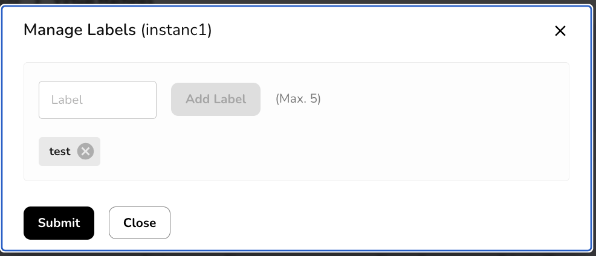

###### Take Snapshots

Snapshots refer to a mechanism that allows you to capture the current state of a VM at a specific point in time. These snapshots are point-in-time copies of the entire VM, including its disk, memory, and configuration settings. Snapshots are useful for various scenarios, such as backup, system recovery, and testing. You can take a snapshot of a virtual machine. To take a snapshot, perform the below steps:

Click three dots mentioned at the right corner of a created VM tile.

Click take snapshots option.

Go to take snapshot tab and add a snapshot name. Add label.

Click create button.

It will successfully create a compute snapshot.

Created snapshot tile includes status and label information.

You can also manage labels or delete a created compute snapshot.

Click three dots and select the options.

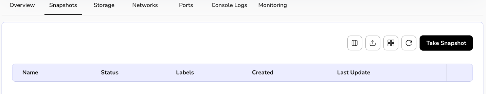

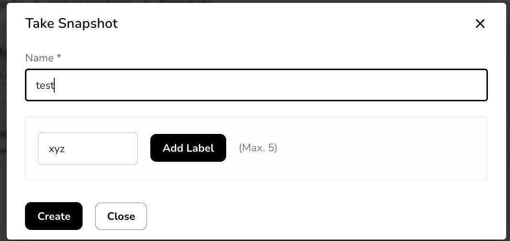

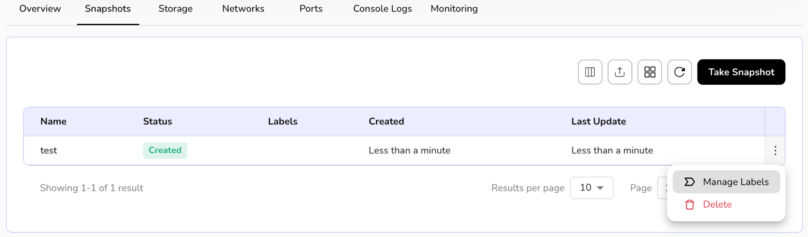

###### Attach Volume

Attach volume refers to connecting an additional block storage device to the VM. Attaching volumes to VMs provides flexibility and scalability in managing storage resources, allowing you to adapt your infrastructure to changing storage requirements. To attach volume, perform the below steps:

Click three dots mentioned at the right corner of a created VM tile.

Click attach volume option.

Go to attach volume tab and select a volume from the drop-down box.

Click attach button. It will successfully attach volume.

The attached volume tile includes size in GiB, status, and label information.

A user can extend the size of the attached volume.

Click on the three dots present at the right corner of the attached volume table. Click on the extend size button.

Define your extended size and click on the update button.

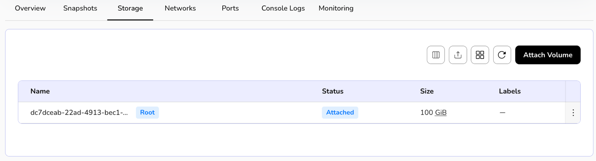

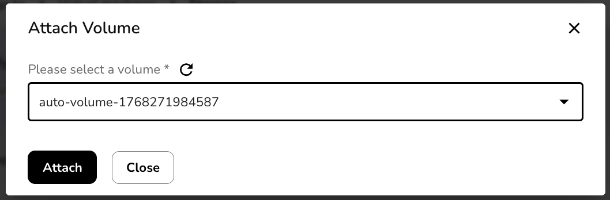

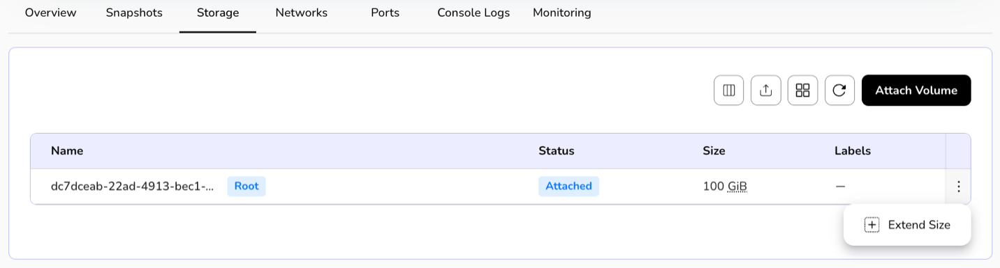

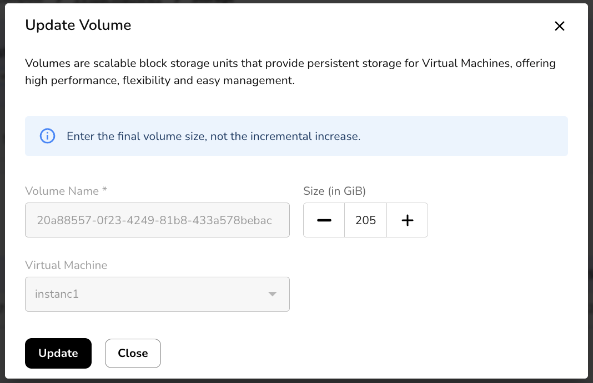

###### Attach Network

Attach network involves connecting the VM to a specific network, allowing it to communicate with other devices and access resources on that Network. This process is a fundamental aspect of configuring networking for VMs. To attach a network, perform the below steps:

Click three dots mentioned at the right corner of a created VM template.

Click attach network option.

Go to the attach network tab and select the network and security group from the drop-down box.

Click attach button. It will successfully attach the network.

The attached network tile includes status, subnet, IP version, and label information.

You can also detach a network.

Click three dots and select the detach network option.

Confirm if you want to detach the network.

Click YES button.

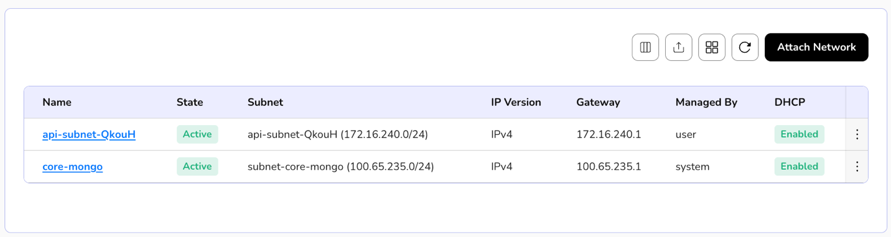

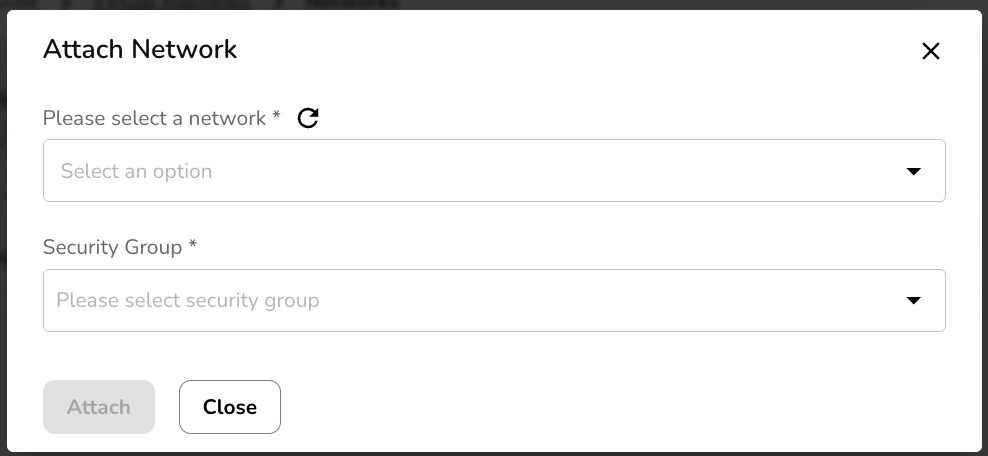

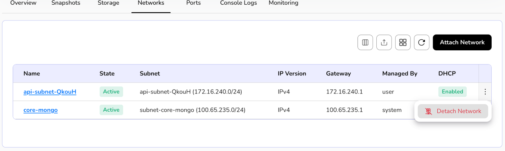

###### Attach Security Groups

Attach Security Group is a concept commonly associated with cloud computing environments. A security group acts as a virtual firewall that controls inbound and outbound traffic to and from a VM. By attaching a security group to a VM, you can define rules that specify which types of traffic are allowed or denied. To attach security groups, perform the below steps:

Click three dots mentioned at the right corner of a created VM tile.

Click attach security group option.

Go to the attach security group tab and select a security group from the drop-down box.

Click attach button. It will successfully attach the security group.

The attached security group tile includes status, managed-by, and type information.

You can also detach security groups.

Click three dots and select the detach security group option. Similarly, a user can detach ports.

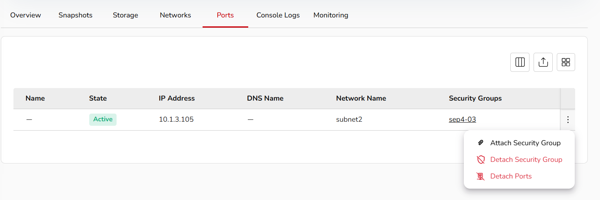

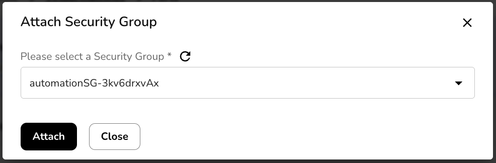

###### Console Logs

Console logs refer to the recorded information about the system's activities and events that can be accessed through the console or terminal interface. These logs are crucial for troubleshooting, monitoring, and understanding the behaviour of the VM. The console logs may contain information related to the operating system, applications, hardware, and other components running on the VM. To view a console log, perform the below steps:

Click **three dots** mentioned at the right corner of a created VM tile.

Click console logs option.

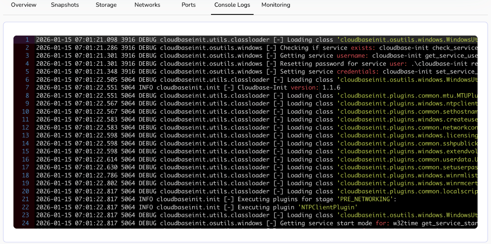

###### Delete

Deleting a virtual machine means that you are removing the VM from the virtualization platform or hypervisor. This action is irreversible, and the VM will no longer be available for use. When you perform a delete action on a VM, it frees up resources such as CPU, memory, and storage that were allocated to the VM. These resources can be used for other VMs or purposes. To delete a VM, perform below mentioned steps:

Click three dots mentioned at the right corner of a created VM tile.

Click **delete** option.

Confirm if you want to permanently delete the selected virtual machine.

Click **delete** permanently button.

### VM Snapshots

Virtual machine snapshots are backups of virtual machines that capture their state at a specific time, enabling easy restoration or replication, ensuring data protection and simplifying recovery processes.

##### Procedure To create compute snapshots

1. Click on the create compute snapshots button.
1. Name: - Enter a unique name for your snapshot.
1. Select Virtual Machine: - Select a VM from the dropdown of which Compute snapshot you want to create.
1. Label: - Add label. Maximum value is 5. After filling in all the details, click the create button for a compute snapshot.

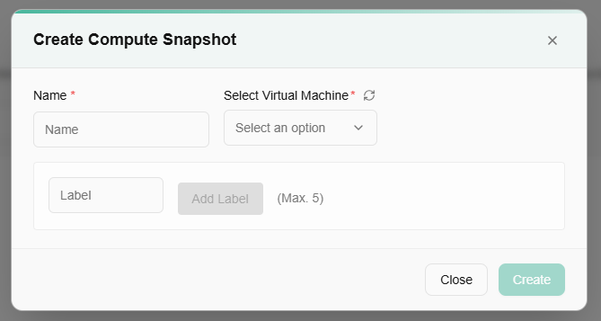

On the VM Snapshots page, users can view created Compute snapshot name, status, compute name, AZ, labels, created and last updated.

A user can use View Preferences to customize visible columns, and Export to download the list with the selected pages and columns.

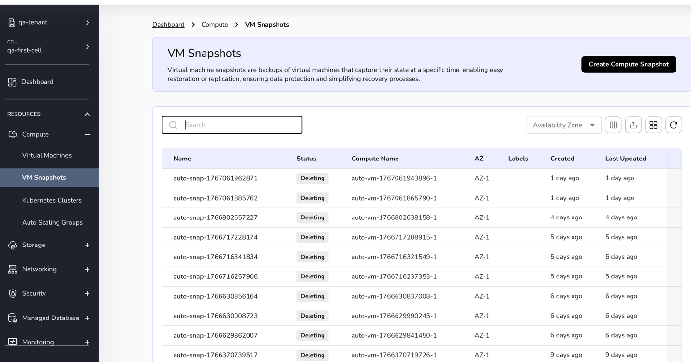

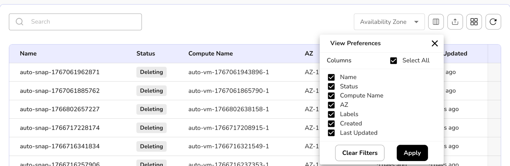

A user can manage labels of a created Compute snapshots. Also, if required, a user can delete the Compute snapshot.

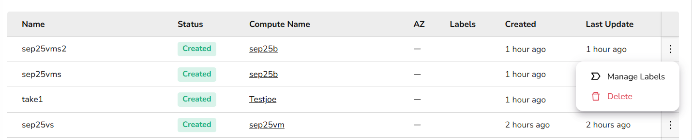

### Kubernetes Clusters

Kubernetes clusters help you run and manage your applications seamlessly across multiple servers. It automatically handles scaling, updates, and recovery, so your apps stay available and perform reliably--whether you're deploying new features or handling more users.

##### Procedure to Create Kubernetes cluster

1. Log in to the CCP service platform.
1. From the left navigation panel, navigate to Resources and select Compute. Click on Kubernetes clusters tab.
1. On the Kubernetes Clusters dashboard, click Create Kubernetes Cluster button.

**Note: **Reach out to the cloud team to complete the pre-requisites before creating your cluster!

1. Enter essential information for your Kubernetes cluster, including the cluster name, version, and region. These details help define and identify your cluster in your environment.
1. View key details such as the current Kubernetes version, the version of the networking setup, and an overview of the cluster's network configuration.
1. Manage node settings, including the configuration of worker nodes where applications run. Each pool can have its own flavor, zone, and scaling settings.
1. Click on add node pool button. Select subnet, flavor, and desired nodes value. If you enable auto scaling, then you must define maximum node value.
1. Once all the details are filled, click on next button.
1. Confirm the details and click on create button.

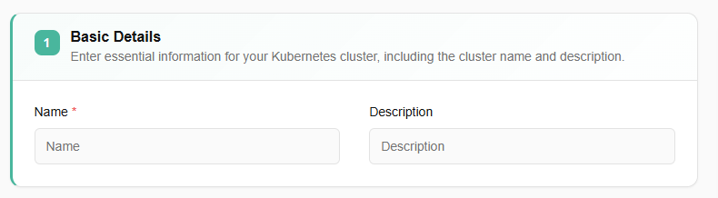

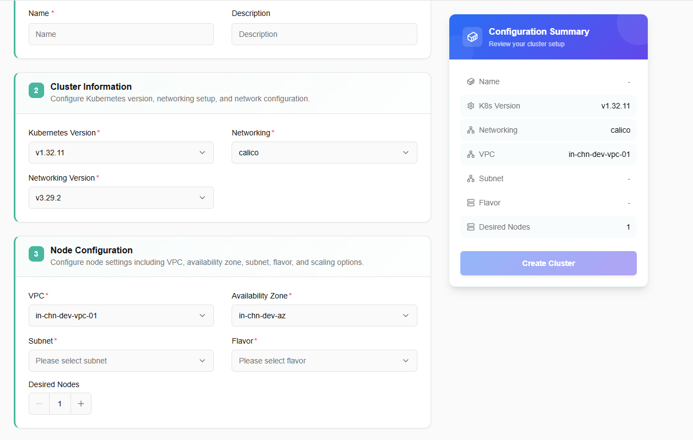

From a state box, a user can view cluster's state as all, connected, not connected, and not registered.

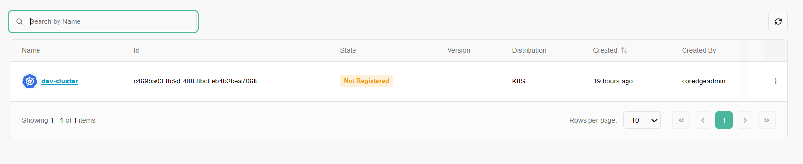

Once a Kubernetes cluster is created, it allows a user to edit the details of a created cluster and can delete it if it is no longer needed.

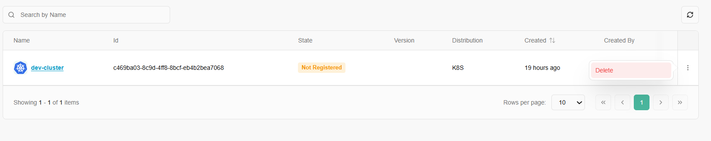

1. Now, click on a created cluster name, it will redirect you to its detailed page. Detailed page of a cluster includes its overview, addons, logs, nodes, namespace, events, workloads, access control, service discovery, and storage information.
1. From overview section, a user can access terminal to run Kubernetes commands.
1. Actions tab includes edit cluster and delete cluster options.
1. To delete the cluster, click the delete button and give confirmation.
1. Overview section consists of basic, configuration, and events details. Like number of nodes in a ready state, total number of nodes, nodes RAM details, nodes CPU, and Pods details.

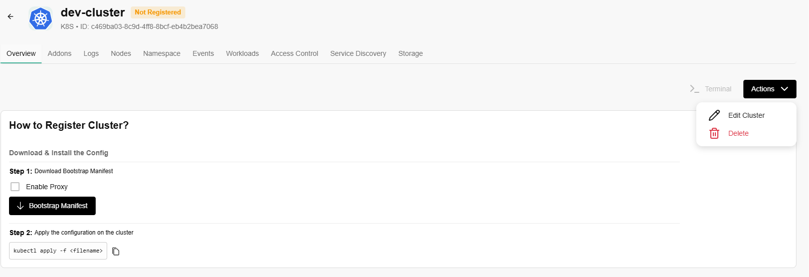

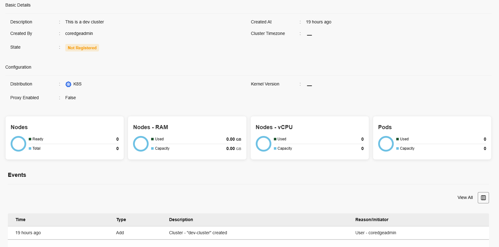

1. To edit a cluster, click on actions button and click the edit cluster option.
1. Edit description and click on update button.
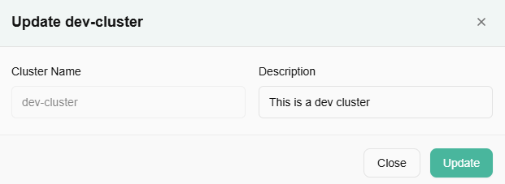

To register the cluster, a user must perform the following steps:

1. Download and install the config.
1. Download bootstrap manifest.
1. Enable proxy.
1. Apply the configuration on the cluster.

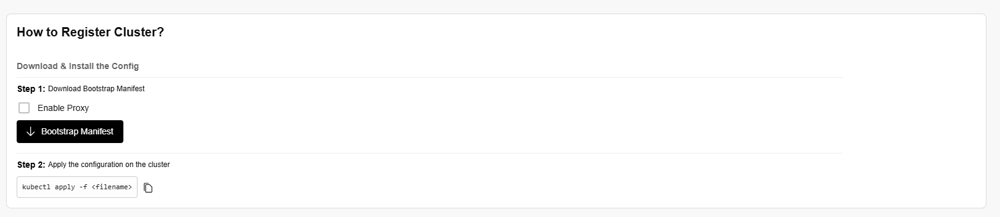

###### Addons

The Addons page allows you to discover, install, and manage supplementary software components for your Kubernetes environment.

Each addon is presented in a dedicated card containing the following information:

1. Name & Version
1. Status Availability
1. Description
1. Category: Groups of addons by function, such as GPU or GitOps.
1. Namespace: Specifies the exact Kubernetes namespace where the addon will reside.
1. Addon/Instance State: Tracks the current lifecycle stage of the component.

To add a new tool to your cluster:

Locate the desired addon card.

Click the **Enable** button.

Once triggered, the **Instance State** will update to reflect the deployment progress.

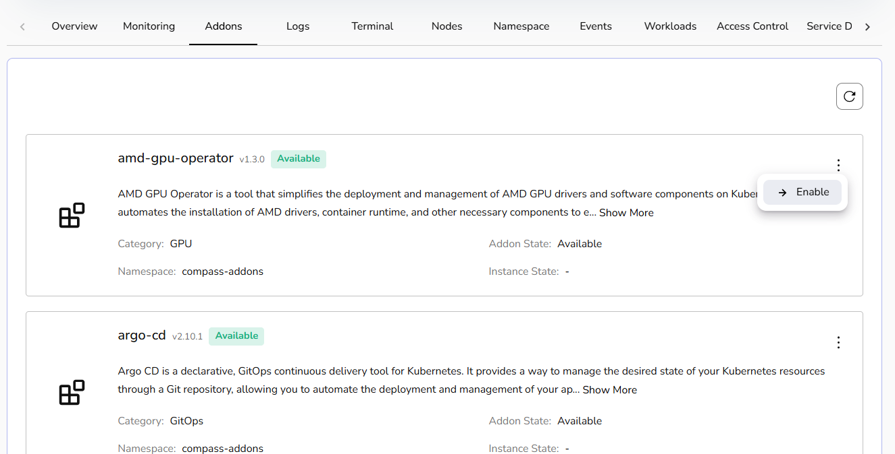

###### Logs

Check the live and audit logs in the Logs section.

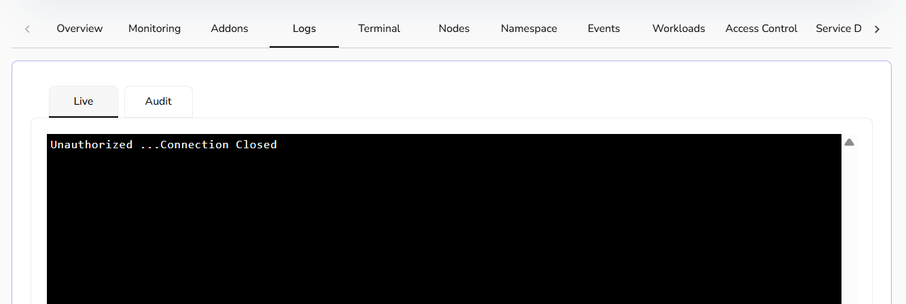

###### Nodes

The nodes section lists the details of the nodes.

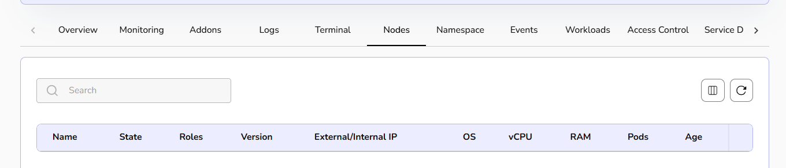

###### Namespace

Click on Create namespace. Add the name, labels, and annotations, then click the save button.

You can create a namespace from YAML.

If you click on a created namespace name, it will redirect you to its details page, where you can perform actions such as editing the namespace, cloning it, editing it as YAML, downloading the YAML, and deleting it.

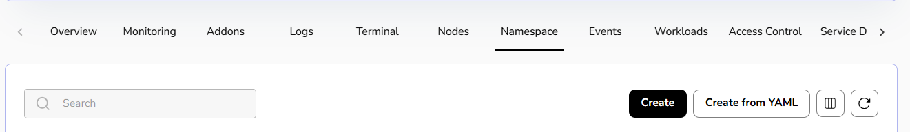

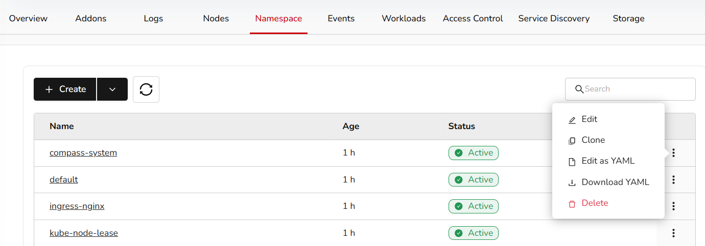

###### Events

1. Events lists the details of an event. A user can use drop box to check namespace for events.

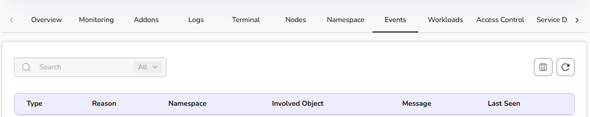

###### Workloads

Click on Create button. A user can create workloads from YAML also. Select option as per the requirement.

Add all the necessary details and click on the create button.

A user can create pods, jobs, Cronjobs, Daemonsets, Statefulsets, Replica sets, and resource quota under workloads. For resource quota, set limits on resource usage within your namespace to manage workload demands and optimize cluster performance.

A user can directly create or can create from YAML. Fill all the necessary details to create the above-mentioned steps.

A user can clone, edit workload deployments as YAML, download YAML file, and delete it if it is no longer needed.

A user can update scale replicas and edit resource metrics of workloads.

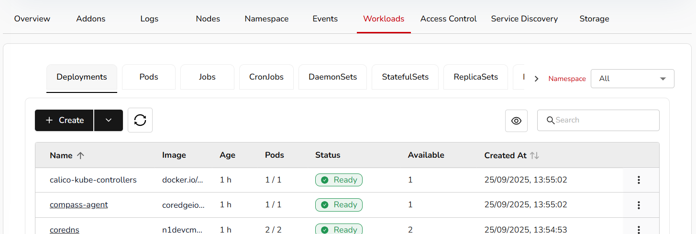

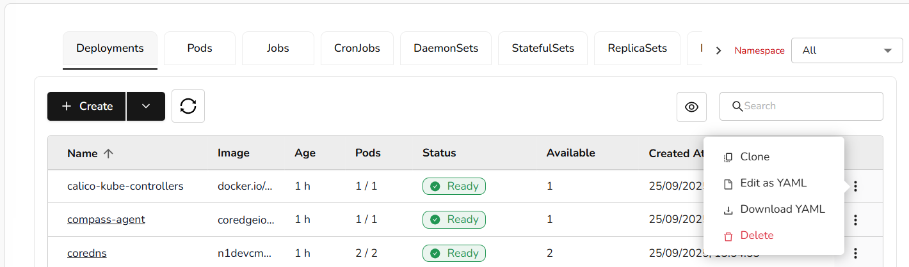

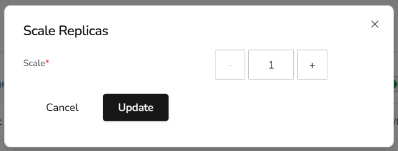

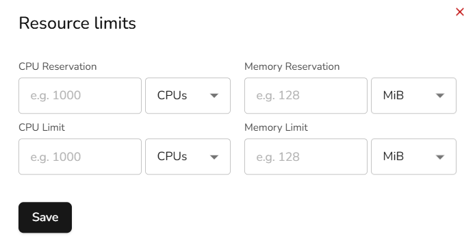

###### Access Control

Create access control or create from YAML.

Add necessary details and click the save button. You can clone, edit as YAML, download the YAML, and delete it.

A user can create roles, role binding, cluster roles, cluster role binding, and service accounts under access control. Fill all the necessary details and click on the submit button.

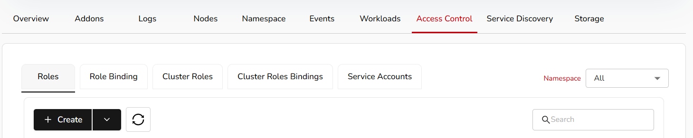

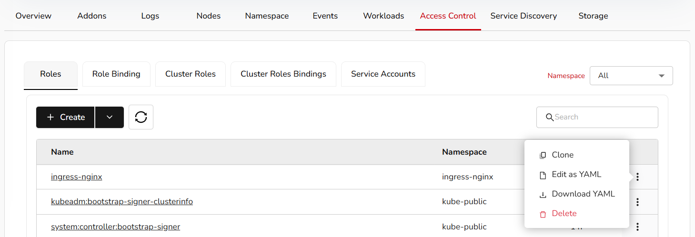

###### Service Discovery

Create a service discovery or create from YAML.

Add necessary details and click the save button. You can clone, edit as YAML, download the YAML, and delete it.

Under service discovery, a user can create services, ingress, network policies, horizontal pod auto-scalers (HPA), and load balancers.

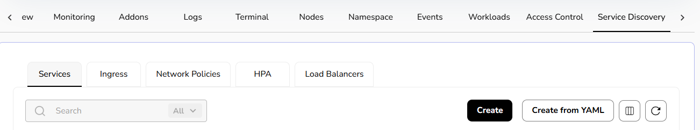

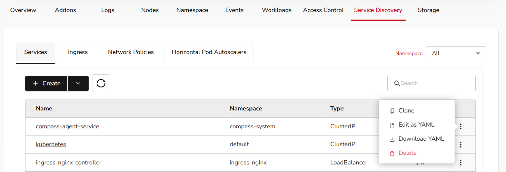

###### Storage

Create a storage or create from YAML.

Add the necessary details and the save button. You can clone, edit as YAML, download the YAML, and delete it.

Under storage, a user can create storage classes, secrets, ConfigMaps, persistent volumes, and persistent volumes claims.

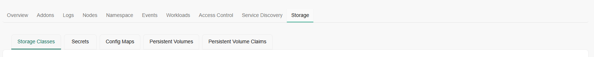

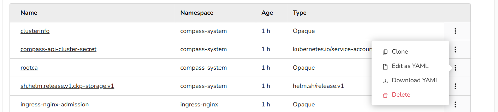

#### Import Kubernetes Clusters

1. Login to the CCP service platform.
1. From the left navigation panel, navigate to Resources and select Compute.

On the Kubernetes Clusters page, click the Import Kubernetes Cluster button.

Provide the basic details, including name and description.

Add tags (optional).

Click the next button. Confirm the details and click the create button.

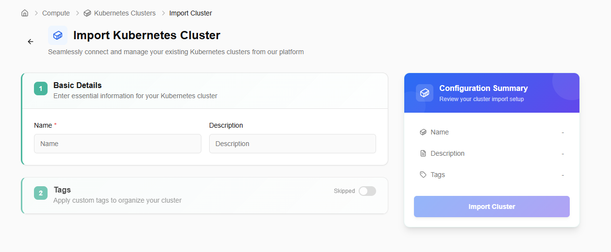

After importing, the user can export the cluster details or download the KubeConfig file using the available options. Also, if the imported cluster is no longer needed, a user can delete it using the delete option as mentioned in the below image.

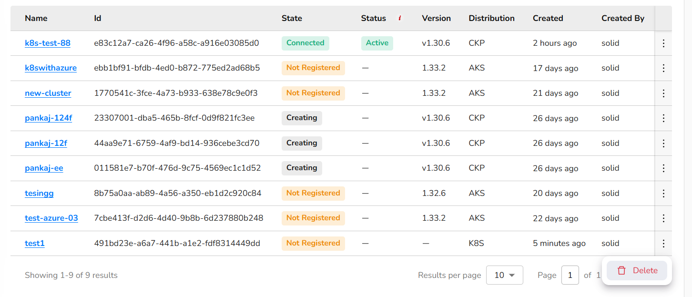

The detailed page of an imported cluster allows a user to use terminal, guides towards the steps to register cluster, download and install Config, perform actions like edit cluster and delete it. It also shows basic details, configuration, and events details.

## Storage

CCP storage is a scalable, cloud-based solution for developers and businesses. It provides storage services such as volumes, object storage, volume snapshots, and file storage, which are reliable and flexible data storage options for hosting websites, applications, and data backups in the cloud.

### Volumes

Volumes are block storage devices that provide scalable and persistent storage for virtual machines. They can be attached and detached as needed, allowing you to expand storage capacity without modifying the underlying infrastructure, offering flexibility and data durability.

##### Procedure to Create Volume

Creating a block storage volume involves provisioning a storage space with specific characteristics to be used for storing data.

1. Log in to the CCP service platform.
1. From the left navigation panel, navigate to resources and select storage.
1. Click on the volumes tab. Click on create volume button.
1. Name: Provide a friendly volume name.
1. VPC: Select VPC type.
1. Subnet: Select subnet from the drop-down menu.
1. Tier: Select tier from the drop-down menu.
1. Define volume size.
1. Virtual Machine: Select a virtual machine from the drop-down.
1. Label: Add label. You can add up to five labels.
1. Once all the details are filled, click create button. It will create a block storage volume.
1. Click on the three dots to extend size and manage labels.

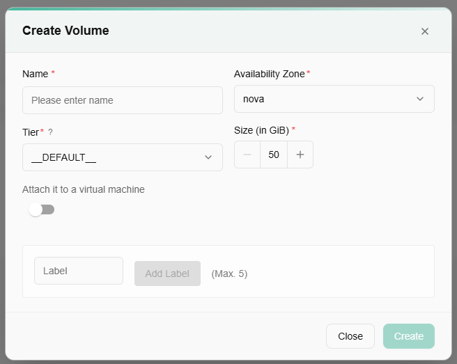

Once a volume is created, a user can extend volume size or manage its labels. Enter the final volume size, not the incremental increase.

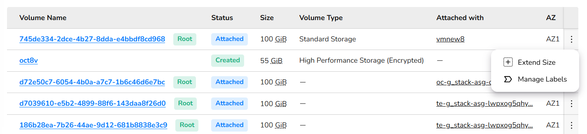

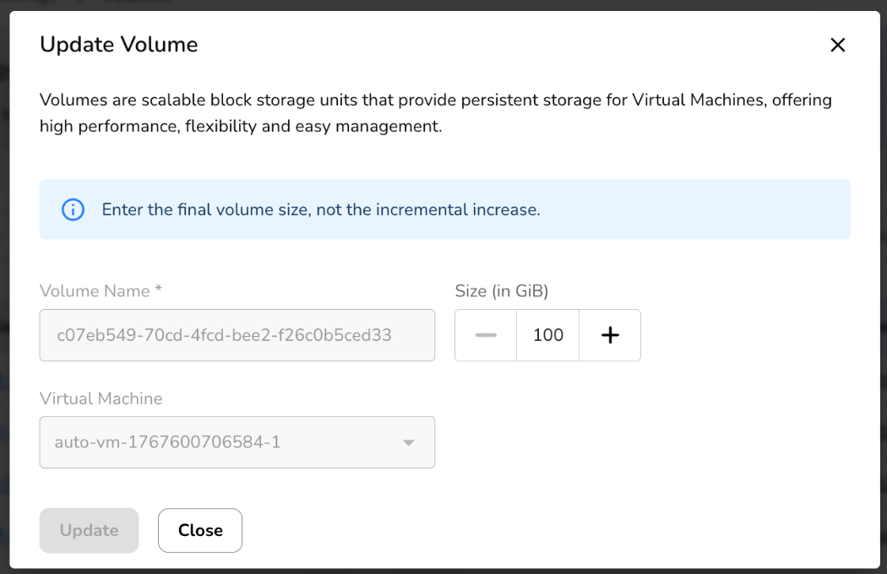

Click on manage labels. You can add up to five labels. Click on submit button.

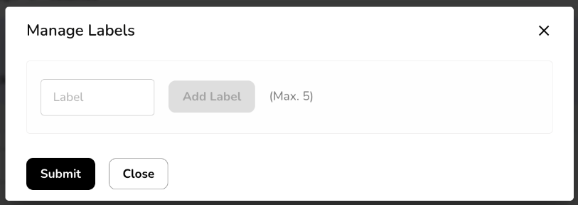

Click on a created volume name. It redirects you to its detailed page, where an overview section provides basic information of a volume. Attached resources provide resources details, and snapshots provide snapshots details. Monitoring provides the graphical view of volume storage as in total size, space used, percentage wise used, state, and more.

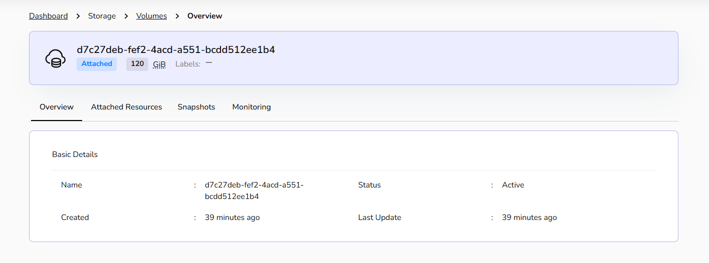

### Volume Snapshots

Volume snapshots is a point-in-time copy or snapshot of the data contained within a storage volume. Volume snapshots capture the data and configuration of the volume, enabling easy restoration or replication, providing data protection, and facilitating disaster recovery and data migration processes.

##### Procedure to Create Volume snapshots

Creating volume snapshots involves interacting with the storage system that manages the volumes.

1. Log in to the CCP service platform.
1. From the left navigation panel, navigate resources and select storage.
1. Click on the volume Snapshots tab.
1. Click on create volume snapshot button.
1. Name: Provide a unique volume snapshot name.
1. Volume: Select volume from drop-down.
1. Label: Add label. You can add up to five labels.
1. Once all the details are filled, click create button. It will create volume snapshots.

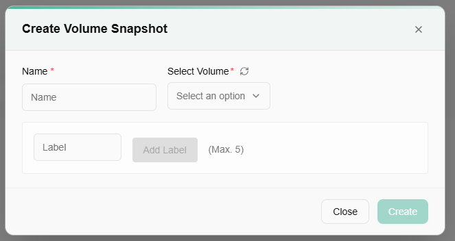

Once a volume snapshot is created, a user can create volume, manage its labels, and can delete volume snapshots if it's no longer required after clicking on the three dots. To create a volume, please follow volumes section described above in this document.

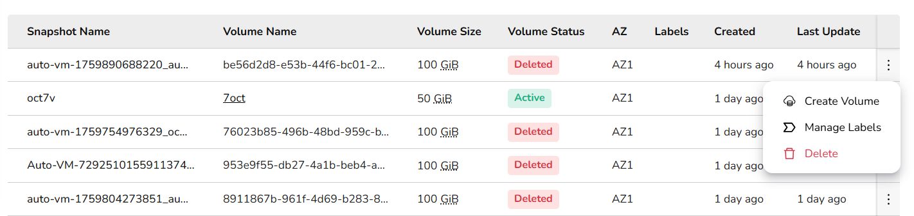

### Object Storage

Object storage is a data storage architecture that manages data as distinct units, called objects, rather than as blocks or files. CCP's object storage helps you to create a bucket. Buckets are the basic containers that store your data in the cloud. Everything that you store in the cloud storage service is contained in a bucket. You can use buckets to organize your data and control access to your data. Buckets have unique names that all users of the cloud storage service share.

##### Procedure to Create bucket

1. Log in to the CCP service platform.
1. From the left navigation panel, navigate resources and select storage.
1. Click on the object storage tab.
1. Go to storage from the left navigation panel, and select object storage option.
1. Click create bucket button.
1. Provide a unique bucket name.
1. Select replication type from the drop-down menu.
1. Select availability zone.
1. A user can enable object storage version or enable object locking. Define lock validity in number of days. ((Both of them are optional).
1. Add key and value tags (Maximum 5 is allowed).
1. Click create button.

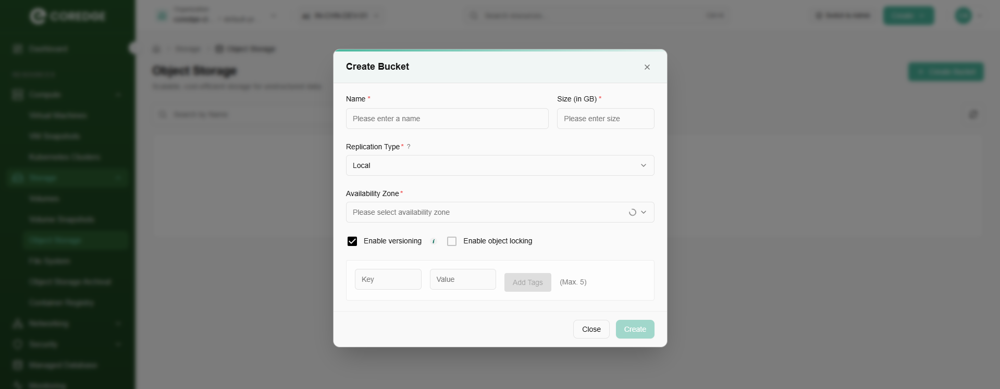

A user can check the state of the bucket and availability zone by selecting from the drop-down menu.

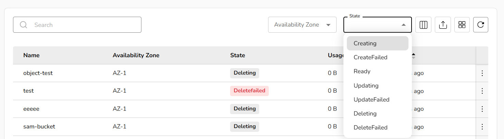

Once a bucket is created successfully, a user can update tags, manage access keys, empty bucket, or delete it if it's no longer needed by clicking the three dots.

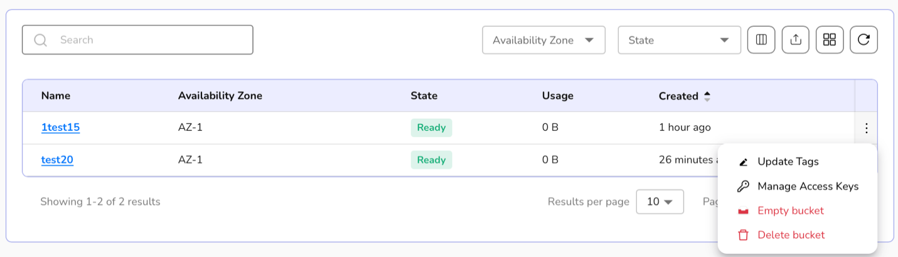

1. Click on update tags, enter the tags (Maximum 5 is allowed) and click on update button to update tags.
1. Click on manage access keys tab. A detailed page of selected object storage appears. It includes overview, objects, access keys, and monitoring sections.
1. Click on Create Access Key button.
1. Select expiration days period from the dropdown and click on create button.
1. Access Keys are created successfully.

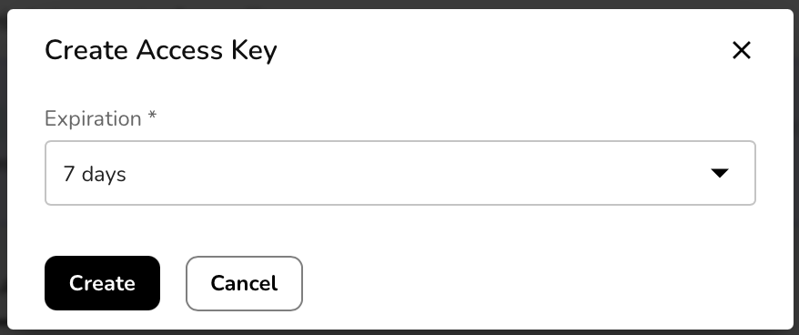

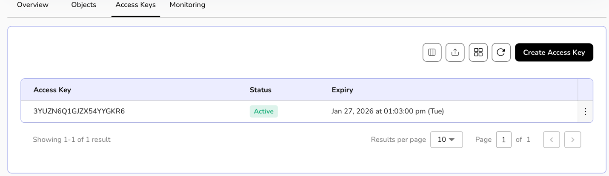

A message appears as-

Make sure to copy the keys below and configuration now. You won't be able to see it again!

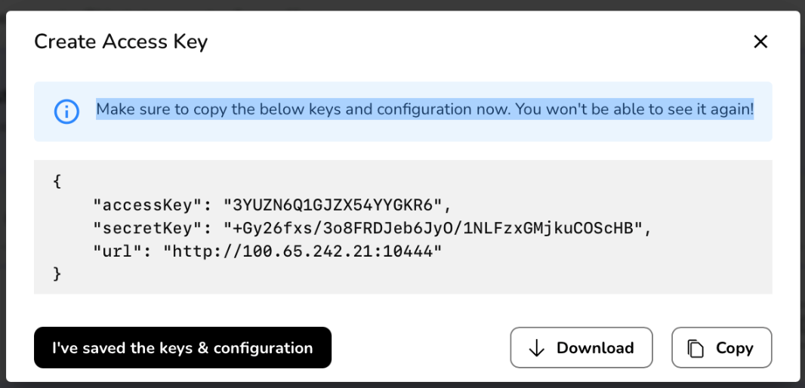

Click on monitoring, details of buckets, bucket growth, and other requests appear.

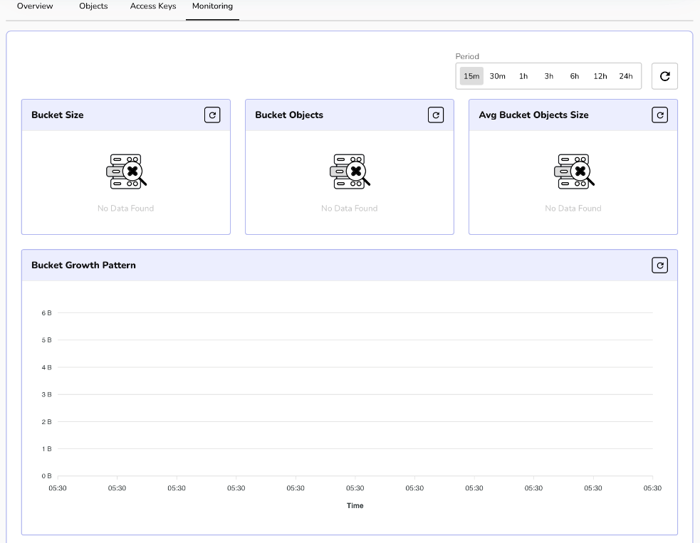

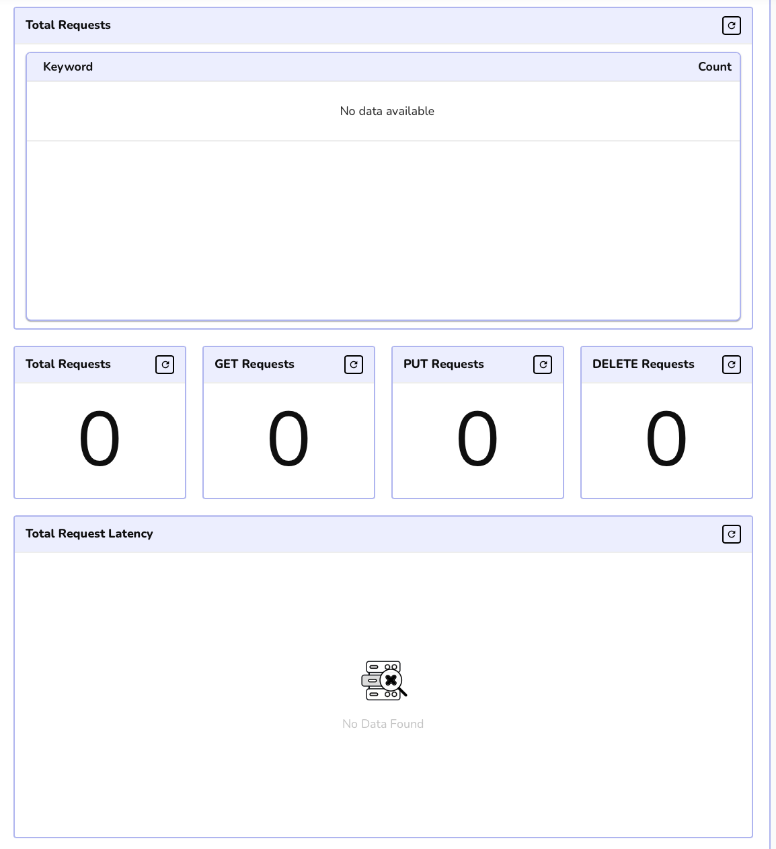

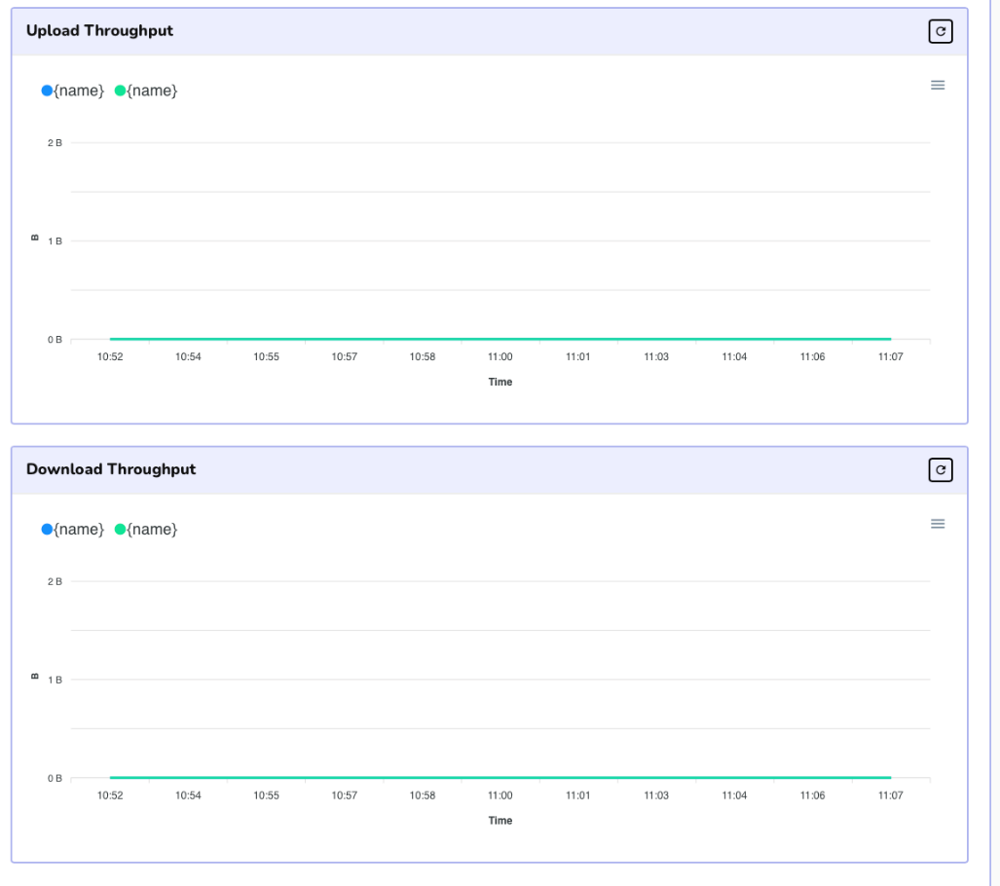

### File System

The **File System** page shows a centralized, shared storage service used for collaboration and application workloads. It lists all created file systems with key details such as **name, state (Active), size, availability zone, creation time, and creator****. **

##### Procedure to Create file system

1. Log in to the CCP service platform.
1. From the left navigation panel, navigate resources and select storage.
1. Click on the file system tab.
1. Click on the create file system button.
1. Provide a unique name to a file system.
1. Choose availability zone from the drop-down menu.
1. Select the file system size and add description.
1. Add tags.
1. Click the create button.

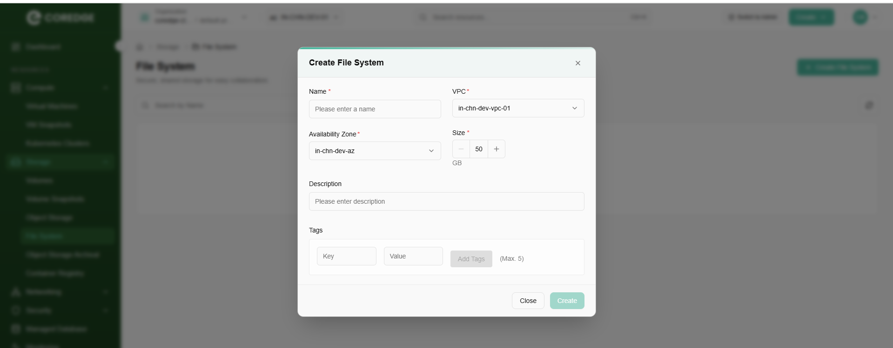

Once a file system is successfully created, a user can edit its size according to the requirement or even can delete it if it is no longer required.

Click on the three dots present at the right corner of the created file system table.

Select option (edit size or delete) as per the requirement.

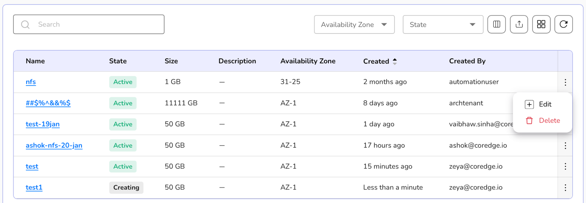

Click on the file system name. It will redirect you to its detailed page where overview section provides a file system's information. Access point allows you to add an access point.

An access point is added to a file system to get simplified access path. It creates a managed entry point that defines how a user connects, what path they start from, and what permissions they get.

To add access points, perform the following steps:

Go to file system and click on its name.

A detailed page of a file system appears. Click on the access points tab.

Now, click on the add access point button.

Add basic details which include protocol, access type, and description.

Click on the next button.

Click on the create button to confirm the details.

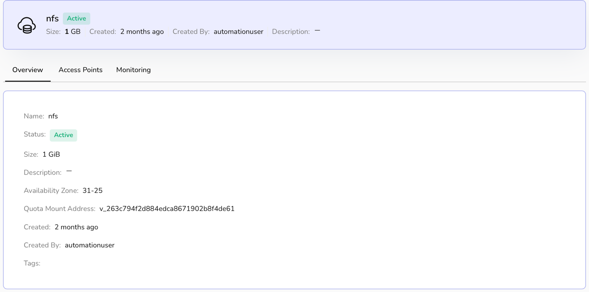

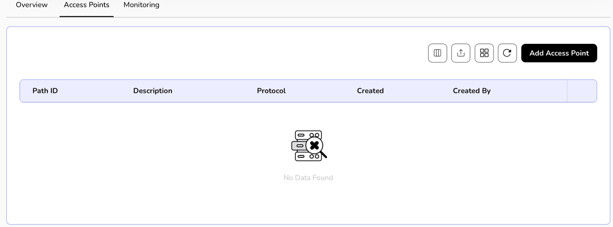

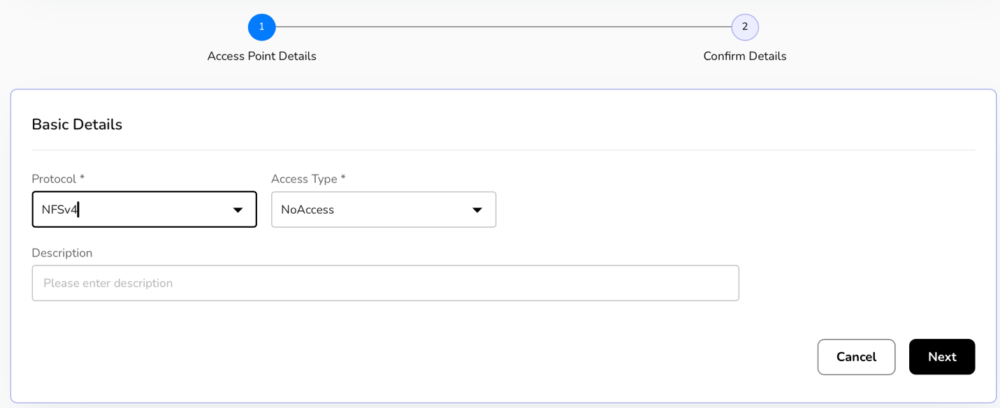

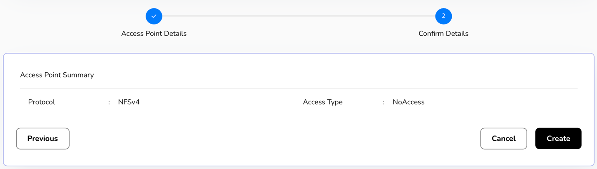

Once access points are added successfully, a user can edit the information or delete it when it is no longer needed.

Click on the three dots present at the right corner of the created access point table.

Select option (edit or delete) as per the requirement.

Click on edit. Update file system box appears, select size in the multiples of 50, enter description, add tags, a maximum of 5 can be added.

Click on update button to update file system.

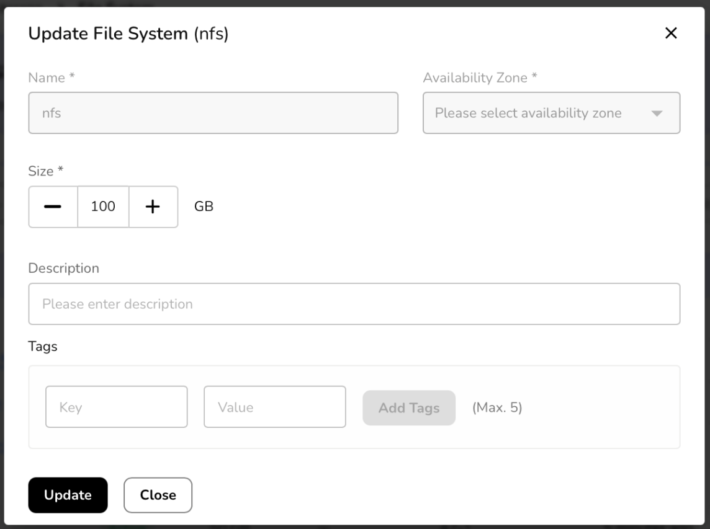

### Object Storage Archival

Coldline balances low storage costs with higher retrieval costs, making it suitable for datasets such as backups, disaster recovery archives, and long-term compliance records. Data is stored with the same high durability guarantees as standard storage tiers but optimized for long-term retention at minimal expense.

##### Procedure to Create bUCKET

1. Log in to the CCP service platform.
1. From the left navigation panel, navigate resources and select object storage archival tab.
1. Click on create bucket button.
1. Enter basic details such as name.
1. Add tags. You can add up to 5 tags.
1. Click on create button to create the bucket.

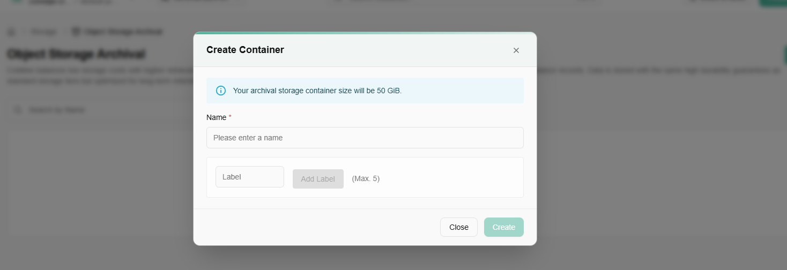

### Container Registry

##### Procedure to create container registry

1. Log in to the CCP service platform.
1. From the left navigation panel, navigate resources and click on storage. Select container registry tab.
1. Click on create container registry button.
1. Enter a name for your container registry.
1. Select a plan that fits your container registry needs.
1. Review your registry setup and click on create registry button.
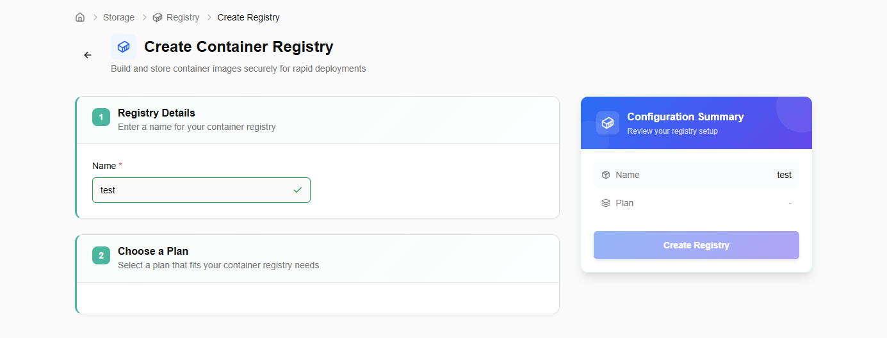

## Networking

Networks are virtualized environments for secure resource communication. You can configure settings, manage traffic, and establish connections between virtual machines and services.

### VPC

A VPC (Virtual Private Cloud) in CCP is a logically isolated network within a cloud environment that provides users with their private space to securely launch and manage compute, storage, and networking resources. A VPC helps create **isolated tenant environments**, ensuring that multiple teams or projects can use the same physical infrastructure without interfering with one another.

##### Procedure to create a VPC

1. Log in to the CCP service platform.
1. From the left navigation panel, navigate resources and select networking.
1. Click on VPC.
1. Click on Create VPC button
1. Add basic details. Project is by default selected. Enter a unique VPC name and description.
1. Enter IPv4 CIDR block.
1. Add tags. Tag consists of key and value. A user can add up to five tags.
1. Click on the next button.
1. Confirm the details and click on the create button.

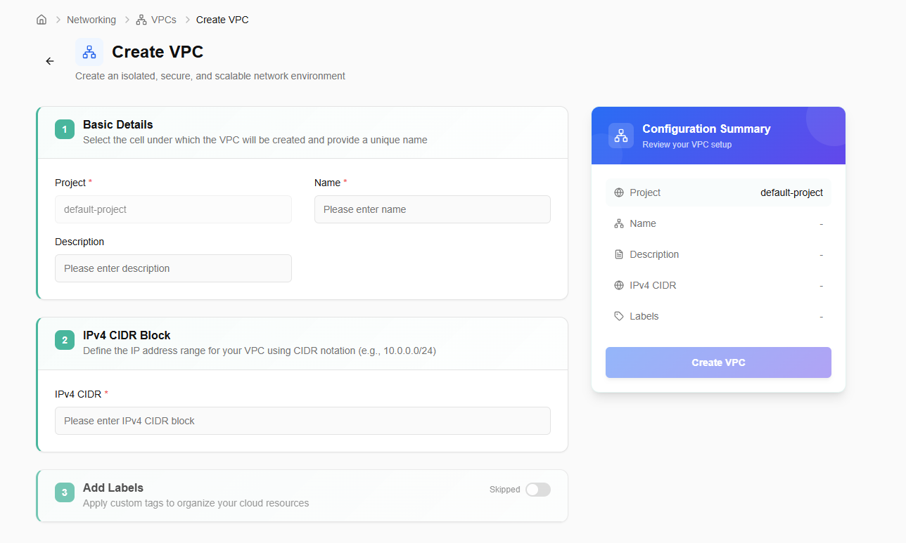

You can delete created VPC using delete option if it is no longer needed.

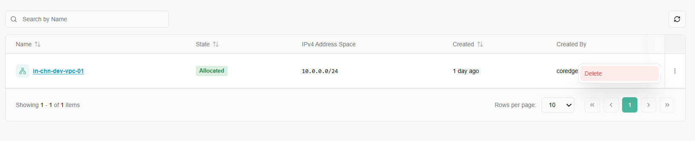

Click on a VPC name. It will redirect you to its overview section. An overview section provides basic and configuration details.

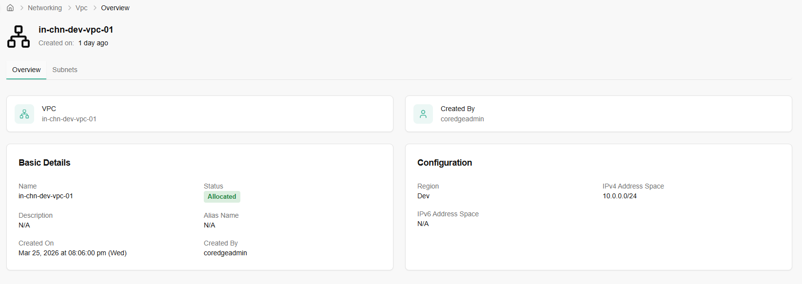

Subnets section allows you to **create a subnet**. Go to subnets tab and click on create subnet button. Easily create subnets to segment your network, enhance security and optimize traffic flow within your cloud environment.

Enter basic details. Provide a unique subnet name, description, subnet sub role, and availability zone.

Add IPv4 CIDR and add labels to your subnet.

Confirm the entered details and click on create button.

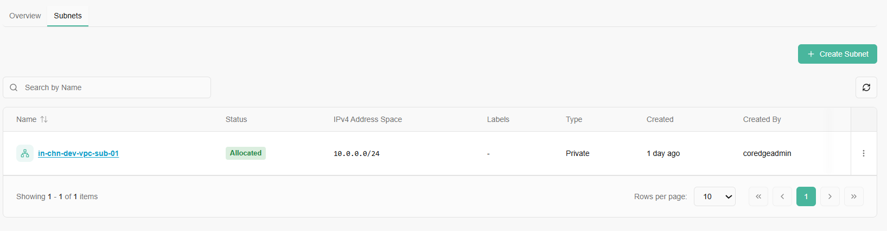

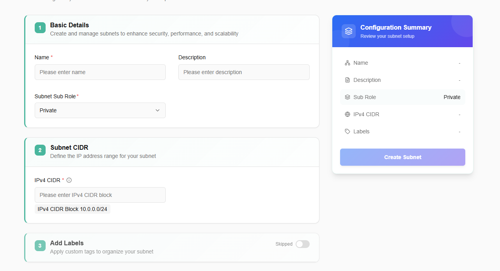

Once a subnet is successfully created, it will reflect on the subnet dashboard. A user can delete the subnet if it is no longer required.

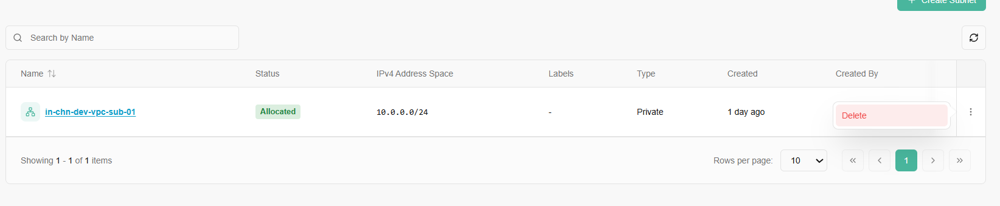

If you click on a created subnet name, it provides you with a detailed history of it.

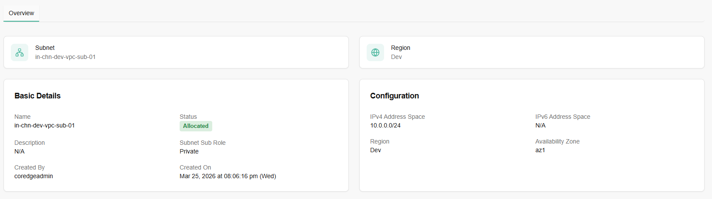

### Security Groups

Security groups are a network-level firewall that controls inbound and outbound traffic for virtual machines. Security groups provide network-level security for instances. You can define rules to allow or restrict access based on protocols, ports, and IP addresses, enhancing the security of infrastructure.

##### Procedure to create Security Group

To create security group, follow below mentioned steps:

1. Log in to the CCP service platform.
1. From the left navigation panel, navigate resources and select security groups.
1. Click on create security groups button.
1. Click on Create security group button.
1. A pop up of create security group appears. You need to fill in the details.
  1. Name: Choose a friendly name for your security group.
  1. Select availability zone from the drop-down menu.

After filling in the details, click create button.

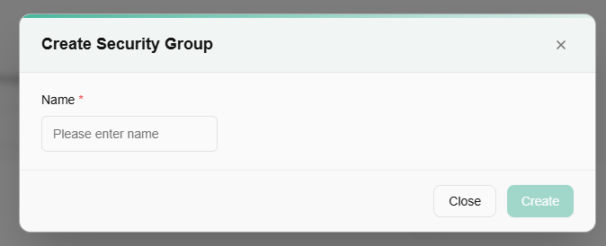

Security group detail dashboard provide you tiles of created security groups. Once a security group is created successfully, it will reflect its status on security group tile.

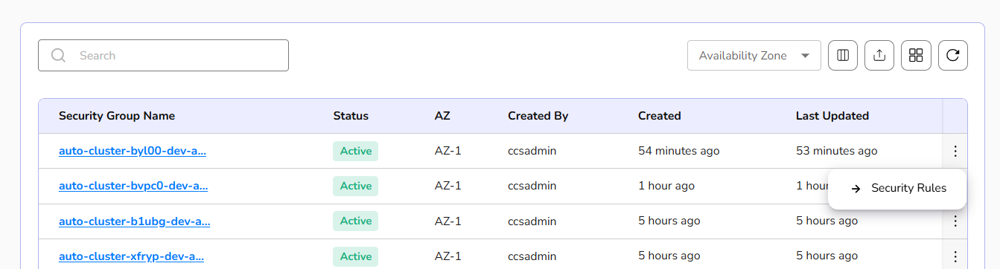

Security group rules define the specific network traffic permissions, such as allowing or blocking specific protocols, ports, and IP addresses for inbound and outbound communication within the security group.

At the right corner of the created security groups, there is three dots available, from there click on security rules tab.

A dashboard of detailed security group appears. Go to security group rules tab and click on the Create Security Group Rule button.

Select protocol from drop-down.

Select IP version.

Choose direction, network address, and predefined ports.

Select predefined ports from drop-down.

Click on add rule button.

Click the next button.

Confirm the details filled and click on the create button.

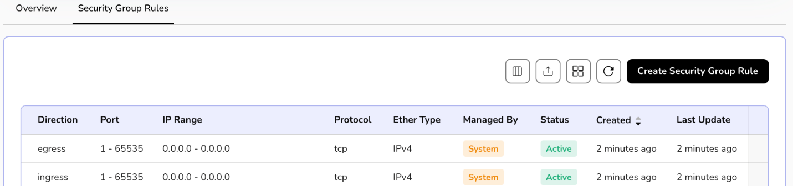

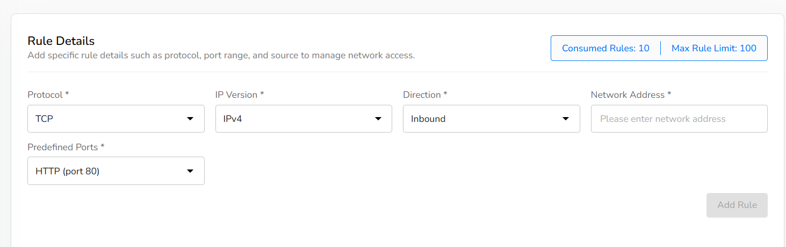

A user can delete the created security group rule if it is no longer needed.

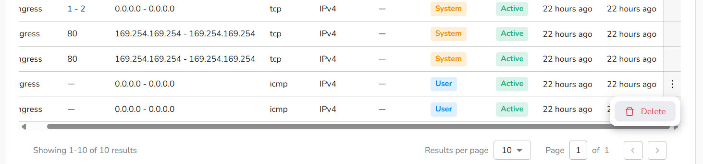

Overview section provides complete details of a security group.

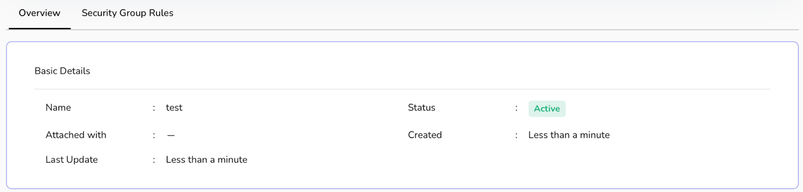

### Load Balancers

Load balancers distribute incoming network traffic across multiple servers, ensuring high availability and improved application performance. The primary purpose of a load balancer is to ensure that no single server bears too much load, thereby preventing performance degradation and ensuring high availability and reliability of services.

##### procedure to create a load balancer

1. Log in to the CCP service platform.
1. From the left navigation panel, navigate resources and select load balancers.
1. Click on create load balancers button. Enter basic details.
1. Name: Provide a unique name to load balancer.
1. Add description.
1. Select VPC and VIP subnet from the drop-down menu.
1. Label: Add a label to your load balancer. You can add up to 5 labels.
1. Click on the next button. Confirm the details and click on the create button.

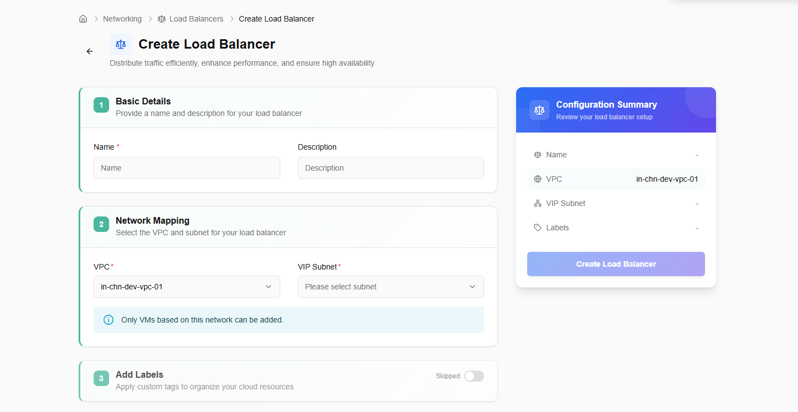

Created load balancer will be listed on the load balancer dashboard. If it is no longer needed, a user can delete it using the delete option by clicking the three dots.

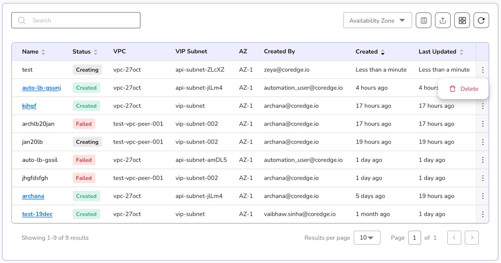

Click on a load balancer name. It redirects to its detailed page where an overview section provides basic and confidential information.

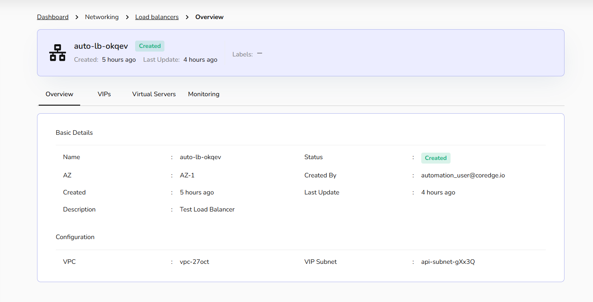

Within the **Load Balancer** details, the **VIPs** tab manages the specific IP addresses assigned to your services.

**Allocate VIP:** Click this button to reserve a new IP address for your services.

**Release VIP:** A user can select Release to decommission an IP and return it to the pool.

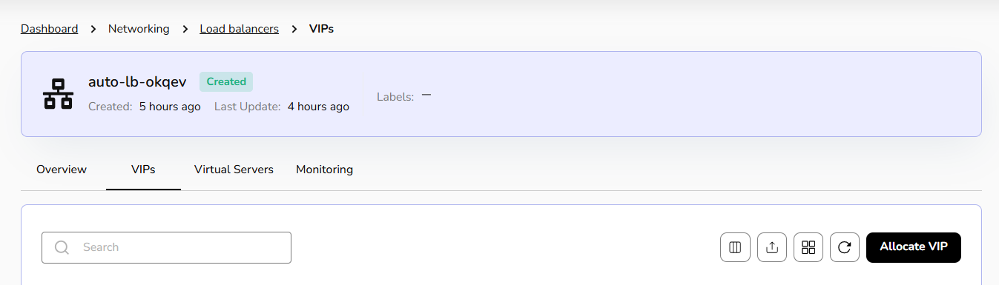

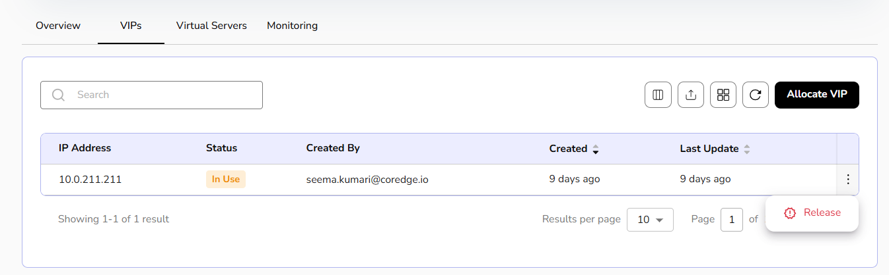

Deploy a **Virtual Server** to handle traffic efficiently, improve performance, and ensure high availability.

Click on virtual server's tab and then click on create virtual server button.

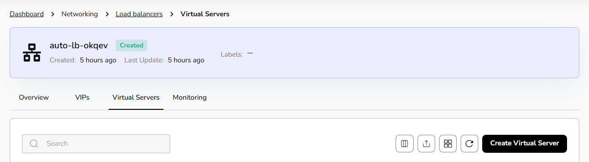

Assign a unique name for easy identification and seamless traffic routing within your Load Balancer.

Choose HTTP or HTTPS for Application Load Balancer; TCP or UDP for Network Load Balancer as per requirement.

Group backend servers for efficient load distribution, high availability, and seamless traffic management.

Optimize load balancing with real-time Monitoring, ensuring reliability and performance.

The destination endpoint. At least one is required, but multiple may be specified too.

Click on next button. Confirm the entered details and click on create button.

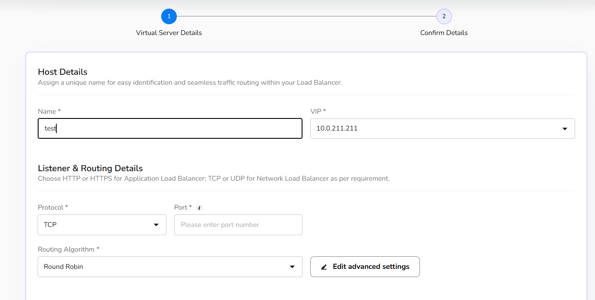

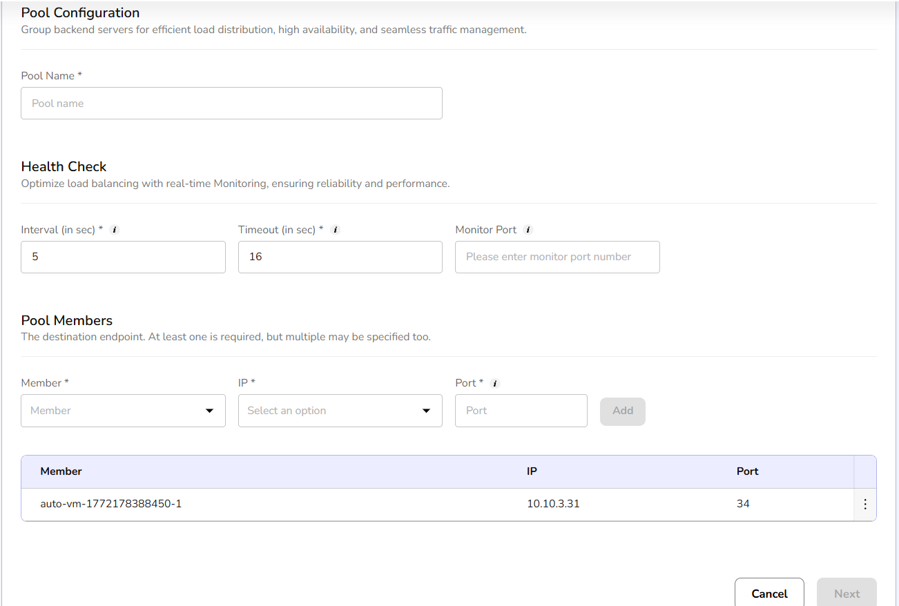

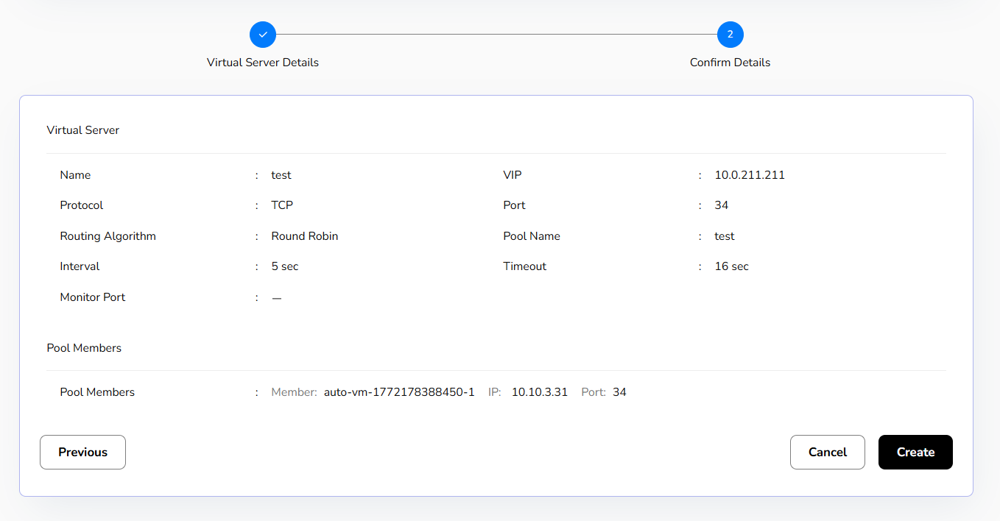

Created Virtual server details can be edited or delete if not needed.

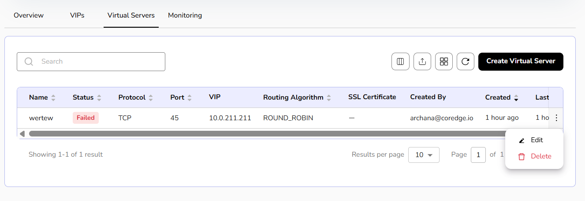

**Monitoring** gives a graphical representation of system throughput, total number of virtual servers, status of a virtual server, its availability, expiry date of certificate, client and server SSL issues, and a lot more information.

## Security

CCP defines security as measures, controls, and services designed to protect cloud resources, data, and applications from unauthorized access, attacks, and threats.

### NAT Gateway

NAT Gateway allows resources in a private subnet to access the internet while preventing incoming connections. It helps secure cloud environments by enabling outbound communication without exposing internal resources.

##### Procedure to allocate public ips

1. Log into the CCP service platform.
1. From the left navigation panel, navigate to resources and select security.
1. Click on NAT gateway.
1. A dashboard of NAT gateway appears. Click on create NAT gateway button.
1. Enter name, select VPC, and subnet from the drop-down menu.
1. Click on the create button.

NAT gateways allocate the public IP to your load balancer or a virtual machine. Further if it is not needed, a user can delete it using the delete option.

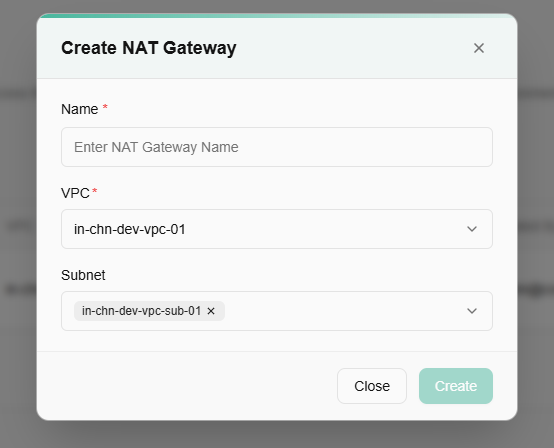

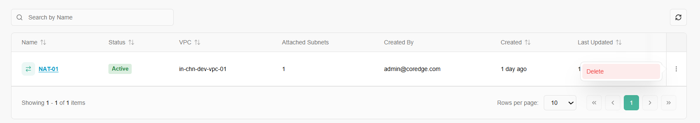

The **Overview** tab provides a high-level summary of the configuration and allocation details of a specific gateway.

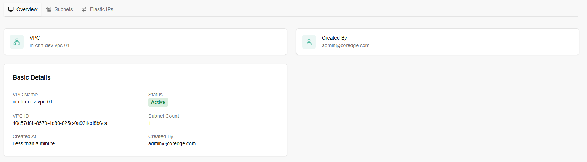

A green button labeled **"+ Attach Subnet(s)"** is visible on the right. Click on it.

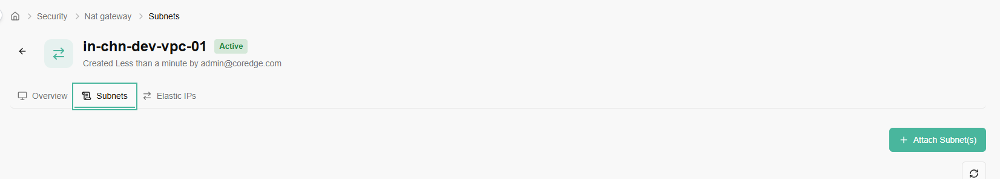

Select subnets to attach. Click on attach button.

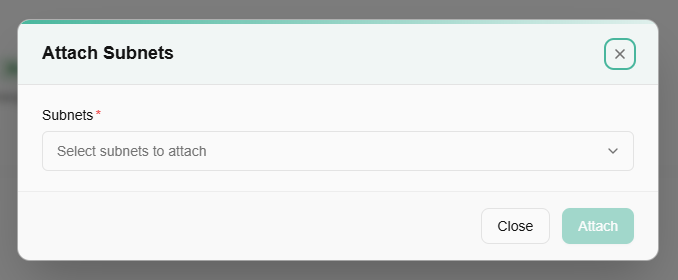

A red button labeled **"Detach"** is available, allowing the user to remove the subnet from the gateway.

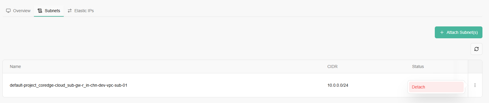

An **Elastic IP (EIP)** is a reserved, static, public IPv4 address designed for dynamic cloud computing. Unlike a standard public IP that might change every time you stop and start a virtual machine, an Elastic IP remains yours until you explicitly release it.

You **Allocate** an Elastic IP when you want to "claim" a public address from the cloud provider's pool.

Releasing elastic IP is the act of "giving the IP back" to the cloud provider.

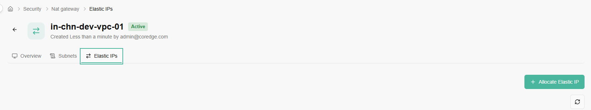

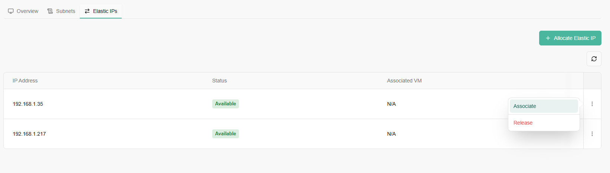

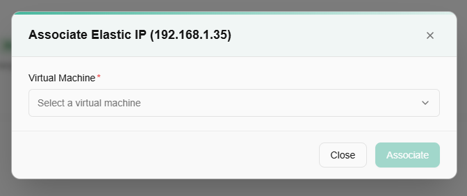

## Monitoring

You can track performance, view graphical representation of your virtual machine metrics, and view resource usage through monitoring. Monitoring involves the systematic and continuous observation of a VM's performance, health, CPU utilization, network traffic, and memory utilization. Monitoring is a crucial aspect of managing IT infrastructure, as it allows administrators to identify issues, optimize performance, and ensure the overall reliability of virtualized environments.

### Monitoring Dashboard

To view metric utilization, perform below mentioned steps:

1. Navigate to monitoring.
1. Click monitoring dashboard.
1. Select metric type and resource from the drop-down menu.

You can track resource usage based on time be it in minutes or hours. Select the time duration from the time drop-down box and click update button. Monitoring dashboard accordingly reflects virtual machine's usage based on your time selection. Based on your selected metric type, the monitoring represents graphical usage of it.

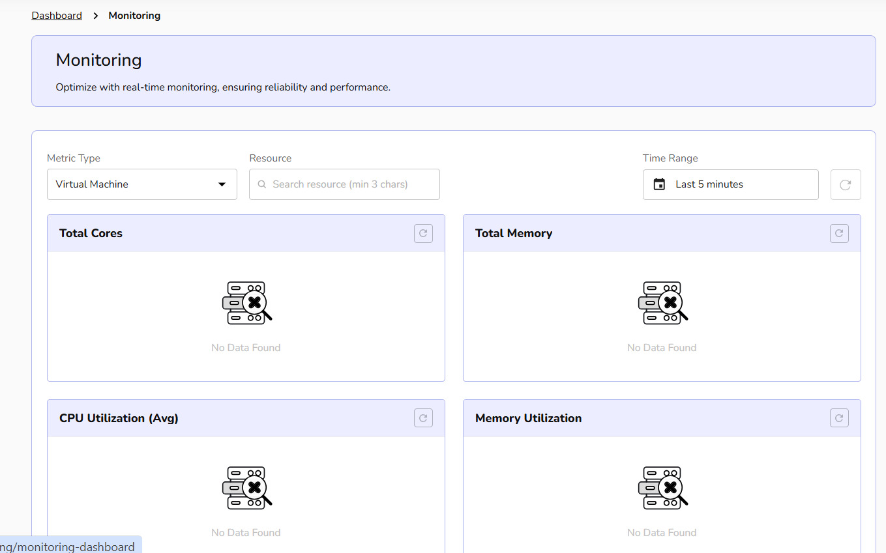

### Alert

Alert management enables you to define alert rules, monitor system thresholds, and receive timely notifications, helping ensure proactive detection of issues and maintain overall infrastructure reliability.

##### Procedure to create alert

1. Go to monitoring and click on alert tab.
1. An alert dashboard appears. Click on create alert button.
1. Add basic details and resource details.
1. Add metrics and thresholds details and click on next button.
1. Add resource mapping details. Confirm the filled details and click on create button.

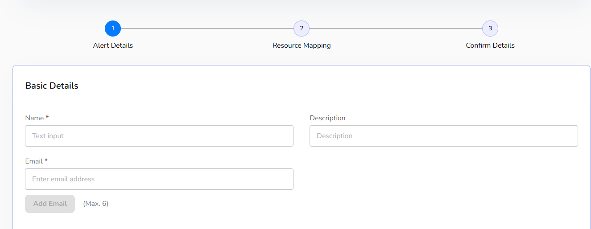

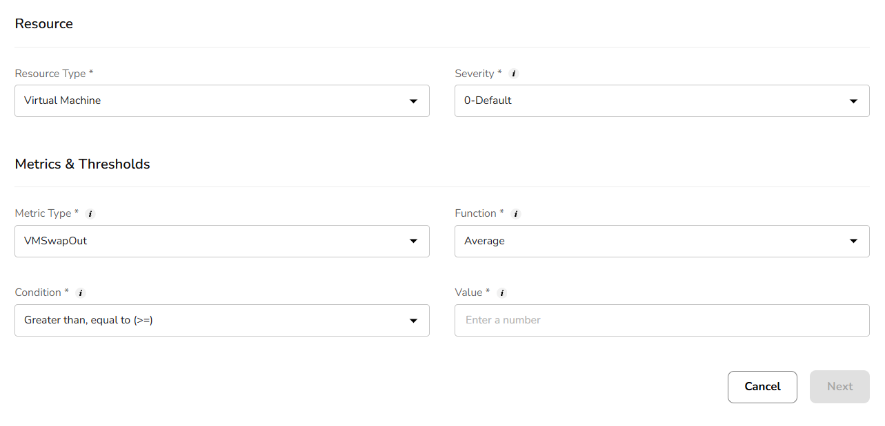

Once alert is successfully created, a user can edit it or delete it by clicking on three dots. Click on the edit button and add necessary changes and confirm the changes.

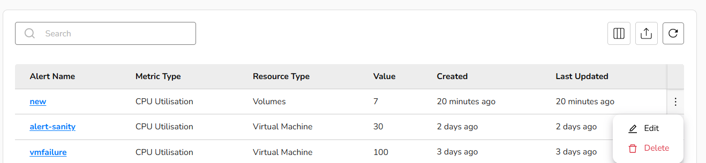

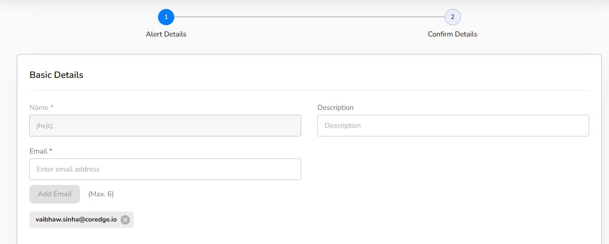

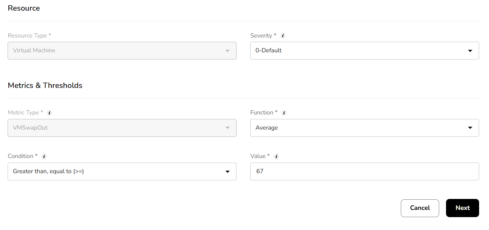

Click on the alert name, the overview section provides complete basic details and alert resource information.

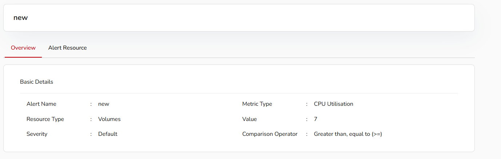

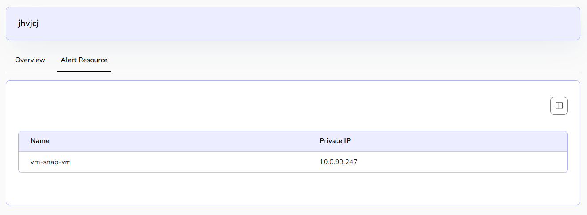

## **Tenant Admin Dashboard**

### Organization Activity Logs

The Activity Logs page provides a comprehensive audit trail of all actions performed within your organization. This is essential for security monitoring, troubleshooting, and tracking infrastructure changes.

1. **Centralized Audit**: View organization-level events, including resource creation, modifications, and system-initiated tasks.
1. **Search & Filter**: Use the Search events... bar to find specific resources by name or use the Filters button to narrow down logs by specific criteria.
1. **Real-time Updates**: Click the Refresh icon (top right) to fetch the latest activity without reloading the page.

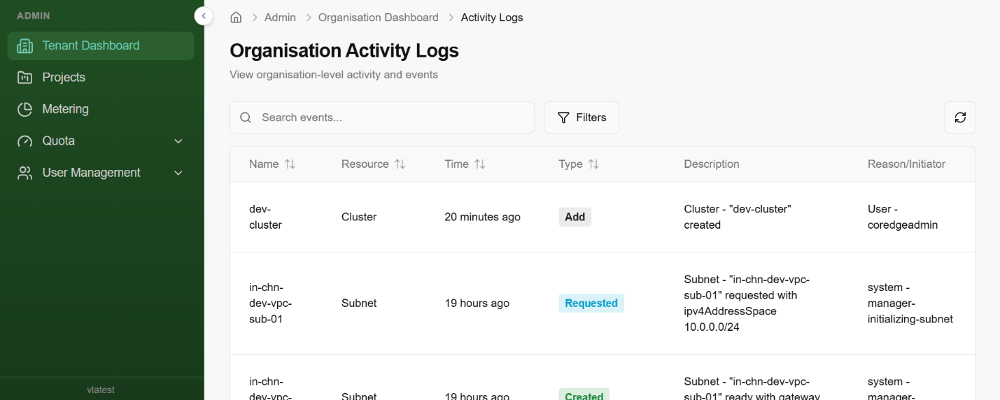

### Projects

Manage projects across your organization. To create a new project, follow the steps below:

  1. Click on create project button.
  1. To update your project details, provide a unique name that reflects the project's purpose, a brief description outlining its objectives and the resources it will manage, and relevant labels to categorize and organize the project for easy filtering and management within your cloud environment.

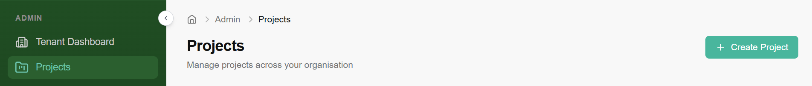

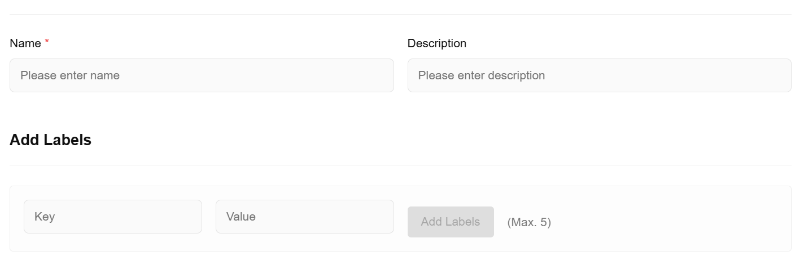

### Metering

The **Metering** section provides a visual representation of how your organization consumes cloud resources. By monitoring these metrics, administrators can identify usage patterns and optimize resource allocation to stay within budget.

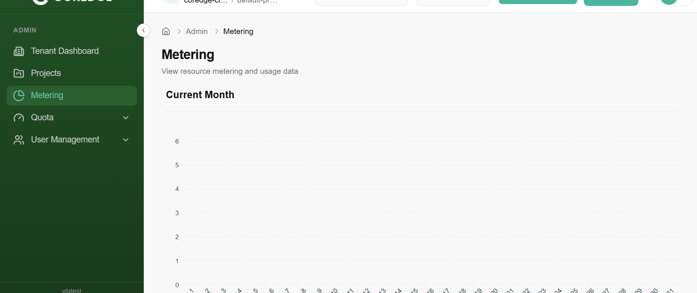

### Quota

#### Quota (Tenant)

A **Tenant Quota** refers to the maximum limit of resources (like storage, load balancers, or compute power) allocated to a specific "Tenant" or organization. The **Tenant Quota** page provides a transparent view of your organization's resource boundaries. It allows administrators to monitor exactly how much of their allocated "slice" of the cloud is currently in use.

**Key Metrics Defined**

The quota table is broken down into three main columns:

**Service:** The specific resource type being tracked (e.g., File Storage, Load Balancer Flavors).

**Usage:** A numerical ratio showing **[Current Units Used] / [Total Units Allocated]**. For example, 500/1000 means you have used half of your available capacity.

**Utilisation:** A visual progress bar and percentage indicating how close you are to reaching your limit.

<table style={{fontSize: '0.85rem', width: 'auto', borderCollapse: 'collapse'}}>
  <tr>
    <th style={{padding: '4px 12px', textAlign: 'left'}}>Column</th>
    <th style={{padding: '4px 12px', textAlign: 'left'}}>Description</th>
  </tr>
  <tr>
    <td style={{padding: '3px 12px'}}>Available</td>
    <td style={{padding: '3px 12px'}}>The total remaining pool of resources left in the Tenant Quota.</td>
  </tr>
  <tr>
    <td style={{padding: '3px 12px'}}>Current</td>
    <td style={{padding: '3px 12px'}}>The limit currently assigned to this specific project.</td>
  </tr>
  <tr>
    <td style={{padding: '3px 12px'}}>Used</td>
    <td style={{padding: '3px 12px'}}>How many units the project is actively using right now.</td>
  </tr>
  <tr>
    <td style={{padding: '3px 12px'}}>Upgrade By</td>
    <td style={{padding: '3px 12px'}}>Use the [+] or [-] buttons to propose a new limit.</td>
  </tr>
</table>

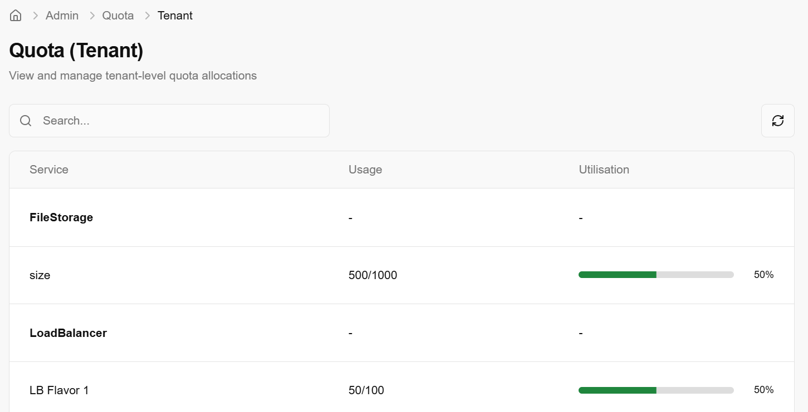

**Monitoring Resource Health**

By reviewing this page, you can proactively manage your infrastructure:

1. **Low Utilisation (Green):** You have plenty of room to scale and deploy new instances or services.
1. **High Utilisation (Approaching 100%):** You may need to delete unused resources or request a Quota Increase from the "Quota Packages" section to avoid deployment failures.

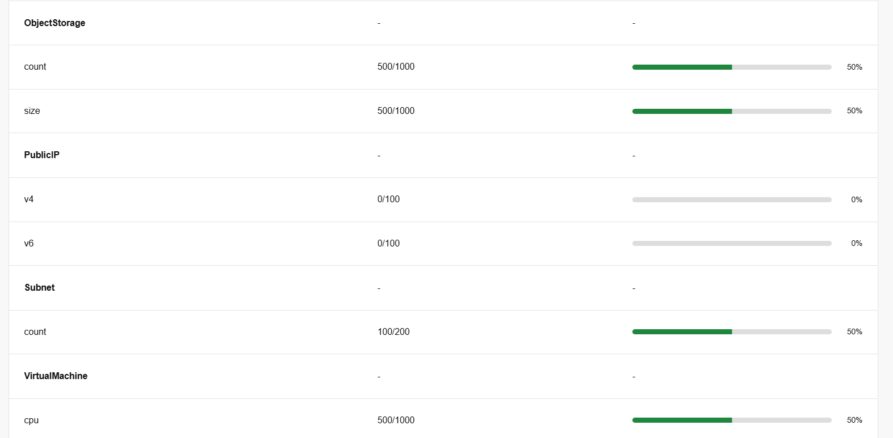

#### **Quota (Project)**

A **Project Quota** is a subset of the Tenant Quota. While the Tenant Quota sets the limit for your entire organization, Project Quotas allow administrators to carve out specific resource limits for individual projects or departments. This ensures that one project doesn't accidentally consume all the resources available to the whole organization.

**Project Quota Overview **

This dashboard provides a snapshot of current allocations for a specific project:

**Usage Tracking:** Displays the number of resources currently provisioned (e.g., 0/50 Load Balancers used).

**Utilisation Bar:** A visual indicator that turns from grey to green as the project consumes its assigned limit.

**Service Categories:** Limits are broken down by specific services like **File** **Storage**, **Object** **Storage**, and **Load Balancers**.

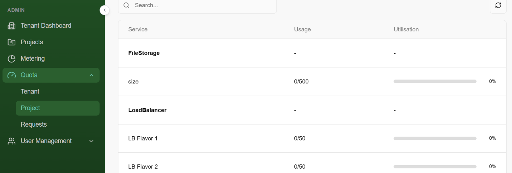

**Adjusting Project Quotas **

The Manage Project Quota interface is used to increase or decrease the limits for a specific project.

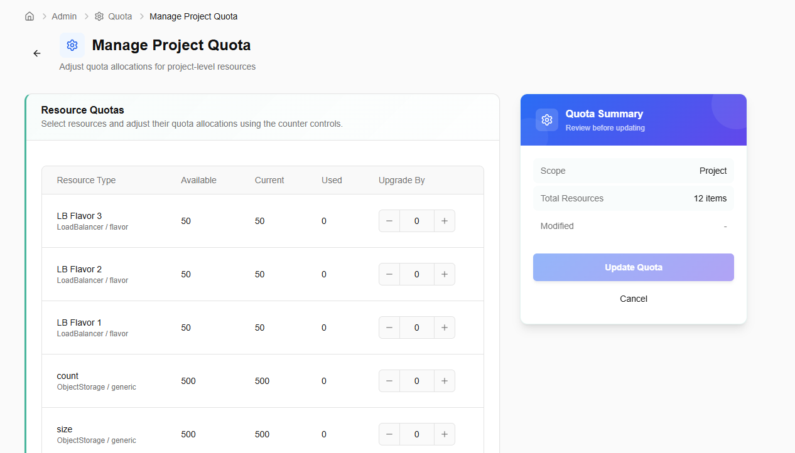

1. **Quota Summary**: Before saving, review the summary card on the right. It shows the Scope (Project) and the number of items being modified.
1. **Update Quota**: Clicking this button submits the request.

#### **Quota ****Requests**

The **Quota Request** workflow is the bridge between your current resource package and your future scaling needs. This section allows you to track, manage, and submit requests for higher resource caps.

1. Click on create request button to create a quota request.
1. Provide a description and priority for your quota request.
1. Add description as why do you need this quota increase.
1. Set priority from drop-down as high, medium or low.
1. Select the resources you want to increase quota for.
1. Apply custom tags to organize your quota request (up to 5 tags).
1. Click on create quota request.

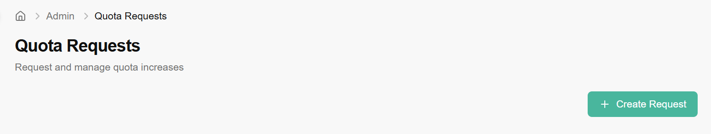

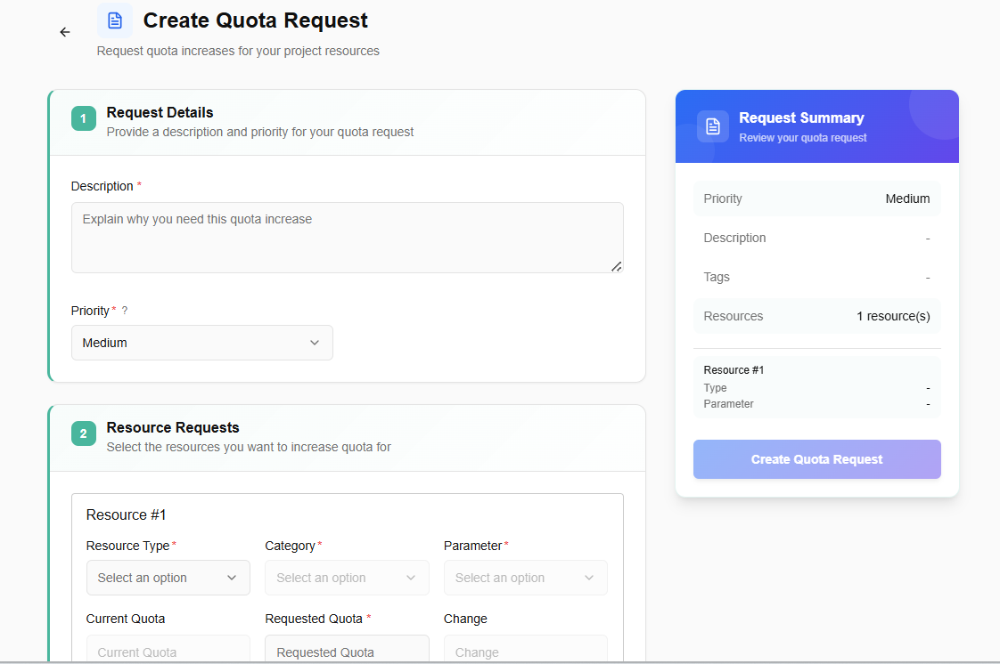

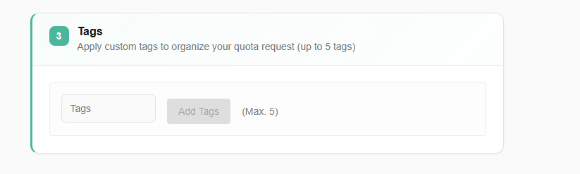

Once your request is submitted, it will go for administrator approval. An admin can approve or reject the request.

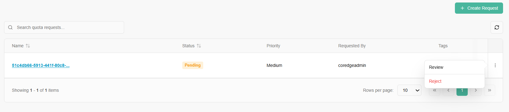

If you click on a name tab, it redirects to its detailed page. An overview section provides a description of requested quota and requested resources provides approval/rejection of request.

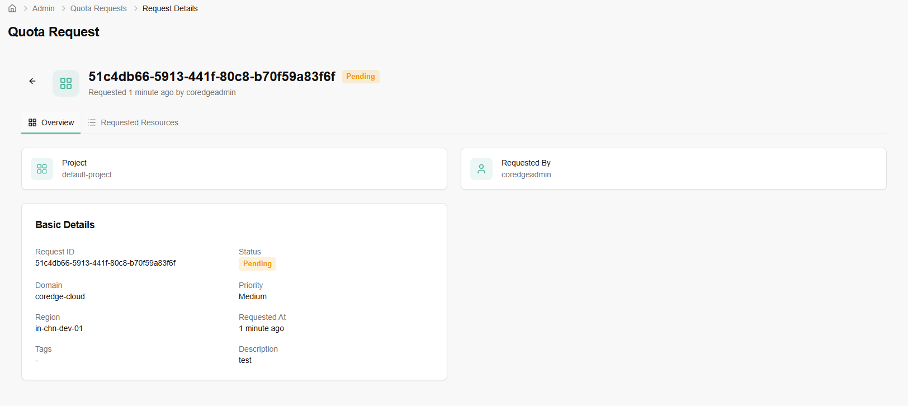

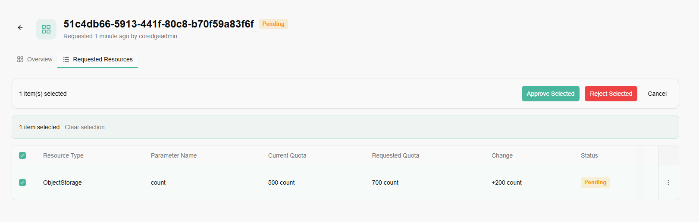

### User Management

#### Tenant

The **Create User** page allows administrators to provision new access credentials and define the initial profile for team members.

Complete the following fields to set up a new account:

**Username:** The unique identifier the user will use to log in.

**Email:** The official email address for notifications and password recovery.

**First & Last Name:** Personal identifiers for the user profile.

**Password:** Set a secure initial password. The user will typically be prompted to change this upon their first login.

**Enabled Checkbox:** When checked, the account is active immediately upon creation. Uncheck this if you want to create the account now but grant access at a later date.

**Create User:** Click this button to save the details and generate the account.

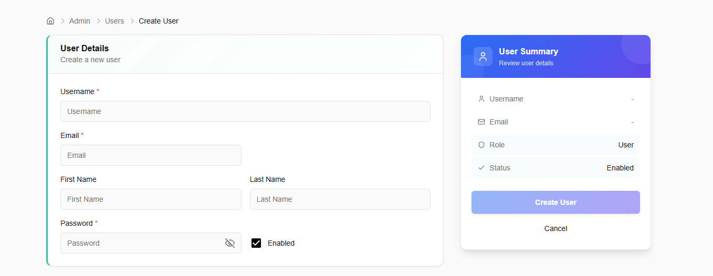

**Manage Roles:** By clicking the three dots (Actions menu) or the "Manage Roles" shortcut, you can enter the configuration screen to update a user's permissions.

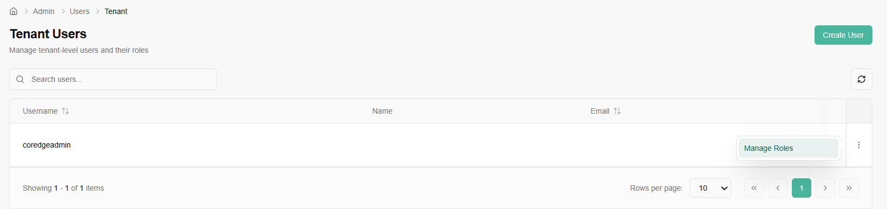

The **Manage Role** interface allows you to define exactly what a user is allowed to do.

**Section 1: Current Roles**

This area lists all roles currently assigned to the user at the domain/tenant level.

**Remove:** You can instantly revoke a specific set of permissions by clicking the "Remove" button next to a current role.

**Section 2: Assign New Role**

**System Roles:** Choose from pre-defined, platform-wide roles.

**Custom Roles:** Access roles specifically created for your organization's unique workflow.

**Search Roles:** Use the integrated search bar to find specific permissions without scrolling through the full list.

Before finalizing, review the summary card on the right:

**User:** Confirms the identity of the person being modified.

**Scope:** Shows that the permissions apply at the **Tenant** level.

**Assign Role:** Click this to apply the changes. The user may need to refresh their session or re-log for the new permissions to take effect.

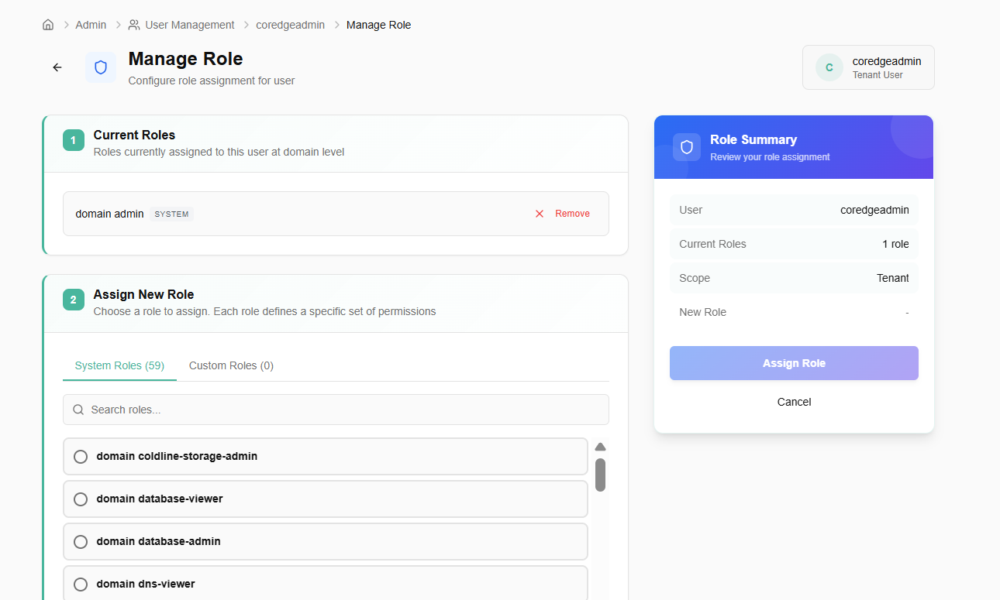

#### Project Users

The **Project Users** page is where you manage specific access for a single project environment.

**Manage Roles:** Access the detailed permission settings for a specific user within *this* project.

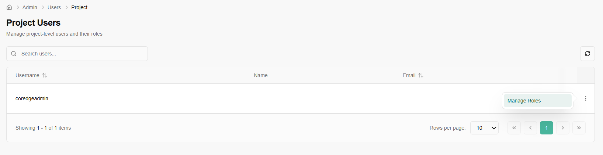

1. **Select Project:** Choose the specific project you are configuring.
1. **Current Roles:** Review the roles the user already holds within this project.
1. **Assign New Role:** Select from available project-level roles.

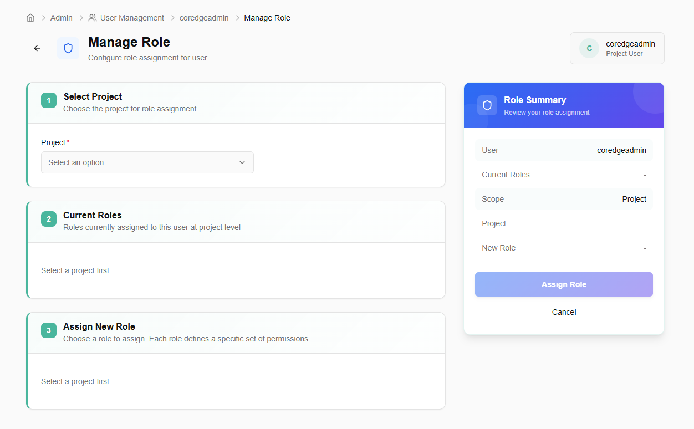

#### Roles

Manage system and custom roles with granular resource permissions.

1. Click on create role button.
1. Define the role name and an optional description.
1. Select the resources and actions this role should have access to.
1. Click on create role button.

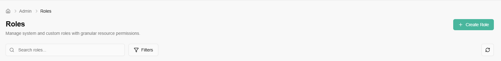

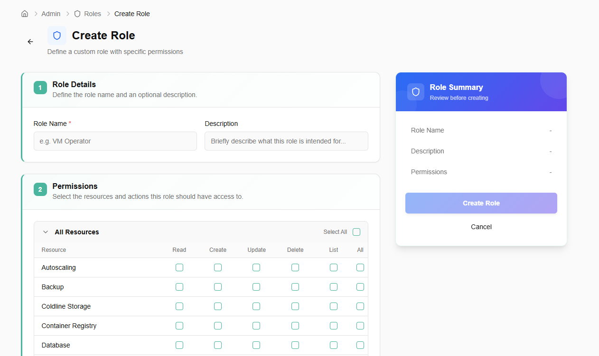

If you click on a name tab, a pop-up appears. It includes resources details.

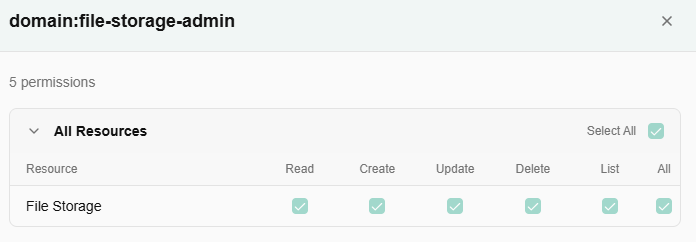

