## Document Version Control

This table shows a record of significant changes to the document.

<table style={{fontSize: '0.85rem', width: 'auto', borderCollapse: 'collapse'}}>
  <thead><tr>
    <th style={{padding: '4px 12px', textAlign: 'left'}}>Version</th>
    <th style={{padding: '4px 12px', textAlign: 'left'}}>Date</th>
    <th style={{padding: '4px 12px', textAlign: 'left'}}>Author</th>
    <th style={{padding: '4px 12px', textAlign: 'left'}}>Reviewer</th>
    <th style={{padding: '4px 12px', textAlign: 'left'}}>Description of Change</th>
  </tr></thead>
  <tbody>
  <tr>
    <td style={{padding: '3px 12px'}}>1.0</td>
    <td style={{padding: '3px 12px'}}>15th Dec 2025</td>
    <td style={{padding: '3px 12px'}}>Priti Shukla</td>
    <td style={{padding: '3px 12px'}}>Archana Prasad</td>
    <td style={{padding: '3px 12px'}}>Initial Draft</td>
  </tr>
  <tr>
    <td style={{padding: '3px 12px'}}>1.1</td>
    <td style={{padding: '3px 12px'}}>27th March 2026</td>
    <td style={{padding: '3px 12px'}}>Priti Shukla</td>
    <td style={{padding: '3px 12px'}}>Md Aamir</td>
    <td style={{padding: '3px 12px'}}>Update as per new UI</td>
  </tr>
  </tbody>
</table>

# Document Overview

## Introduction

Cirrus Cloud Suite (CCS), a Cloud Self-Service Portal that captures the overall product specifications to create a comprehensive cloud offering for your business and provide seamless infrastructure provisioning, monitoring, and management of cloud services. CCS platform is a cloud orchestrator or manager designed to provide hyper-scaler-like capabilities to OpenStack and Kubernetes-based deployments. The purpose is to provide better cloud services in terms of features, stability, and performance. Empower your team with the ability to effortlessly deploy, monitor, and control your infrastructure, ensuring optimal performance and efficiency.

This admin guide aims to provide an orchestration layer that includes key functionality of an OpenStack and Kubernetes-based public cloud experience.

## Scope of Document

The scope of this document is to explain the usability and functionality of CCS admin console to its users.

# Dashboard

CCS dashboard is designed for seamless management and complete control. The Admin portal empowers you to oversee users, roles, and resources effortlessly, with secure access and real-time insights that simplify administration and enhance operational efficiency.

Gain visibility into your cloud environment, from tenants and organizations to projects, users, and active resources. Track compute, storage, network usage, monitor providers, and maintain platform consistency -- all from one unified dashboard.

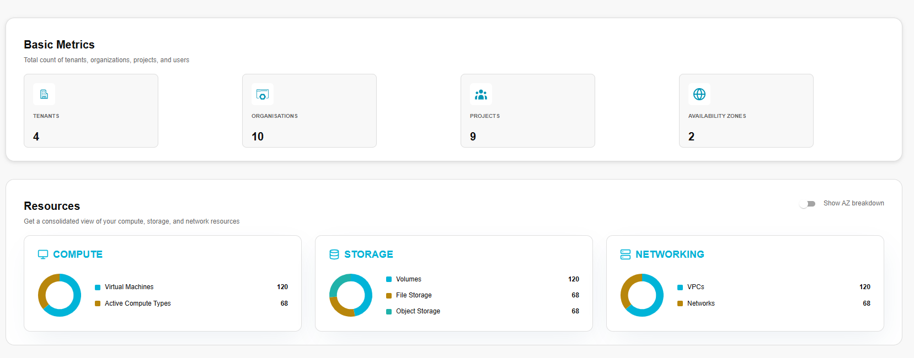

**Global AZ Breakdown Toggle:** In the upper-right corner of this panel, there is a toggle switch. By default, resources are shown at a consolidated, global level. Activating the "Show AZ breakdown" toggle (when configured and supported) will further refine the data in each resource card, showing usage partitioned by each Availability Zone, allowing you to identify zone-specific resource hotspots.

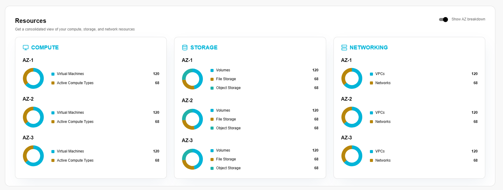

# Administrator

## Tenant

A tenant is a secure, dedicated space, where your organization can organize and manage all its resources with full control. A tenant is a higher-level container than a cell -- it groups multiple cells and policies under a single administrative domain.

### Procedure to create tenants

- Log in to the CCS admin portal.
- From the left navigation panel, navigate to Tenant and click on Tenants tab.
- On the tenant page, click the create tenant button.
- Provide a friendly tenant name and add admin details such as username, email, first name, last name, and password.
- Select the quota package from the dropdown in the quota section.
- Click Create button to finish.

Once created, confirm details such as name, description, username, first name and last name. Click the confirm button.

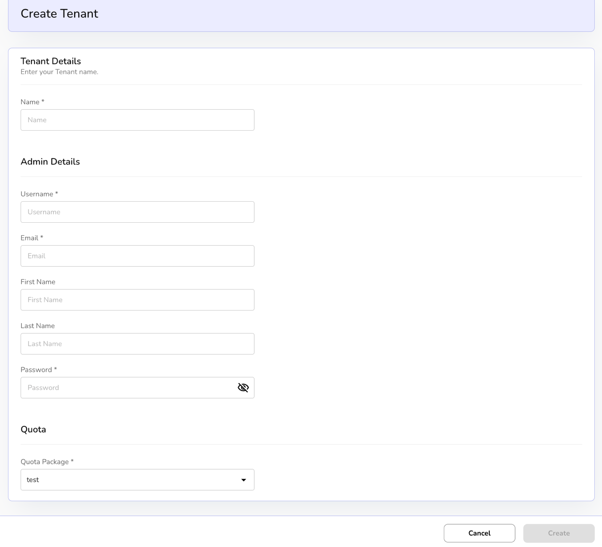

### Tenant details

On the tenant's dashboard, admin can view a created tenant including name, tenant, created by and created at detail.

Admin can and Export to download the list with the selected page and columns.

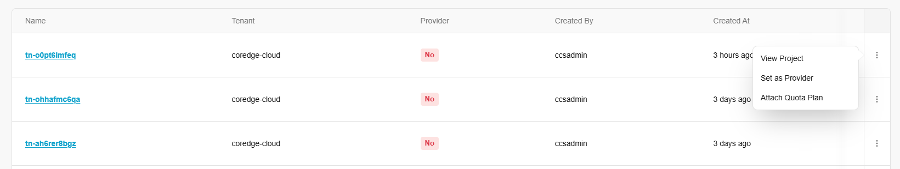

Click on the three dots to View Project, Set as Provider, and Attach Quota Plan.

- Click on View Cell. A default domain page with cells, users, additional information, and mapped images appears.

Cells provide detailed information about when it was created, its description, and name.

- Users allow you to attach a user. Go to user's tab and click on attach user button.
- Enter select user and select role from the drop down and click on attach button to assign the role.

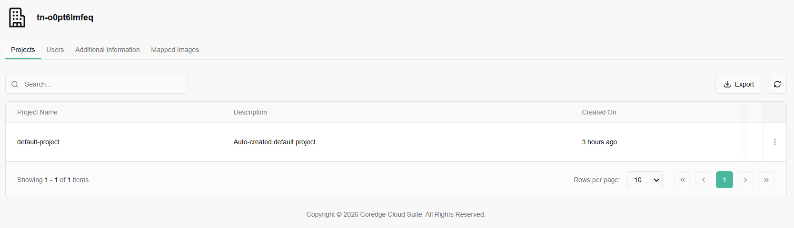

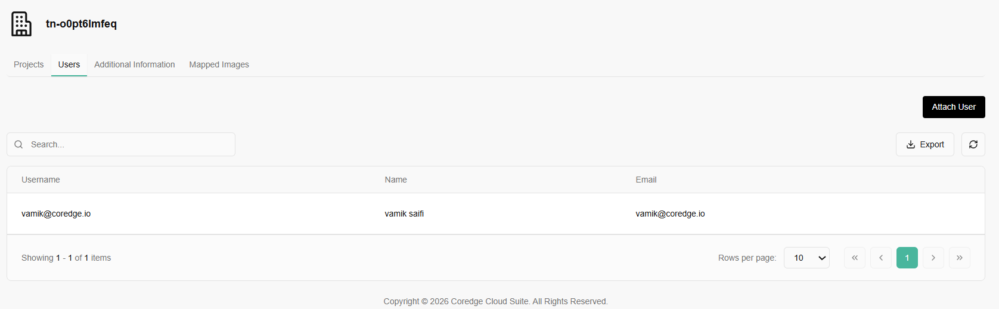

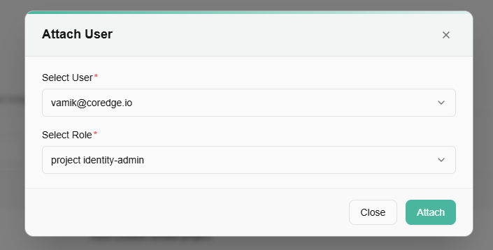

- Additional information provides firewall and VDOM details.

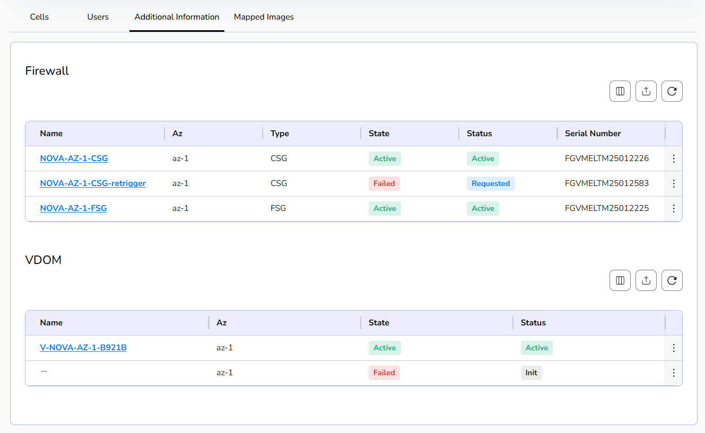

- If a firewall or VDOM is no longer needed, you can delete it using delete button.

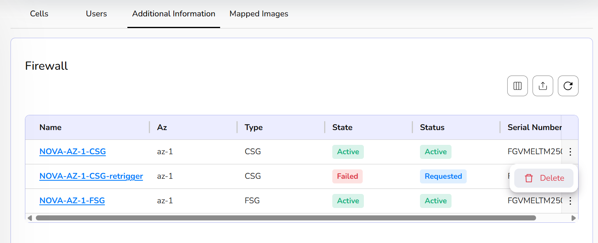

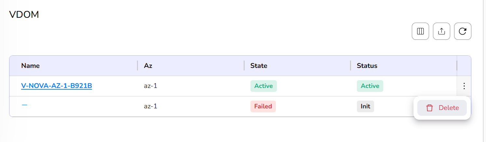

- Click on a firewall name, it provides firewall details and compute firewall details.

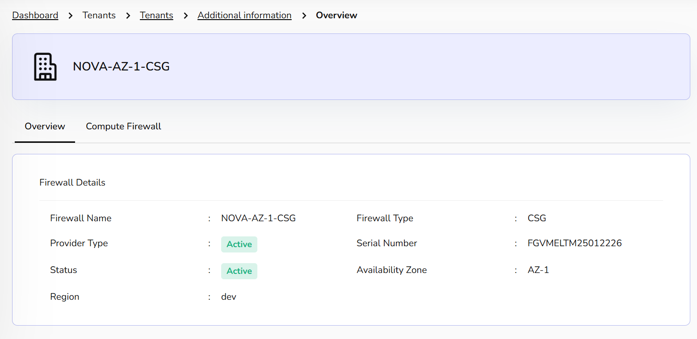

- VDOM provides its overview and VPCs details.

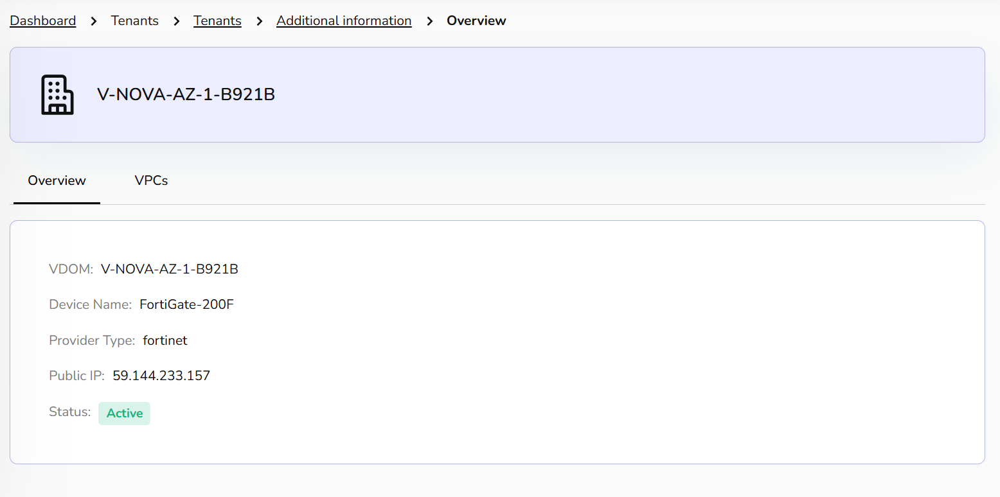

The **Mapped Images** tab provides a centralized view of all operating system templates available for deployment within your current Tenant. You can un-map image if it is no longer needed.

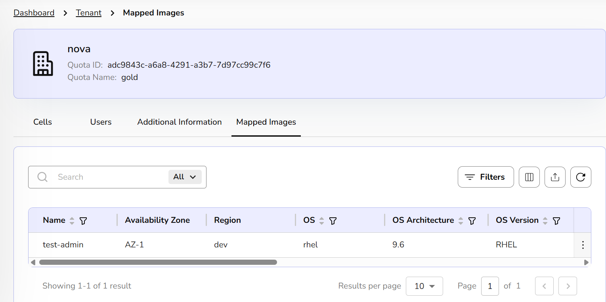

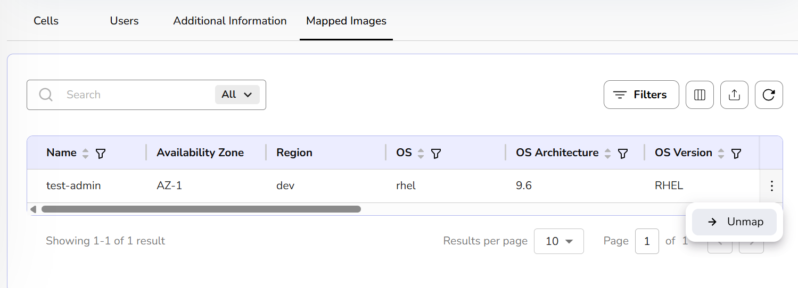

### Procedure to attach quota plan

Attaching a **Quota Plan** to a **Tenant** is the primary way your portal manages resource allocation and financial guardrails. Without a quota plan, a single tenant could theoretically consume all available GPUs in a data center, leaving nothing for others.

- Click on three dots. Click on attach quota plan.
- Select quota package from the dropdown and click on attach button to attach quota plan.

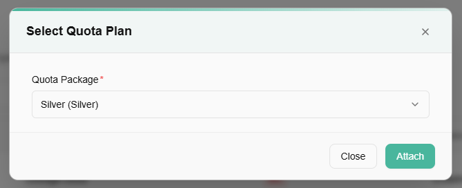

## Projects

Cells are organizational tools that help you manage and group resources like virtual machines, databases, and storage, making it easier to organize, monitor, and collaborate on related assets. You can create a cell through the Dashboard. To create a cell, follow below-mentioned steps:

### Procedure to create project

- Log in to the CCS admin portal.
- From the left navigation panel, navigate to Tenant and select Projects.
- Navigate to the right side and click on the create project button.
- Choose the organisation under which to create the project.
- Provide a unique name and optional description for the project.
- Click on create project button. It will successfully create the project.

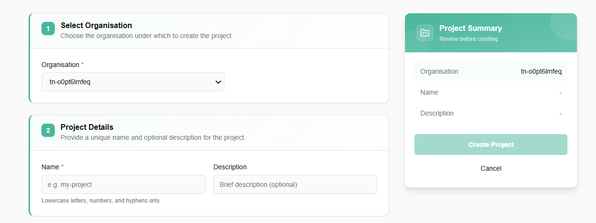

- Click on the three dots, click on the attach users.
- Enter details of the selected user, select the role from the drop-down box and click on the attach button.
- A pop-up of user mapped successfully appears.

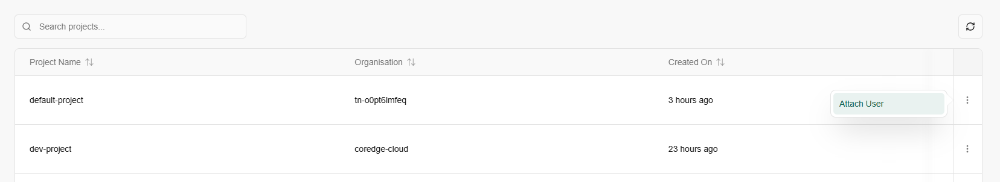

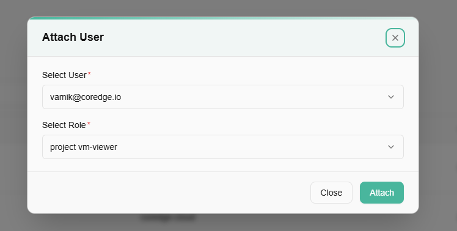

## User Management

User Management creates, updates, deletes, and controls user access within a system, platform, or cloud environment. It is a key part of Identity and Access Management (IAM), such as Arcos, OpenStack, or AWS.

### Users

Creating a user means adding a new identity or account to the system through an administrator or IAM service. This user can log in and perform allowed operations based on assigned roles.

#### Procedure to create users

- Log in to the Fluid CCS admin platform.
- From the left navigation panel, navigate to User Management and select Users.
- Click on Create User button tab.
- Enter user details such as username, email, first name, last name, and password.
- Set the enabled status and click create button.
- Click on confirm button to confirm the details.

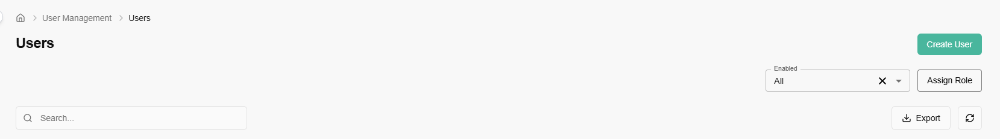

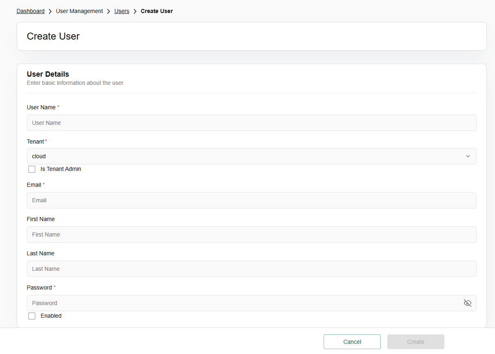

#### Modify user details

From the left navigation panel, navigate to User Management and select Users.

When you click the **three-dot (vertical ellipsis) menu** at the end of a user row, you gain access to the following management tools: Option of manage roles, reset password, disable user, and enable user appears.

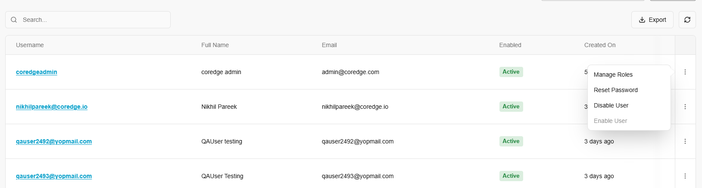

##### Manage Roles

This is the primary method for controlling **Permissions and Access Control**.

Selecting this usually opens a modal or slide-out menu where you can assign "Roles".

- Choose the domain and optionally a project for role assignment.
- Choose a role to assign. Each role defines a specific set of permissions.
- Click on assign role button.

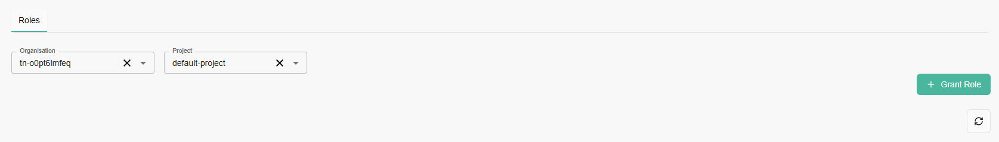

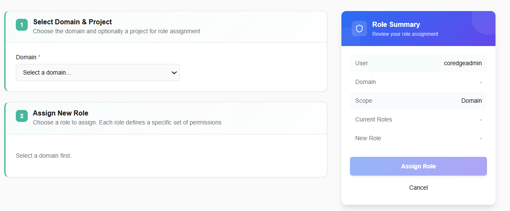

##### Reset Password

This is a security and support feature used when a user is locked out, or their credentials have been compromised.

To reset password, click on **Reset password**, enter a temporary password and click on reset.

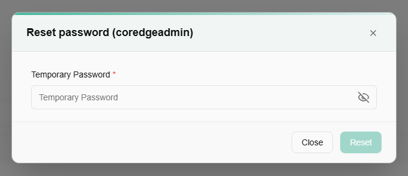

##### Disable / Enable User

These are toggle-based actions used to manage a user's active status without deleting their data or history.

- To disable the user, select **Disable** and confirm.
- To enable the user, select **Enable** and click yes to confirm.

### Admin Users

An admin user is a privileged account with elevated system-wide access. Admins can create and manage tenants, configure quota packages, monitor resource utilization and alerts, oversee security and regions, and handle full user management (including other admin accounts), enabling governance, policy enforcement, and platform-wide operations beyond standard tenant capabilities.

#### Procedure to create users

- Log in to the Fluid CCS admin platform.
- From the left navigation panel, navigate to User Management and select Admin Users.
- Click on create user button tab.
- Enter user details such as username, email, first name, last name, and password.
- Click on confirm button to confirm the details.

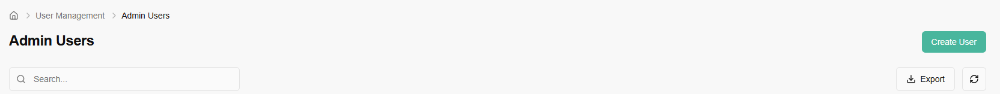

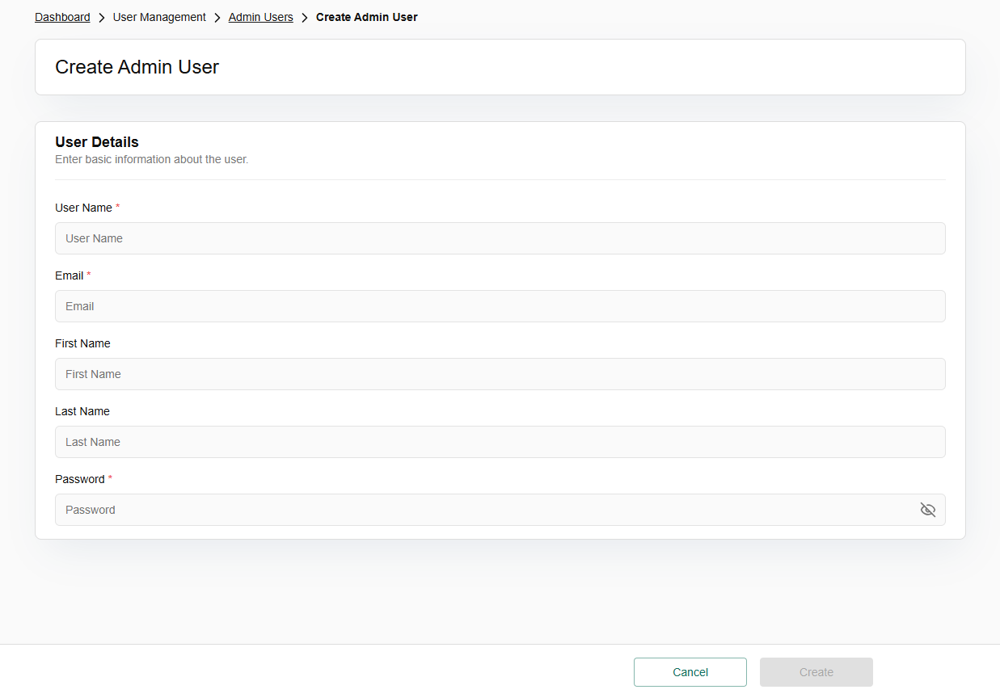

#### Modify user details

From the left navigation panel, navigate to User Management and select Users.

When you click the **three-dot (vertical ellipsis) menu** at the end of a user row, you gain access to the following management tools: Option of reset password, disable user, and enable user appears.

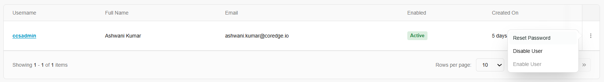

##### Reset Password

This is a security and support feature used when a user is locked out, or their credentials have been compromised.

To reset password, click on **Reset password**, enter a temporary password and click on reset.

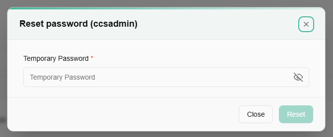

##### Disable / Enable User

These are toggle-based actions used to manage a user's active status without deleting their data or history.

- To disable the user, select **Disable** and confirm.
- To enable the user, select **Enable** and click yes to confirm.

##### Grant Role

You can grant role to an admin user. Click on the admin user username and click on grant role button.

Select role from the drop-down menu and click on grant button. It will allow a selected admin user to give the role you assigned/granted.

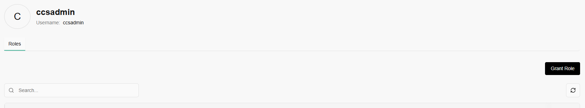

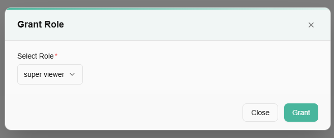

### Roles

- **Roles** are the sets of permissions that define what a user can or cannot do within the platform.
- A domain usually represents a specific scope, such as a particular department, a client environment, or a logical boundary within your cloud infrastructure. Before you see any roles, you must select a **Domain**.

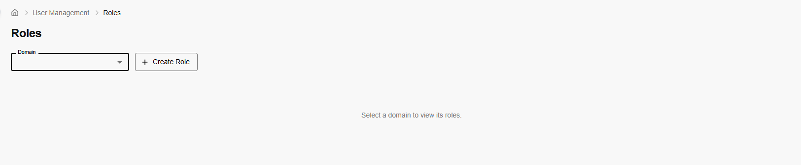

#### Procedure to create role

- Choose the domain for which to create this role.
- Define the role name and an optional description.
- Select the resources and actions this role should have access to.
- Click on create role button.

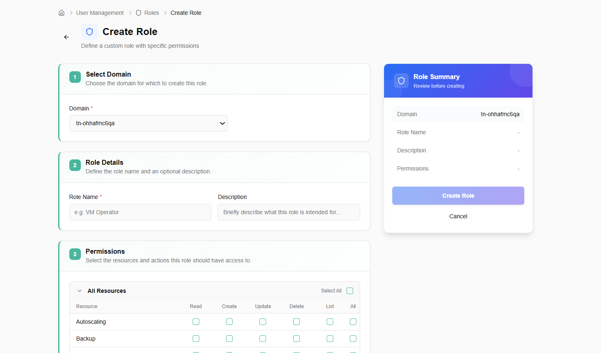

- Once a role is created, you can view the permission it is assigned to. Permissions like read, create, update, and so on.

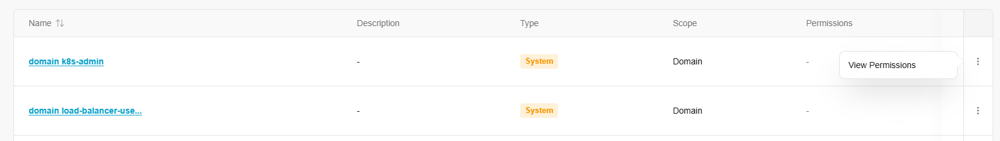

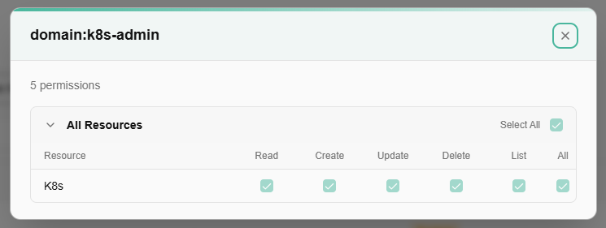

## Quota

"Quota" refers to resource quota management in the platform. Quota Packages (including the one named "Quota") define maximum limits for cloud resources (e.g., compute, storage, networking) that can be applied to tenants, projects, or users.

### Quota Packages

Quota Packages are predefined resource limit configurations that administrators can create and assign to tenants, projects, or users. They define maximum allowances for resources such as compute (vCPUs, RAM), storage, networking, and other services. The packages shown follow tiered naming (Diamond, Gold, Silver) suggesting different service levels, alongside test and auto-generated package.

#### Procedure to create quota package

Create quota package assign resource quotas to a specific tenant to define usage boundaries for compute, storage, or other services. Define a reusable set of resource limits by creating a quota package. Quota packages help standardize resource allocation across tenants or projects.

- Log in to the Fluid CCS admin platform.
- From the left navigation panel, navigate to quota and select Quota Packages.
- Click on the create quota package button, enter basic details such as name, description, and display name to identify and describe this quota package.
- In the resource quota allocation, choose the resource type from the drop-down list and click on add quota button.
- Details of resource type, quota, allocated limit and action appears.
- Click on next button to create the quota package.

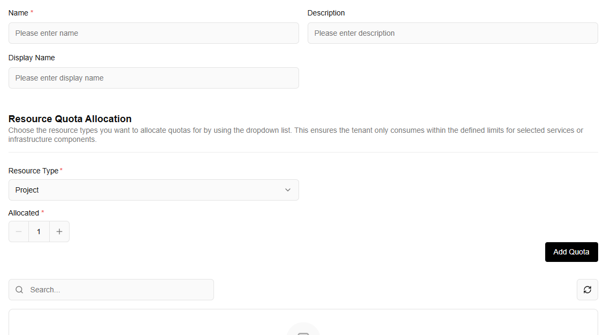

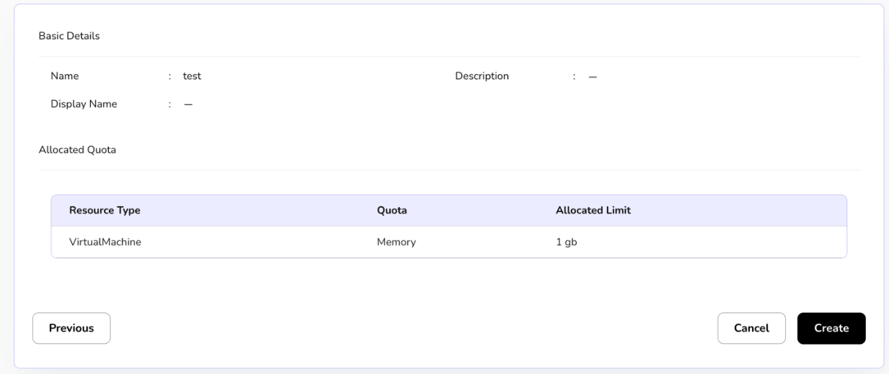

- To **Deprecate** a quota package means to mark it as "obsolete" or "soon to be retired." It is a softer action than deleting it entirely.

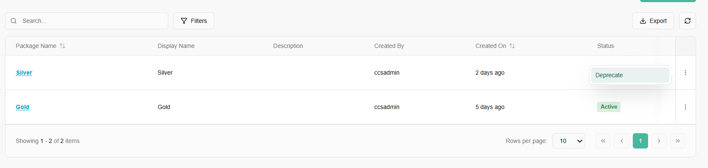

- Click on package name to get detailed information.
- **Resource Type:** The category of service (e.g., Virtual Machine, Subnet, VPC, Load Balancer).
- **Flavor Name:** Specific sub-categories, such as "CPU" or "ram" for Virtual Machines.
- **Allocated Limit:** The maximum numerical value allowed for that resource.

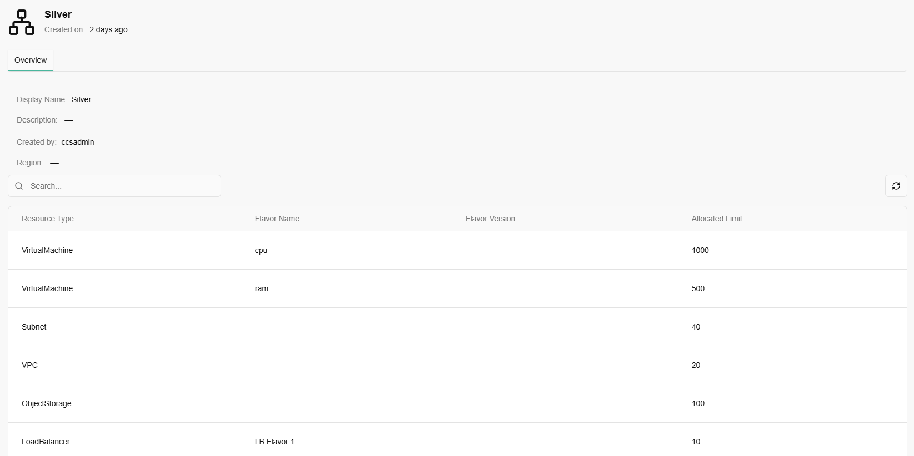

### Tenant Quota

Tenant quota or quota service is an organization-specific quota charts that visualize resource usage, displaying CPU, memory, and disk data for organization.

- Select tenant from the drop-down menu.

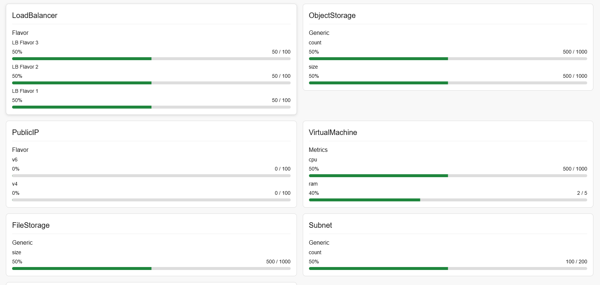

### Cell Quota

Cell specific quota charts visualize resource usage, display CPU, memory and disk data for cell.

- From the left navigation panel, navigate to quota and select project quota.
- Select project and tenant from the drop-down menu.

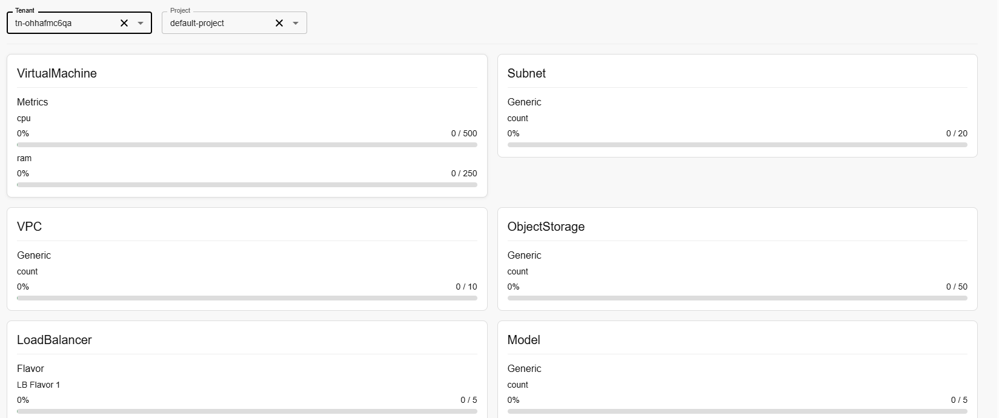

## Monitoring

### Monitoring Providers

A Monitoring Provider is the service or "agent" responsible for collecting raw data from your infrastructure. It is the bridge between your resources (VMs, Databases, Networks) and your Admin Console.

#### Procedure to create provider

- Enter the basic details for the monitoring provider.
- Enter provider name, select resource type, and provider type from the drop-down menu.
- Enter dashboard authentication URL.
- Enter API key name, and API token.
- Enter source UID and ID.
- Select availability zone from the dropdown menu.
- Set active status as yes or no.
- Add description and click on click provider button.

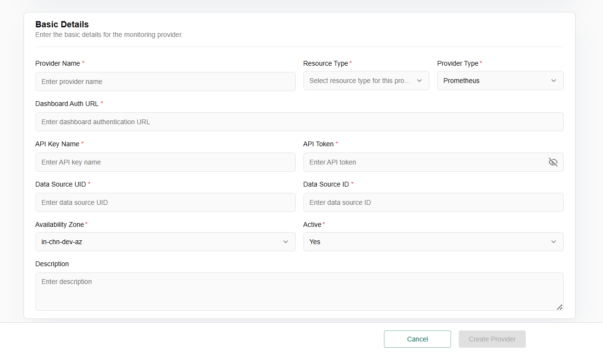

### Monitoring Dashboards

A Monitoring Dashboard is a visual interface that turns that raw data into something a human can understand. It uses charts, graphs, and heatmaps to show you the "state of the union" of your environment.

#### Procedure to create monitoring dashboard

- Click on create dashboard button.
- Enter the basic details for the dashboard.
- Add and configure panels for your dashboard. Drag and drop to rearrange.

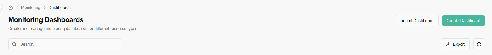

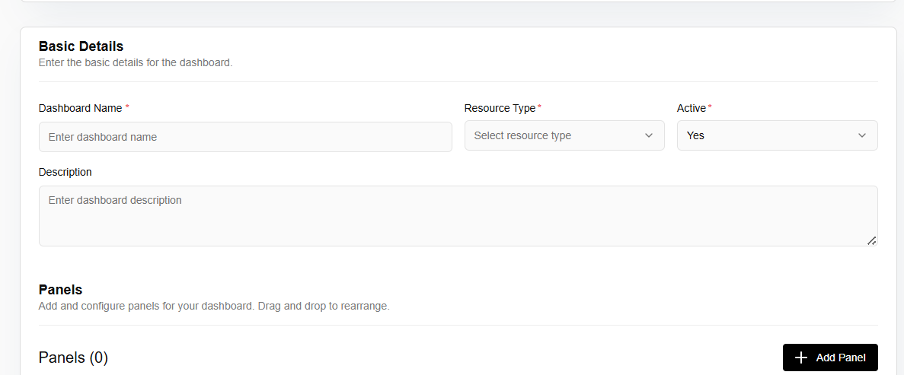

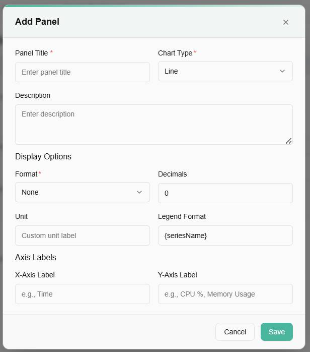

### Access Logs

Access logs are a specific type of log that records user or system access to a service, resource, or application. These logs are critical for security, auditing, and tracking usage.

- From the left navigation panel, navigate to Access Logs.
- On the access logs page, an admin can select tenant from the drop down, and view user, action time, status, action method, and Action URLs.

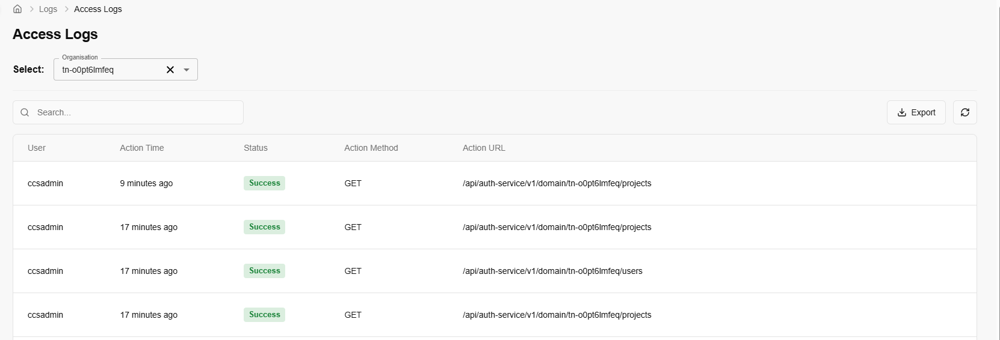

# Catalog

A catalogue is a central, structured list of all services and resources an organization's IT department offers to its users, such as hardware, software, and support. It functions like a menu, providing clear descriptions, costs, and access procedures for each service, which helps users find and request what they need efficiently and supports IT operations.

## Compute Catalogue

A Compute Catalogue is a centralized library or directory of all available compute resources--virtual machines, containers, bare-metal servers, GPU instances, edge nodes, and sometimes even serverless functions--offered within a cloud platform, data center, or multi-cloud environment.

### View Compute Catalogue

- Log in to the Fluid CCS admin platform.
- From the left navigation panel, navigate to catalogue and select compute catalogue.
- On the storage providers page, an admin can view the name, availability zone, OS, OS Architecture, OS Version, OS Group Name, Public, Active and created on.

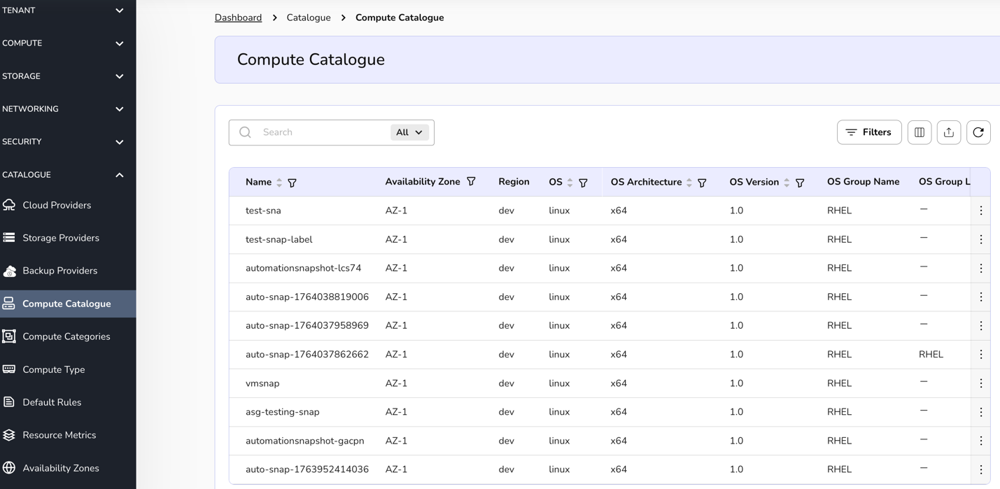

- Apply filter in name, availability zone, OS, OS Architecture, OS Version, OS Group Name, Public, and Active.
- Admin can use View Preferences to customize visible columns, and Export to download the list with the selected columns.

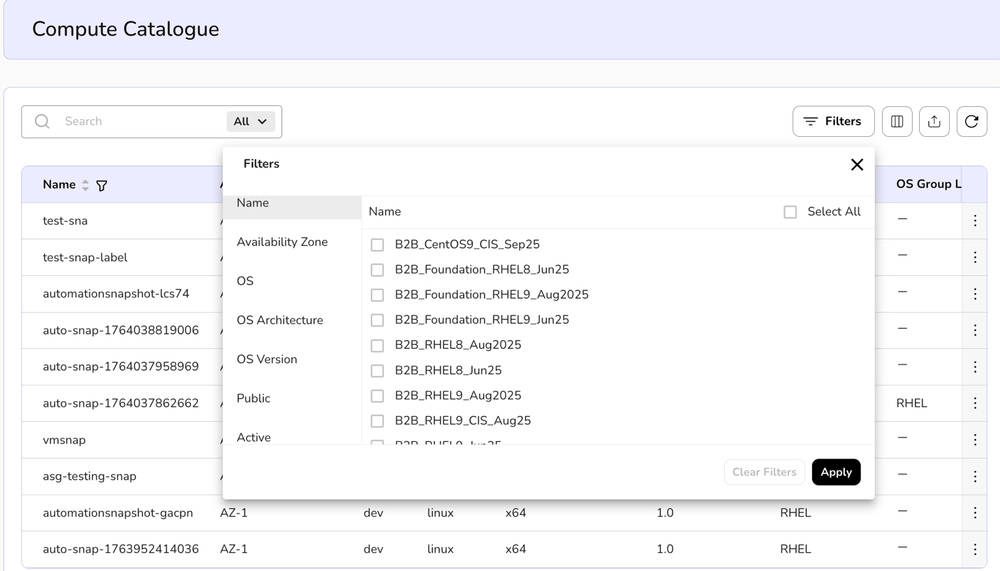

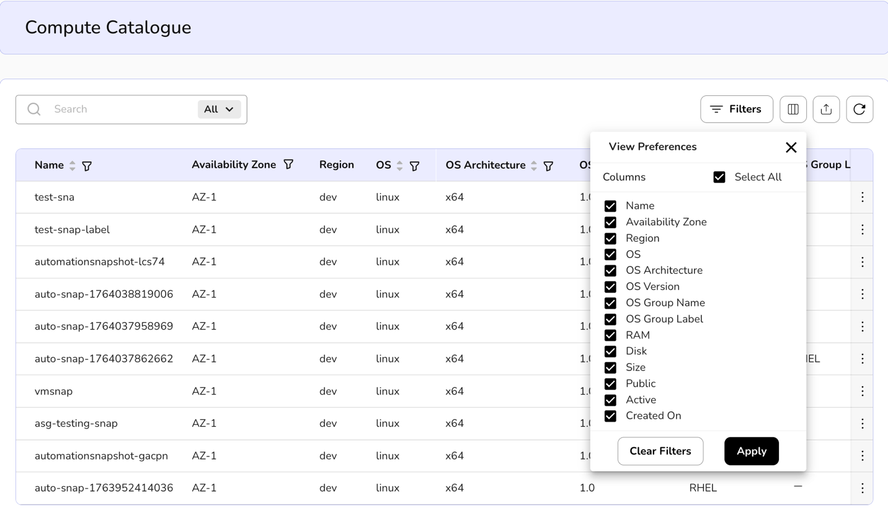

- Click on the three dots, three options appear. Edit image details, manage Init script, and view related VMs.
- Click on edit image details, Update Compute Catalogue page appears.
- Enter basic details such as OS, OS Version, OS Architecture, public, active, group name, instruction text, Min Desk, Min vCPU, Min Ram, Min GPU, and description.
- Click on update and confirm the details.

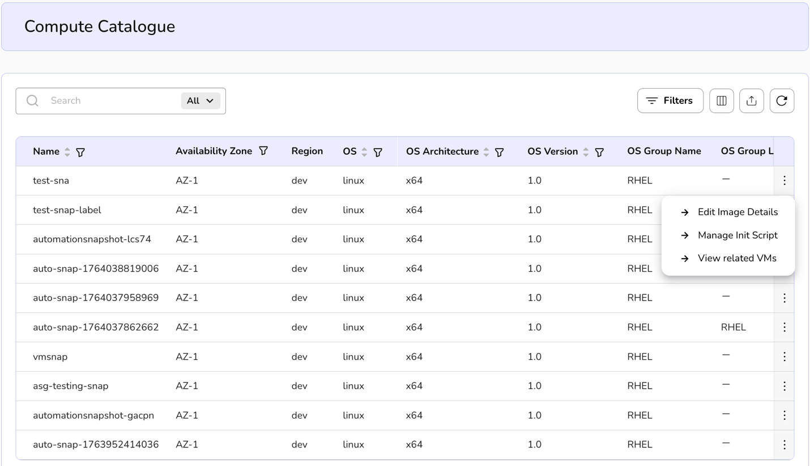

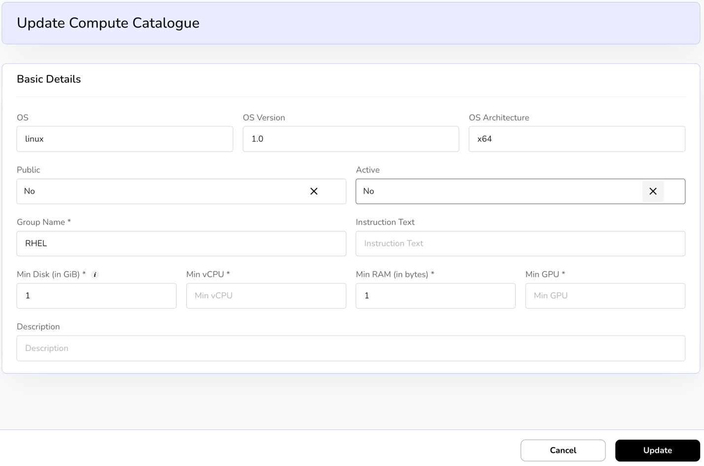

- Click on the three dots, click on manage Init script, and click on update script.

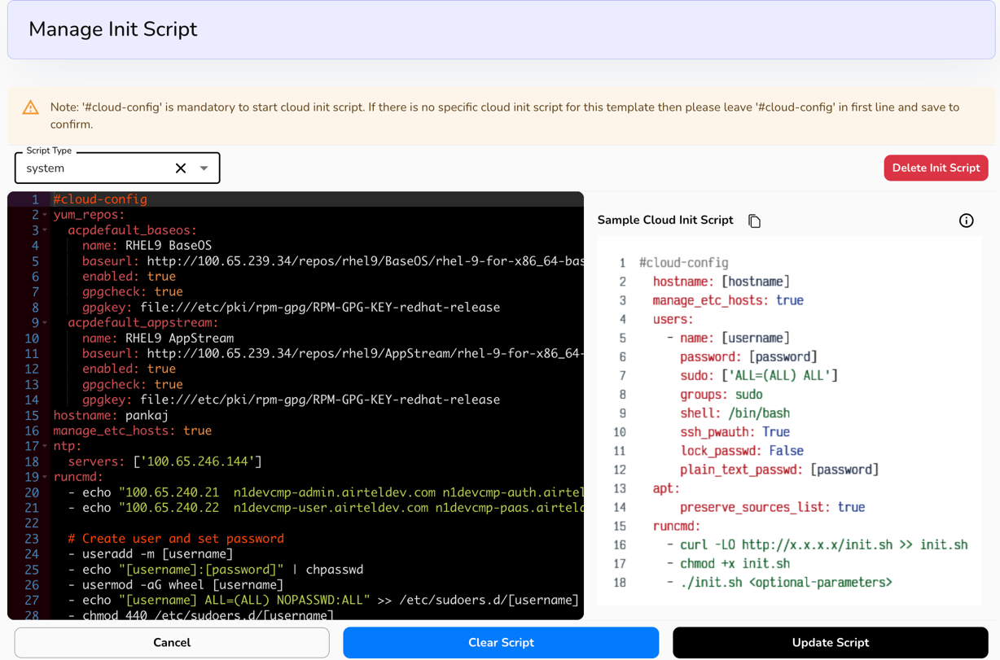

- Click on the three dots, click on View related VMs.
- It will redirect to Virtual Machine dashboard and the process to view it is mentioned under Compute Tab section.

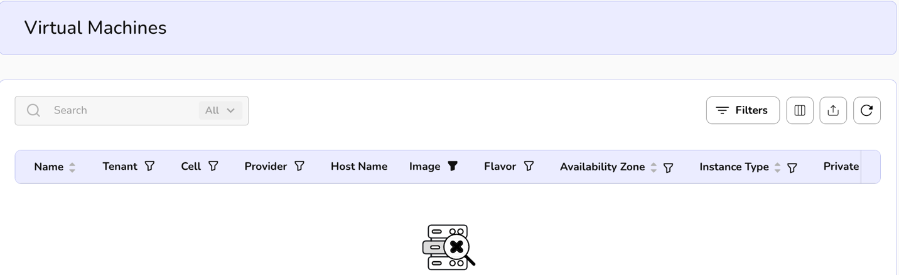

## Compute Categories

### Procedure to create Compute Categories

- Log in to the Fluid CCS admin platform.
- From the left navigation panel, navigate to catalogue and select compute categories.

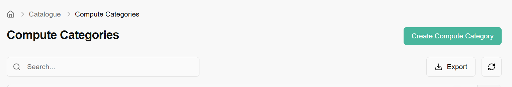

- On the compute categories page, an admin can view the create categories tab on the right side of the bar plus name, description, and created on.
- Click on create compute categories tab, enter the flavor group details such as name and description. Click on create button and confirm details for flavor group creation.

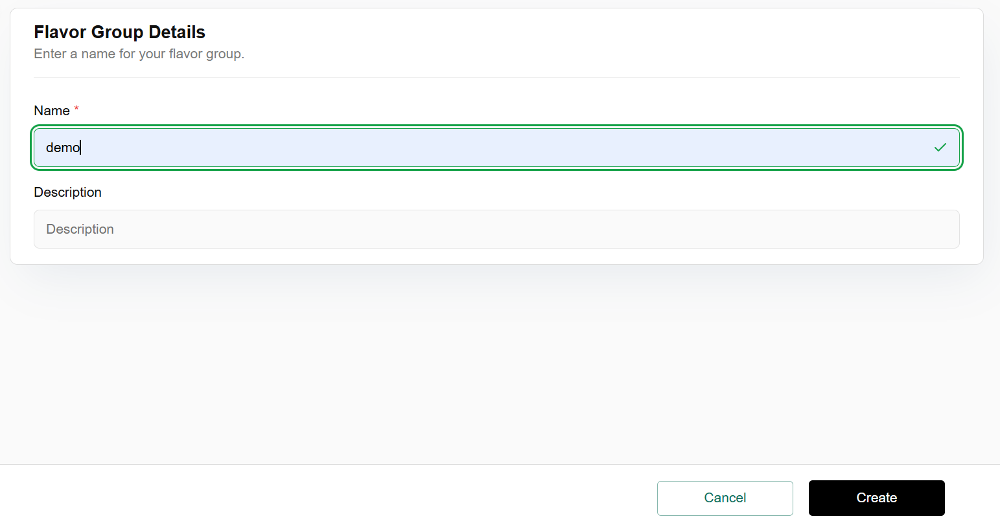

- Click on the three dots, click on Map to flavors, enter provider and flavors details from the drop down, and click on confirm tab.

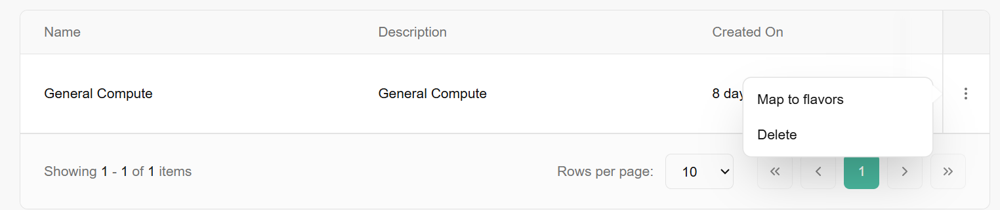

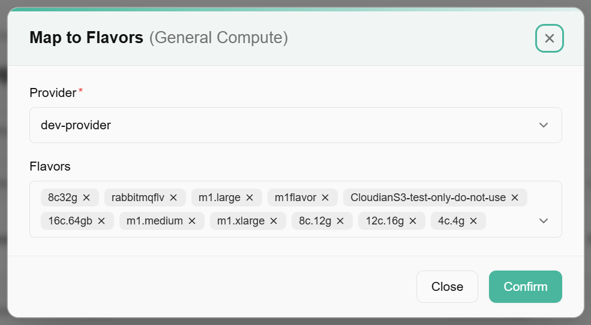

## Compute Types

**Compute**** types** refer to the **specific kinds of computing resources** available within a cloud platform, data center, or edge environment. While *C**ompute categories* group resources broadly (like general-purpose or GPU), **C****ompute types are the actual variations or models within those categories**.

### View Compute types

- Log in to the Fluid CCS admin platform.
- From the left navigation panel, navigate to catalogue and select compute types.
- On the compute types display page, an admin can view name, display name, group name, availability zone, region, ram, disk, VCPUs, weight, type, public, active and created on.
- Apply filter in name, availability zone, region, ram, disk, VCPUs, public, and active.
- Click on the three dots, click on edit flavor details. Update compute type page appears. Enter the basic details and click on update button to confirm the details.

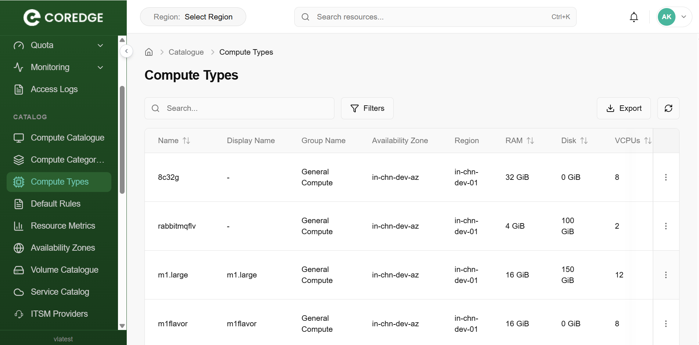

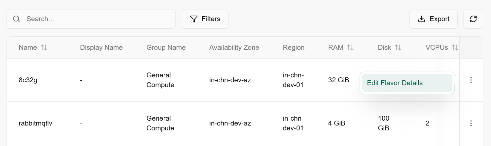

### Update Compute Types

Update compute type usually refers to the action of modifying or changing an existing compute type's configuration or details in a cloud platform, compute catalogue, or management system. It means updating the specifications or settings of a compute resource type.

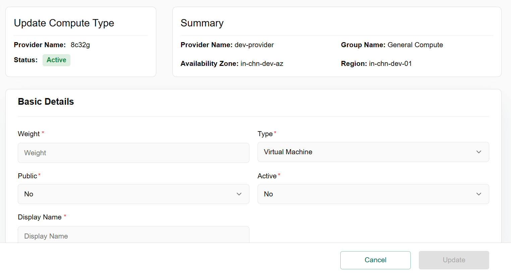

## Default Rules

Default rules are the predefined, automatic rules or settings applied in a system, software, policy, or process when the user does not manually configure anything. They act as the baseline behavior of a system.

- Log in to the Fluid CCS admin platform.
- From the left navigation panel, navigate to catalogue and select default rules.
- On the default rules page, an admin can view direction, availability zone, region, managed by, ether type, remote IP Prefix, protocol, resource type, port range min, port range max, active, status and created on. Create a default rule tab is available on the right side of the default rules bar.
- Click on the create default rule tab, enter the configuration details and click on the create button to finish the configuration.
- Apply filter in name direction, availability zone, managed by, ether type, protocol, resource type, port range min, port range max, active, and status.
- Admin can use View Preferences to customize visible columns, and export them to download the list with the selected columns.
- Click on the three dots, three options are available such as apply rule, map cell, and delete rule.
- Click on apply rule, apply default rule bar opens. Enter the basic details in the organization (Select the option from the drop down) and cell column and click on create button.
- Click on map cell, map default rules with project bar appears. Select the Cell with this Rule (3), enter the cell name and click on apply button to create the project successfully. To remove it, follow the same process and click on remove button.
- Click on the delete rule and select the option, Yes or No.

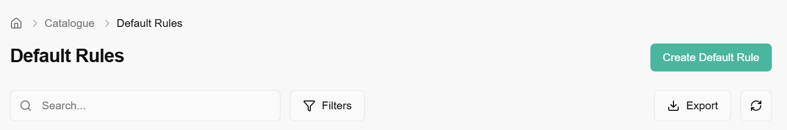

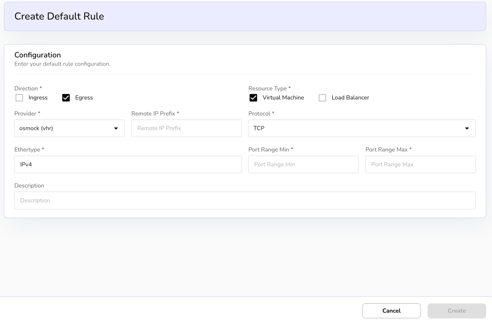

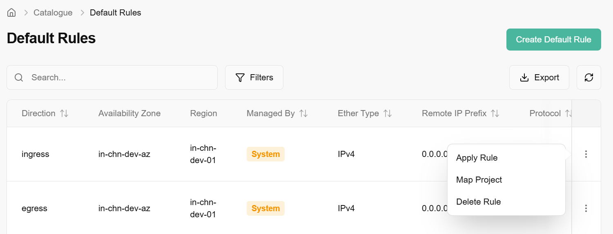

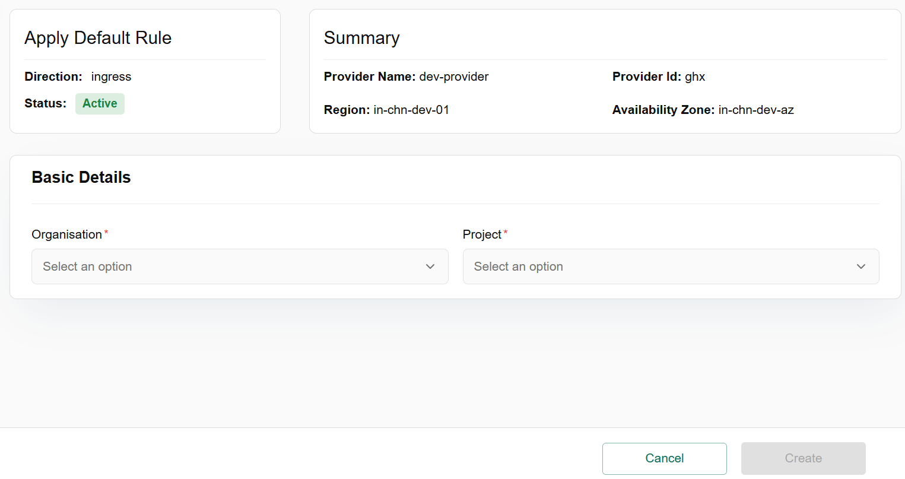

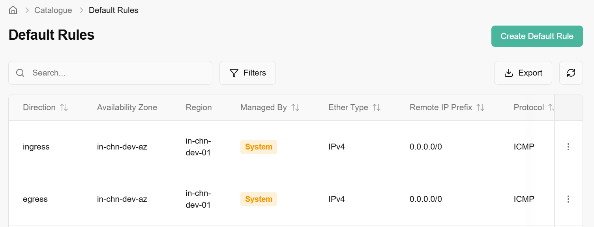

## Resource Metrics

Resource metrics refer to measurements and data collected about the utilization, performance, and availability of resources in a computing environment. These metrics provide insight into how resources like CPU, memory, disk, and network are being used, allowing for better monitoring, troubleshooting, and optimization.

### Procedure to create resource metrics

- Log in to the Fluid CCS admin platform.
- From the left navigation panel, navigate to catalogue and select resource metrics.
- On the resource metrics page, an admin can view metric level, availability zone, region, resource type, report label, Y Axis Label, X Axis and created on. Create resource metrics tab is available on the right side of the resource metrics bar.
- Click on the Create resource metric tab, select the provider from the drop down, enter metric details and click on create button to finish the setup.
- Apply filter in metric level, availability zone, resource type, report label, Y Axis Label, and X Axis Label. Admin can use View Preferences to customize visible columns and export them to download the list with the selected columns.
- Click on the three dots, two options are available such as update resource details and delete resource metric.
- Click on update resource details, under update resource metric bar, enter the metric level details. Click on update button and confirm the details.
- Click on delete resource metric to select the suitable option, Yes or No.

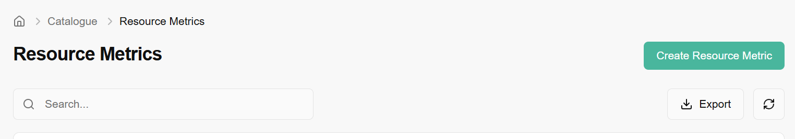

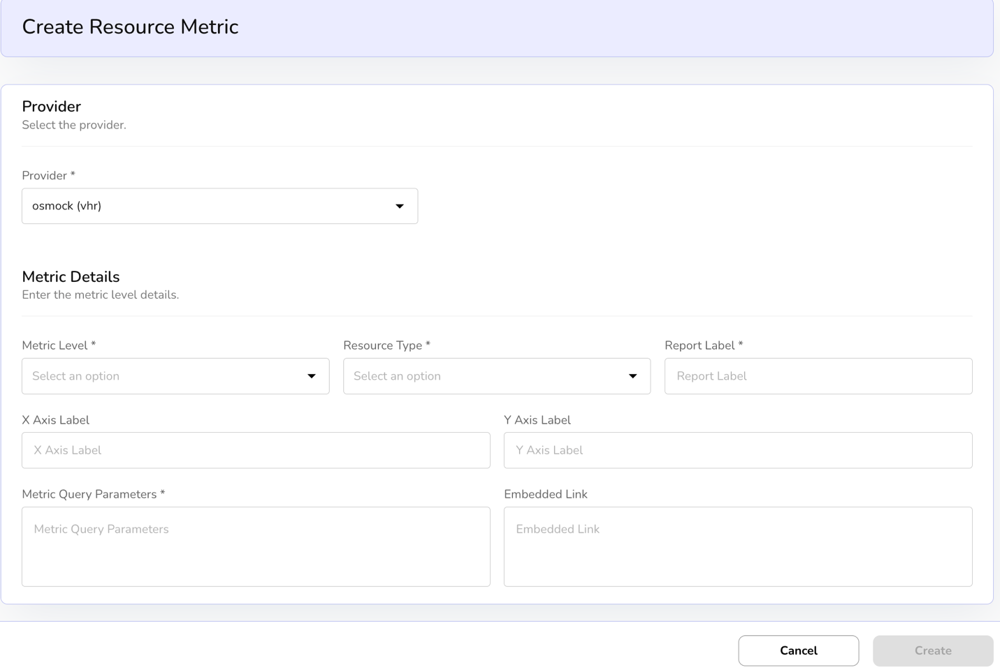

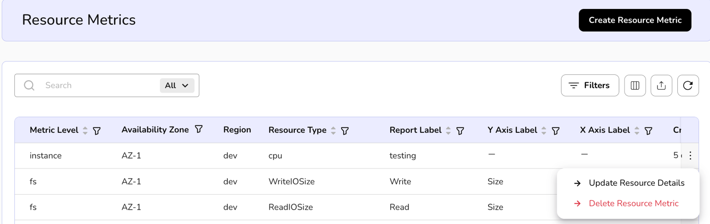

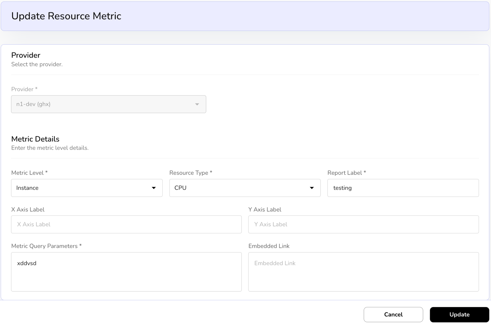

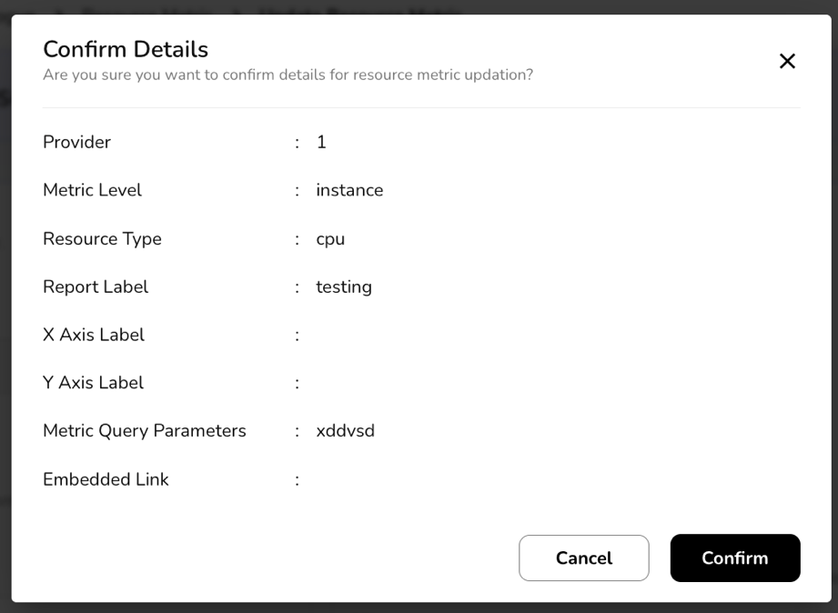

## Availability Zones

An availability zone is a distinct, isolated location within a cloud provider's infrastructure region that ensures high availability and fault tolerance for cloud services and resources. It provides redundancies and minimizes the risk of service disruptions caused by localized failures.

### View Availability of Zones

- Log in to the Fluid CCS admin platform.
- From the left navigation panel, navigate to catalogue and select availability zones
- On the availability zones page, an admin can view the resource name, provider, zone name, public, is default, status and created on.
- Apply filter in resource name and provider.
- Admin can use View Preferences to customize visible columns, and Export to download the list with the selected size and columns.

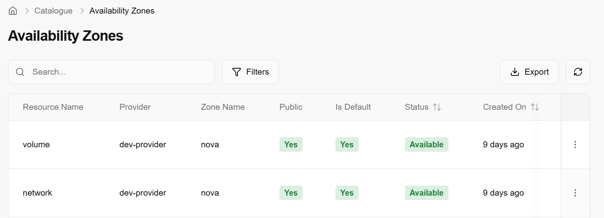

### Update Availability Zones

Updating availability zones means to refresh, modify, or sync the list of Availability Zones in a CCS admin console.

- From the left navigation panel, navigate to catalogue and select availability zones.
- On the desired availability zone tile, click the three-dot menu and select update availability zone.
- An update availability zones page is displayed, set public and default status from the dropdown menu.
- Click on update button and then click on confirm to finish.

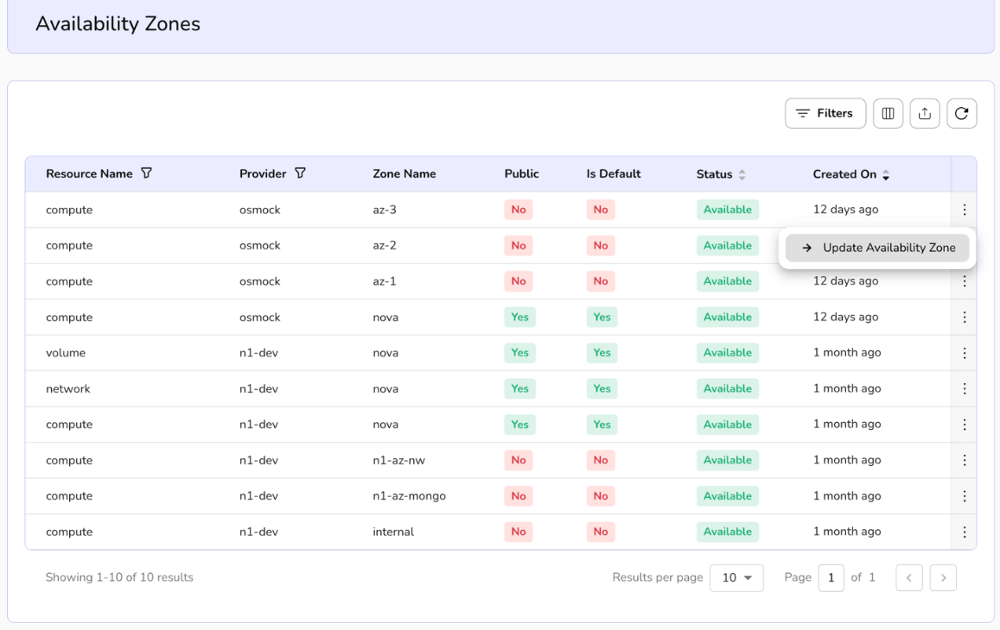

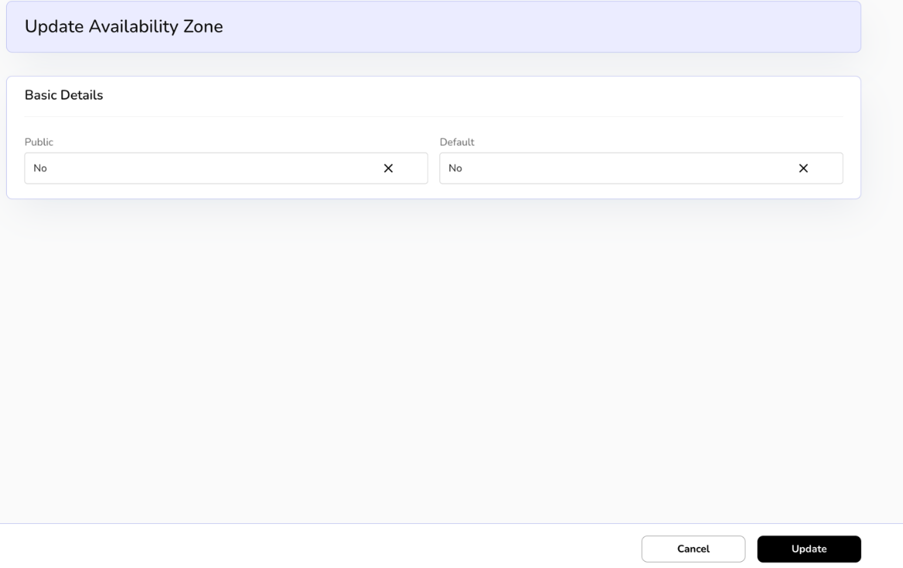

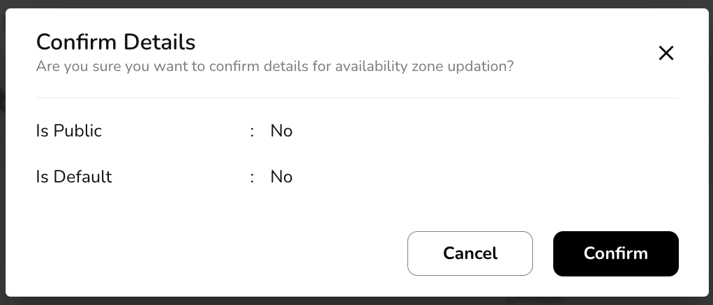

## Volume Catalogue

A Volume Catalogue is a structured metadata repository or inventory system used in cloud and enterprise storage environments (such as NetApp ONTAP or hybrid cloud block storage setups) to organize, discover, and manage persistent storage volumes. It acts as a centralized directory that catalogs available volumes with key attributes, facilitating resource allocation, compliance tracking, and operational efficiency. Volumes in the catalogue are typically block-based (for high-IOPS workloads like databases or VMs) and are defined by configurable properties to match workload needs.

### View volume catalogue

- Log in to the Fluid CCS admin platform.
- From the left navigation panel, navigate to catalogue and select volume catalogue.
- On the volume catalogue page, an admin can view the name, availability zone, region, group, label, description, root volume limits, additional volume limits, public, active, default, and created on.
- Apply filter in availability zone, public, active and default.
- Admin can use View Preferences to customize visible columns, and Export to download the list with the selected size and columns.

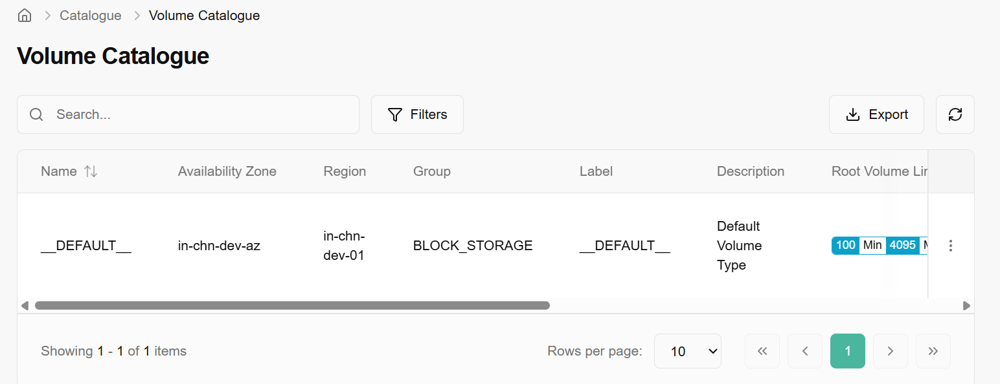

#### Update volume catalogue

"Update Volume Catalogue" lets you edit a reusable storage profile that application teams will see when they pick volumes for their workloads. It defines the basic metadata (name, provider, description, group name, label, visibility/active/default flags) and the technical guardrails for that profile, such as minimum, maximum, and step size for both root and additional volume sizes in GiB, so capacity is requested consistently and according to platform policies.

##### Procedure to update volume catalogue

- Click on the three dots, click on update.
- On the update volume catalogue page, enter the basic details, select root volume limits and additional volume limits from the drop down and click on update button.
- On the confirm details page, click on confirm tab to finish the process.

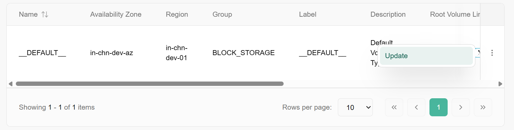

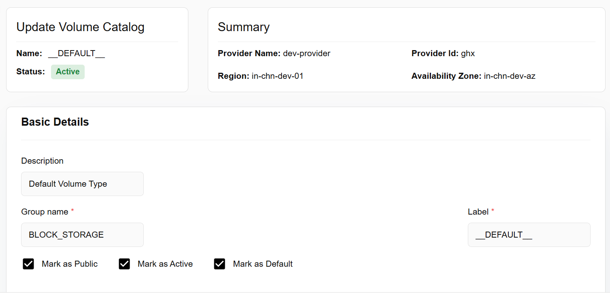

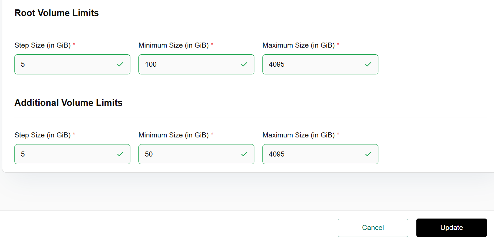

## Service Catalogue

A Service Catalogue is a curated menu of cloud building blocks (like Cells, Virtual Machines, Block Storage, VPC, Load Balancer, VM Snapshots, Object Storage, Subnet, and File Storage,) that your platform team predefines so users can selfservice deploy standardized resources with consistent configurations, policies, and automation across the environment.

### Procedure to create service catalogue

- Log in to the Fluid CCS admin platform.
- From the left navigation panel, navigate to catalogue and select service catalogue
- Click on the create service catalogue button.
- Enter the basic details such as display name, service code, short description, select service name from the drop down, and enter long description in the box.
- In add category bar, you can add up to 5 categories.
- Click on next button. Basic info details appear. Click on create button to complete the process.

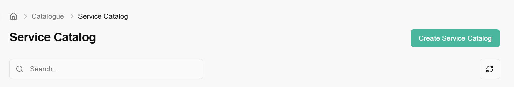

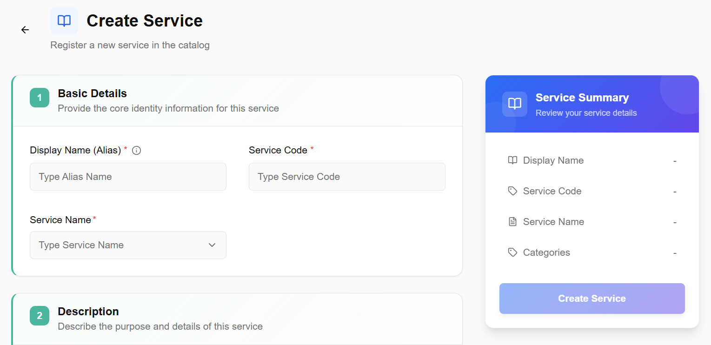

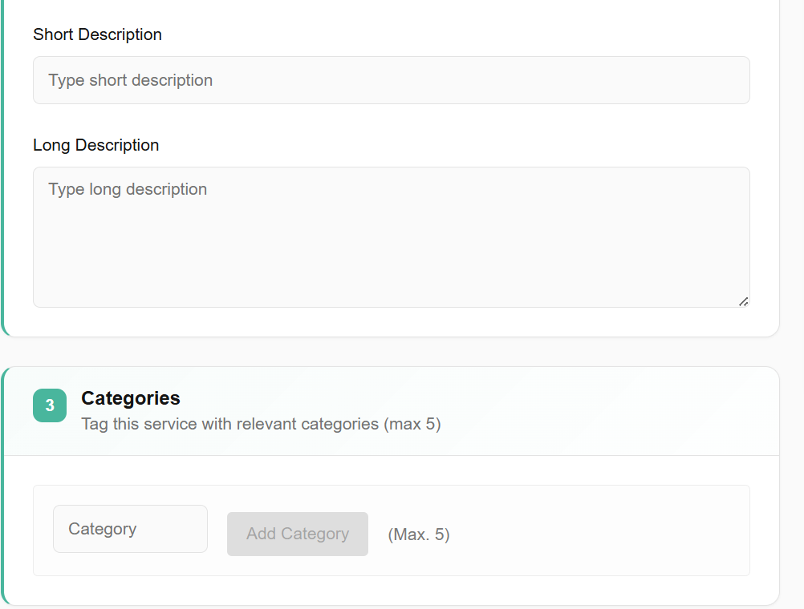

#### Delete service catalogue

- On the desired service catalogue page, an admin can view name of different service catalogues, their code, categories, who created it, and when it was created.
- If a particular service catalogue is no longer needed, it can be deleted. Click on the three dots at the right corner of the service catalogue table and click on delete button.

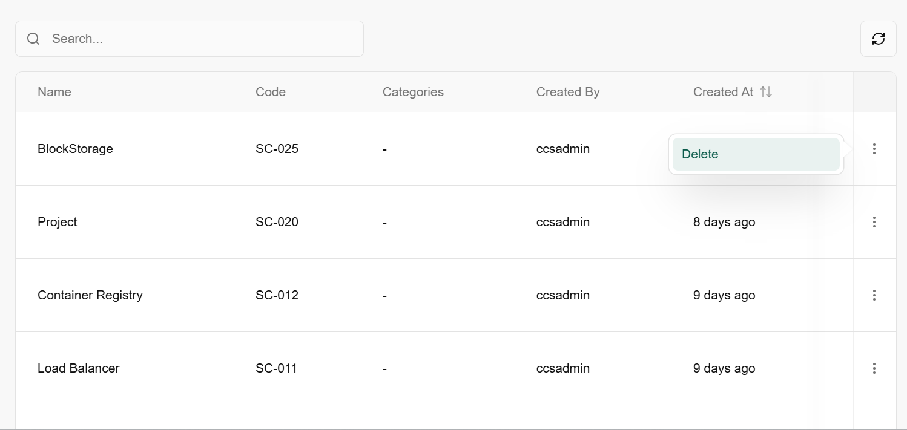

## ITSM provider

An **ITSM (IT Service Management) Provider** is a service that manages the end-to-end delivery of IT services to an organization. It is the external system (like **ServiceNow**, **Jira Service Management**, or **BMC Helix**) that your platform connects to for handling tickets, approvals, and service requests.

### Procedure to add ITSM provider

- Go to catalog and click on ITSM provider tab.
- A dashboard appears where you can see add provider button. Click on it.
- Enter a friendly name to identify this connection.
- Select the specific software being used (Provider Type).
- Select the geographic location of the server.
- Add context on what this provider handles as in description. Click on add provider button.

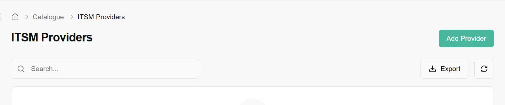

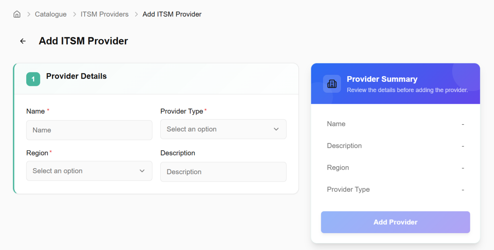

# Providers

## Cloud Providers

### Procedure to add cloud provider

- Click on the right side of the Add Cloud Provider Tab and enter the basic details such as provider type, region, availability zone, provider name and description, also enter the OpenStack details such as Auth URL, Username, Password, Region name, Identity API version, Password, Cell Name add Domain Name. Finish the setup by clicking on test connection/Add Button to create cloud provider.

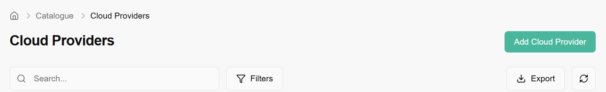

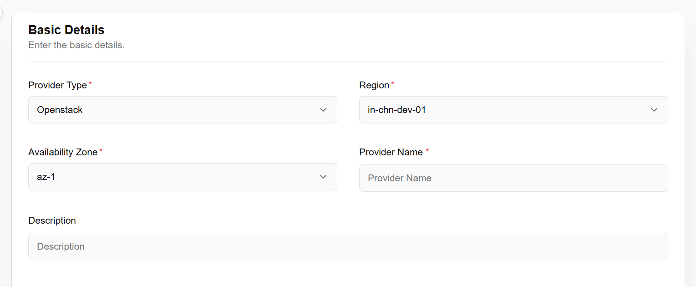

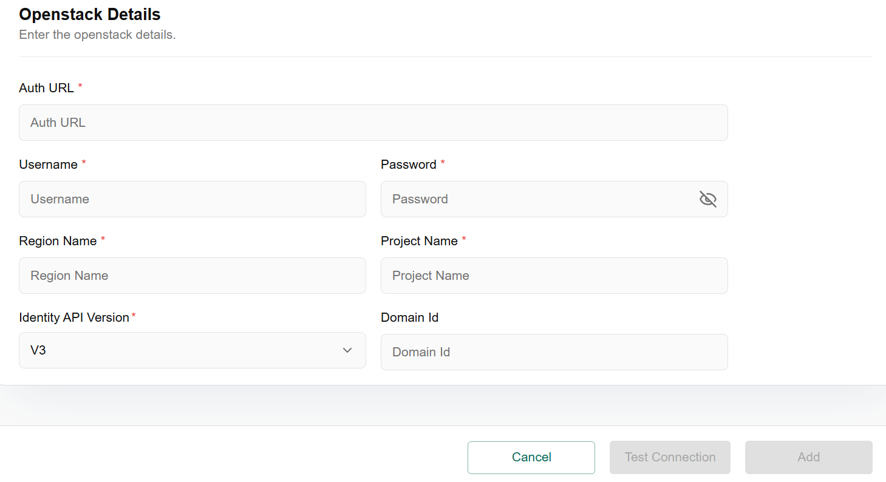

#### Update Cloud Providers

Update cloud provider" usually refers to changing or modifying the configuration or details of an existing cloud provider integration inside a cloud management or backup/IT operations platform.​

##### Procedure to Update Cloud Providers

- From the left navigation panel, navigate to catalogue and select cloud provider.
- Click the three-dot menu and select Update
- Fill in the basic and OpenStack details.
- Click on Update to confirm.

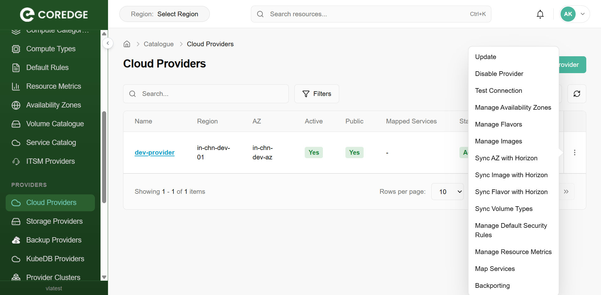

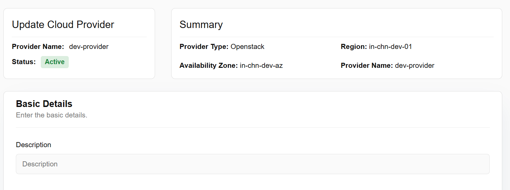

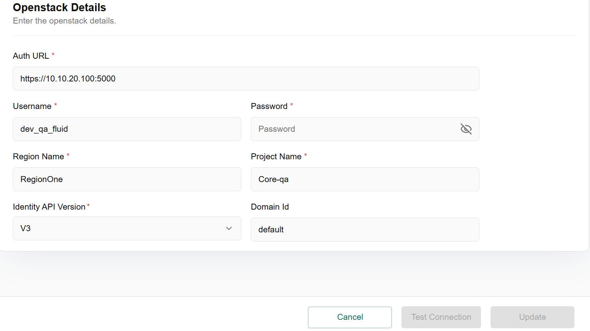

#### Disable Provider

Disable provider means to stop, remove, or prevent a provider from being used.

- From the left navigation panel, navigate to navigate to catalogue and select cloud provider. Click the three-dot menu and select disable provider.
- Enter comments as required and click on disable.

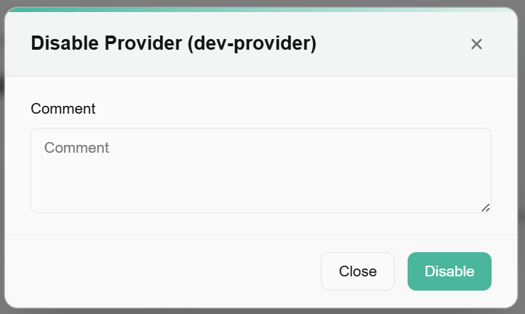

#### Test Connection

Test connection is to verify that a system (or infrastructure tool) can successfully communicate with the cloud provider's API or services.

- navigate to navigate to catalogue and select cloud provider. Click the three-dot menu and select test connection.
- Select the suitable option.

n

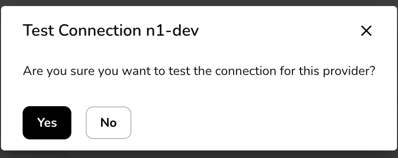

#### Manage Availability Zones

Manage availability zone refers to controlling how to use or assign Availability Zones (AZs) in a cloud provider to optimize high availability, fault tolerance, and performance of your infrastructure.

- From the left navigation panel, navigate to catalogue and select cloud provider.
- Click the three-dot menu and select Manage Availability Zones.
- It will redirect to availability zones dashboard. Click on the three dots and select update AZs.

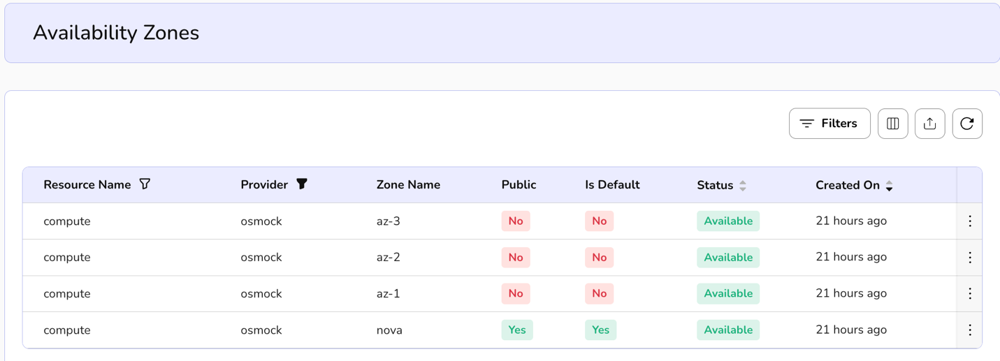

#### Manage Flavors

Manage Flavor means to control or configure VM instance types (a.k.a. Flavors) in cloud platforms--especially in OpenStack.

- From the left navigation panel, navigate to catalogue and select cloud provider.
- Click the three-dot menu and select Manage Flavors.

It will redirect to Compute Types dashboard.

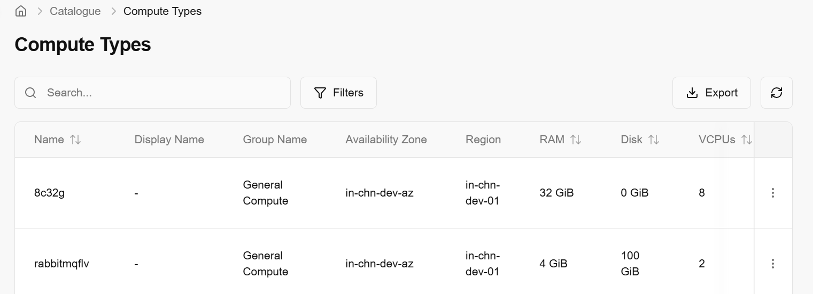

#### Manage Images

Manage images refers to controlling, organizing, and using machine images--pre-configured templates of virtual machines or containers used to launch instances.

- From the left navigation panel, navigate to catalogue and select cloud provider.
- Click the three-dot menu and select Manage images.
- It will redirect to Compute Catalogue dashboard.

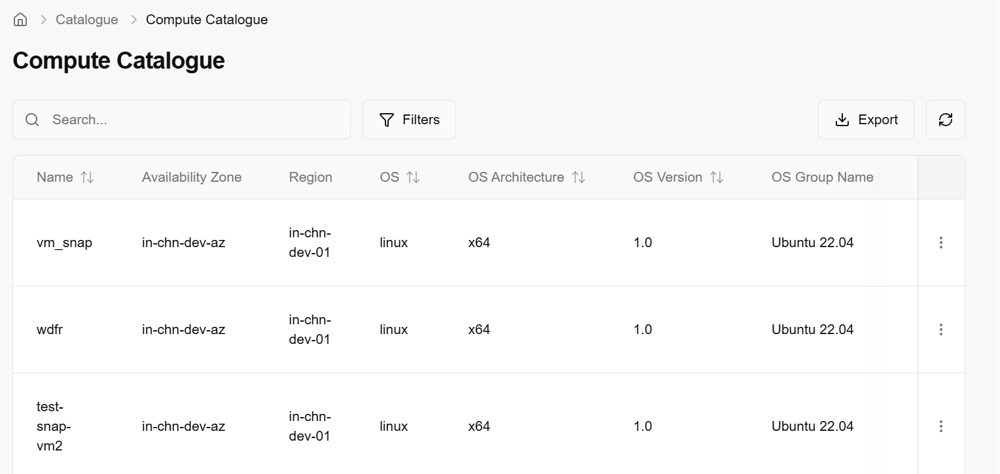

#### Sync AZ with Horizon

Sync availability zone with Horizon refers to the process of ensuring that the availability zones defined in OpenStack infrastructure are correctly reflected and usable in the horizon dashboard, which is the web-based user interface for OpenStack.

- From the left navigation panel, navigate to catalogue and select cloud provider.
- Click the three-dot menu and select sync AZ with horizon.
- Message of "Synced availability zone with horizon successfully" will appear.

#### Sync Image with Horizon

Sync image with horizon means ensuring that all available images in OpenStack backend are synced with horizon.

- From the left navigation panel, navigate to catalogue and select cloud provider
- Click the three-dot menu and select sync images with horizon.
- Message of "Synced images with horizon successfully" will appear.

#### Sync Flavor with Horizon

Sync Flavor with Horizon means ensuring that the compute flavors defined in your OpenStack backend are visible and usable in the Horizon dashboard.

- From the left navigation panel, navigate to catalogue and select cloud provider.
- Click the three-dot menu and select sync flavor with horizon.
- Message of "Synced flavor with horizon successfully" will appear.

#### Sync Volume Types

Sync volume types mean ensuring that the volume types defined in an OpenStack block storage service (Cinder) are correctly visible and available in other components--especially in the Horizon dashboard and for use during volume creation or instance booting.

- From the left navigation panel, navigate to catalogue and select cloud provider.
- Click the three-dot menu and select sync volume types.
- Message of "Synced volume types successfully" will appear

#### Manage Default Security Rules

Manage default security rules means configuring the default firewall rules that apply to new projects or instances automatically, controlling how network traffic is allowed or denied.

- From the left navigation panel, navigate to catalogue and select cloud provider.
- Click the three-dot menu and select manage default security rules.
- It will redirect to default rules dashboard.

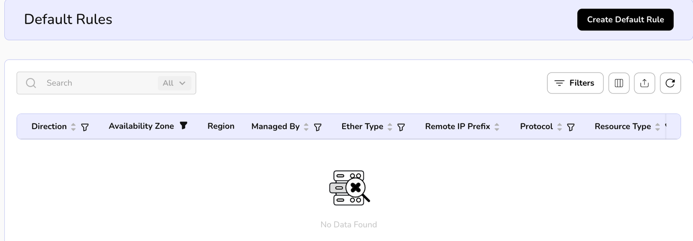

#### Manage Resource Metrics

Manage resource metrics refers to the process of collecting, monitoring, and analysing performance data (metrics) for cloud resources like virtual machines, storage volumes, networks, and services.

##### Procedure to create Resource Metrics

- From the left navigation panel, navigate to catalogue and select cloud provider.
- Click the three-dot menu and select manage resource metrics.
- It redirects to resource metrics dashboard.
- Click on create resource metric. Enter the provider and metric details and click on create button.
- On the resource metrics page, an admin can view metric level, availability zone, region, resource type, report label, Y Axis label, X Axis label and created on.
- Apply filter in metric level, availability zone, resource type, report label, Y Axis label, and X Axis label
- 6. Admin can use View Preferences to customize visible columns, and Export to download the list with the selected columns.

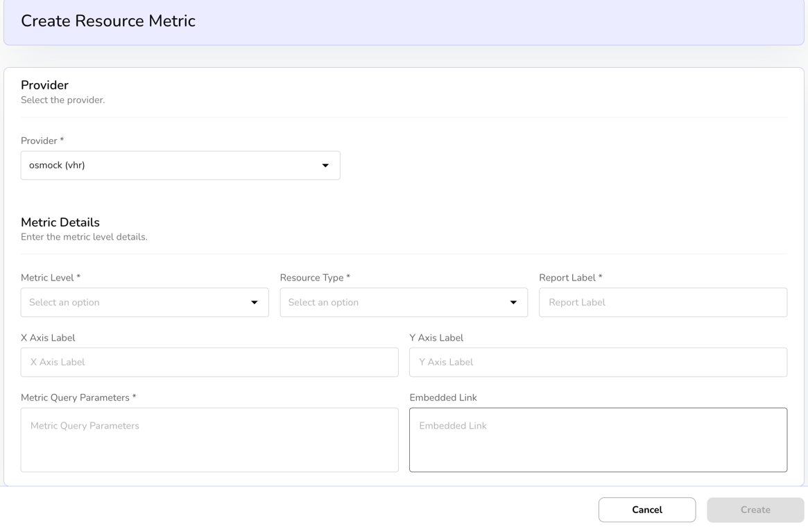

#### Map Services

Map services refer to location-based services that allow users to visualize, query, and analyse geographic data on interactive maps within the cloud environment.

- From the left navigation panel, navigate to catalogue and select cloud provider.
- Click the three-dot menu and select map services.
- Select services from dop-down box and click on the submit button.

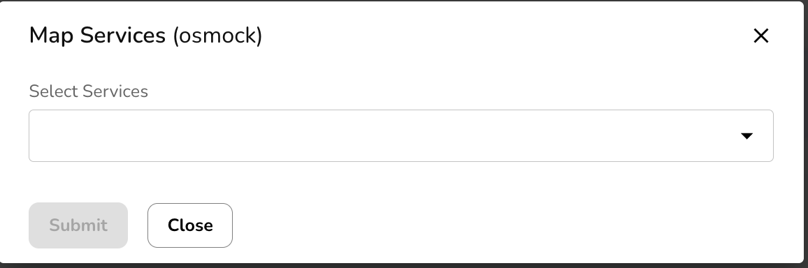

#### Back Porting

Backporting is the process of importing existing cloud resources that were created outside of this platform into the platform's management system. If you have virtual machines or networks already running in **OpenStack**, backporting "scans" them and brings them under the control of this dashboard so you can manage them here.

**Tab Navigation**

**Available Resources:** This section lists resources found in the cloud provider (OpenStack) that are **not yet managed** by this platform.

**Synced Resources:** This section shows resources that have already been successfully imported and are currently in sync with the platform.

**Search & Discovery Controls**

To find resources to backport, the user must define the scope:

**Organisation & Project:** These fields allow you to filter the scan to a specific business unit or project within the OpenStack environment.

**Scan vs. Search:** * **Scan:** Triggers the system to crawl the provider's API to find every available resource.

**Search:** Allows you to find a specific resource by name or ID if you already know what you are looking for.

**Scan Resources Button:** The primary action button to initiate the discovery process once the filters are set.

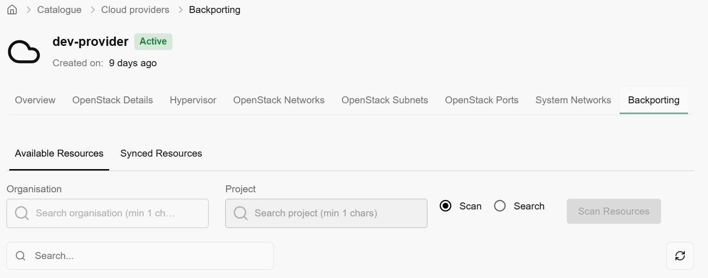

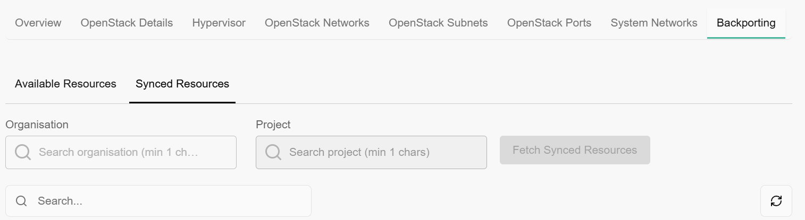

When you land on backporting tab, you can see other cloud provider details as well. Overview of provider details, OpenStack details, hypervisor, OpenStack networks, subnets, ports, and system networks details.

- System networks allow you to onboard network.
- Click on onboard network button.
- Choose OpenStack network and network type from the dropdown menu.
- Click on create button.

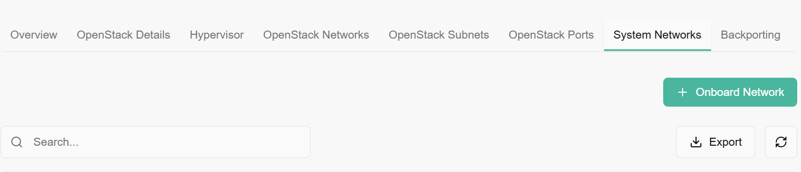

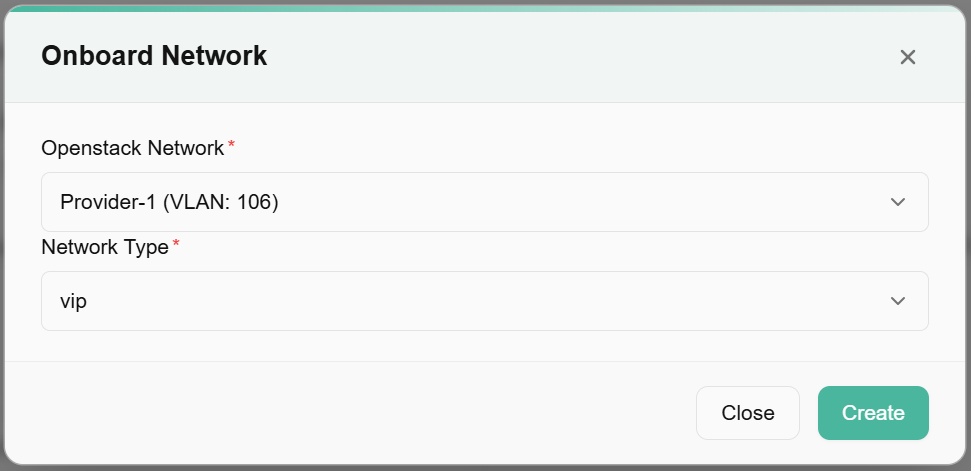

## Storage Providers

Storage providers" are the systems or services that supply storage capacity for saving data, such as files, databases, or virtual machine disks.

### Procedure to add storage providers

- Click on the Add storage provider tab available at the right side of the storage providers tab and enter the provider details, such as Name, Type (Select from the drop-down list), provider type (Select from the dropdown list), availability zone (Select from the dropdown list), and description. Enter the configuration details such as Mgmt Endpoint, Data Endpoint, Username, Password, SVM Name, and SVM UUID.

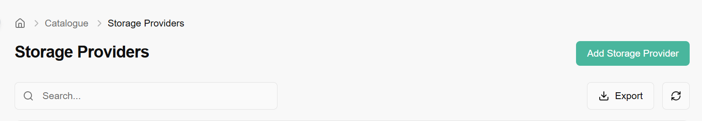

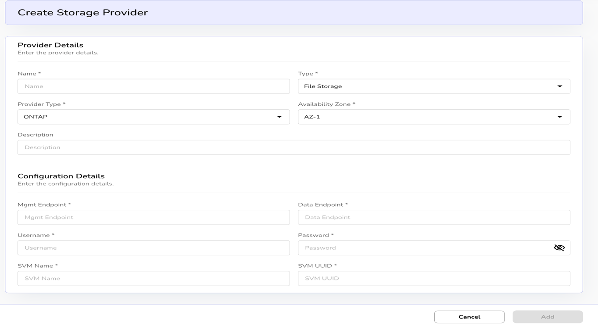

- Click on add button to complete the setup.
- Click on the three dots, click on edits. Update Storage Provider bar appears. Enter the provider details such as name, type, provider type, availability zone, and description.

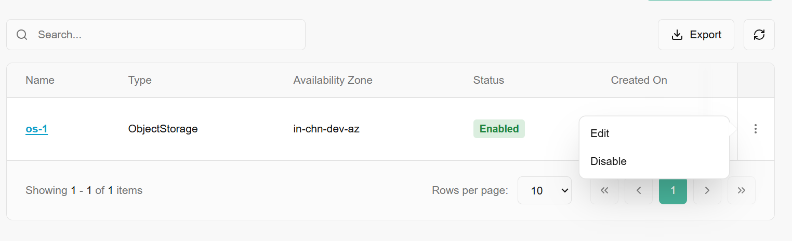

- Enter the configuration details such as mgmt Endpoint, Data Endpoint, Username, Password, SVM Name, and SVM UUID.
- Click on update button and confirm the detail.
- Click on the three dots, click on disable and choose the necessary option.

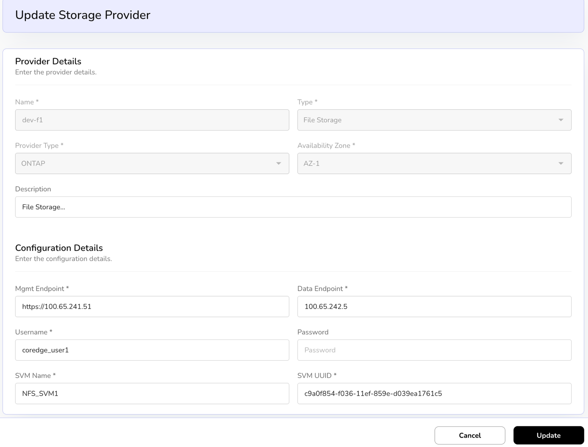

Click on storage provider name, it redirects to its detailed page where you can find overview and configuration information.

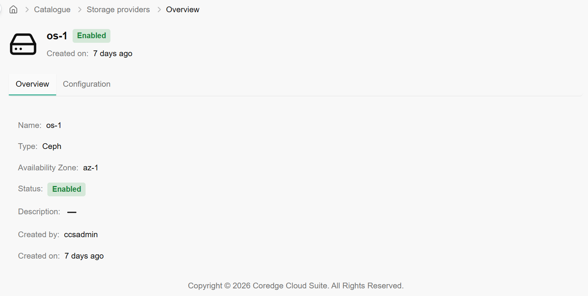

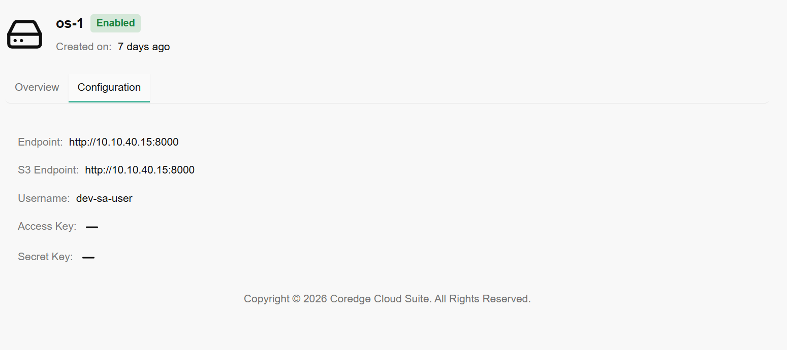

## Backup Providers

A backup provider is a service or system that performs and stores backups of your data so you can restore it after loss, corruption, or disaster

### Procedure to add backup providers

- Click on the Add backup provider tab available at the right side of the backup providers tab and enter the provider details, such as Provider Name, Description, Region, and availability zone from the drop-down list.
- Enter provider credentials such as username and password. Enter server details as Primary Server and Base URL. Enter media servers' details, staging storage path, mount path, and storage location.
- Click on add button to finish the process.
- Click on the three dots, click on edits.
- Update Backup Provider page opens. Enter provider details such as provider name, description, region and availability zone.
- Select the server details as mentioned in primary server and base URL.
- Enter the details in media server, staging storage path, mount path, and storage location by selecting the details mentioned in the drop down and click on Add button. A new detail is added in drop down.
- Click on three dots and remove the listing.
- Click on update and confirm the details.

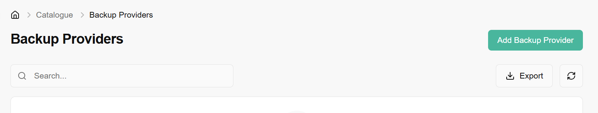

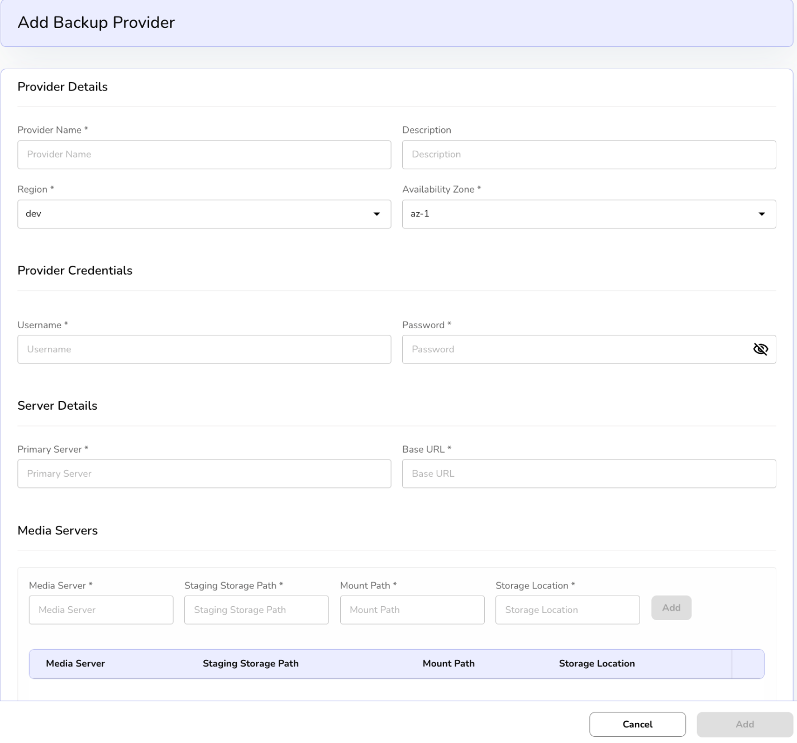

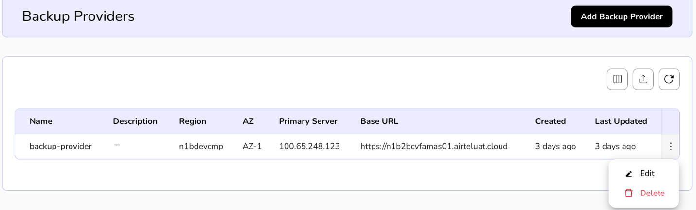

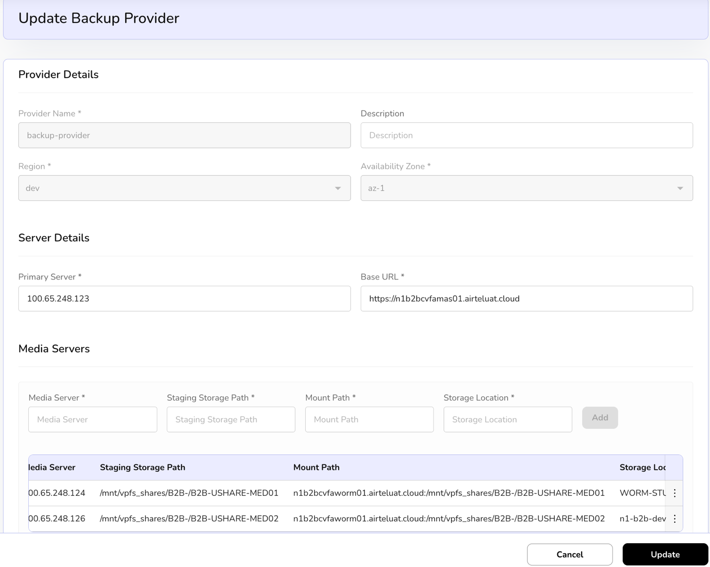

## KubeDB Providers

KubeDB Providers allow you to integrate and manage production-grade databases within your Kubernetes clusters. KubeDB is a cloud-native database management solution that automates complex operations like provisioning, patching, scaling, and backups for popular databases (such as PostgreSQL, MySQL, MongoDB, and Redis).

By configuring a KubeDB Provider, you are essentially "linking" a specific Kubernetes cluster to the Coredge management plane so it can orchestrate these database services.

### Procedure to onboard provider

**Basic Information**

In this section, define the primary identity and location of the provider.

**Provider Name:** Enter a unique, recognizable name for this database provider.

**Cloud Provider:** Specify the underlying cloud infrastructure name.

**Region:** Select the geographical region where the cluster is located.

**Availability Zone:** Choose the specific data center zone to ensure high availability.

**Domain:** Select the network domain associated with this deployment.

**R****esource Capacity & Reservation**

Set the physical limits and safety buffers for the provider's resources.

**Total Resource Capacity:** Enter the absolute hardware limits available to this provider:

**Total CPU Cores:** Total processing power available.

**Total Memory (GB):** Total RAM available.

**Total Storage (GB):** Total persistent disk space.

**Resource Reservation (%):** This acts as a safety "quota."

**Default:** 80%.

**Purpose:** Only the reserved percentage can be allocated to active databases. This prevents the cluster from reaching 100% utilization, which can cause system instability.

**Provider Settings**

Configure how the platform prioritizes and validates this provider.

**Priority:** A numerical value used to determine which provider to prefer if multiple providers are available for the same region.

**Active:** Toggle this to enable the provider for immediate use.

**Maintenance Mode:** Check this if you need to perform updates on the cluster without the platform attempting to deploy new resources to it.

**Verify SSL:** Ensures secure communication by validating the SSL certificates of the API endpoint.

**Kubernetes Configuration**

Provide the credentials required for Coredge to communicate with your Kubernetes cluster.

**KubeConfig**** Path / Content:** * You can provide the **Path** to a local file if the agent has access to it.

Alternatively, paste the **KubeConfig**** Content** directly into the text area. This file contains the API server address and authentication tokens.

**API Endpoint:** Enter the URL of the Kubernetes API server.

After filling in these details, click **Next** to proceed to the **Review** stage, where you can verify all settings before final creation.

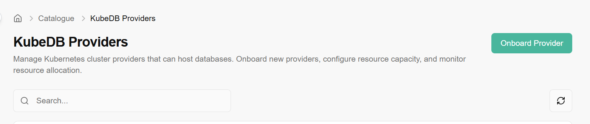

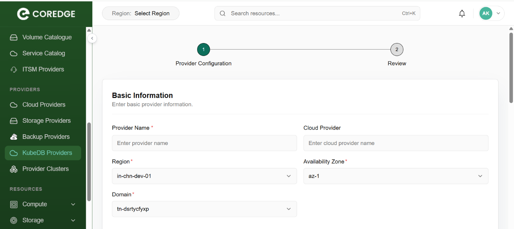

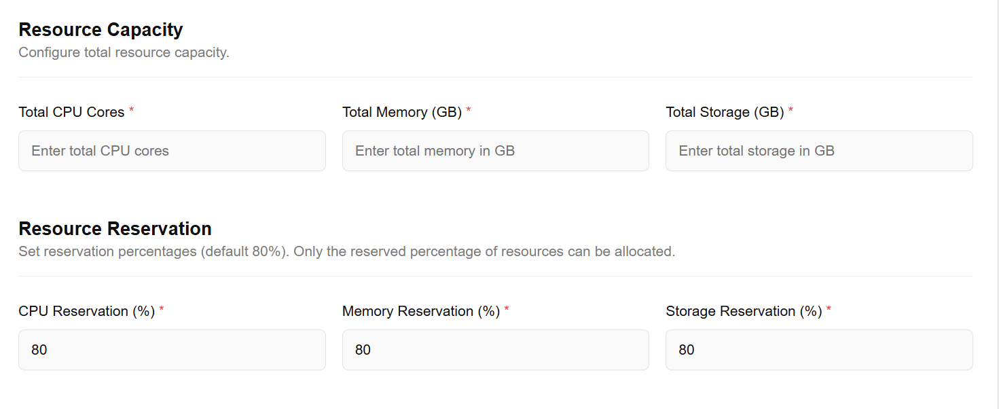

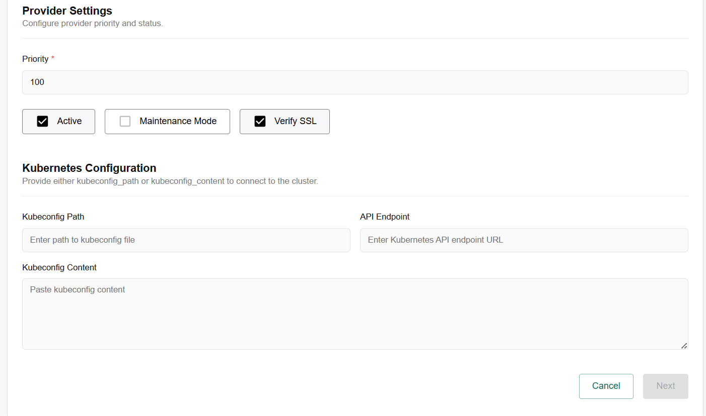

## Provider Clusters

A **Provider Cluster** is a Kubernetes cluster that has been registered and integrated into the system to serve as a resource host. While a "Provider" (like the KubeDB provider we discussed) defines the *connection and credentials*, the **Provider Cluster** represents the actual computational environment where your workloads, databases, and services are deployed.

Essentially, it is the bridge between the Coredge management interface and your physical or virtual infrastructure, allowing you to manage multiple clusters across different regions or cloud providers from a single pane of glass.

The **Provider Clusters** page is your central hub for viewing and managing the health and distribution of your registered Kubernetes environment.

**Navigat****e**** to Provider Clusters**

You can access this section via the sidebar menu: Catalogue > Providers > **Provider Clusters**.

**Interface Overview**

The interface is designed for quick filtering and administrative actions:

**Organisation Selection:** Use the **Select Organisation** dropdown to filter clusters based on specific business units or tenants. This ensures you are viewing only the infrastructure relevant to a specific team or project.

**Search Functionality:** The global search bar allows you to quickly locate a specific cluster by name, region, or status. This is particularly useful for environments managing dozens of clusters.

**Exporting Data:** Click the **Export** button to download a report of your current cluster configurations and statuses. This is useful for auditing, resource planning, or offline documentation.

**Refresh:** The **Refresh icon** (circular arrow) updates the real-time status of your clusters, pulling the latest data from the Kubernetes API endpoints to reflect current resource availability.

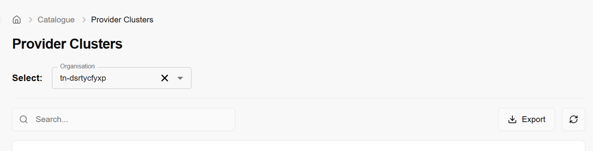

# Resources

## Compute

Compute refer to virtual machines that provide cloud-based processing power. You can deploy and manage scalable, customizable instances to run applications, websites, and other workloads on the cloud.

### Virtual Machine

Compute is a virtual machine that provides cloud-based processing power. You can deploy and manage these scalable, customizable instances to run applications, websites, and other workloads on the cloud. In CCS, compute will provide a way to provision and manage on-demand compute instance VMs. You can create instances as needed to meet your computing and application requirements. After creating an instance, you can access it securely from your computer, restart it, attach, and detach volumes, and terminate it when you're done. Any changes made to the instance's local drives are lost when you terminate them. Any saved changes to volumes attached to the instances are retained. Virtual Machines are virtualized computing instances that allow you to run applications and services in a cloud environment. Compute provide scalable, isolated, and customizable computing resources, enabling you to deploy and manage your software efficiently.

#### Created virtual machine details

- On the virtual machines page, an admin can view the name, tenant, cell, provider, host name, VPC name, image, Flavor, availability zone, instance type, private IP, power state, antivirus status, firewall, VPN, status, and created by and when it was created details.
- Under the search bar section on virtual machines page, search preferences as required.
- An admin can apply filter to virtual machines details as per the preferences. Click on the filters button. Choose filters and click on the apply button.
- Admin can use View Preferences to customize visible columns, and export to download the list with the selected pages and columns.
- Click on the three dots available on right side of the panel. Admin can get current VM Status, mark VM as error, and see VM Console.

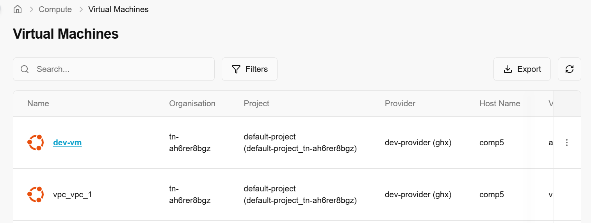

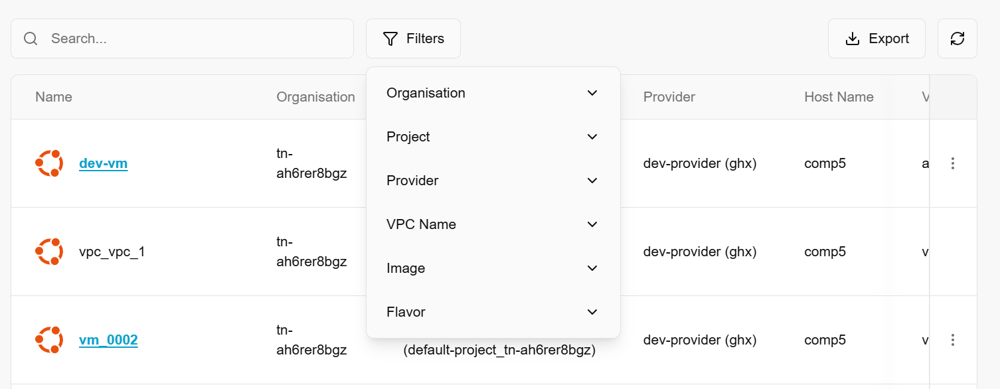

##### Get Current VM Status

Getting current VM status means retrieving the current state or condition of a virtual machine. The status includes information such as whether the VM is running, stopped, paused, suspended, or in error. This is a read-only operation used for monitoring or automation purposes.

- From the left navigation panel, navigate to compute and select Virtual machines
- On the desired VM tile, click the three-dot menu and select Get current VM status.
- Click Yes button to confirm.

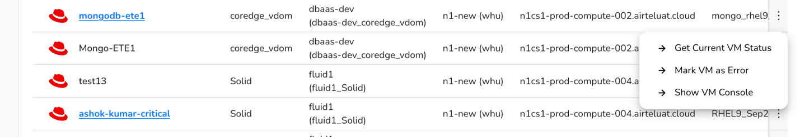

##### Mark VM as error

Mark VM as error sets the status of a VM to error to indicate that something has gone wrong with the VM (e.g., failed boot, corrupted disk, or OS crash). In some systems, this may be set automatically by the hypervisor or management software, or it may be manually marked by an administrator for tracking or debugging.

- From the left navigation panel, navigate to compute and select Virtual machines
- On the desired VM tile, click the three-dot menu and select Mark VM as error.
- Click Yes button to confirm.

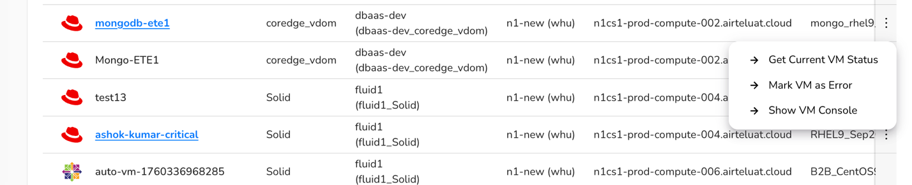

##### Show VM as console

Show VM as console means opening or displaying the virtual console of the VM, which mimics the physical console of a traditional machine. It allows you to interact directly with the VM as if you were using a monitor and keyboard connected to it. It is useful for troubleshooting when network access (e.g., SSH, RDP) is unavailable.

- From the left navigation panel, navigate to compute and select Virtual machines
- On the desired VM tile, click the three-dot menu and select Get current VM status.
- Click Yes button to confirm.
- Click on a virtual machine name. The **Overview** tab provides a comprehensive summary of your instance, including its current status, hardware configuration, and the base image used for deployment.

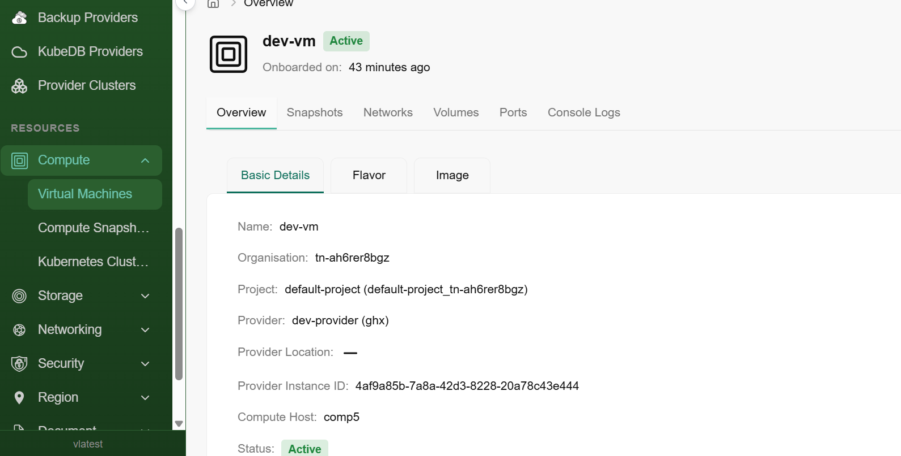

- The **Flavor** sub-tab displays the specific hardware profile assigned to your instance. This determines the computing power available to your applications.

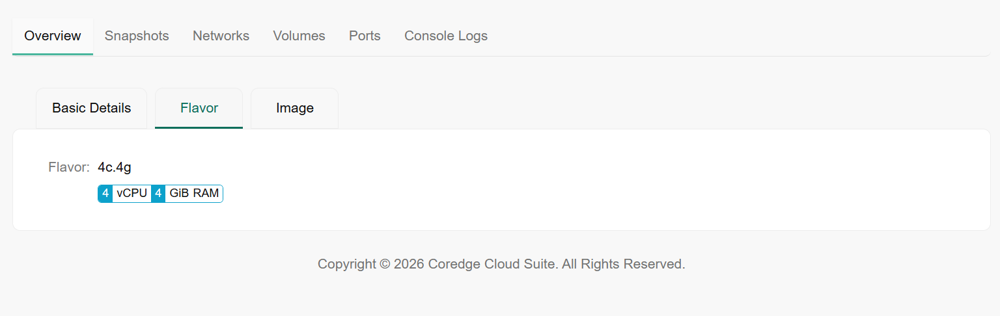

- The **Image** sub-tab shows the source software stack used to create the virtual machine.

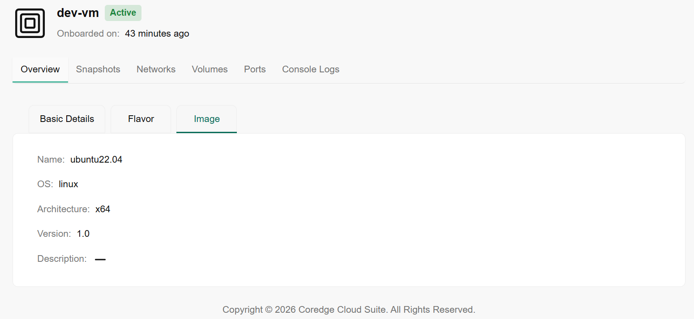

The **Snapshots** tab displays a history of point-in-time images taken of your virtual machine. These are essential for backup and recovery.

- **Name & Description:** Identifies the specific snapshot and its purpose.
- **Active Status:** Indicates if the snapshot is healthy and available for restoration.
- **Created:** Shows the exact timestamp of when the backup was performed.

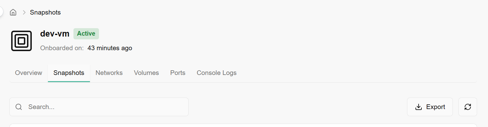

The **Networks** tab lists the virtual networks your instance is currently attached to.

- **Network Address: **Displays the CIDR range of the subnet (e.g., 100.72.1.0/25).
- **Gateway IP: **The routing address for outgoing traffic.
- **DHCP: **Indicates if the IP address was automatically assigned by the network.

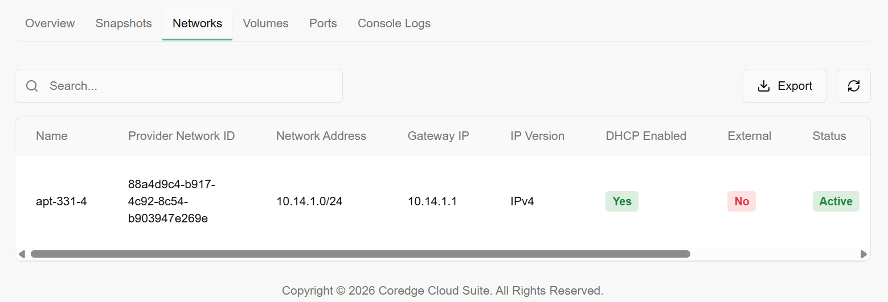

The **Volumes** tab manages the storage disks attached to your VM.

- **Size (GiB):** The capacity of the disk.
- **Attached Device Name:** The mount point on the OS (e.g., /dev/vda is typically the boot drive, while /dev/vdb is data storage).
- **Bootable:** Specifies if the volume contains the operating system required to start the VM.

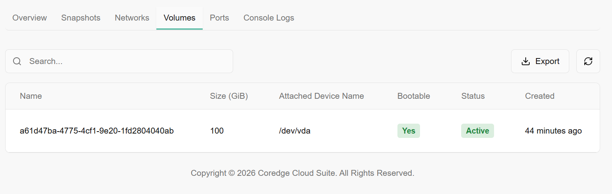

The **Ports** tab provides granular detail on the network interface cards (NICs).

- **IP & MAC Address:** The specific hardware and software addresses for the interface.
- **Security Groups:** Shows the firewall rules applied to this port (e.g., manik-allow-all).
- **External:** Indicates if the port is reachable from outside the private network.

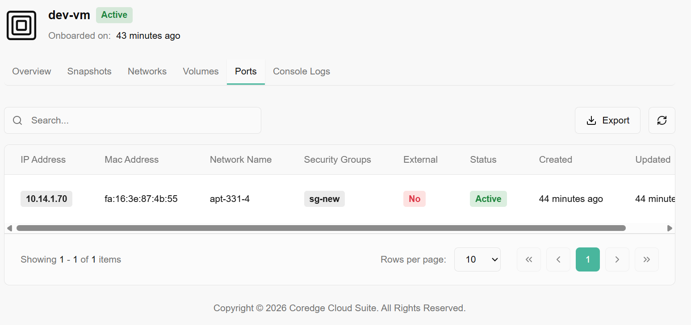

The **Console Logs** tab provides a real-time, read-only view of the system's kernel and boot process.

- **Usage:** Use this to diagnose boot failures, kernel panics, or to verify that cloud-init scripts have finished running without needing to SSH into the machine.

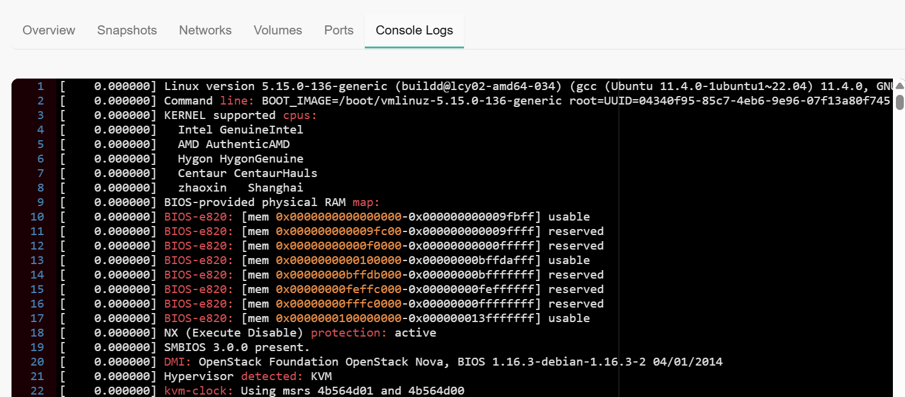

### Compute Snapshots

CCS Snapshots help you to take backups of your virtual machines and capture their state at a specific time, enabling easy restoration or replication, ensuring data protection, and simplifying recovery processes.

Snapshots capture a VM's state at a specific moment, enabling quick reversion as a backup mechanism. Unlike time-consuming full VM backups, incremental snapshots taken at intervals efficiently track changes. CCS compute snapshots also simplify creating multiple test environments from one VM, letting developers and testers swiftly revert to a clean state after testing configurations or updates.

#### Created compute snapshots details

- On the Compute Snapshots page, an admin can view the snapshot name, compute name, tenant, cell, availability zone, region, Is Image, action, active, status, created by, and created on.
- Under the search bar section on Compute Snapshots page, search preferences as required.
- Apply filter in tenant, cell, is-image, action, active, and status as required.
- Admin can use View Preferences to customize visible columns, and export to download the list with selected page and columns.

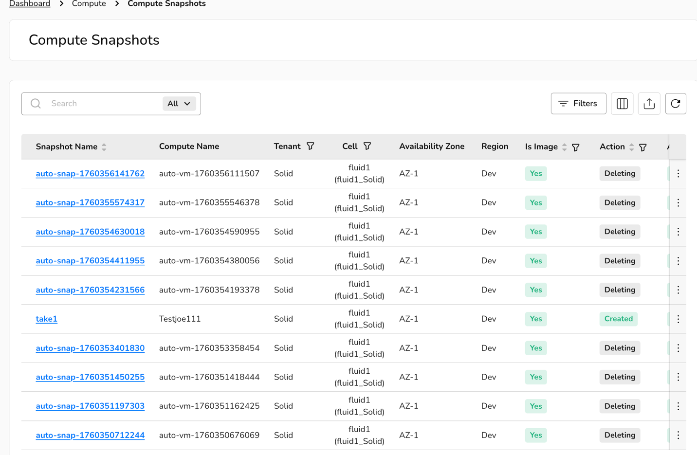

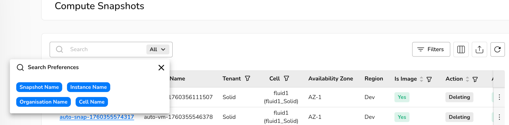

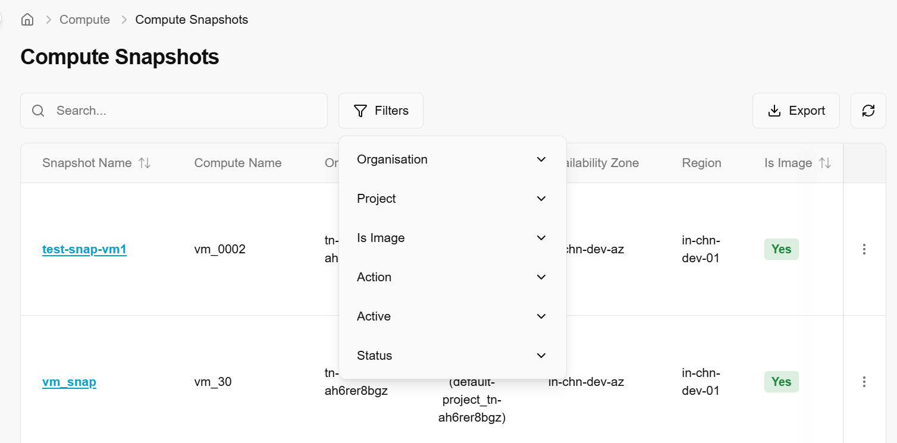

When clicked on snapshot name, it will provide detailed information of selected snapshots. The detail includes overview, users, Compute, and volume snapshots information.

The **Overview** tab provides a high-level summary of the snapshot's configuration and current status.

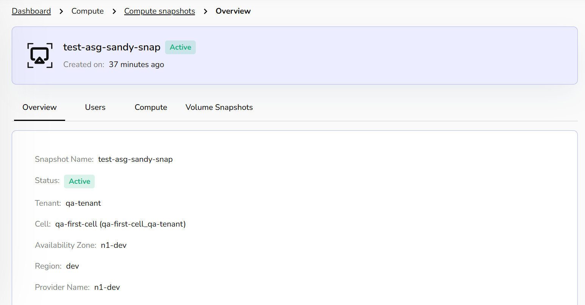

The **Users** tab displays the primary owner or authorized users associated with this specific snapshot.

**User's Name/Email:** Lists the administrative contact or creator responsible for managing the snapshot lifecycle.

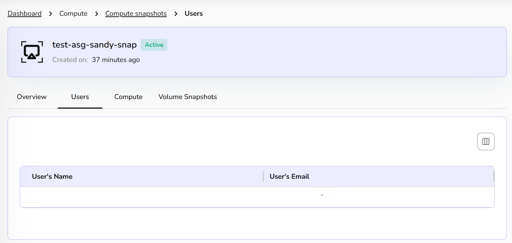

The **Compute** tab provides details about the source instance from which the snapshot was captured.

**Compute Name:** The name of the parent virtual machine.

**Instance Type:** Confirms the resource category.

**Private IP:** The internal network address of the original instance.

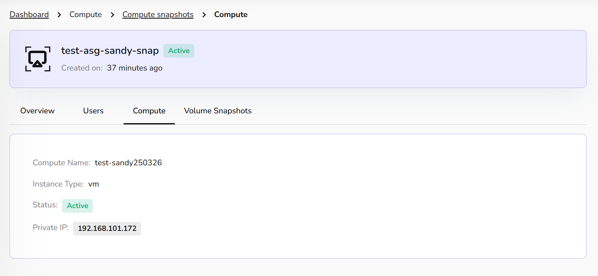

The **Volume Snapshots** tab lists the individual storage disks captured within this compute snapshot.

**Volume Name:** The specific disk ID.

**Size:** The total storage capacity of the captured volume.

**Status:** Confirms the health of the underlying disk data.

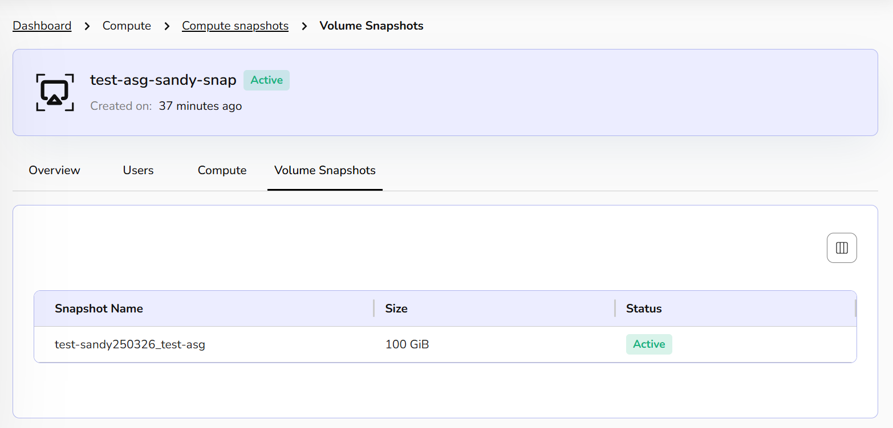

##### Update Snapshots Status

Update snapshot status changes or refreshes the current state of a snapshot in the system's metadata or database. It is used by the platform to mark the snapshot as create, available, error, or delete.

- From the left navigation panel, navigate to compute and select Compute snapshots.
- On the desired snapshot tile, click the three-dot menu and select Update Snapshot status
- Click Yes button to confirm.

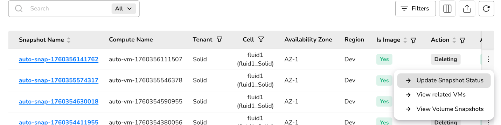

##### View Related VMs

View related VMs displays all virtual machines that are linked to or were created from a specific snapshot. Since snapshots capture the state of a VM at a point in time, this function helps track which VMs are associated with (or restored from) a given snapshot.

- From the left navigation panel, navigate to compute and select Compute snapshots.
- On the desired snapshot tile, click the three-dot menu and select View related VMs. VMs related to the selected snapshot will be displayed.

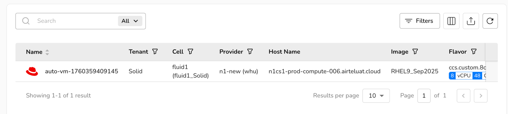

##### View Volume Snapshots

View volume snapshots is a list of snapshots taken of the VM's volumes or disks (as opposed to the full VM). Volume snapshots capture the data stored on individual virtual disks and can be used to restore just the disk, not the entire VM.

- From the left navigation panel, navigate to compute and select Virtual machines
- On the desired snapshot tile, click the three-dot menu and select View volume snapshots. Volume Snapshots page will be displayed.

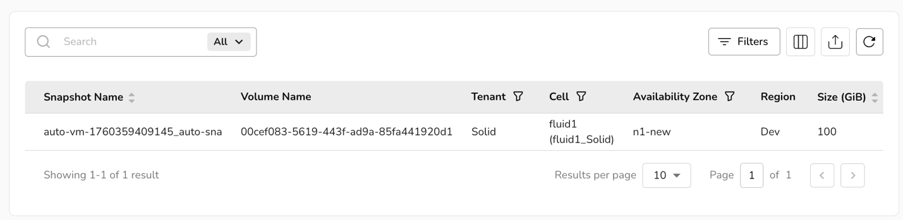

### Kubernetes Clusters

The Kubernetes section allows you to manage live clusters and configure the standardized OS images used to deploy them. The main landing page provides a comprehensive list of all active Kubernetes deployments within your environment.

**Search & Filter:** Use the search bar to quickly locate specific clusters by name.

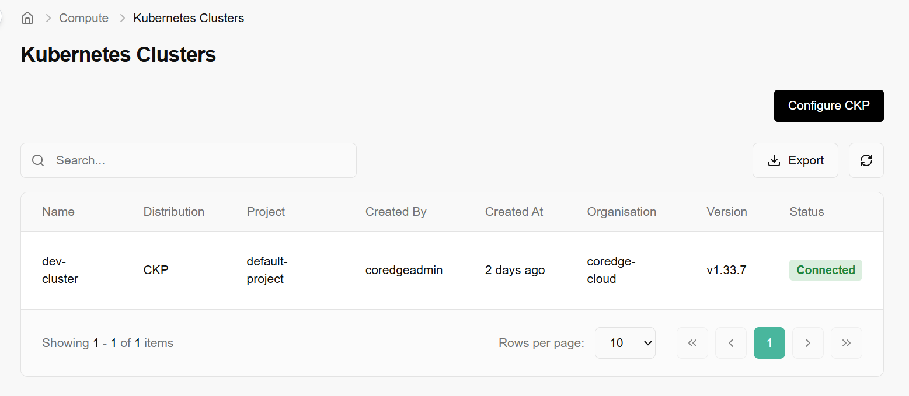

To ensure consistency across clusters, you must configure the **CKP OS Image** library. This defines which OS and Kubernetes versions are compatible with your provider.

#### Add CKP OS Image

When adding a new image template, you must define the following:

**Name:** Select the base image from your repository.

**Backend:** Specify the provider, such as the **CCS Virtual Machine Provider**.

**K8s Version:** Choose the supported Kubernetes version.

**OS Distribution:** Select the OS type (e.g., RHEL, Ubuntu).

**Install CKP Components:** A toggle/checkbox to automatically inject necessary platform binaries during deployment.

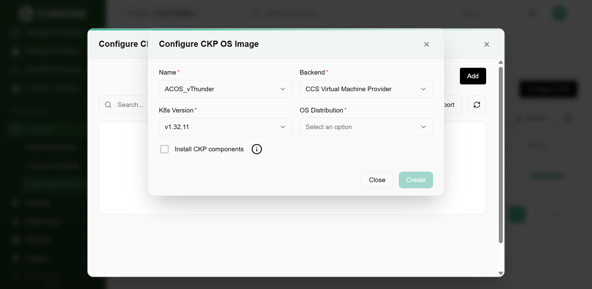

##### Configure CKP Table

This view (accessible via "Manage OS Images") acts as a registry for all configured templates.

**Architecture:** Displays the CPU architecture (e.g., amd64).

**Edit Action:** Clicking the three-dot menu on any row allows you to **Edit** the existing configuration.

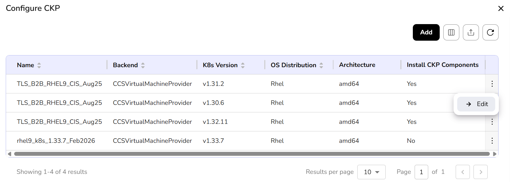

##### Update CKP OS Image

If a version needs to be patched or changed:

The system allows you to modify the **K8s Version** or toggle the **Install CKP components** setting for an existing image entry.

Fields like **Backend**, **OS Distribution**, and **Architecture** are often locked (greyed out) during updates to maintain data integrity.

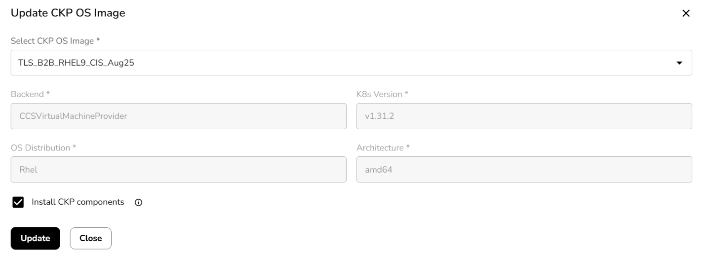

## Storage

CCS storage is a scalable, cloud-based solution for developers and businesses. It provides storage services such as volumes, object storage, volume snapshots, and file storage, which are reliable and flexible data storage options for hosting websites, applications, and data backups in the cloud.

### Block Storage

Volumes are block storage devices that provide scalable and persistent storage for virtual machines. Volumes can be attached and detached as needed, allowing you to expand storage capacity without modifying the underlying infrastructure, offering flexibility and data durability.

Block storage is a type of data storage that organizes data into fixed-sized blocks, each with its unique address. One of the primary advantages of block storage is its flexibility and efficiency in handling data at the block level, making it well-suited for various applications, including virtual machines, databases, and other data-intensive workloads.

- Log in to the Fluid CCS admin platform
- From the left navigation panel, navigate to Storage and select block storage.
- On the block storage display page, an admin can view the volume name, availability zone, region, volume size (GiB), tenant, cell, bootable, action, status, created by and created on.
- Under the search bar section on block storage, search preferences as required.
- Apply filter in availability zone, tenant, cell, bootable, action, and status as required.
- Admin can use View Preferences to customize visible columns, and Export to download the list with the selected pages and columns.

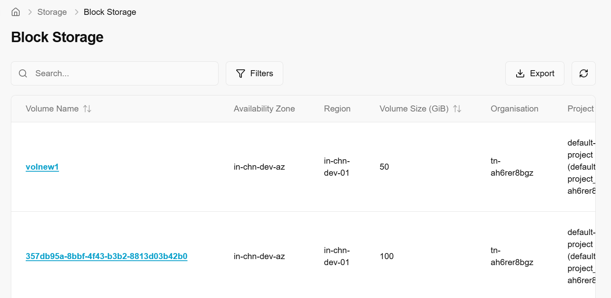

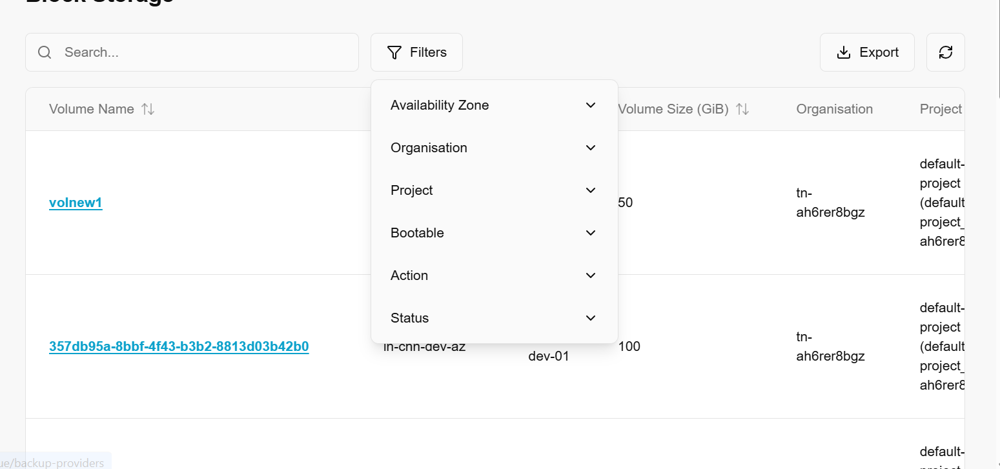

When clicked on any one of the volume names, it provides detailed information about the selected volume. It includes an overview and compute details of a volume.

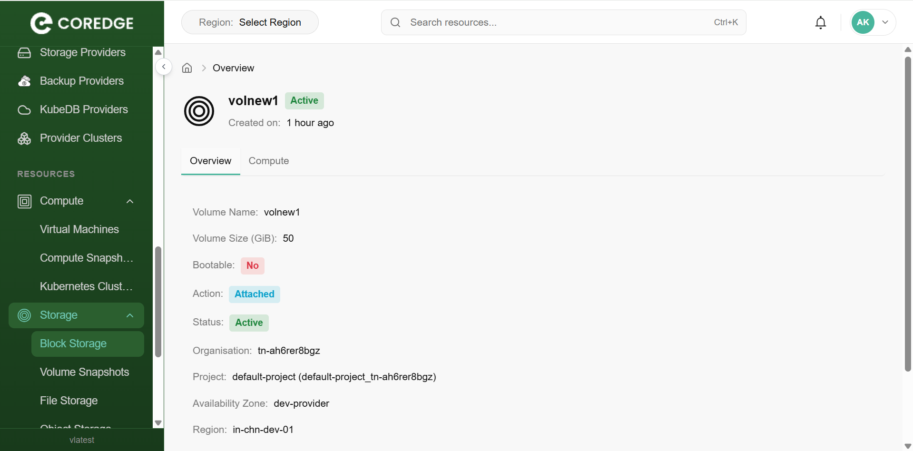

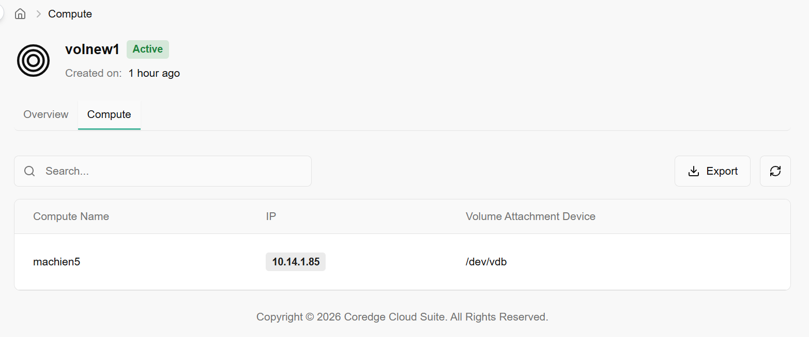

### Volume Snapshots

Volume snapshots are a point-in-time copy, or snapshot of the data contained within a storage volume. Volume snapshots capture the data and configuration of a volume, enabling easy restoration or replication, providing data protection, and facilitating disaster recovery and data migration processes.

- On the volume snapshots page, an admin can view the snapshot name, volume name, tenant, cell, availability zone, region, size (GiB), compute snapshot status, created-by, and created-on information.
- Under the search bar section on volume snapshots, search preference as    required.
- Apply filter in tenant, cell, availability zone, and status as required.
- Admin can use View Preferences to customize visible columns, and Export to download the list with the selected page and columns.

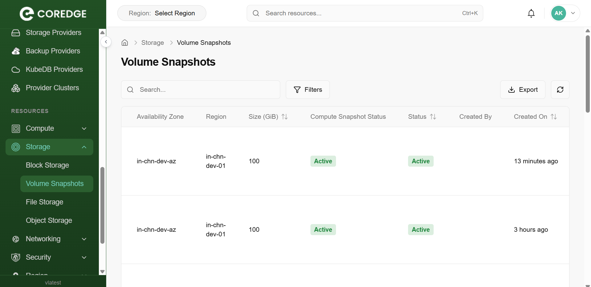

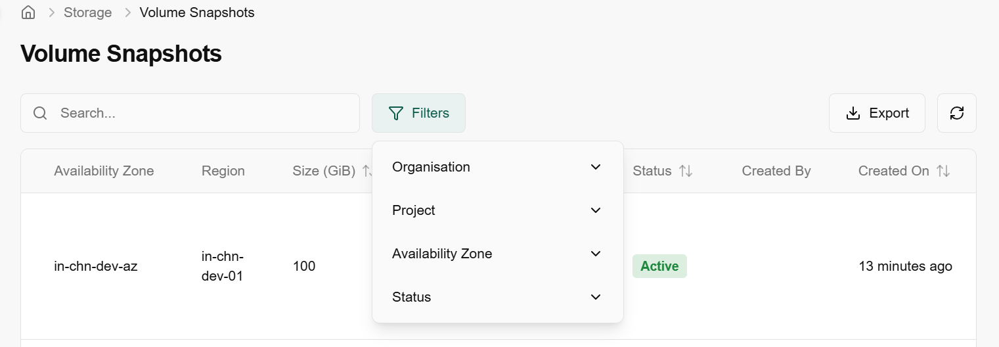

### File Storage

File storage allows multiple servers or instances to access the same storage pool over a network. It is particularly useful for scenarios where you need to share storage that can be accessed by multiple virtual machines or containers simultaneously.

- Log in to the Fluid CCS admin platform.
- From the left navigation panel, navigate to storage and select File Storage.
- On the File Storage page, an admin can view the name, organization, availability zone, cell, state, description, created by, and created on.
- Under the search bar section on File Storage page, search as required.
- Admin can use View Preferences to customize visible columns, and export to download the list with selected page and columns.

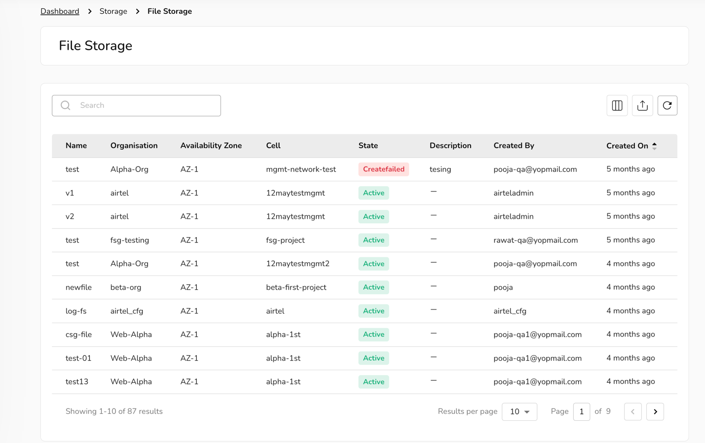

### Object Storage

Object storage is a data storage architecture that manages data as distinct units, called objects, rather than as blocks or files. Fluid CCS's object storage helps you to create a bucket. Buckets are the basic containers that store your data in the cloud. Everything that you store in the cloud storage service is contained in a bucket. You can use buckets to organize your data and control access to your data. Buckets have unique names that all users of the cloud storage service share.

- Log in to the Fluid CCS admin platform.
- From the left navigation panel, navigate to storage and select Object Storage.
- On the Object Storage page, an admin can view the name, availability zone, state, usage, and created-on details.
- Under the search bar section on Object Storage page, search as required.
- Admin can use View Preferences to customize visible columns, and export to download the list with selected page and columns.

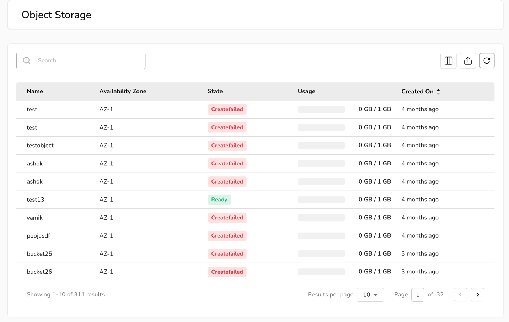

## Networking

Networking refers to the management and orchestration of network connectivity, enabling users to access cloud resources like virtual machines, storage, and applications over the internet. It involves creating virtual networks, applying security protocols, and using components such as virtual routers, load balancers, and firewalls to establish secure, scalable, and reliable connections within cloud environments.

### VPC

A VPC (Virtual Private Cloud) is a logically isolated network within a cloud environment that provides users with their private space to securely launch and manage compute, storage, and networking resources. A VPC helps create isolated tenant environments, ensuring that multiple teams or projects can use the same physical infrastructure without interfering with one another.

#### Procedure to onboard VPC

- Log in to the Fluid CCS admin platform
- From the left navigation panel, navigate to Networking and select VPC.
- Click on add VPC.
- Enter basic network details such as name, description, region from dropdown box, add IPv4 address space, and add IPv6 address space.
- Set onboard and provider network status. Add labels as required and click on the add button and confirm the details.
- Enable provider network.
- Add tags. Maximum five tags can be added.
- Click the add button.
- On the VPC page, an admin can view the name, region, status, tenant, and cell of VPC.
- Admin can use View Preferences to customize visible columns, and Export to download the list with the selected page and columns.

**p**

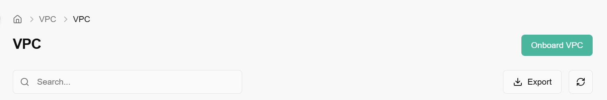

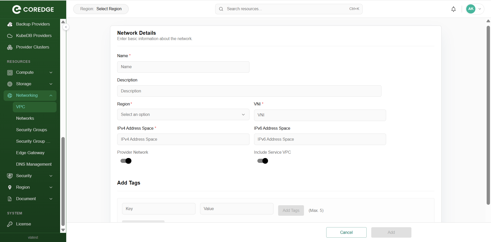

##### Associate to tenant

Allocate VPC refers to the process of assigning or associating the VPC to a specific tenant/project, user, or resource group so that it can be used for launching virtual machines, networks, and other cloud services within that isolated network environment.

To allocate VPC, perform the following steps:

- From the left navigation panel, navigate to VPC. A dashboard of VPC appear. Click on the three dots present at the right corner of the onboarded VPC table.
- Click on the associate to tenant button.
- Select tenant from the dropdown box.
- Click the associate button.

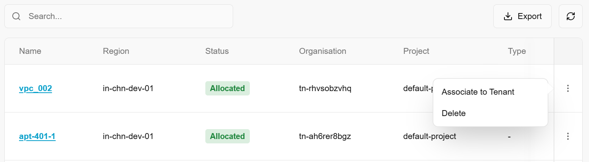

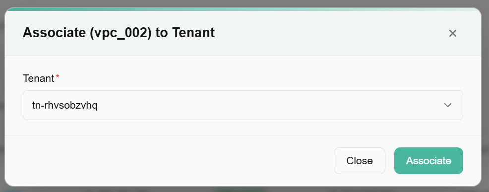

##### Unallocated VPC

To release or disassociate VPC from a specific resource, project, or tenant without necessarily deleting the VPC itself we use unallocated the VPC.

- From the left navigation panel, navigate to VPC and select VPC.
- On the desired VPC tile, click the three-dot menu and select unallocated. Click on yes to confirm.

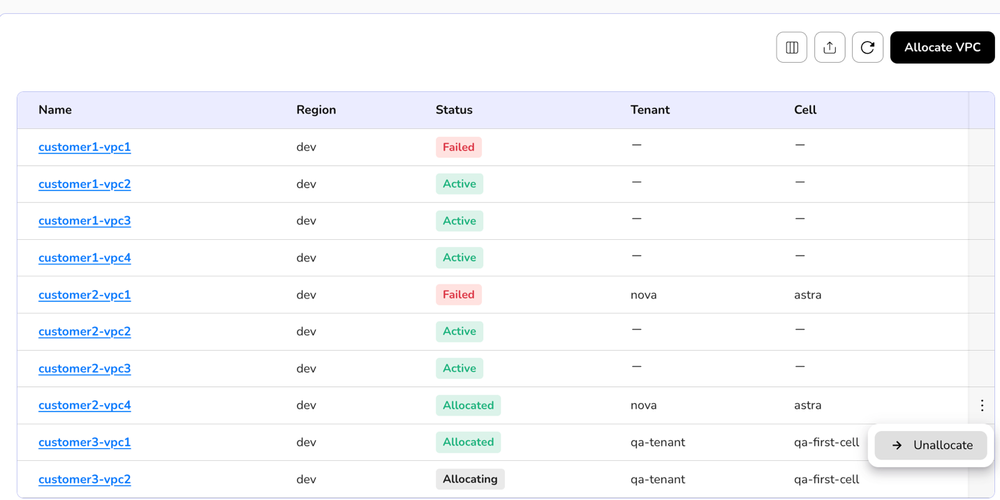

##### Delete VPC

Delete VPC is the action of permanently removing a VPC and all its associated networking components from your cloud environment.

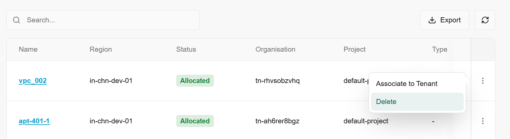

Click on an onboarded VPC name, it redirects to its detailed page. An overview section provides complete detail about onboarded VPC. Subnets allow you to add subnet to a VPC.

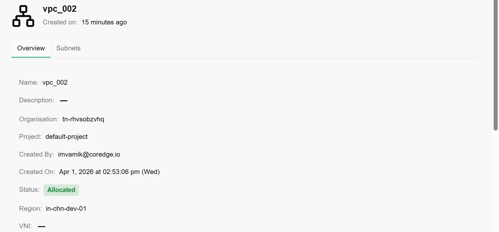

#### Procedure to add subnet

- Go to VPC detailed page and select subnet section.
- Click on add subnet button.
- Enter basic information about the subnet. Enter name, description, subnet role, subnet sub role, enable gateway button, IPv4 and IPv6 address space, subnet start and end values, VLAN, VNI, MTU, physical network name and type, AZ, DHCP servers, DNS servers, and tags.
- Enable onboarded, include service VPC, and DHCP toggle buttons.
- Click on add button.

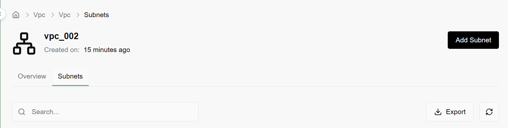

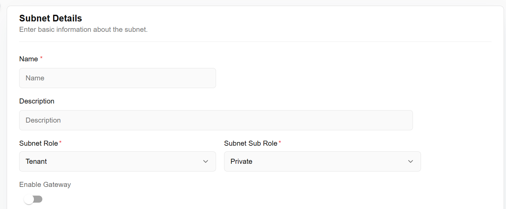

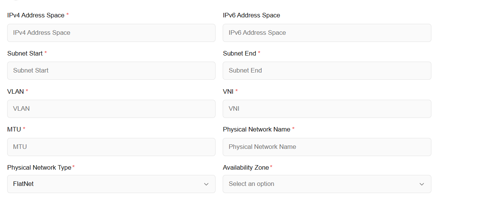

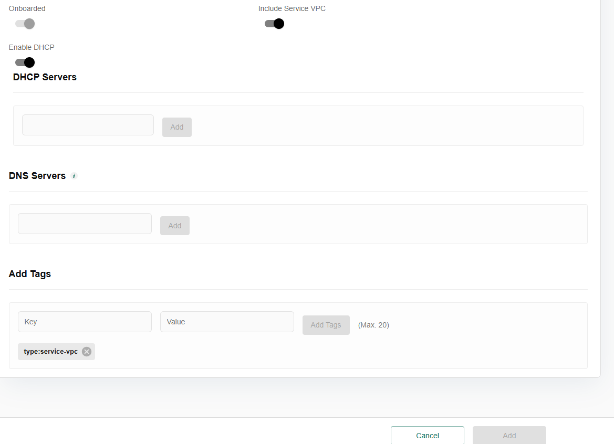

An admin can un-allocate added subnet to a particular organization and project. For un-allocation, perform the below mentioned steps:

Click on the three dots at the right corner of the allocated subnet table.

Click on the un-allocate button.

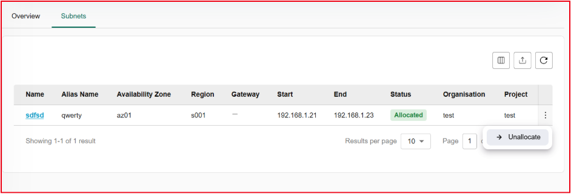

Click on the added subnet name, it will redirect to the overview page, where it provides complete details of added subnets.

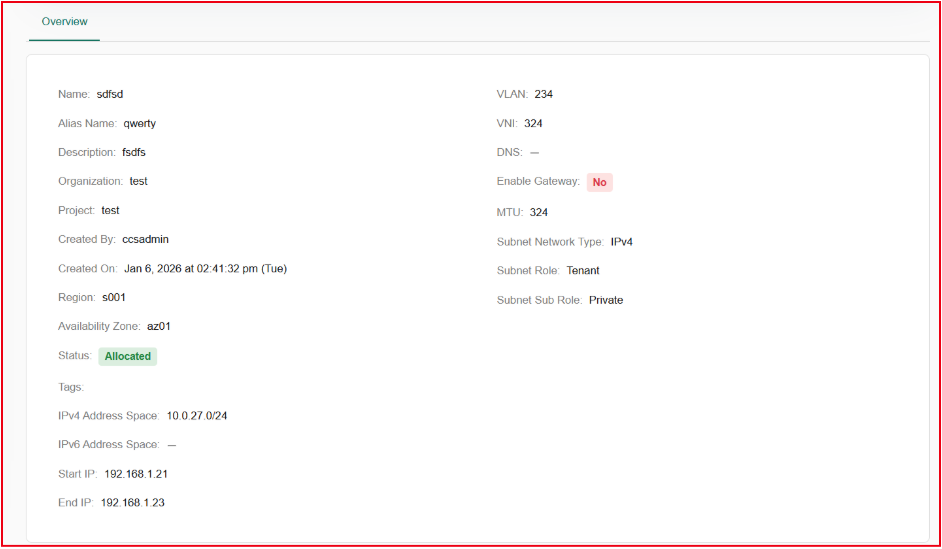

### Networks

Networks are virtualized environments for secure resource communication. Admins can configure settings, manage traffic, and establish connections between virtual machines and services.

- Log in to the Fluid CCS admin platform.
- From the left navigation panel, navigate to Networking and select Networks.
- On the networks page, an admin can view the network name, subnet, IP Usage, tenant, cell, availability zone, region, type, managed by, status, created by and created on.
- Under the search bar section on networks, search preference as required.
- Apply filter in tenant, cell, type, managed by, and status as required.
- Admin can use View Preferences to customize visible columns, and Export to download the list with the selected size and columns.

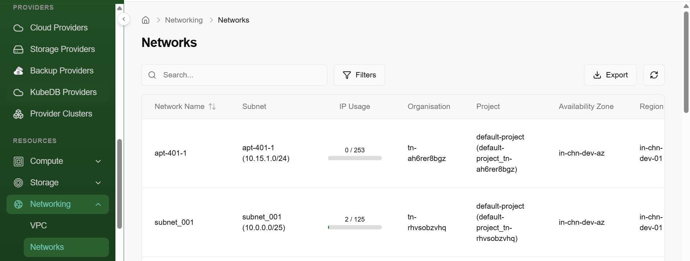

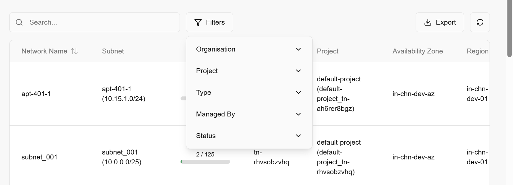

### Security Groups

Security groups are a network-level firewall that controls inbound and outbound traffic for virtual machines. Security groups provide network-level security, for instance. An admin can define rules to allow or restrict access based on protocols, ports, and IP addresses, enhancing the security of infrastructure.

- Log in to the Fluid CCS admin platform.
- From the left navigation panel, navigate to Networking and select security groups.
- On the security groups page, an admin can view the name, tenant, cell, availability zone, region, managed by, status, created by and created on.
- Under the search bar section on security groups, search preference as required.
- Apply filter in tenant, cell, type, managed by, and status as required.
- Admin can use View Preferences to customize visible columns, and Export to download the list with the selected size and columns.
- Click on the three dots, click on manage security rules, default page appears.
- On default page, view overview and security group rules.
- Admin can use View Preferences to customize visible columns, and Export to download the list with the selected size and columns.

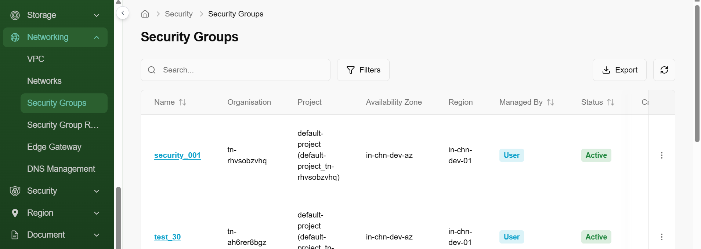

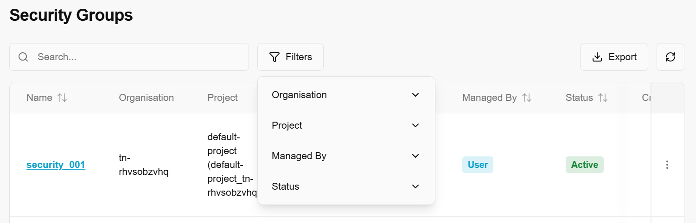

#### Manage Security Rules

- From the left navigation panel, navigate to Networking and select security groups.
- On the desired security group tile, click the three-dot menu and select manage security rules.
- An admin can create and sync a security group rule:
  - To create, click on create button, enter necessary details such as protocol, IP version, direction, network address and select predefined ports (if required).
  - Click on add rule to finish setup.
  - To sync, click on sync button, select rule details. Enter source and remove extra rule status. Click on create to finish setup.
- Under the search bar section on security group rules, search preference as required.
- Apply filter in direction, protocol, ether type, managed by, and status as required.
- On the security group rules page, an admin can view direction, remote IP, port range, protocol, Ether type, managed by and status of the security group rules
- Admin can use View Preferences to customize visible columns, and Export to download the list with the selected size and columns.
- From the top menu, select overview to view basic details of a security group such as name, tenant, cell name, status, availability zone, region, managed by, created by and created on.

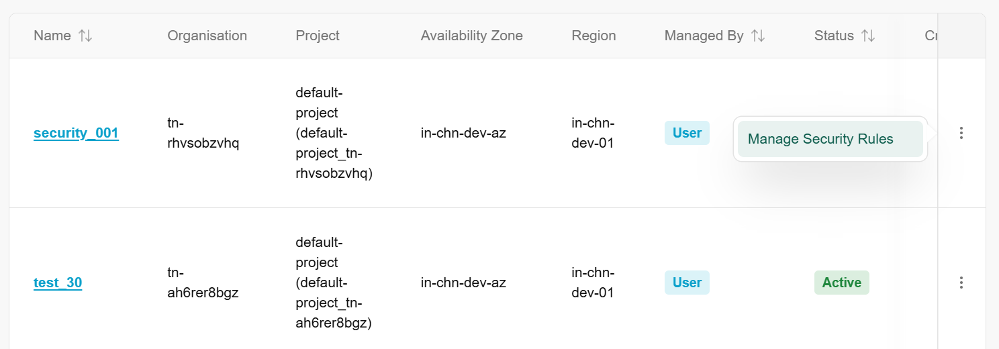

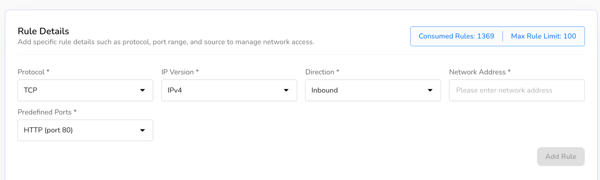

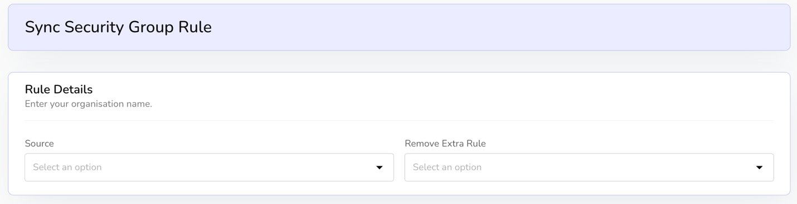

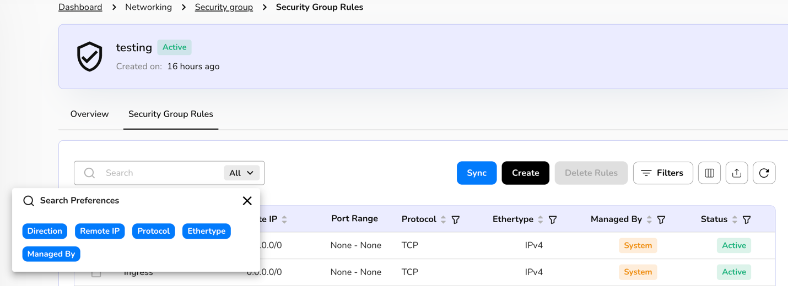

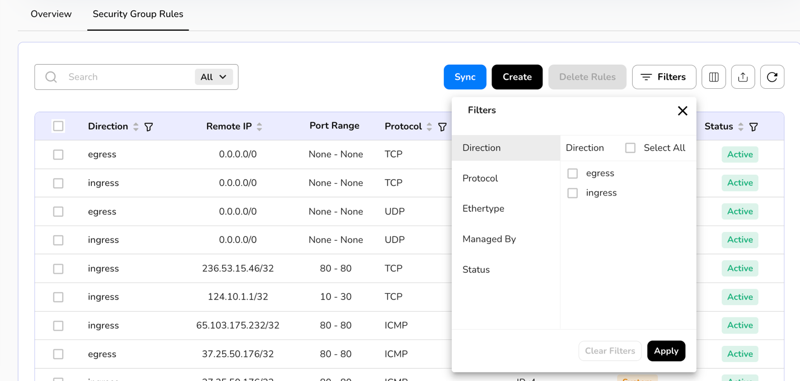

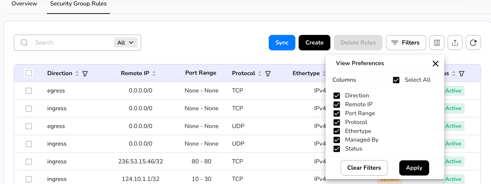

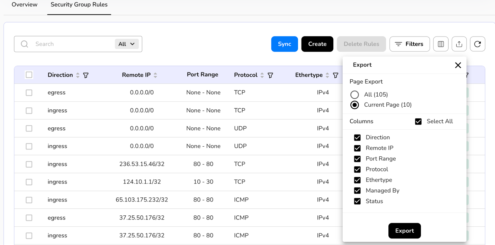

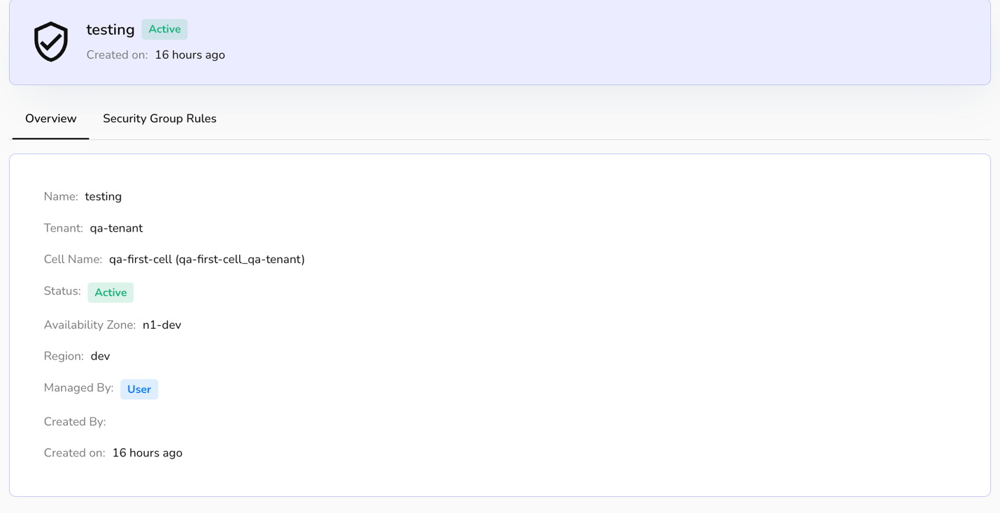

### Security Group Rules

Security group rules are firewall policies attached to a security group, which control inbound (incoming) and outbound (outgoing) network traffic to and from virtual machines (VMs) or other resources (like containers or load balancers) in a Virtual Private Cloud (VPC) or virtualized environment.

- Log in to the Fluid CCS admin platform.
- From the left navigation panel, navigate to Networking and select security group rules.
- On the security groups rules page, an admin can view the security group name, cell, direction, remote IP, port range min, port range max, protocol, ether type, managed by, status, created by and created on.
- Apply filter in cells, direction, protocol, ether type, managed by, and status as required.
- Admin can use View Preferences to customize visible columns, and Export to download the list with the selected size and columns.

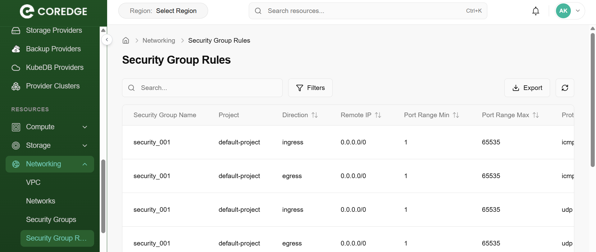

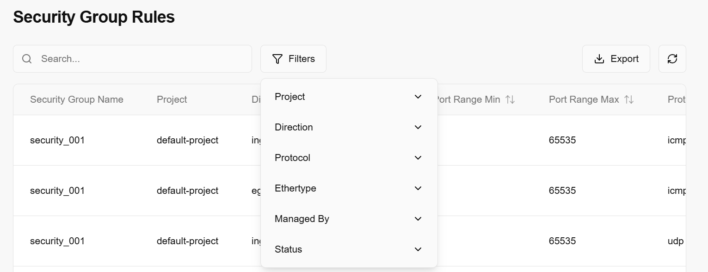

### Edge Gateway

An edge gateway is a device or server located at the "edge" of a network that connects local devices to the cloud or a larger network, performing functions like data processing, protocol translation, and security.

- Log in to the Fluid CCS admin platform.
- From the left navigation panel, navigate to Networking and select edge gateway.
- On the edge gateway page, an admin can view the edge gateway name, VPC, availability zone, region, tenant, cell, status, created at and updated at.
- Apply filter in VPC, availability zone, tenant, cell, and status.
- Admin can use View Preferences to customize visible columns, and Export to download the list with the selected size and columns.

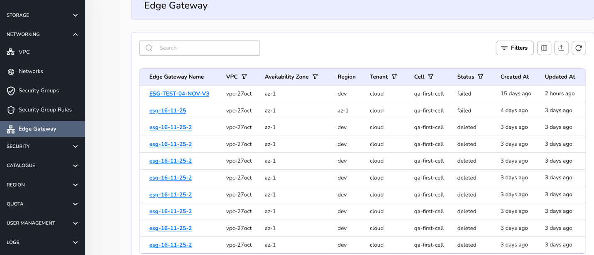

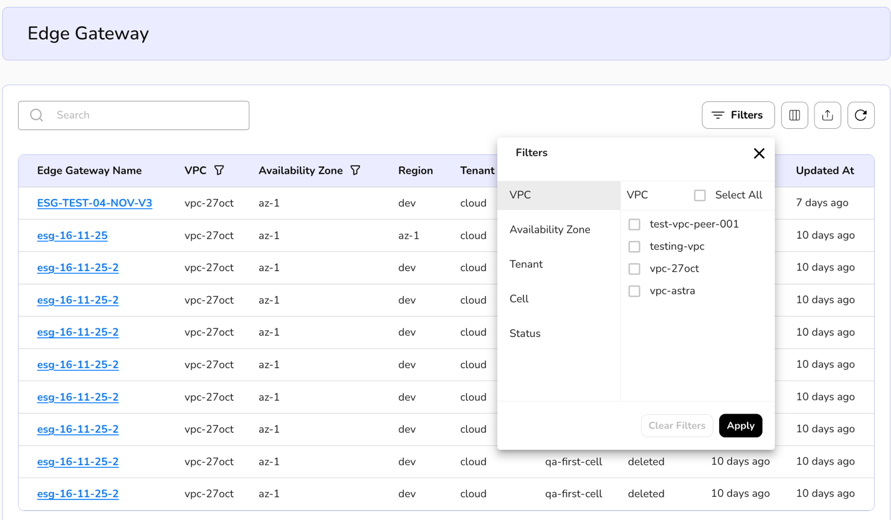

### DNS Management

DNS (Domain Name System) Management is the process of managing the "phonebook of the internet. DNS management is the administrative control over the records that tell the internet which IP address belongs to which domain name.

From the left navigation panel, navigate to Networking and select DNS management.

On the DNS management page, an admin can view the name, zone type, network, tenant, created-by, and created-on details.

Admin can use View Preferences to customize visible columns, and Export to download the list with the selected size and columns.

Click on a name tab, it redirects to its detailed page. An overview section provides the basic and configuration details.

Resource records provide the basic units of information stored in the DNS database. Each record provides a specific instruction--whether it's pointing a name to an IP address, directing email to a server, or providing security metadata. You can check the status of the records.

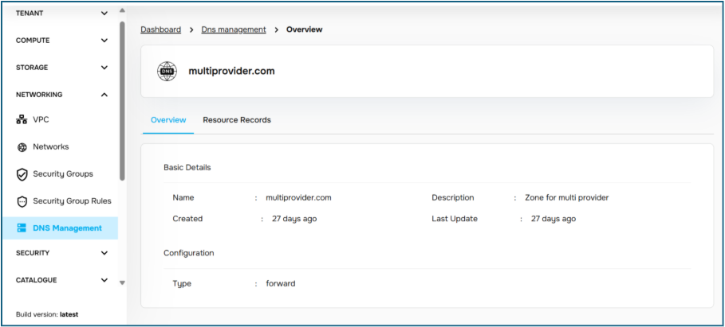

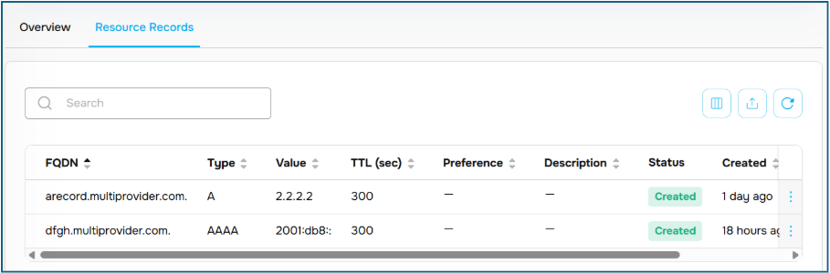

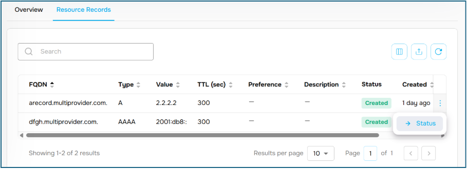

## Security

Security is the practice of protecting computer systems, networks, and data from digital attacks, unauthorized access, and damage. It involves a combination of technologies, processes, and human behaviors to safeguard digital assets, from personal information to critical infrastructure, against threats like malware, phishing, and ransomware.

### Organisation Firewall

An **Organisation Firewall** is a specialized security layer designed to manage traffic at the "Org" level. Unlike a standard firewall that might protect a single server, this firewall acts as a gatekeeper for an entire business unit or project group.

**Managing Organisation Firewalls**

The Organisation Firewall section allows administrators to define and audit security groups.

**Search:** Quickly find specific security rules by name or ID.

**Export:** Download a CSV or PDF of all active firewall rules for compliance auditing.

A **VDOM** (Virtual Domain) is a technology that allows a single physical firewall to be divided into multiple **logical** firewalls.

- Use the **Search** bar to filter through multiple virtual domains if your organization operates across multiple segments.
- **Refresh:** Use the refresh icon to pull the latest status of the virtual interfaces and routing paths.

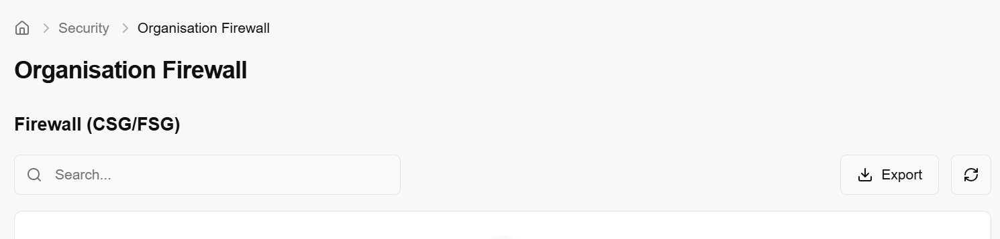

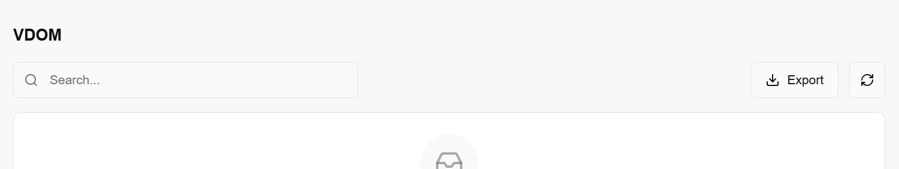

### Firewall Rules

Firewall Rules are a set of specific instructions that act as a digital filter for your network. They define which traffic is allowed to enter (Inbound) or leave (Outbound) your environment based on criteria like IP addresses, ports, and protocols.

- Use the **Search bar** to quickly filter rules.
- The **Export** button allows you to download your current rule set as a file.
- Click the **Refresh icon** to ensure you are looking at the most current set of active rules.

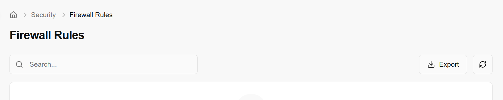

### SSL Certificate

An SSL (Secure Sockets Layer) Certificate is a digital credential that validates the identity of a website or server and enables an encrypted connection. It's what turns a website from **http://** to **https://**, signaling to browsers and users that their data is safe.

Managing SSL certificates is critical for securing communication between your users, your applications, and your database providers.

**Overview**

The SSL Certificates dashboard provides a centralized view of all security credentials used across your organization. This allows you to monitor certificate health and prevent service outages caused by expired encryption.

- **Search & Filters:** Quickly locate certificates by their common name, issuing authority, or expiration date.
- **Export:** Generate a report on all certificates. This is often used for compliance audits to prove that all data in transit is properly encrypted.
- **Refresh:** Sync the dashboard with your certificate manager to ensure you are seeing the most recent renewal statuses.

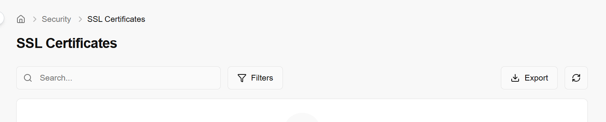

### Cyber Security Requests

From the left navigation panel, navigate to security and select cyber security requests.

On the cyber security requests page, an admin can view the request ID, tenant, project, status, state, raised by and raised on.

From the drop down, choose a security service as required.

On the cyber security requests page, click the three-dot menu and click on update status.

On the update request status page, choose the suitable status from the drop down and click on update to complete the process.

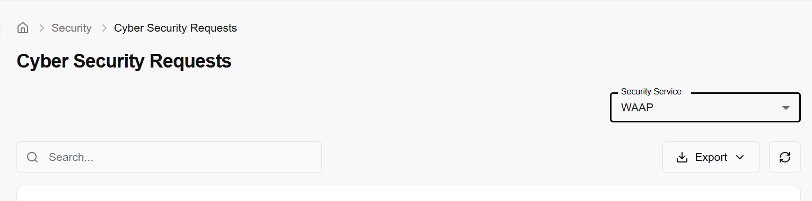

## Region

### Regions

In the CCS admin cloud console, a region represents a logical location where cloud resources can be deployed, each with its own code, endpoint URL, and activation state. The Regions page lets administrators view and manage all defined regions--searching by name, checking the mapped region code and API URL, and activating or deactivating specific regions to control where tenants are allowed to provision services.

#### Procedure to add region

- 2. From the left navigation panel, navigate to region and select regions.
- 3. Click on the add region button.
- 4. Enter Region Details (basic information about the region) and click on create button to complete the process.

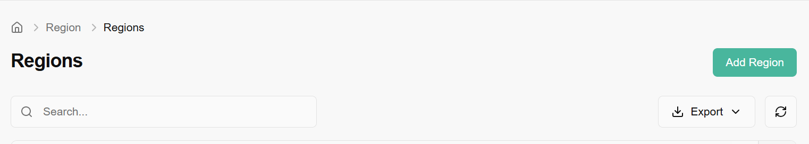

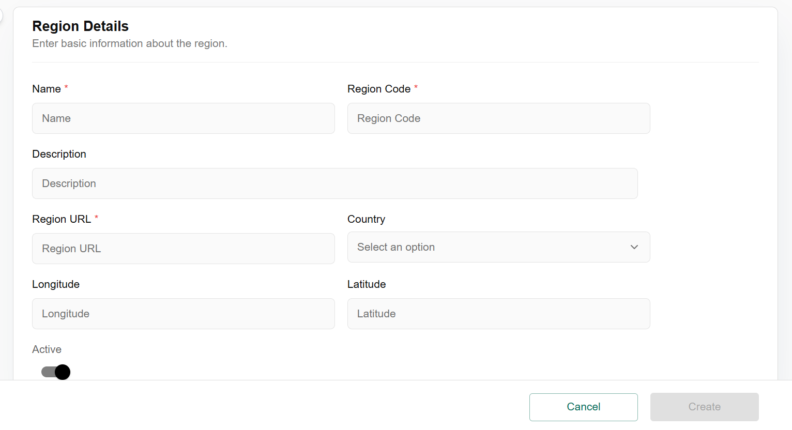

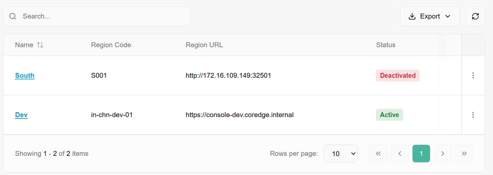

Added regions can be activated, deactivated, and updated.

##### Activate

When a region is **Deactivated** (marked with a red label), it is hidden from most provisioning menus.

**How to Activate:** Click the vertical ellipsis (three dots) next to the deactivated region and select **Activate**.

**Effect:** The status will change to a green **Active** label. You can now select this region when configuring KubeDB Providers or other cluster resources.

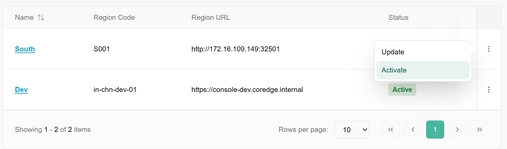

##### Deactivate

If a region is undergoing maintenance or is no longer in use, you can deactivate it to prevent new deployments.

**How to Deactivate:** Click the vertical ellipsis (three dots) next to an active region and select **Deactivate**.

**Effect:** The status will change to a red **Deactivated** label. Existing resources may remain, but no new configurations can be assigned to this region.

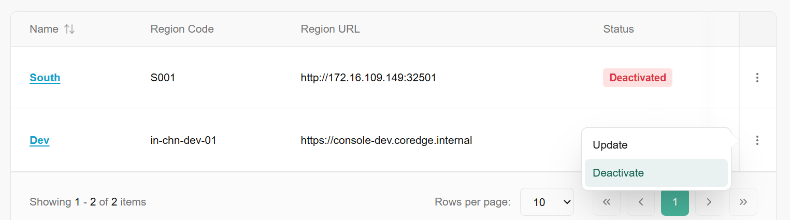

##### Update

Update Region is the administrative action of modifying the metadata or connection parameters of an existing geographical or logical deployment zone.

- Select **Update** from the action menu to modify the Region URL or Name.

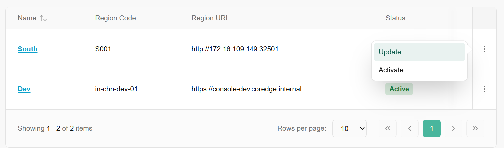

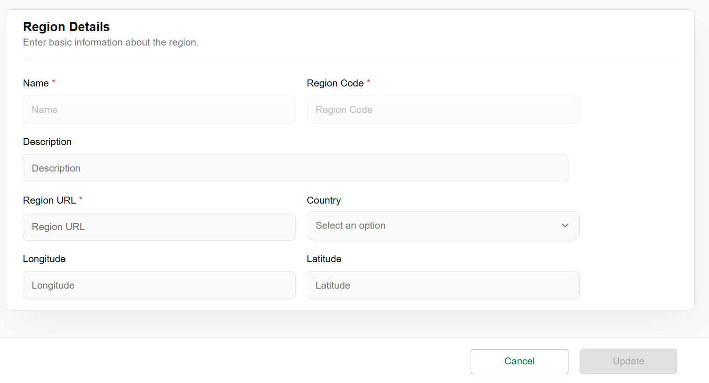

Click on region name, it redirects to region overview dashboard. The region overview page provides a deep dive into the specific configurations, geographic location, and audit trail of a single region. This information is vital for ensuring compliance and troubleshooting connectivity issues.

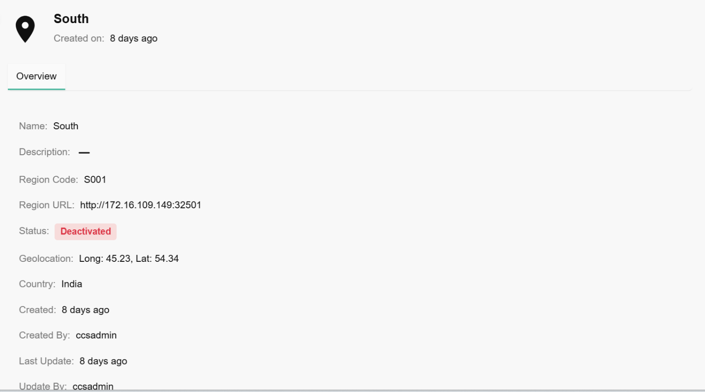

### Availability Zones

An availability zone is a distinct, isolated location within a cloud provider's infrastructure region that ensures high availability and fault tolerance for cloud services and resources. It provides redundancies and minimizes the risk of service disruptions caused by localized failures.

#### Procedure to Add Availability Zones

- From the left navigation panel, navigate to regions and select availability zones.
- On the availability zone page, click on add availability zone tab.
- Enter basic information such as name, availability zone code, description, and select suitable option in the region code from the drop down.
- In the add tags selection, you can up to five tags
- Click on create button.
- Click on confirm tab to confirm the details.

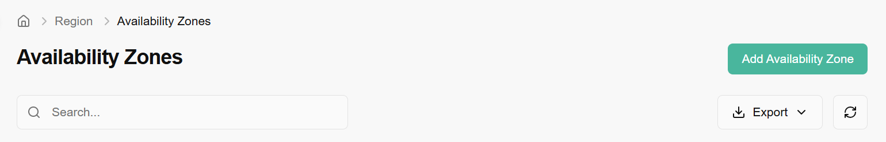

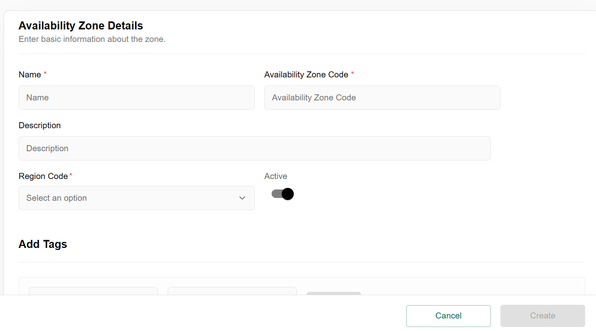

Click on three dots to update, map region, un-map region, and deactivate availability zone.

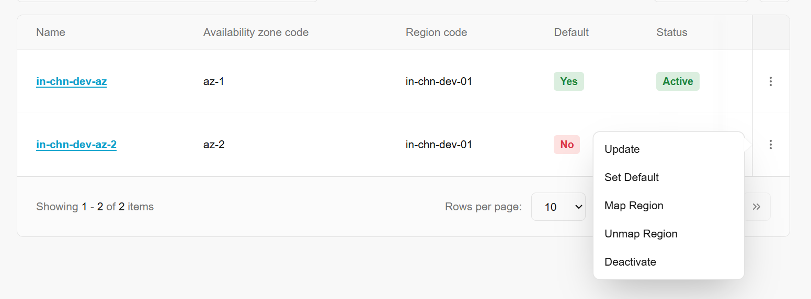

##### Update

Update allows you to modify the configuration of an existing zone. Use this if the name needs to be changed or if the underlying metadata for that specific data center segment has been updated. It does not move physical hardware but updates the platform's reference to it.

Click on three dots, click on update, enter name and description, and click on update button to update availability zone.

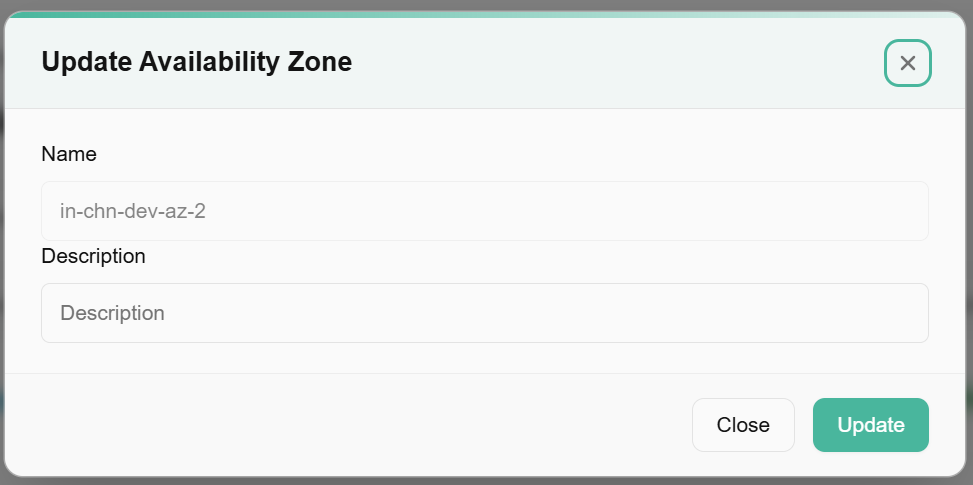

##### Set Default

Within a Region, you can mark one Availability Zone as the **Default**. When a user creates a new resource and does not manually specify a zone, the platform will automatically provision it in the "Default" AZ.

- Click on three dots of availability zone table and click on set default option.

##### Map Region

This action creates a logical link between an Availability Zone and a parent Region.

Click on three dots, click on map region, enter region code from the drop down, and click on update button to map region.

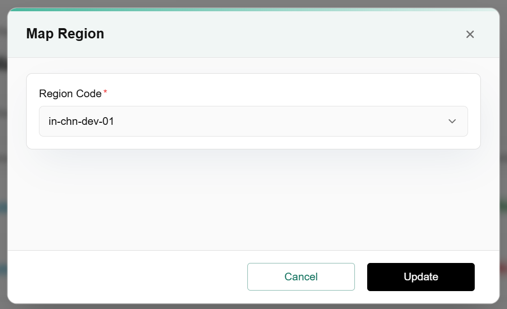

##### Unmap Region

This removes the logical association between the AZ and a Region.

Click on three dots, click on un-map region and select suitable option.

##### Deactivate

Toggling an Availability Zone to **Deactivated** keeps the configuration in the system but prevents any new resources from being scheduled there.

Click on three dots, click on deactivate and select suitable option.

The **Availability Zone (AZ) Overview** provides a detailed breakdown of a specific zone's configuration, its parent region, and its current availability within your infrastructure.

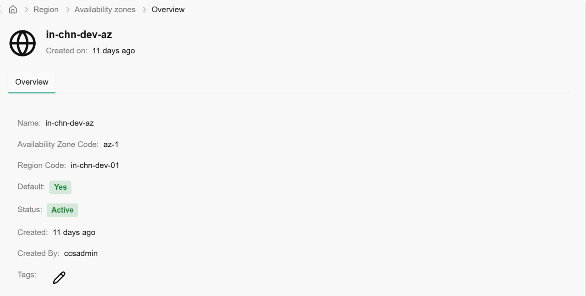

## Document

The **Document** section serves as a compliance and verification hub. Just as banks require "Know Your Customer" checks, cloud platforms use these sections to verify the identity of individual users (**KYC**) and the legitimacy of business entities (**KYB**) before granting access to sensitive infrastructure or high-resource quotas.

### KYC

The **KYC** dashboard tracks the verification status of individual users. This process links a digital platform account to a real-world identity.

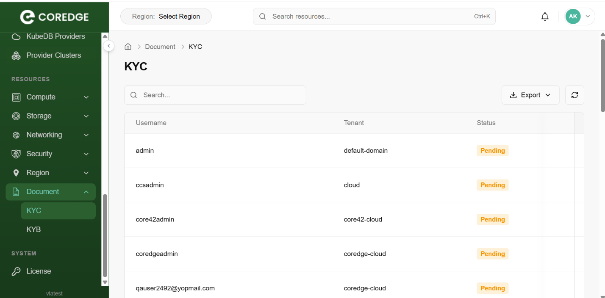

### KYB

- The **KYB** dashboard focuses on the corporate level. This is essential for enterprise clients to prove that the "Organization" or "Tenant" is a legally registered business entity.

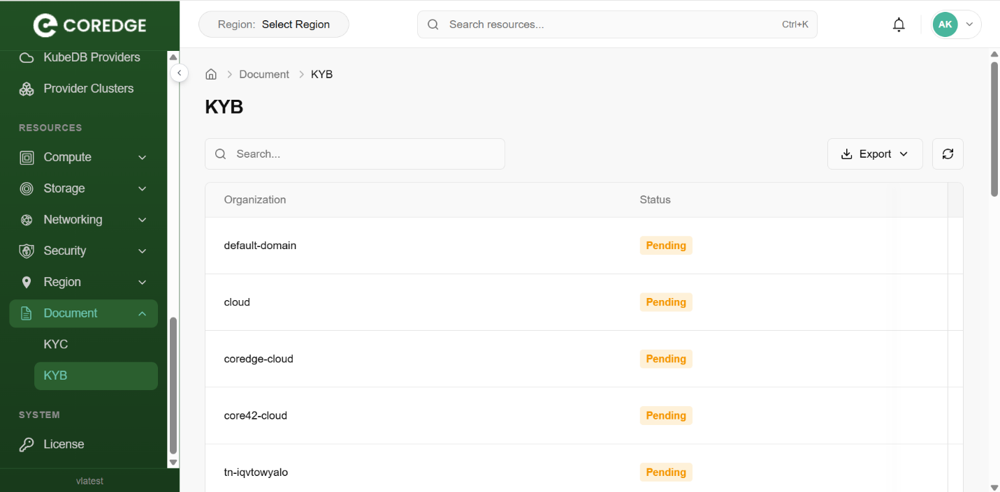

# System

A **System License** is a digital certificate or "key" that authorizes the use of the Coredge platform. It serves as the bridge between your service agreement and the technical activation of the software.

## License

The **License** section is found under the **System** menu in the sidebar. This is where you activate the platform and monitor your current entitlement status.

**License Overview**

When the system is first installed or if a license has expired, you will see the **Unlicensed** state.

**Status Badge:** Displays a red **Unlicensed** tag when no valid key is present.

**Update License:** Click this button to open the activation modal.

**Refresh:** Use this icon to sync with the license server if you have recently renewed your subscription online.

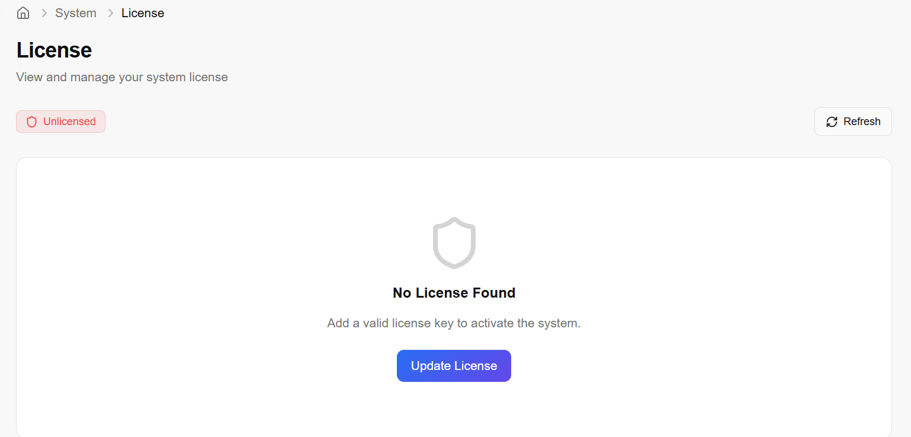

**Updating the License**

To activate or renew your platform, use the **Update License** modal.

**License Type:**

**Online:** Select this if your controller has internet access. The system will automatically validate the key against Coredge servers.

**Offline:** Select this for "Air-gapped" environments with no internet access. This usually requires uploading a license file provided by Coredge support.

**License Key:** Enter the unique alphanumeric string provided in your purchase confirmation.

**Secret:** Enter the security secret or "passphrase" associated with your license key. This adds an extra layer of protection to prevent unauthorized license usage. Click on update button.

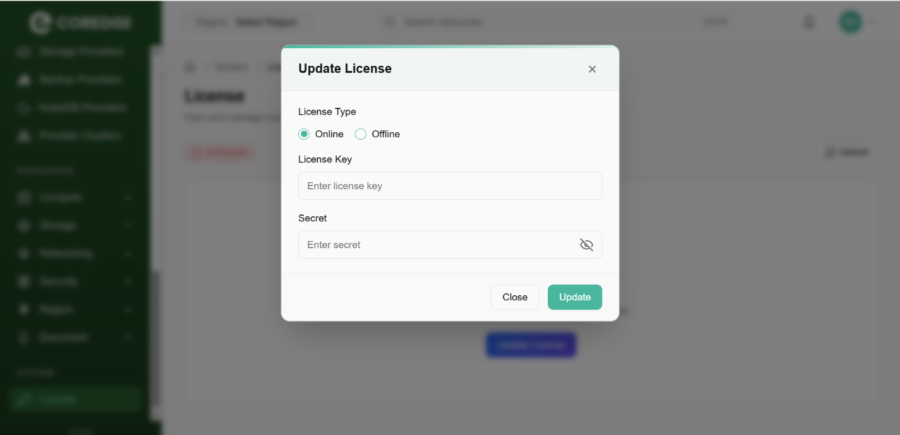

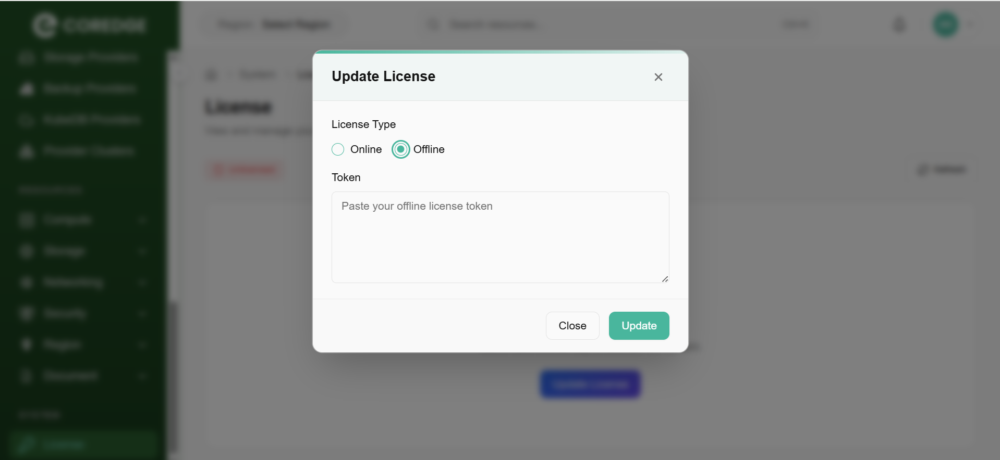
