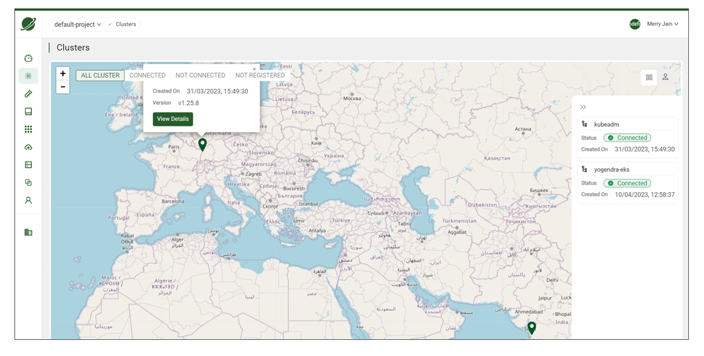
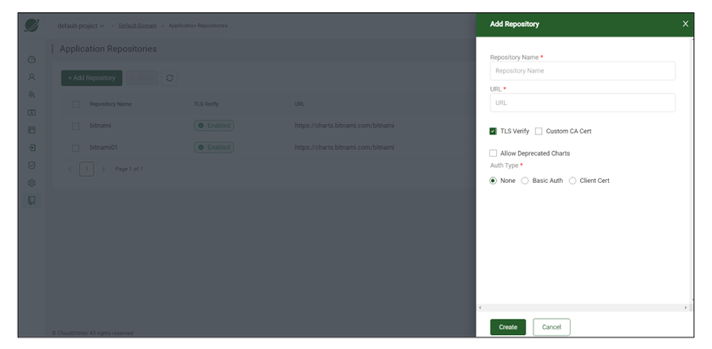
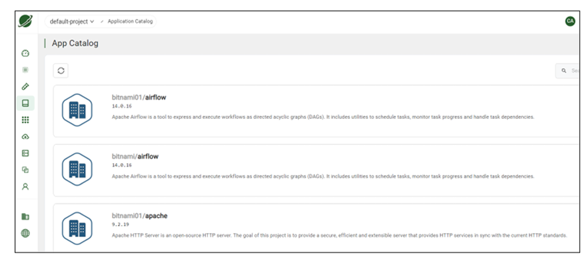
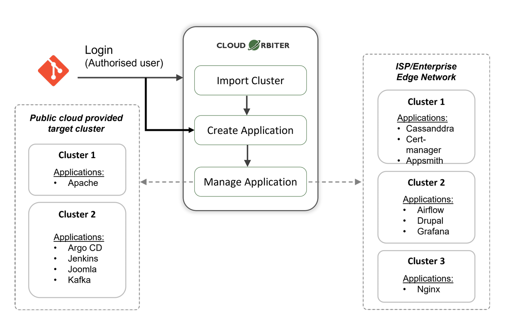
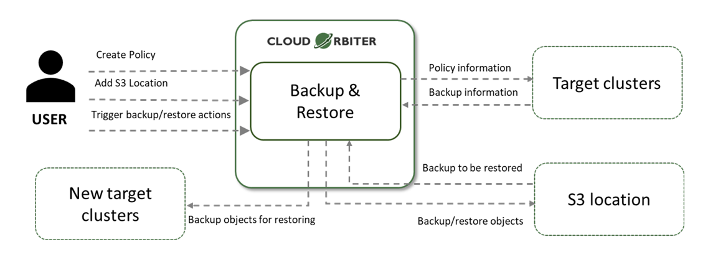
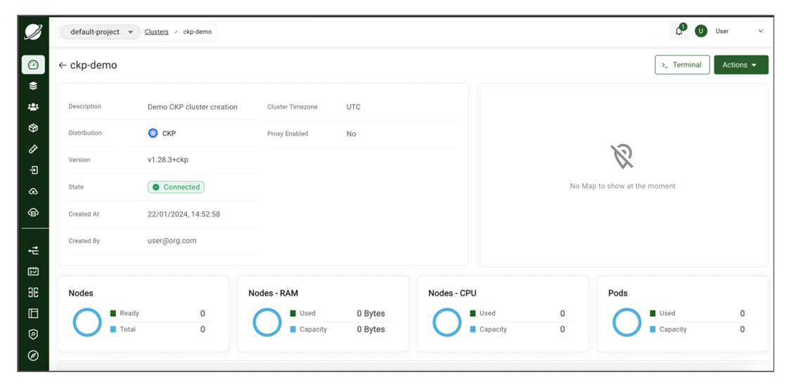

# Cloud Orbiter Documentation

## 1. Getting Started

### 1.1 Quick Start with Coredge Cloud Orbiter

Welcome to Coredge Cloud Orbiter! Getting started with our platform requires you to sign up and become an authorized user. Our universal application control plane provides access and management capabilities for applications, infrastructure, and edge devices.

Cloud Orbiter provides a comprehensive solution to help you manage workloads more effectively. You can manage your entire application stack in one place using our platform, which features a powerful automation capability, robust security features, and an intuitive user interface.

Cloud Orbiter helps you streamline your workflow and reduce complexity by managing applications, infrastructure, edge sites, and devices. It provides centralized management of your application deployment and infrastructure management needs.

Cloud Orbiter allows you to manage and monitor all your workloads and applications from one convenient location. As a company, Coredge strives to provide you with the best experience possible and is constantly improving its platform.

---

## 2. Overview

Welcome to Coredge Cloud Orbiter, a solution for efficiently managing your entire infrastructure. Our platform is a comprehensive and centralized universal application control plane allowing you to manage all your applications, infrastructure, and edge sites or devices from a single, intuitive dashboard.

Cloud Orbiter is a centralized, integrated platform that allows enterprises to manage the complete application lifecycle of any combination of existing or new, simple or complex, small or large Kubernetes environments, from creating and managing VMs, and clusters to deploy applications on any location anywhere on any cluster or VM, whether it's in the cloud, on-premise, or at the edge. Cloud Orbiter enables IT teams to manage multiple clusters at scale and efficiently with governance and enterprise-grade security by providing highly curated Kubernetes stacks and tools tailored to developers' specific needs. Cloud Orbiter gives IT teams complete control, visibility, and production-scale efficiency.

Cloud Orbiter offers a range of features to make your life easier, including automatic deployment of applications, vulnerability scanning, backup and restore, observability, logging and monitoring, and central IAM and RBAC. Our fully customizable and flexible platform allows you to integrate with any external identity provider and automate your workflows.

Cloud Orbiter follows a zero-trust principle and provides highly secure infrastructure management with centralized IAM and RBAC. Get complete control, visibility and efficiency over your entire infrastructure while ensuring enterprise-grade security.

Join the revolution of simplified infrastructure management and experience the power of Cloud Orbiter today!

### 2.1 Who will benefit from Coredge Cloud Orbiter?

Coredge Cloud Orbiter is an all-in-one platform that simplifies infrastructure management and streamlines application deployment. It is designed to meet the needs of a wide range of users, including:

**Developers**

Cloud Orbiter makes it easy for developers to focus on building applications rather than managing infrastructure. With Cloud Orbiter, developers can quickly deploy applications on any cluster, whether in the cloud, on-premise, or at the edge. The platform also provides automatic deployment of applications and integration with popular code repositories like GitHub, enabling developers to pull code, patch, and upgrade their applications quickly.

**DevOps Teams**

DevOps teams can leverage Cloud Orbiter's powerful automation capabilities to streamline workflows and reduce complexity. With features like vulnerability scanning, observability, and logging and monitoring, DevOps teams can ensure their applications run smoothly and securely. The platform also provides centralized multi-cluster management, making it easy for DevOps teams to manage multiple clusters at scale.

**Infrastructure Administrators**

Infrastructure administrators can use Cloud Orbiter to manage their entire infrastructure from a single, intuitive dashboard. The platform handles all the heavy lifting, from creating and managing VMs and clusters to deploying applications on any location. With Cloud Orbiter, infrastructure administrators can achieve production-scale efficiency and reduce the time and effort required to manage their infrastructure.

**IT Operations and SREs**

IT Operations and Site Reliability Engineers (SREs) can benefit from Cloud Orbiter's centralized IAM and RBAC capabilities. The platform provides a centralized identity and access management control, allowing IT Operations and SREs to manage user access and permissions across their entire infrastructure. Only authorized users can access and manage their applications and infrastructure.

**IT Executives**

Cloud Orbiter offers IT executives complete control, visibility, and efficiency over their infrastructure. The platform provides enterprise-grade security, automatic deployment of applications, and observability, making it easy for IT executives to ensure that their infrastructure runs smoothly and securely. With Cloud Orbiter, IT executives can achieve greater productivity, reduce costs, and improve the overall efficiency of their IT operations.

**Security Engineers**

With vulnerability scanning and centralized IAM and RBAC controls, security engineers can ensure that their organization's infrastructure is secure and compliant with industry standards.

**Network Engineers**

Network engineers can benefit from Cloud Orbiter to manage edge sites and devices, allowing them to deploy and manage applications across multiple locations easily.

### 2.2 Key Differentiator

**Universal Application Control Plane**

Cloud Orbiter is a comprehensive platform that manages your entire infrastructure from a single, centralized dashboard. Cloud Orbiter allows you to streamline your application deployment and infrastructure management, reduce complexity, and achieve production-scale efficiency.

**Integrated and Curated Platform**

Cloud Orbiter is an integrated and curated platform that is tailored to your specific needs. It means you get all the features you need to manage your infrastructure at scale with governance and enterprise-grade security.

**Automatic Deployment of Applications**

With Cloud Orbiter, you can automatically deploy applications on any location, anywhere on any cluster or VM, whether it's in the cloud, on-premise, or at the edge. It helps you streamline your application deployment process and reduce downtime.

**IAM and RBAC**

Cloud Orbiter offers centralized IAM and RBAC controls, which means you can easily manage access to your infrastructure and applications. It helps you ensure that only authorized personnel have access to your infrastructure.

**Observability**

Cloud Orbiter provides observability tools that help you monitor and troubleshoot your infrastructure and applications. It enables you to quickly identify and resolve issues, ensuring that your infrastructure and applications are always running.

### 2.3 Why Cloud Orbiter

**Complete Infrastructure Management**

Cloud Orbiter provides a centralized platform for managing your entire infrastructure, including Kubernetes, VMs, and storage, with ease.

**Universal Application Control Plane**

Cloud Orbiter offers a universal application control plane, allowing you to deploy applications anywhere, whether in the cloud, on-premise or at the edge.

**Zero Trust Security**

Focusing on Zero Trust Security, Cloud Orbiter ensures that all clusters and edge sites are secure by default, reducing the risk of security breaches.

**Automated Deployment**

Cloud Orbiter automates the deployment of applications, reducing complexity and streamlining workflows.

**Multi-Environment Management**

Cloud Orbiter provides multi-environment management for Kubernetes clusters, allowing you to manage your clusters across on-premise, private cloud, and edge environments.

**RBAC and Identity Access Management**

With centralized RBAC and identity access management control, Cloud Orbiter ensures only authorized users can access your infrastructure and applications.

**Observability and Monitoring**

Cloud Orbiter offers comprehensive observability and monitoring features, giving you complete visibility into your infrastructure and applications.

**Simplified Infrastructure Management**

Cloud Orbiter simplifies infrastructure management, reducing the burden on IT operations and SREs, and enabling them to focus on higher-value tasks.

**Flexible and Customizable**

Cloud Orbiter allows you to integrate with any external identity provider and automate your workflows.

**Enterprise-Grade Security**

Cloud Orbiter provides enterprise-grade security, ensuring that your infrastructure and applications are always secure and compliant.

---

## 3. User Session Management

Coredge offers you an option to configure user sessions with concurrent session limits and manage session exceedance. It is essential for maintaining control, security, and optimal resource utilization in a system or application, leading to a smoother user experience and enhanced system performance.

### 3.1 Configuring User Sessions

This action is exclusively accessible in the admin mode. To set up user sessions, navigate to the settings menu and then choose 'User Session Config.'

#### 3.1.1 Setting Concurrent Session Limits

Administrators have the ability to configure concurrent session limits for users within the domain. This feature allows you to control the number of simultaneous sessions each user can have.

#### 3.1.2 Managing Session Exceedance

Our system offers two options for managing user sessions when limits are exceeded:

**Terminate the Oldest Session**

When a user exceeds their session limit, our system will automatically terminate the session of the user who has the oldest "Last Access Time" among all active user sessions. This ensures that users with the least recent activity are affected first.

**Deny New Sessions**

Alternatively, administrators can choose to deny new sessions when a user reaches their session limit. This prevents users from starting new sessions until they free up existing sessions.

---

## 4. Tenant

Cloud Orbiter platform is designed to support multiple tenants, which are organizations that register with the platform to manage their infrastructure and deploy their applications. Tenants can register with Cloud Orbiter and start using the platform.

### 4.1 Tenant Registration

To register with Cloud Orbiter, tenants need to follow these steps:

1. Click on the **Request For Demo** button on the platform's homepage.
2. Fill in the required details in the registration form.
3. Our sales team will contact you and help you learn more about the platform's capabilities and how it can cater to your infrastructure needs.
4. After completing the registration form, our sales team will set up your account and provide you with login credentials.
5. Log in to your Cloud Orbiter account and begin managing your infrastructure and deploying your applications with ease.

---

## 5. Projects

Cloud Orbiter is a comprehensive platform that simplifies infrastructure management and streamlines application deployment. This page of the product documentation will provide an overview of how to manage projects in Cloud Orbiter and leverage its powerful features to isolate infrastructure and applications within projects.

### 5.1 What are Projects?

Projects in Cloud Orbiter are a fundamental concept that allow you to organize and manage your infrastructure and application resources. At its core, a project is a logical entity that represents a specific initiative or deployment. For example, you might create a project for a particular application or service, or for a specific team within your organization. Cloud Orbiter creates a default project for each domain to ensure a smooth onboarding experience.

Each project in Cloud Orbiter is an isolated environment that contains its own set of infrastructure and application resources. This allows you to manage and scale your resources independently of one another, without worrying about resource conflicts or dependencies.

Projects are also powerful tools for collaboration and delegation. By assigning specific users and groups to a project, you can delegate tasks and responsibilities to different teams or individuals, while maintaining overall control and visibility over your resources. This enables you to streamline your operations and improve efficiency, while still maintaining a high degree of control and security over your resources.

#### Steps to create a new project in Cloud Orbiter

1. Log in to your Cloud Orbiter account.
2. Click on the **Projects** tab on the dashboard.
3. Click on the **New Project** button.
4. Enter the required details, such as the project name and description.
5. Click on **Create** to create the new project.

Once you have created a project, you can start adding your infrastructure and applications to it. You can also invite team members to collaborate on the project and assign roles and permissions to ensure the right level of access.

#### 5.1.2 Assigning Users and Groups to Projects

In Cloud Orbiter, you can assign users and groups to projects to enable collaboration and ensure the right level of access. Here are the steps to assign users and groups to a project:

1. Navigate to the project to which you want to assign users and groups.
2. Click on the **Settings** tab.
3. Click on the **Users and Groups** tab.
4. Click on the **Add User** button.
5. Enter the user's email address or select a group from the dropdown menu.
6. Click on **Save** to add the user or group to the project.

---

## 6. User Management

Cloud Orbiter, to provide hyperscalar equivalent experience over globally distributed infrastructure, managing a variety of applications extending different solutions will require mapping identity, access, and privileges corresponding to various individuals and teams. Cloud Orbiter provides a comprehensive user management solution that allows you to manage local users and users from external Identity Providers (IDPs) such as Okta, Microsoft, Google, or any other OpenID Connect IDP. With the user management feature in Cloud Orbiter, you can create, read, update, and delete (CRUD) users, manage groups and roles, and assign users to these groups, roles, and projects.

Cloud Orbiter extends solutions and better user experience to different types of users:

- **Infrastructure Owners / Providers:** are tasked with creating and managing the infrastructure components' lifecycle.
- **Application Developers / Providers:** those would be responsible for the delivery of applications running over the infrastructure.
- **Solution Engineers:** teams tasked with deploying and interfacing various applications instances together.
- **DevOps:** the team is responsible for looking after the continuity of operations.
- **Admins:** responsible for overseeing the operations and tweaking some security, RBAC controls, and other global settings.

### 6.1 Key Concept

Before getting started with user management in Cloud Orbiter, it's essential to understand key concepts related to user management in Cloud Orbiter.

- **Local Users:** Local users are created and managed within Cloud Orbiter. These users have credentials (username and password) that are stored in Cloud Orbiter.
- **External Users:** External users are individuals authenticated by external IDPs and authorized to access Cloud Orbiter. Cloud Orbiter supports integration with IDPs like Okta, Microsoft, Google, and other OpenID Connect IDPs. Cloud Orbiter creates a corresponding local user account when an external IDP authenticates a user. Additionally, if account linking is enabled, existing users can be linked to their corresponding IDP user account.
- **Groups:** Groups are a collection of users that share a standard set of permissions in Cloud Orbiter. By assigning users to groups, you can manage resource access more efficiently.
- **Roles:** Roles are permissions that define what actions users can perform once you assign roles to users in Cloud Orbiter.

### 6.2 Create and Manage Users

Cloud Orbiter provides a default user for access associated with the tenant admin role, which cannot be deleted or deactivated. Configuration for this user can be provided during installation or for SaaS deployment, after which only a password change is allowed.

Cloud Orbiter provides two options to onboard users. You can bring users from identity providers, or you can also create users locally into the systems.

Generally, like organizations, they require a centralized identity management system to integrate their internal identity. So we promote integrating a central identity management with Cloud Orbiter. Cloud Orbiter provides three SSO integrations, using Google, Microsoft, and Okta identity integration. The other mechanism is that you can create a local user when you are in a development environment.

#### 6.2.1 Adding Local User

In Cloud Orbiter, you can create and manage local users or bring users from external IDPs. Only users associated with the admin role can manage local users. Admins of existing organization can invite new users.

Once a local user is created, you can view and manage their information from the User Management section within Cloud Orbiter. It includes updating their personal information, resetting their password, and modifying their group and role assignments. You can also delete local users if they are no longer needed. After logging in with the temporary password, the user must create a new password.

#### 6.2.2 Procedure to add a user to Cloud Orbiter

1. Sign in as a tenant-admin and go to the **Settings** section.
2. Click on **Users** menu.
3. Click on the **+Add User** button to add a user you want to give access to. This field consists of:
   - First Name
   - Last Name
   - Email/Username
   - Temporary Password
4. Assign project and role of user.
5. Click on **Create**.

Email or Username is a mandatory field if you want to create a local user.

#### 6.2.3 Bring Users from External IDPs

Cloud Orbiter can bring users from external identity providers (IDPs) such as Okta, Microsoft, Google, or any other OpenID Connect IDP. It lets you easily manage users across multiple platforms and streamline onboarding.

When a user is brought in from an external IDP, Cloud Orbiter creates a local representation of the user in its system. The user's email address, name, and groups or roles associations are stored in Cloud Orbiter's database. It allows you to manage the user's access and permissions within Cloud Orbiter's platform and to assign them to groups, roles, and projects.

You must first set up the IDP integration within Cloud Orbiter to bring users in from an external IDP. Once the integration is established, you can initiate the user import process. Cloud Orbiter will then retrieve the user information from the external IDP and create a corresponding user record in its database.

Once the user is imported, you can perform all CRUD (create, read, update, delete) operations on the user just as you would with a local user. It includes managing their groups, roles assignments, and access to projects. If the user's information changes in the external IDP, you can trigger a re-sync to update the user's information in Cloud Orbiter.

Once a user is created using IDPs, you can perform the following:

1. To sign up using IDP portals, visit Single Sign-On (SSO)
2. Log in to Cloud Orbiter.
3. Select IDP provider to sign in.
4. Select **Overview** from left ribbon menu.
5. Select **Users**.
6. Click on **+Add User** button. Fill all the mandatory details.
7. Click **Create**.

Managing Users: Once you have created users in Cloud Orbiter, you can manage them by performing CRUD operations, such as updating user details, resetting passwords, or deleting users.

### 6.3 Groups

Groups are the mechanism offered to group individuals together, representing teams. It allows role assignment to all its members by assigning the role directly to the group. Only users associated with the tenant-admin role are authorized to manage groups.

- **Creating Groups:** To create a new group in Cloud Orbiter, navigate to the User Management section of the dashboard and click on Groups. From here, click "New Group" and enter the name and description of the group. You can also add users to the group during the creation process.
- **Managing Groups:** Once a group is created, you can manage its members, permissions, and other attributes. To manage a group, select the group from the list of groups and click Manage Group. Here you can add or remove members from the group, assign permissions, and edit the group's details.
- **Assigning Users to Groups:** To assign a user to a group, navigate to the User Management section of the dashboard and click on Users. From here, select the user you want to assign to a group and click on Edit. Under the Groups section, you can assign the user to one or more groups.
- **Removing Users from Groups:** To remove a user from a group, navigate to the User Management section of the dashboard and click on Users. From here, select the user you want to remove from a group and click on Edit. Under the Groups section, you can remove the user from one or more groups.

---

## 7. Single Sign-On (SSO) Integration

Single Sign-On (SSO) provides you the ability to log in just once with one set of credentials to have access to multiple applications. Single Sign-On helps in lowers software costs, improves usability, and enhances security and compliance. The majority of enterprises today anticipate having all of their solutions or products integrated with their Single Sign-On solution in order to manage users and their authentication in a centralized manner as a result of the adoption of the Single Sign-On offering. For situations like the evaluation phase, where Single Sign-On integration is not yet authorized, there are several use cases that also necessitate the creation and management of local users.

### 7.1 Procedure to sign-in in Cloud Orbiter using Okta

1. Create Okta account, you can refer the Okta Help Center documentation.
2. Once logged-in, add application.
3. Create a new identity provider in Cloud Orbiter.
4. Go to **Setting > Overview > security > Identity Provider > click on + Add Identity Provider > fill the necessary details > click create**.

You need to add the following fields: Client ID, Client Secret, Authorization URL, Token URL.

### 7.2 Procedure to sign-in in Cloud Orbiter using Google

1. Create Google account. If you do not have a Google account, create one. You can also use your Google account if you have one. Once logged-in, add application.
2. Create a new identity provider in Cloud Orbiter.
3. Go to **Settings > Overview > Security > Identity Provider > click on + Add Identity Provider > fill the necessary details > click create**.
4. For adding Client Id and Secret, you can refer the attached Google Identity documentation.

### 7.3 Procedure to sign-in in Cloud Orbiter using Microsoft

1. Create Microsoft account. If you do not have a Microsoft account, create one. You can also use your Microsoft account if you have one. Once logged in, add application.
2. Create a new identity provider in Cloud Orbiter.
3. Go to **Setting > Overview > Security > Identity Provider > click on + Add Identity Provider > fill the necessary details > click create**.
4. For adding Client Id and Secret, you can refer the attached Microsoft link.

Once a user is created using IDPs, you can perform the following:

1. Log in to Cloud Orbiter.
2. Click on the **Users** tab in the left sidebar.
3. Click the **Add User** button.
4. Select the IDP (Okta, Microsoft, and Google) you want to bring users from.
5. Follow the prompts to authenticate with the IDP and select the users you want to bring over.
6. Click **Save** to import the users.

Managing Users: Once you have created users in Cloud Orbiter, you can manage them by performing CRUD operations, such as updating user details, resetting passwords, or deleting users.

---

## 8. Roles and RBAC (Role Based Access Control)

Roles are a fundamental aspect of user access control in Cloud Orbiter. Roles define a set of permissions that determine what actions a user can perform on specific resources within a project. With role management, you choose from pre-defined roles provided in Cloud Orbiter. It allows you to assign granular permissions to users and groups within your organization. By using roles, you can ensure that users only have access to the resources they need to perform their jobs and nothing more, reducing the risk of unauthorized access or security breaches. Cloud Orbiter provides a set of pre-configured roles allowing granular control over access permissions to resources. Currently, we offer three roles: Admin, Project Admin, and Default User.

**Tenant Admin**

The Tenant Admin is the highest privileged role within a tenant. With this role, a user can configure everything within the assigned tenant, including user management, group management, Identity provider configurations, roles, applications, and notifications.

**Project Admin**

The Project Admin role has permission for all operations on all resources within a project, including managing users, assigning other Project Admins, creating, updating, and deleting clusters, deploying applications, and managing instances.

**Default User**

The Default User is the role associated with any user-created via Cloud Orbiter. This role has permission to perform operations like creating new clusters, listing clusters (read-only information on project clusters), accessing application repositories and apps, viewing all clusters, viewing test suites, listing backup and recovery, and listing all hosts and groups. Note that additional roles cannot be created at this time, but we anticipate expanding this functionality to include more fine-grained RBAC capabilities in the future.

**Procedure to check a role assign to a user or group:**

1. Go to **Setting** in Cloud Orbiter.
2. Click on the **Roles** menu.
3. If a user further clicks at the name tab, it will list down the user details to which user groups they are assigned and what roles they possessed.
4. Once a user is created, he or she will be able to login to the portal using their credentials.

### 8.0.1 RBAC (Role Based Access Control)

RBAC in Cloud Orbiter is a mechanism that enables admin to create users and roles and give all access to Cloud Orbiter features. Anything an administrator does under User Management is possible because of their role as a admin. If a user is not a admin, they can only create onboarding requests (onboarding requests). The admin can approve or reject any form submitted by a user to perform any tasks / or access Cloud Orbiter features. At the same time, tenant or user role is only specified to fill out forms or make onboarding requests.

---

## 9. Clusters

### 9.1 Overview

Cloud Orbiter is a cloud-native platform that enables users to quickly and easily deploy and manage Kubernetes clusters. With Cloud Orbiter, users can create secure, scalable, and highly available Kubernetes clusters in minutes. It aims to provide an excellent user experience in managing hundreds of thousands of clusters and maintaining large-scale distributed applications. When working across various settings, such as different data centers, private clouds, and edge environments, enterprises confront issues that must be addressed. Cloud Orbiter provides the capabilities to address the challenges organizations face.

- Cloud Orbiter allows you to easily deploy, create, manage, monitor, and upgrade multiple clusters across geo-locations environments.
- With Cloud Orbiter, Kubernetes clusters can be provisioned easily at the edge. They can be updated and upgraded without any downtime.
- Cloud Orbiter integrates with various logging metric platforms for detailed cluster resource visibility and monitoring across edge environments.
- With Cloud Orbiter, a user can remotely manage target and orbiter clusters.
- Cloud Orbiter connects multiple clusters to itself so that through Cloud Orbiter, users can manage their target clusters.
- The connection establishes through NAT GW (NAT GW connects private networks to the Internet), through the Internet into the Cloud Orbiter control plane, where cluster management is hosted.
- Cloud Orbiter manages applications on the target cluster.
- NAT GW works as a translation layer between these networks.
- So, once deployed, the HTTP request goes back and forth, and the request will hit the target clusters a user has connected to Cloud Orbiter.

Cloud Orbiter manages all the Kubernetes resources like nodes, events, namespaces, workloads, pods, Replicasets, deployments, Daemonsets, Statefulsets, access control, roles, role binding, cluster roles, cluster roles bindings, service accounts, network policies, storage, storage classes, secrets, ConfigMaps, and more. You can access all the Kubernetes resources, and manage them, using Cloud Orbiter for your application and cluster management.

### 9.2 Day 2 Management

Cloud orbiters provide several options to manage Kubernetes clusters on an ongoing basis, ensuring smooth and efficient operations throughout the entire cluster lifecycle. With features such as auto-scaling, cluster upgrades, and application deployment, the platform lets you focus on your core business rather than the complex infrastructure supporting it. Day 2 operations, which encompass the ongoing management of your cluster once it is up and running, are a critical aspect of cluster lifecycle management.

Cluster management involves various tasks, including managing resources, ensuring high availability, maintaining security and compliance, scaling workloads, and monitoring cluster performance. Cloud orbiters simplify these tasks, allowing you to manage your clusters efficiently and effectively without requiring extensive manual intervention. Examples of day 2 management Cloud Orbiter performed:

**Cluster Upgrades**

Cloud Orbiters automate upgrading Kubernetes clusters to the latest version. It ensures that clusters are running on the latest stable version of Kubernetes with the latest security patches and bug fixes.

**Scaling**

With Cloud Orbiters, scaling Kubernetes clusters up or down is simple. Cloud Orbiters provides a centralized interface for scaling clusters, making adding or removing nodes as needed easy.

**Backup and Restore**

Cloud Orbiters also provide backup and restore functionality, allowing organizations to easily back up their Kubernetes clusters and restore them in case of a disaster.

**Monitoring**

Cloud Orbiters provide monitoring and alerting capabilities, giving organizations visibility into the health and performance of their Kubernetes clusters. Alerts can be set up to notify administrators of any issues, allowing them to take corrective action before they become significant problems.

**Security**

Cloud Orbiters provide a range of security features that help organizations ensure the security of their Kubernetes clusters. It includes role-based access control (RBAC), network policies, and container image scanning.

By providing a centralized platform for day 2 operations, Cloud Orbiters simplify the management and maintenance of Kubernetes clusters, allowing organizations to focus on building and deploying applications with confidence.

### 9.3 Cluster Monitoring

One of the critical aspects of managing a Kubernetes cluster is monitoring the health and performance of the nodes and workloads running on the cluster. Cloud Orbiters provides robust cluster monitoring capabilities that enable users to track critical metrics such as CPU, memory, and node health.

**Health Monitoring**

Cloud Orbiters' health monitoring tools allow users to check the health status of each node and quickly identify any issues that may arise. Users can view the status of each node and receive alerts if any nodes become unhealthy. It lets users quickly identify and resolve issues impacting the cluster's stability.

**CPU and Memory Monitoring**

Monitoring the CPU and memory usage of a Kubernetes cluster is crucial to ensure optimal performance. Cloud Orbiters provides real-time monitoring of CPU and memory usage for each node and for each workload running on the cluster. It enables users to identify and troubleshoot any issues arising from high CPU or memory usage.

**Node Monitoring**

Cloud Orbiters' node monitoring capabilities allow users to monitor each cluster node's health and performance. It includes monitoring the node's CPU, memory, disk usage, and network activity. Users can view the node metrics in real-time and set alerts to receive notifications if any issues arise.

### 9.4 Application deployment

Cloud Orbiter offers several options to deploy applications on Kubernetes clusters, making it easier and faster for developers to deliver their applications to end-users. One of the key features of Cloud Orbiter is its ability to automate the deployment process, which saves a lot of time and reduces the risk of human error. To deploy an application on a Kubernetes cluster using Cloud Orbiter, developers can integrate with helm and gitOps repository.

#### 10.4.1 App Instances

Applications running on target clusters are termed app instances. With Cloud Orbiter, you can have access to managed and unmanaged app instances. Applications that are actively managed by Cloud Orbiter onboarded applications are termed as managed instances, while those onboarded applications which are not managed by Cloud Orbiter are termed as unmanaged instances.

**Managed Instances**

Managed instances provides you details of an application, namespace, release name, created at, created by, and state. It lets you perform various operations on an application deployed on a cluster. You can view the log and download values.yaml file, unmanaged, and delete app instances from managed instance dashboard.

**Unmanaged Instances**

You can actively check the unmanaged app instances, their chart details, and application status with Cloud Orbiter. Cloud Orbiter allows you to interact with unmanaged app instances and enables you to move from unmanaged instances to manage instances to automate the application life cycle.

### 9.5 Location Tagging

Cloud Orbiter allows you to manage clusters. A significant focus for Cloud Orbiter is to connect edge clusters. Edge computing caters to various computing scenarios like latency-sensitive applications where the geolocation of a cluster is extremely important. Cloud Orbiter provides location tagging that allows you to specify and view the geolocation of your clusters, with the feature of auto-detecting the geolocation of a cluster based on its public IP.

On a clusters dashboard, you can view two options to fetch details of your cluster:

- **List view**
- **Map view**

A list view lists the clusters with information like status, version, distribution, applications, health, pods, and utilization. The map view shows a graphical representation of your cluster on a map. You can view the details of your clusters using the Info button. Once you click on the view details button, it will show you the details of your cluster.

From the map view dashboard, you can also enable Add-ons:

- Click on **go to Add-ons**.
- Select **Enable** from the three dots in the right corner.

### 9.6 Service Discovery

#### 10.6.1 Services

In Kubernetes, a Service is a method for exposing a network application that is running as one or more Pods in your cluster. Services in Kubernetes provide service discovery without requiring you to modify your existing application. Pods allow you to run code from either cloud-native or containerized apps. A Service makes the set of Pods available on the network so that clients can access them.

#### 10.6.2 Centralized Ingress

When a service is created, Kubernetes assigns it an IP address that can only be accessed from within the cluster. Regardless of how many pods are running or which specific nodes they are on, other containers inside the cluster can begin to contact the service over its IP address.

- Centralized Ingress allows access to multiple services without any extra configuration. Cloud Orbiter enables applications to be accessed across clusters without writing Ingress files or establishing service NodePorts or Load Balancers manually.
- The Centralized Ingress solution eliminates the need for service configuration or exposure mapping. You can access the services in the target cluster without using an external tenant or IP-based configuration.

### 9.7 Test Suites

Cloud Orbiter offers a pre-configured set of test suites containing pre-packaged test cases. These pre-bundled test suites enable you to proactively verify your clusters before application deployment and post-deployment to ensure optimal performance.

### 9.8 Access Logs

Access logs are a crucial aspect of monitoring your cluster activity, identifying security threats, and troubleshooting operational issues. Cloud Orbiter provides a robust solution for managing and analyzing your cluster access logs.

### 9.9 Backup & Restore Jobs

Cloud Orbiter's backup and restore provides a backup of your namespace and applications deployed on multiple clusters at remote locations.

### 9.10 Add-ons

Cloud Orbiter Add-ons is a collection of preconfigured components that enhance the functionality of a Kubernetes cluster.

---

## 10. Edge Clusters

Edge clusters are Kubernetes clusters deployed on edge hosts installed in isolated locations. These edge hosts can be virtual machines and are managed by operators at remote sites. Cloud Orbiter deploys workload clusters on edge hosts through its SaaS-based management console. In addition to provisioning clusters, Cloud Orbiter provides end-to-end cluster management through scaling, upgrades, and reconfiguration operations.

The following are some highlights of the comprehensive Cloud Orbiter edge solution:

- **Centralized multi-cluster management:** All Kubernetes clusters can be deployed, managed, and upgraded from a single console across all your edge nodes.
- **Comprehensive lifecycle management:** With Cloud Orbiter, Kubernetes clusters can be provisioned easily at the edge. They can be updated and upgraded without any downtime.
- **Integration and automation:** With our Command Line Interface utility or REST APIs, you can quickly build comprehensive automation.
- **Centralized logging and monitoring:** Cloud Orbiter integrates with various logging metric platforms for detailed cluster resource visibility and monitoring across edge environments.
- **Remote cluster management:** With Cloud Orbiter, you can manage target clusters and compass clusters remotely.

Before onboarding an Edge cluster, users must add a host to install the Cloud Orbiter cluster provisioning installer. A host is a physical or virtual machine that runs one or more Kubernetes nodes. Each node in the cluster runs a container runtime, such as Docker or container, and is responsible for running containers that are scheduled on it by the Kubernetes control plane. A host group is a logical grouping of hosts within the cluster. Host groups are useful for managing and organizing the nodes in the cluster, as they allow users to apply labels, taints, and other Kubernetes metadata to a set of nodes at once.

**Host**

A host is a physical or virtual machine that runs one or more Kubernetes nodes. Each node in the cluster runs a container runtime, such as Docker or container, and is responsible for running containers that are scheduled on it by the Kubernetes control plane.

**Host Groups**

A host group, on the other hand, refers to a logical grouping of hosts within the cluster. Host groups are useful for managing and organizing the nodes in the cluster, as they allow you to apply labels, taints, and other Kubernetes metadata to a set of nodes at once.

> **Note:** You can onboard a cluster only after you have approved host and created host groups out of approved host.

**Procedure to add a host:**

1. Select **Host** from left ribbon menu.
2. Click on **+Add Host/Onboard** button. You need to click the download button to enable cluster provisioning installation.
3. Once your host is approved, it will be on the approved list.
4. The approved tab shows the host, IP address, provisioned status, connection status, cluster association, group membership, and role.
5. Once the host is approved, you must create Host Groups. Host Groups are a collection of approved host.

**Procedure to create host groups:**

1. Select **Host Groups** from left ribbon menu.
2. Click on **+Create Host Group** button.
3. Provide host group name (name is mandatory) and description.
4. Click **Create**.

Once the host groups are created, you can onboard a cluster. There are two methods Cloud Orbiter provides to onboard a cluster: Import Cluster and Create Cluster.

---

## 11. Brown Field Clusters

Cloud Orbiter provides the ability to import existing Kubernetes clusters into the platform, enabling users to gain visibility, management, and additional capabilities, such as application lifecycle management. The platform supports the import and management of Kubernetes clusters in various public, private, and bare-metal environments.

With Cloud Orbiter, users can also import their existing clusters to the platform regardless of the cloud service provider using the Generic Cluster import feature. This feature enables the user to import the cluster and perform generic operations like scans and backups not specific to the cloud infrastructure.

Cloud Orbiter supports importing clusters from various environments including VMware, OpenShift, KubeAdm, and other Kubernetes distributions. This makes Cloud Orbiter a powerful platform that simplifies the management of existing Kubernetes clusters, enabling organizations to streamline their operations and improve efficiency.

You can use import cluster when you already have a cluster and want to connect with Cloud Orbiter.

**Procedure to import a cluster:**

1. Go to Cloud Orbiter dashboard. Select **Clusters** from the left ribbon menu.
2. Click on **+ Add Cluster** button.
3. You can view the import cluster and create cluster option.
4. Select **import cluster**.
5. Give a name to a cluster (the name is a mandatory field).
6. Select cluster type > description > location parameters > click **create**.
7. Download config file from the cluster you just created.
8. Connect to your cluster: `ssh core@192.168.0.114`
9. Apply the downloaded file to your cluster: `kubectl apply -f bootstrap-cluster.yaml`

### 11.1 Create Cluster

When you do not have a cluster and only have nodes with you and want to deploy your workload over a cluster, then you can use create cluster option via Cloud Orbiter.

**Procedure to create a cluster:**

1. Go to Cloud Orbiter dashboard. Select **Clusters** from the left ribbon menu.
2. Click on **+ Add Cluster** button.
3. You can view the import cluster and create cluster option.
4. Select **create cluster**.
5. Give a name to a cluster (the name is a mandatory field).
6. Select cluster type > cluster registry > Kubernetes distribution > Kubernetes version > networking > networking version > virtual IP > description > select master nodes > master host group > select worker nodes > worker host group > click **create**.

### 11.2 Manage Cluster

After importing a brownfield cluster into Cloud Orbiter, users can immediately access all the platform's features and capabilities. It includes health check monitoring, event logging, cost and usage analysis, and application lifecycle management.

Cloud Orbiter also allows users to attach Add-on Cluster Profiles to an imported cluster, pre-configured packages that install and manage various applications and integrations above the core infrastructure layers. These profiles can be added to an imported cluster anytime, allowing users to expand the cluster's capabilities and enable day 2 operations.

The imported clusters are managed through the Cloud Orbiter Management Console. Users can view and manage all their imported clusters from the console and perform various tasks such as upgrading or downgrading the cluster, adding or removing nodes, scaling the applications, and monitoring the health and performance of the cluster.

To delete an imported cluster, users can go to the Clusters page in the Cloud Orbiter Management Console and select the cluster they want to delete. Then, they can click on the "Delete" button and confirm the action. It will remove the cluster from Cloud Orbiter and revoke Cloud Orbiter's permissions on the cluster. It's important to note that deleting a cluster from Cloud Orbiter will not delete the actual cluster from the cloud service provider or infrastructure provider.

---

## 12. Manage Cluster Access

In Cloud Orbiter, cluster access is managed by creating and managing users and service accounts.

### 12.1 Service Accounts

Service accounts act as user accounts created explicitly to provide security context mappings for supporting Kubernetes Role-Based Access Control (RBAC) to Cloud Orbiter users. By mapping a user to a target cluster service account, the user can only perform actions on the target cluster that are allowed to that service account.

To map a user to a service account, you can follow the below steps:

1. Click the **Map User** button in the Cloud Orbiter Management Console.
2. Enter the Namespace and Service Account to map users to the desired service account.

With this feature, Cloud Orbiter makes it easy for organizations to manage their service accounts and provide secure access to the Kubernetes clusters.

### 12.2 Cluster Terminal

Cloud Orbiter also provides a cluster terminal that allows you to access the command line interface (CLI) of your Kubernetes clusters directly from the Cloud Orbiter Management Console. To access the cluster terminal, click the Terminal tab in the Clusters section of the Cloud Orbiter Management Console. You can then enter commands and interact with your clusters just as you would from the command line on your local machine.

**Procedure for cluster terminal:**

1. Go to a cluster dashboard.
2. Select the connected cluster.
3. Click on the **Terminal** button from the right corner of the dashboard.
4. Perform commands over the terminal to fetch the details of Kubernetes resources (e.g., pods, namespaces, config maps, secret, etc.).

### 12.3 Kubeconfig

KubeConfig is a file that contains all the necessary information to access a Kubernetes cluster, including authentication details, server information, and cluster configuration. You can use KubeConfig to access your cluster from a local command line interface (CLI) or from within another application.

To download the kubeconfig file for a cluster, follow these steps:

1. Log in to the Cloud Orbiter Management Console and select the project that contains the cluster you want to access.
2. Click **Clusters** in the left-hand navigation menu and select the cluster you want to access.
3. Click on **Download Kubeconfig** in the top navigation menu.
4. Save the kubeconfig file to your local machine.

#### 14.3.1 Get a shell to a running container

You can use the below commands mentioned in Terminal to get a shell to a running container. Get a shell to a running container reference to kubectl exec command, this is available as an option to the dashboard which Cloud Orbiter is supporting. You can perform all actions as you would on any Ubuntu prompt. If you type "ls," you'll see a list of files on the screen.

---

## 13. Observability

Cloud Orbiter offers comprehensive observability for your Kubernetes cluster. Observability is crucial for managing your cluster's health, reliability, and security. Observing your Kubernetes cluster is similar to having a team of experts working around the clock to ensure your cluster's optimal performance.

With observability, you can quickly identify and resolve issues, predict usage patterns and plan for growth, and protect your cluster from potential threats. Observability is achieved through a set of best practices, including monitoring and alerting, centralized logging, metrics collection, tracing, visualizations, and security auditing. These practices enable you to collect and analyze data about your cluster's resources, performance, and security.

### 13.1 What does Cloud Orbiter offer for achieving observability?

Cloud Orbiter uses Prometheus to achieve observability in your Kubernetes cluster. Prometheus is an open-source monitoring system well-suited for monitoring and alerting in Kubernetes environments. It is designed to collect time-series data from various sources, including Kubernetes metrics APIs, and provide powerful querying and alerting capabilities.

Without enabling the Prometheus add-on, some of the key monitoring features in Cloud Orbiter will be unavailable. Specifically, you will not be able to see time-based charts that show you real-time monitoring results. However, you will still be able to view some basic information about your cluster's resource usage, including CPU and RAM usage by namespace, as well as network input-output pressure.

This means that you may miss important information about the health and performance of your cluster and be less able to troubleshoot issues as they arise. To fully leverage the monitoring capabilities of your Kubernetes cluster, we strongly recommend enabling the Prometheus add-on.

Here are some metrics examples that you can track with observability for your Kubernetes cluster:

**Node ready vs total nodes**

This metric displays the number of nodes in your cluster that are currently ready and the total number of nodes in the cluster. By monitoring this metric, you can ensure that all nodes are operational and ready to serve requests.

**Node RAM usage vs capacity**

This metric shows the percentage of RAM used by the nodes in your cluster and how much RAM capacity is available. By monitoring this metric, you can ensure that your applications have enough resources and detect any potential issues related to memory usage.

**Node CPU usage vs capacity**

This metric displays the percentage of CPU used by the nodes in your cluster and how much CPU capacity is available. It helps you determine if you need to add more nodes to your cluster or adjust resource allocations for your applications.

**Pod usage vs capacity**

This metric shows the number of pods running in your Kubernetes cluster and how many pods your cluster can support. This can help you identify if you are reaching the maximum capacity of your cluster or if there are enough resources to scale up your application.

**CPU use by namespace**

This metric shows the amount of CPU used by each namespace in your cluster. By monitoring this metric, you can ensure that each namespace has enough resources and detect any potential issues related to CPU usage.

**RAM use by namespace**

This metric displays the amount of RAM used by each namespace in your cluster. This can help you identify which namespaces are consuming the most resources and optimize your resource allocation accordingly.

**Network I/O pressure**

This metric measures the network input-output (I/O) pressure on your cluster. By monitoring network I/O pressure, you can detect any potential network bottlenecks and optimize your cluster's network performance.

### 13.2 How can you enable the Prometheus add-on?

To enable the Prometheus add-on for your Kubernetes cluster in Cloud Orbiter, follow these simple steps:

1. Log in to your Cloud Orbiter portal.
2. Navigate to the specific cluster for which you want to enable the Prometheus add-on.
3. If the add-on is not already enabled, you will see a message stating *Prometheus add-on not installed. Please install the add-on to use this feature.* Below this message, you will find a **Go to Add-on** button. Click on this button.
4. You will be directed to the Add-ons page, where you can see the Prometheus add-on listed.
5. Click on the three dots located at the right side of the Prometheus add-on to expand the options menu.
6. Click on the **Enable** button to enable the add-on for your cluster.

Once enabled, you will be able to use the powerful monitoring and alerting capabilities of Prometheus to achieve comprehensive observability for your Kubernetes cluster.

> **Note:** If you encounter any issues or require further assistance, please contact the support team.

---

## 14. Access Logs

Access logs are a crucial aspect of monitoring your cluster activity, identifying security threats, and troubleshooting operational issues. Cloud Orbiter provides a robust solution for managing and analyzing your cluster access logs. There are several reasons why users may find cluster access logs to be important:

1. **Security:** Access logs can help identify security breaches or unauthorized access attempts. By reviewing access logs, users can detect anomalies in user behavior or identify suspicious activity that may indicate an attempted hack.
2. **Troubleshooting:** If a user experiences issues accessing a cluster, access logs can provide valuable information to troubleshoot the problem. By reviewing the logs, users can identify errors or misconfigurations that may be causing the issue.
3. **Compliance:** Access logs can be important for compliance purposes. Depending on the industry or organization, there may be regulations or policies that require logging of all access to a cluster. Users may need to review access logs to ensure compliance with these regulations or policies.

Access log includes details such as the username, date and time of access, project, the user's IP address, and the specific API endpoint that was accessed.

For example:

| Time | Username | Project | Operation | IP Address | API |
|---|---|---|---|---|---|
| 16/3/2023, 2:28:07 pm | xxxx@yyyy.com | default-user | GET | 174.91.166.94 | /api/v1/namespaces/default/pods?limit=500 |

This log entry provides specific information about a user's API access. The user, "xxxx@yyyy.com", accessed the API endpoint "/api/v1/namespaces/default/pods?limit=500" using the HTTP method "GET". The access was made from the IP address "174.91.166.94" at 2:28:07 pm on March 16, 2023, for selected project as "default-project".

### 14.1 Accessing Cluster Access Logs

With Cloud Orbiter, accessing your cluster access logs is straightforward.

1. Log in to the Cloud Orbiter platform using your credentials.
2. Navigate to the cluster section in the menu bar.
3. Select the "access logs" option.
4. This will display two tabs: "live logs" and "audit logs."

### 14.2 Audit Logs

The "audit logs" tab also provides a historical view of all the access logs, making it easy to investigate past events and troubleshoot issues. With the audit logs feature, you can:

- Analyze user activity, track changes made to your system, and identify potential security threats.
- Troubleshoot operational issues by reviewing past events.
- Gain insights into the long-term behavior of your system.

Each audit log entry includes details such as the username, date and time of access, the user's IP address, and the specific API endpoint that was accessed.

For example:

| Time | Username | Operation | IP Address | API |
|---|---|---|---|---|
| 16/3/2023, 2:28:07 pm | xxxx@yyyy.com | GET | 174.91.166.94 | /api/v1/namespaces/default/pods?limit=500 |

The audit logs can be easily searched and filtered using various criteria such as user, date and time, IP address, and API endpoint. This allows you to quickly find specific entries in the log and pinpoint any issues or anomalies.

### 14.3 Live Logs

The "live logs" tab provides a continuous stream of log events as they occur in your cluster, enabling you to monitor your system's performance and quickly identify any issues. For instance, you can track the number of requests, response times, and error rates, and take action to optimize your system accordingly. The live logs feature helps you:

- Monitor system performance in real-time.
- Identify issues and take prompt action to resolve them.
- Analyze system behavior, such as request volume and error rate.

---

## 15. Test Suites

With the rapid advancements in cloud computing and containerization technology, Cloud Orbiter recognizes the importance of ensuring that the cluster's behavior during the ups and downs of application scaling remains predictable to avoid application downtime, which can lead to lost revenue and damage your business's reputation.

To help verify the suitability of the cluster environment for application execution, Cloud Orbiter offers a pre-configured set of test suites containing pre-packaged test cases. These pre-bundled test suites enable you to proactively verify your clusters before application deployment and post-deployment to ensure optimal performance.

Furthermore, Cloud Orbiter provides the flexibility to bring your own test suites and run them on your clusters, giving you complete control over the validation process. With Cloud Orbiter, you can ensure that your Kubernetes clusters are secure, reliable, and consistently perform at their best. We are providing these test out of the box:

**Health Checks**

Executes a comprehensive set of health checks on the target Kubernetes cluster, including checks for cluster components, network connectivity, and resource utilization. These checks provide valuable insights into the overall health of the cluster, helping you identify potential issues before they affect application performance.

**Resiliency**

Executes a set of resiliency checks for the Kubernetes control plane of the target cluster. These checks help you evaluate the resilience of the cluster to various types of failures, including node failures, network disruptions, and service disruptions.

**CIS Security**

Executes a CIS security scan to check the cluster's security posture against industry-standard benchmarks. This scan helps you identify potential security vulnerabilities and provides recommendations for improving the overall security of the cluster.

**API**

Provides an API interface that lets you query and manipulate the state of the API objects, such as pods, namespaces, configmaps, and events. This interface enables you to automate cluster management tasks and integrate with other tools in your DevOps toolchain.

**Pod Robustness**

Executes a series of tests to ensure the ability of the pods to withstand unexpected disruptions and maintain their stability under varying conditions. These tests evaluate the resilience of the pods to different types of failures, including node failures, network disruptions, and service disruptions.

### 15.1 Bringing Your Own Test Suites

At Cloud Orbiter, we understand that every business has unique requirements and needs regarding application deployment. To cater to this, we offer you the option to bring your own test suites and customize them to meet your specific requirements.

**Using Host Network**

When defining a custom test suite for your Kubernetes cluster, you may choose to use the host network. When you use the host network, your test suite can access the same network interfaces as the host machine. This can be useful when testing network connectivity between pods or nodes on your cluster.

**DNS Policy**

DNS policy is a crucial aspect of Kubernetes networking that can significantly impact the cluster's performance and reliability. Considering and configuring DNS policies is essential based on the cluster's requirements and resources.

Different types of DNS policies exist in Kubernetes, each with its own set of rules and configurations. For instance, some commonly used DNS policies include:

1. **ClusterFirst:** This policy configures Kubernetes to look up the DNS records in the cluster first and fall back to external DNS servers if no records are found.
2. **ClusterFirstWithHostNet:** This policy is similar to ClusterFirst but designed for pods that use the host network.
3. **Default:** This policy uses the DNS resolver configured on the host system and does not provide any cluster-level DNS resolution.
4. **None:** Disables DNS for the pod.

If you choose to use the host network, it is recommended that you also configure your DNS policy to use the cluster first policy with the host network. This ensures that DNS queries are resolved using the cluster's DNS service first and then fall back to the host machine's DNS service if necessary. This can help ensure that your tests use the correct DNS resolution and avoid potential issues with inconsistent or incorrect DNS resolution.

**Robot Arguments**

In the context of the Robot Framework, robot arguments refer to the input parameters passed to test suites, test cases, or keywords when executed. These arguments are used to provide specific input data, configuration options, or other values required to run a test. By leveraging the functionality of robot arguments, you can further customize your test suites to meet your specific needs and requirements.

**Image Name**

It typically refers to the name of the container image used to create a Kubernetes pod. Users can specify the image name in various ways, including as a parameter in a Kubernetes deployment manifest, as a command-line argument when using a container runtime such as Docker, or as an environment variable.

**To bring your own test suites, follow these steps:**

1. Log in to the Cloud Orbiter platform using your credentials.
2. Navigate to the **Test Suites** tab in the menu bar.
3. Click on the **Add Test Suites** option to open a new navigation drawer.
4. In the form, name the test suites and provide a description.
5. Specify the DNS policy that your test suites require.
6. Specify the Robot Arguments that are necessary for your test suites.
7. Specify the image name.
8. Choose the distributions as all, or include or exclude a few from the list to meet your specific needs.
9. Click the **Create** button to complete the process of adding the test suites.
10. Your custom test suites will now be available for use in the Cloud Orbiter platform under the Test Suites tab.

**Accessing Test Suites on Cloud Orbiter:**

1. Log in to the Cloud Orbiter platform by entering your credentials.
2. Once you are logged in, navigate to the menu bar.
3. In the menu bar, look for the **Test Suites** tab and click on it. This will open the list of all available test suites.

**Executing Test Suites on a Specific Cluster in Cloud Orbiter:**

Access to execute the test suite is restricted only to the user who created the cluster, the project owner, and the tenant administrator. These restrictions ensure that the execution of test suites is performed by authorized users and promote the security and integrity of the test environment.

1. Log in to the Cloud Orbiter platform using your credentials.
2. In the menu bar, click on the **Cluster** tab to view the list of all imported or created clusters.
3. Choose the cluster for which you want to execute the relevant test suites.
4. Navigate to the **Test Suites** tab and click on the **Execute Test Suite** button.
5. This will list all the applicable test suites for the selected cluster.
6. Select the test suites that you want to execute for this specific cluster.
7. Click on the **Execute** button to start the test suite execution process.
8. The execution process will begin, and you can monitor its progress in real-time.

Upon completion of the test suites, users will receive a notification indicating the status and results of the tests. This provides users with feedback on the outcome of their test executions and enables them to take appropriate actions based on the results.

#### 17.1.1 Accessing Test Suites Execution Information

1. Log in to the Cloud Orbiter platform by entering your credentials.
2. Navigate to the **Test Suites** tab.
3. Click on the cluster name for which the test suite was executed.
4. You will see a summary of the test suite execution status.
5. To access detailed insights, click on the cluster name.
6. The detailed insights will provide you with more information on the test suite execution status.

Once the test suite execution is completed, you can access the execution information to get a comprehensive overview of the test results. The summary provides essential information about the test execution status, such as the number of passed and failed tests and any errors or warnings encountered during the execution. This summary helps you quickly identify any issues that may have occurred during the testing process.

#### 17.1.2 Filtering Test Suites Execution Summary

1. After accessing the execution summary, you can filter the summary based on the status.
2. Click on the **Status Filter** button.
3. Select the status that you want to filter (All/Pass/Fail/Warn/Info).
4. The summary will show the executions related to that status.

### 15.2 Downloading Logs and Reports

Furthermore, you can view detailed logs related to the test suite execution, allowing you to troubleshoot and diagnose any issues that may arise during the testing process. The logs provide a record of all test steps executed, along with any errors or exceptions encountered during the test execution.

Apart from the logs, you can download a detailed report that includes an interactive chart of test results and past test execution history. This report provides valuable insights into the overall performance and reliability of the test suite, allowing you to identify areas that require further attention or improvement.

1. After accessing the execution summary, you can download the reports and logs related to the test suite execution.
2. Click on the **Download PDF/Download Log** button.
3. The report or log will be downloaded to your device.

---

## 16. Application Repositories

Application repository allows you to manage multiple applications and their charts from a single location. With application repository, you can create, manage, add, and upgrade an application. Application repository also lets you view a chart showing the list of applications you have installed. Many Helm repositories are available with Cloud Orbiter, including bitnami, prometheus-community, camel-k, cert-manager, etc. When creating an application, you have to select the repository name.

Suppose you have added a new application repository to your charts and want it to reflect automatically in your chart or app catalog, then in that case, Cloud Orbiter provides an option called refresh. Within 24 hours, the newly created application repository will trigger automatically in the chart using the refresh button to update your application chart.

- **App catalog** lists applications and their repositories. You can also create an application and download the YAML file from the app catalog.
- **YAML file** lets you define the default values of an application like kubeVersion, image registry, replica count, volume size, and many more. With each application, you can specify the settings depending upon the applications. Cloud Orbiter provides TLS Verify and mTLS while creating an application repository.

**TLS Verify and mTLS for Cloud Orbiter's Application Repository**

Transport Layer Security (TLS) and Mutual Transport Layer Security (mTLS) protocols provide encrypted communications and endpoint authentication on the Internet. Cloud Orbiter uses these two protocols to create the network of trusted servers and to ensure that all communications over that network are encrypted.

### Procedure to add an application repository

- Go to the left ribbon menu in Cloud Orbiter. Click on **Settings** tab.
- Click **Application Repository** under Overview.
- Click on **+Add Repository** button.
- Fill in all the details in the form and click the **Create** button.

Once the application repository is created, it will be visible on the repository dashboard. It will show you your created repository name with the URL. You can delete or sync or refresh the repository.

- Go to **App Catalog** from the left ribbon menu.

App catalog lists created applications with repositories. Using the refresh button, you can view the recently added application repository. You can also create application and download YAML files from App catalog. The Helm repository provides a mechanism to manually update or sync the helm repository catalog based on the updates available in the helm repository. It can be triggered by the sync operation provided for a repository.

---

## 17. Application Lifecycle Management

### 17.1 Overview

The term "Application Lifecycle Management" refers to managing applications outside of software development, especially after an application has been created, and includes its usage, maintenance, and service. Governance, development, and operations are three closely related aspects of application lifecycle management. The use of application lifecycle management tools promotes communication and collaboration throughout the lifecycle of an application while providing visibility and transparency.

Cloud Orbiter is ideal for deploying, managing, and monitoring applications hosted in multiple clouds, clusters, and edge locations. With built-in security policies, Cloud Orbiter manages applications from a single console.

With Cloud Orbiter, you can manage repositories, applications, and application operations. Cloud Orbiter provides you access to both secured and open repositories. For example, a GitHub repository can have multiple helm applications and Cloud Orbiter provide solutions from application creation to application management. The integration with the Git repository helps developers commit the code ready to deploy in a production environment.

- Cloud Orbiter helps developers with deployment, time, and manual approach for configuration at the time of rollout and rollback.
- You can clone your application to any cluster and can make several instances out of the applications.
- Cloud Orbiter enhances scalability because of which a cloud operation team can install and update a large volume of applications across multiple clusters. Cloud Orbiter helps update, deploy, monitor, and scale applications across clusters in a distinct physical location.

Cloud Orbiter provides multiple applications like Apache, Argo CD, Joomla, Kafka, Cassandra, Cert-manager, Drupal, Grafana, and more. You can deploy multiple applications on CKP clusters, edge clusters, or ISP/enterprise edge networks.

### 17.2 Application Onboarding

Application onboarding allows you to create or add application to a cluster. You can create, manage, update, delete, and monitor your application. One major functionality Cloud Orbiter offers application onboarding to the target cluster, including application delivery on the remote Kubernetes clusters. The industry has evolved using a variety of different types of application packaging schemes. However, Cloud Orbiter focuses on supporting the following standard application packaging:

- Helm-Chart bundles
- Kubernetes Operator bundle

Helm helps you manage Kubernetes applications. Helm Charts help you define, install, and upgrade even the most complex Kubernetes application.

**Procedure to onboard application:**

1. Select **Applications** from Cloud Orbiter left ribbon menu.
2. Click on **+ Add Application** button.
3. Fill details to add an application: App name > Release name > Namespace > select chart parameters (Name, URL, Bundle) > select timeout unit > Repository name > Chart name > Version.
4. Once you select "Chart Name" it will automatically select its Version.

> **NOTE:** You can create application directly from packaged chart file chart.tgz or with URL of the chart file. Also, app name, release name, namespace, repository name, and chart name is mandatory fields.

### 17.3 Helm Repository

The helm repository provides privacy, high availability, massively scalable storage, and access control. It also offers advanced and enterprise-ready repository management for all Helm charts features of Helm repositories.

Cloud Orbiter provides a bundle of Helm repositories, example bitnami. You can select repository name from the drop down while creating application.

Under Application Repositories section from Cloud Orbiter, you can view the details of application repositories and Helm charts.

Application providers using Helm Chart bundles for packaging usually follow one of the following methods for helm chart distribution:

- Providing charts from a Helm Repository (or Artifactory) to allow version control of the helm charts.
- Directly providing the Helm Chart bundle for individual applications to deploy.

The Helm repository provides a mechanism to manually update/sync the helm repository catalog based on the updates available in the helm repository. This can be triggered by the sync operation provided for a repository.

### 17.4 Helm Application

Helm is a tool to help you define, install, and upgrade applications running on Kubernetes. At its most basic, Helm is a templating engine that creates Kubernetes manifests. What makes Helm more than that is it can upgrade and scale applications.

Cloud Orbiter support three modes in which a helm application context can be created:

- Name
- URL
- Bundle

While creating an application from the helm repository, Cloud Orbiter provides "Add Application" option on the helm chart catalog of the helm repository, choosing which auto-populate the helm repository and chart details in the application create form.

Rest of the details can be filled in as per requirement:

- **Application name** — unique name for reference.
- **Release name** — helm release name to be used on the target cluster.
- **Namespace** — namespace on the target cluster on which the application is expected to be installed.
- **Profile parameters** — to override default values of the helm chart.
- **Timeout** — timeout is for helm operations. For example, if you specify a 60-second timeout for an application installation, and the installation does not happen by a specified time, it will be marked as a failed installation. If any helm operation takes more than the allotted time, it will be marked as failed.
- **Repository name** — the name of a repository from the list, for example, bitnami, grafana, etc.
- **Chart name** — the name of the chart from the list depending upon your selected repository name, for example, grafana, loki, etc.
- **Version** — version of the chart name. Version, it takes automatically based on what chart name you have selected.

### 17.5 Application Instance

Once the application is created, you can view application details on its card.

1. To view the details, click on the created application.
2. You can view the name of application, created by, creation time, repo name, namespace, release name, chart name, and timeout details.
3. It will also provide you the revision details like, app version, version, creation time, and created by.
4. Under overview, you can see number of pods, containers, Daemonset pods, Daemonset containers, CPU request, CPU limits, memory request, memory limits, Init CPU request, Init CPU limits, Init memory request, Init memory limits.
5. Cloud Orbiter also provide you with storage, images, and reports details of your application.

These application details provide the information to accept or reject an application before instantiating it on any target cluster(s).

Cloud Orbiter allows creating application context separately without associating any cluster to it, to allow reviewing the application report before application onboarding and enabling a user to choose the relevant cluster based on the resource requirements.

Cloud Orbiter additionally allows mapping more than one instance to the application to extend a seamless life cycle eventually.

**Procedure to add application instance:**

1. To add application instance, click on the created application where it shows the details dashboard of an application. From left corner ribbon, select **instances**.
2. Click on **+ Add Instance** button.
3. It will take you to a form to fill in details of the new instance. Specify the cluster on which instance is supposed to be created. Additionally, it allows you to override target namespace and release name for a particular instance if you tick the check-box of "keep namespace and release name same". If you uncheck it, then you must provide target namespace and release name.
4. Click **Create**.

You can select multiple clusters to add instance. Submitting the form will create the application instance in the created state. In the background, Cloud Orbiter will attempt to install an application on the target cluster, changing the instance state accordingly.

- **Installed** — on the successful installation.
- **Installation Pending** — if the cluster is not currently connected with the controller.
- **Install Failed** — if it encounters any error while installing an application.
- Once installation is complete, it can also be validated on the cluster terminal window of Cloud Orbiter.
- Similarly, more instances can be added to the same application instance. Once the application instance is no longer required it can be deleted using the delete icon.
- Upon deletion cluster, the instance will be removed from the target cluster.

---

## 18. Add-ons

Cloud Orbiter Add-Ons is a collection of preconfigured components that enhance the functionality of a Kubernetes cluster. These add-ons cater to essential features like monitoring, logging, networking, and more. The purpose of Cloud Orbiter Add-Ons is to offer a simple and seamless way to extend the functionality of Kubernetes.

### 20.1 Benefits of using Add-Ons with Cloud Orbiter

Using Add-Ons with Cloud Orbiter offers various benefits. Firstly, it enables easy and straightforward installation and configuration of various Kubernetes components. Secondly, it saves time and effort as users do not have to manually install and configure each component. Lastly, Add-Ons are preconfigured and tested, ensuring their seamless integration, and reducing the chances of any compatibility issues.

### 20.2 Available Add-Ons

Cloud Orbiter Add-Ons offers users an easy and quick way to extend the functionality of their Kubernetes cluster. With three Add-Ons currently available, users can enhance their cluster's monitoring, storage, and backup and recovery capabilities. Using Add-Ons with Cloud Orbiter saves time and effort, ensures seamless integration, and provides a tested and proven solution. Additionally, not all add-ons may be supported for all clusters, and it may depend on the distribution type of the cluster.

1. **Prometheus:** A monitoring and alerting tool for Kubernetes clusters. Prometheus is a popular open-source monitoring and alerting tool for Kubernetes clusters. It offers real-time monitoring and alerting based on configurable rules and thresholds. Prometheus has a multi-dimensional data model, a flexible query language, and offers various visualization options, making it a robust monitoring solution. Using Prometheus with Cloud Orbiter offers users an easy and quick way to set up and manage a monitoring and alerting solution for their Kubernetes cluster.

2. **Local Path Provisioner:** A dynamic storage provisioner for Kubernetes. The Local Path Provisioner is a dynamic storage provisioner for Kubernetes that allows users to create and manage persistent volumes using the local disk of Kubernetes nodes. This add-on is useful for scenarios where users require local storage for their Kubernetes workloads. Using Local Path Provisioner with Cloud Orbiter offers users an easy and quick way to set up and manage a dynamic storage provisioner for their Kubernetes cluster.

3. **Velero:** A backup and disaster recovery tool for Kubernetes workloads. Velero is a popular open-source backup and disaster recovery tool for Kubernetes workloads. It enables users to backup and restore Kubernetes resources, including volumes, configurations, and secrets. Velero also supports migration and disaster recovery scenarios, making it a robust backup and recovery solution. Using Velero with Cloud Orbiter offers users an easy and quick way to set up and manage a backup and disaster recovery solution for their Kubernetes cluster.

### 20.3 Add-Ons Status for Cloud Orbiter

By understanding the different statuses of Add-Ons on Cloud Orbiter, you can easily manage and monitor the Add-Ons that are installed on your Kubernetes cluster. Below we have outlined the different statuses that Add-Ons can have on the platform:

1. **Available:** Add-Ons that are supported by Cloud Orbiter and can be installed on your Kubernetes cluster will be shown as "available." You can easily install these Add-Ons by selecting them from the list and clicking the enable button. Add-Ons that were previously installed on your Kubernetes cluster but have been uninstalled will also be shown as "available." You can reinstall these Add-Ons by selecting them from the list and clicking the enable button.

2. **Not Supported:** Add-Ons that are not supported by Cloud Orbiter will be shown as "not supported." These Add-Ons cannot be installed on your Kubernetes cluster.

3. **Installed:** Add-Ons that have been successfully installed on your Kubernetes cluster will be shown as "installed." You can view the status of each installed Add-On by selecting it from the list.

### 20.4 Installing Add-Ons for Cloud Orbiter

With a simple step-by-step guide for installing Add-Ons, users can quickly expand their cluster's capabilities. Cloud Orbiter Add-Ons are preconfigured and tested, ensuring seamless integration and reducing the chances of any compatibility issues.

To install Add-Ons for Cloud Orbiter, follow the steps below:

1. Log in to the Cloud Orbiter platform using your credentials.
2. Navigate to the Cluster tab and select the desired cluster you want to add an add-on to.
3. Click on the **"Add-Ons"** button.
4. Select the desired add-on you want to install from the list provided.
5. Click the **"enable"** button represented by the three dots on the right side of the add-on. The status will briefly show "created" before changing to "installed". The add-on is now installed on your Kubernetes cluster.

### 20.5 Uninstalling Add-Ons for Cloud Orbiter

When it comes to managing your Kubernetes clusters on Cloud Orbiter, there may come a time when you need to uninstall an Add-On. Whether it's because you no longer need it, or you want to replace it with a different Add-On, uninstalling an Add-On is a straightforward process that can be accomplished in just a few simple steps. To uninstall Add-Ons for Cloud Orbiter, follow the steps below:

1. Log in to the Cloud Orbiter platform using your credentials.
2. Navigate to the Cluster tab and select the desired cluster you want to remove the Add-On from.
3. Click on the **"Add-Ons"** button.
4. Locate the Add-On you wish to remove and click the three dots on the right side of the Add-On.
5. Select **"Uninstall"** from the dropdown menu. The add-on will now be uninstalled on your Kubernetes cluster.

Once uninstalled, the add-on status will change to available.

### 20.6 Troubleshooting Add-Ons for Cloud Orbiter

While using Add-Ons with Cloud Orbiter, you may encounter common issues that can prevent the Add-On from functioning correctly. Below we have outlined a troubleshooting step you can take to resolve these issues:

**Check the Log**

If you encounter an issue while installing or uninstalling an Add-On, use the "view log" option attached to each Add-On. This will provide you with detailed information about the issue, enabling you to identify the root cause and resolve it.

---

## 19. Backup and Restore

Modern applications are composed of several microservices inside containers instead of monolithic applications. By default, there are no backup/recovery policies in Kubernetes. With Cloud Orbiter's backup and recovery, we have integrated Velero as an add-on. Velero is an open-source tool that takes backups, restores, performs disaster recovery, and migrates Kubernetes cluster resources and persistent volumes.

The Backup and Restore feature by Cloud Orbiter help you to:

- Take a backup of namespaces and restore data as required.
- Migrate cluster resources to other clusters.
- Replicate production clusters with development and testing clusters.

Cloud Orbiter offers velero as an add-on to enable users to create backups and restores. Backup location will be S3 based and every cluster must have an S3 endpoint to enable the backup feature. Users must follow the steps listed below to configure an S3 endpoint for backup purposes.

### 21.1 S3 Storage Endpoint Onboarding Process

Before creating backups, users need to configure the S3 storage endpoint. Users need to set up an S3 Storage endpoint to take the backup. This is a step that needs to be done only once per cluster.

To onboard the S3 storage endpoint, complete the following steps:

1. From the left menu bar, click **Backup and Restore**.
2. You will see Backup Jobs and Storage Endpoints. Click on **Storage Endpoints**.
3. Click on **+Add Storage Endpoint** button.
4. Provide all the mandatory fields:
   - Storage endpoint name
   - Region
   - Bucket name
   - Access key ID
   - Secret access key
5. Click **Create**. The new storage endpoint will now appear in the storage endpoint list.

**Additional Options:**

Once the S3 storage endpoint is created, users can perform the following operations on storage endpoints:

- **Update:** Users can update the S3 storage endpoint to change its configuration.
- **Delete:** Users can delete the S3 storage endpoint if it is no longer needed.

### 21.2 Backup Resource Customization

The Backup Resource Customization feature is an advanced capability in Cloud Orbiter that allows users to customize their backup process to meet their specific needs. This feature is especially useful for users who have complex infrastructure and applications that require a more tailored backup approach.

Some examples of when users might want to use Backup Resource Customization include:

- **Persistent Volumes:** You should include or exclude specific persistent volumes if you have a large amount of data to back up and only need to back up certain volumes. For example, you could include only volumes with the label "data" or exclude volumes that are larger than a certain size.
- **Snapshot Volumes and Restores:** You should include or exclude snapshot volumes and restores if you have a large amount of data to back up and only need to back up certain volumes. For example, you could exclude snapshot volumes if you have a separate process for backing them up.
- **Cluster-wide Resources:** You should include or exclude cluster-wide resources, such as nodes if you have a large cluster and only want to back up specific resources. For example, you could include only persistent volumes with a specific label or exclude nodes not running any applications.
- **Label Selectors:** You should include or exclude resources based on their labels if you have many resources and need a way to group them easily. For example, you could include all resources labeled "tier=backend" or exclude resources with the labels "backup=false."
- **App Hooks:** You should add app hooks to your backup process if you need to run custom scripts or processes during backup or restore. For example, you could use an app hook to run a script that stops a database service before the backup process starts and starts it again after the backup is complete.

---

## 20. GitOps Integration

Cloud Orbiter provides a GitOps automation solution for managing your cloud resources with Continuous Delivery. This approach allows you to automate the deployment process and quickly roll out updates to your applications and services.

### 22.1 What is GitOps?

The GitOps integration is a powerful feature of Cloud Orbiter that simplifies the deployment process, reduces the risk of errors, and improves overall productivity. Using Git as the single source of truth, users can ensure that the application is always up-to-date and in sync with the codebase, which is critical for maintaining high-quality software. With customizable options for deployment environments and deployment rules, users can configure the GitOps integration to meet their specific needs and ensure a seamless deployment process.

### 22.2 How does Cloud Orbiter support GitOps for Continuous Delivery?

Cloud Orbiter integrates with Git to provide a GitOps automation solution for managing your cloud resources with Continuous Delivery. Here are some of the key features and benefits:

- **Continuous deployment:** Cloud Orbiter supports Continuous Delivery, allowing you to automate the deployment process and quickly roll out updates to your applications, infrastructure, and services.
- **Version control:** Cloud Orbiter uses Git as the source of truth for your infrastructure and application deployment, enabling version control for your deployments. You can easily track changes, rollbacks, and updates to your deployments with GitOps automation.
- **Application updates:** With GitOps automation in Cloud Orbiter, you can easily deploy updates to your applications, infrastructure, and services. This enables you to improve application reliability and scalability while reducing downtime and risk.

### 22.3 Getting started with GitOps automation in Cloud Orbiter

To get started with GitOps automation for Continuous Delivery in Cloud Orbiter, follow these steps:

1. Set up a Git repository for your application code.
2. Onboard your Git repository to Cloud Orbiter.
3. Use GitOps automation to manage your workload deployment, using version control to track changes, rollbacks, and updates.
4. Enable Continuous Delivery with Cloud Orbiter to automate the deployment process and quickly roll out updates to your applications, infrastructure, and services.

---

## 21. Notification

To provide our users with the best experience, Cloud Orbiter has integrated a real time dashboard notification feature. Keeping our users informed about their projects, infrastructure (clusters, VMs, application deployments), and other important updates is crucial. Our dashboard notification feature sends real-time notifications through the application's dashboard or user interface, ensuring that users are always aware of critical events or alerts. For instance, when a cluster is created, the cluster owner and project admin will automatically receive a notification. This enables users to remain up-to-date with their activities and take prompt action when necessary, without continuously monitoring the app.

---

## 22. What Trigger Notification?

Cloud Orbiter's real time dashboard notification is triggered by various events, ensuring our users are always up-to-date with their project's progress. Some examples of the different triggers that result in a notification being sent to the dashboard include the following:

1. **Changes in Cluster Status:** You'll receive a notification whenever there is a change in the status of your clusters, whether it's creation, update, or deletion. Additionally, Cloud Orbiter provides the capability of generating notification messages based on the following events related to clusters:
   - **ClusterReadyEvent:** You'll be notified when a cluster is ready for use.
   - **ClusterVersionChangedEvent:** Notifications will be sent when there is a change in the version of a cluster.
   - **ClusterNodeScaledEvent:** You'll receive notifications when cluster nodes are scaled up or down.

2. **Changes in Application Status:** Notifications are sent when there's a change in the status of an application deployment, such as successful deployment or deployment failure.

3. **Role Management Events:** Notifications are sent when a user's role is updated or changed.

| Resource Type | The Cloud Orbiter will send a notification when: | Project Admin | Default User |
|---|---|---|---|
| Cluster | A cluster is created/imported/deleted | Yes | Yes |
| Cluster | A cluster gets connected/disconnected | Yes | Yes |
| Cluster | A cluster is scaled-up/scaled-down | Yes | Yes |
| Test Suites | A user starts a test suite execution | Yes | Yes |
| Test Suites | A test suite gets executed | Yes | — |
| Test Suites | A user add/remove a test suite | Yes | — |
| Roles | The project admin or user admin assigns a user role | Yes | — |
| User Membership | The user gets a membership granted or revoked | Yes | Yes |

### 24.1 Managing Your Notifications

Cloud Orbiter's user-friendly notification management system allows you to effortlessly manage and track notifications related to your projects. When a notification is generated, it appears as a discreet pop-up window in the bottom-right corner of your screen, providing a brief message and a call-to-action button. This enables you to take immediate action if necessary, enhancing your productivity and overall product experience.

Here are the key features for managing your notifications:

- **Ability to Navigate to the Respective Orbiter Resource:** Simply clicking on a notification will take you directly to the relevant Orbiter resource. This feature streamlines your access to the associated item, making it easier to respond promptly.
- **Ability to Mark Notifications as Read/Unread:** You can mark notifications as read or unread, allowing you to keep track of which notifications you've already seen and which require your attention.
- **Ability to Delete Notifications:** If you no longer need a notification, you can delete it. This helps you keep your notification list clean and organized.
- **Automatic Deletion:** Notifications will be automatically deleted after an expiry time, which is set at 15 days. Please note that this expiration period is currently non-configurable.
- **View and Manage Notifications Without Navigating to the Listing Page:** You can view and manage your notifications without leaving your current screen.
- **Last 10 Notifications Display:** You can access the last 10 notifications by clicking the notification bell icon. This feature allows you to quickly catch up on recent notifications without navigating to a separate notification listing page.
- **Filter Unread Notifications:** You have the option to filter notifications to show only the unread ones, making it easy to focus on the notifications that still require your attention.

---

## 23. Settings

Settings are the configurable options and preferences that allow you to customize your experience within the Cloud Orbiter portal. Settings can help you to improve usability, security, and privacy, and provide with more control over how you interact with the portal. It includes the following:

### 25.1 Password Policy

By configuring your password policy, you can ensure that all users of your Cloud Orbiter portal adhere to the same standards for password strength and security. This helps prevent security breaches and ensure that your portal and data remain secure at all times. To ensure the security of user data, Cloud Orbiter provides a default password policy that all users must follow. Passwords must meet the following requirements:

1. **Character length (Minimum):** Passwords must be at least 8 characters long. This rule helps ensure that passwords are sufficiently complex and difficult to guess.
2. **Character length (Maximum):** Passwords must not exceed 32 characters in length. This rule helps ensure that passwords are not too long, making them harder to remember or type accurately.
3. **Special Characters (Minimum):** Passwords must contain at least one special character, such as !, @, #, $, %, ^, &, *, and ?. Including special characters can help make passwords more complex and harder to guess.
4. **Upper Case (Minimum):** Passwords must contain at least one uppercase letter. Using a mix of uppercase and lowercase letters can help make passwords more complex and harder to guess.
5. **Lowercase (Minimum):** Passwords must contain at least one lowercase letter. Using a mix of uppercase and lowercase letters can help make passwords more complex and harder to guess.
6. **Digits (Minimum):** Passwords must contain at least one numerical digit, which can help make passwords more complex and harder to guess.
7. **Recently Used:** Passwords must not be the same as the user's previous three passwords. This rule helps ensure that users do not reuse passwords that may have been compromised in the past.
8. **Password must not be the same as User IDs:** Passwords must not contain the user's email address or other personal information. Using personal information in passwords can make them easier to guess or obtain through social engineering attacks.

These requirements are designed to ensure that passwords are strong enough to resist hacking attempts and unauthorized access. A strong password reduces the risk of data breaches and helps keep your account and data secure. However, Cloud Orbiter also allows you to customize the password policy to meet your specific security needs. As a tenant administrator, you can modify the policy settings such as the minimum and maximum length, minimum number of special characters, digits, and uppercase and lowercase letters required.

### 25.2 Session Management: Log out From All Devices

Cloud Orbiter provides a convenient way to manage your account's security by offering a "Sign Out of All Devices" feature. With this feature, you can log out of all active sessions on any device with just a single click. This is particularly useful when you suspect that someone else may have gained unauthorized access to your account or if you simply want to ensure that your account remains secure.

1. Go to your account settings.
2. Select the **"Sign Out of All Devices"** checkbox.

This will log you out of all active sessions on any device including mobile phones, tablets, and computers. By doing so, you can be confident that your account is secure and your data is protected.

Cloud Orbiter's session management capabilities make it easy for you to keep track of active sessions and ensure that your account remains secure. Whether you want to log out of all devices or simply monitor active sessions, Cloud Orbiter makes it easy to manage your account's security with just a few clicks.

---

## 24. Cloud Orbiter Access Logs

The Cloud Orbiter Access Logs feature allows tenant administrators to view access logs related to their tenancy within the Cloud Orbiter console. This feature provides valuable insights into the activity and usage of the tenancy, and helps identify potential security risks or performance issues. By regularly reviewing and analyzing these logs, you can quickly identify and resolve issues, ensuring that your portal remains secure and functional for all users.

Each log entry includes details such as the user's identity, date and time of access, IP address, and the specific API endpoint that was accessed. This information allows you to easily search and filter the logs to find specific entries and pinpoint any issues or anomalies. For example, the following log entry provides specific information about a user's API access:

| Time | Username | Operation | IP Address | API |
|---|---|---|---|---|
| 16/3/2023, 2:28:07 pm | xxxx@yyyy.com | GET | 174.91.166.94 | /v1/domain/default-domain/features |

The user, "xxxx@yyyy.com", accessed the API endpoint "/v1/domain/default-domain/features" using the HTTP method "GET". The access was made from the IP address "174.91.166.94" at 2:28:07 pm on March 16, 2023.

### 26.1 Accessing Cloud Orbiter Access Logs

To access the Cloud Orbiter Access Logs, follow these steps:

1. Log in to the Cloud Orbiter platform using tenant administrator credentials.
2. Navigate to **Settings** in the side menu bar.
3. Select the **"Access Logs"** option from the side menu bar.

By following these steps, you can access the Domain Logs and review the activity of your users. We recommend that you regularly review these logs to detect and resolve any potential issues or threats.

---

## 25. Creating a Virtual Machine with Cloud Orbiter

### 27.1 Introduction

Cloud Orbiter provides a seamless enterprise cloud experience for edge data centers, centralizing operations and automation for distributed Kubernetes clusters. With the integration of KubeVirt as an addon, users can efficiently manage VMs, containers, and workloads across various infrastructures.

### 27.2 Prerequisites

- A connected Kubeadm kubernetes cluster with a distribution type of amd64/Linux, and an available storage class.
- KubeVirt addon enabled on the cluster.

### 27.3 Step-by-Step Guide

#### Step 1: Basic Settings

Navigate to the "Virtual Machines" tab on the left side menu and click on **"+ Create Virtual Machine"**.

- **VM Name:** Enter a unique name for the VM.
- **Namespace:** Select the appropriate namespace. Default namespace is set as 'default'.
- **Run Strategy:** Choose 'Always' to keep the VM running continuously.

#### Step 2: Storage Section

Define the storage parameters for the VM:

- **Access Mode:** Choose 'ReadWriteOnce' for single-node usage.
- **Size:** Specify the required disk space in GiB.
- **Storage Class:** Ensure a storage class is selected.
- **Image Import Options:** Choose to import an image via HTTP URL or other listed methods. For HTTP URL, use a link to a supported image, such as the provided Ubuntu server image.

#### Step 3: Preset Selection

Customize the compute resources:

- **VCPU:** Assign the number of virtual CPUs.
- **RAM:** Allocate the necessary RAM in GiB.

#### Step 4: Configure Instance Details

Utilize the cloud-init script section to customize the VM's configuration.

#### Step 5: Review & Finalize

Check all entered details for the accuracy, including the VM name, storage, and compute resources. Confirm the namespace and cluster details, and ensure the cloud-init script is as intended.

### 27.4 VM Management

Once created, manage your VM directly from Cloud Orbiter:

- **Start/Stop:** Power on or off the VM.
- **Pause/Unpause:** Temporarily halt or resume the VM operations.
- **Delete/Restart:** Remove or reboot the VM.
- **Console Access:** Interact with the VM via CLI or VNC for graphical interfaces.

### 27.5 Conclusion

With Cloud Orbiter, you can leverage the power of Kubernetes for managing VMs alongside your container workloads, providing a versatile environment for your applications.

---

## 26. Coredge Kubernetes Platform (CKP)

### 28.1 Overview

CKP is a custom Kubernetes distribution, built from the upstream Kubernetes repository, which is configured with all of the features needed to build a Kubernetes cluster. CKP has a simple design, flexible deployment options, and modest system requirements, making it an excellent choice for cloud, bare metal, edge, and IoT deployments. The versions are maintained in line with community releases, with the advantage of Enterprise support. CKP manages all the Kubernetes resources.

### 28.2 Why CKP?

The industry has widely adopted Kubernetes for several reasons, as it addresses key challenges in deploying, managing, and scaling containerized applications. Here are key reasons why you should choose CKP:

**Automated Rollouts, Scaling, and Rollbacks**

It automatically creates the specified number of replicas, distributes them onto suitable hardware, and takes action to reschedule your containers if a node goes down. You can instantly scale the number of replicas on-demand or in response to changing conditions such as CPU usage.

**Service Discovery, Load Balancing, and Network Ingress**

It provides a complete networking solution covering internal service discovery and public container exposure.

**Stateless and Stateful Applications**

While Kubernetes initially focused on stateless containers, it now also has built-in objects to represent stateful apps. You can run any kind of application in Kubernetes.

**Storage Management**

Persistent storage is abstracted by a consistent interface that works across providers in the cloud or a local file system.

**Declarative State**

Kubernetes uses object manifests in YAML files to define the state you want to create in your cluster. Applying a manifest instructs Kubernetes to transition the cluster to the target state automatically. You don't have to script the changes you want to see manually.

**Works Across Environments**

It can be used in the cloud, at the edge, or on your developer workstation.

**Highly Extensible**

Kubernetes packs a lot of functionality, but you can add even more using extensions. You can create custom object types, controllers, and operators to support your workloads.

### 28.3 CKP Installation via Cloud Orbiter

To install CKP through Cloud Orbiter, you need to go through below mentioned steps:

**Add Hosts and Create Host-groups:**

1. Login to Cloud Orbiter.
2. Click **Hosts** from left navigation panel.
3. Follow machine steps displayed on screen to Onboard new machine host.
4. Run the commands from the Cloud Orbiter in the Hosts.
5. The Pending Machine Host Requests will appear as below once the above commands run successfully. Click **Review** button.
6. Once the Review button is clicked, a dashboard of Machine Host Requests will appear; click three dots mentioned at right corner of machine host request table. Select **Approve** option.
7. Now, navigate back to the hosts page. Successful addition indicates Provisioned Status as **Available**, and Connection Status as **Connected**.
8. Click the **Host Groups** tab, followed by the **+Create Host Group** button.
9. Upon clicking the +Create Host Group button, Add Host Group window will appear. Enter Name and Description and then click **Create** button. It will create a Host group.
10. To assign the host to a host group, Click on the host that is added and click on **Actions > Assign Groups**.
11. A dropdown appears using the Host group created in the last step. Now, click **Save** button.

> **NOTE:** Repeat the same steps for any other hosts to be assigned to the host group.

### 28.4 Creating CKP Cluster

1. In Cloud Orbiter, go to **Clusters** tab from left navigation panel.
2. Click **+Add Cluster** button.
3. Click **Create Cluster** button.
4. Choose a Kubernetes Distribution as **CKP**, and click **Next** button.
5. Enter Cluster Name and Description and click **Next** button. Once you click next button, a form appears where you need to add cluster information:
6. Choose **Kubernetes Version** from drop-down.
7. Choose **Networking** from drop-down.
8. Choose **Networking Version** from drop-down.
9. For Provider Config, choose **BringYourOwnHost** from drop-down.
10. Once all the above details are filled, click **Next** button. Once you click next button, a form appears where you need to add provider configuration:
11. Choose a number of **Master Nodes** and click on + to increase the number.
12. Choose **Master Host Nodes** from the drop-down and select the Host group that is required.
13. Enter **Virtual IP**.
14. Choose the number of **Worker Nodes**, click on + to increase the number.
15. Choose the **Worker Host Nodes** from dropdown and select the Host group that is required.
16. Click **Create** button. A dashboard appears that consist of a cluster state.

---

*Copyright (c) 2024, Coredge.io*
