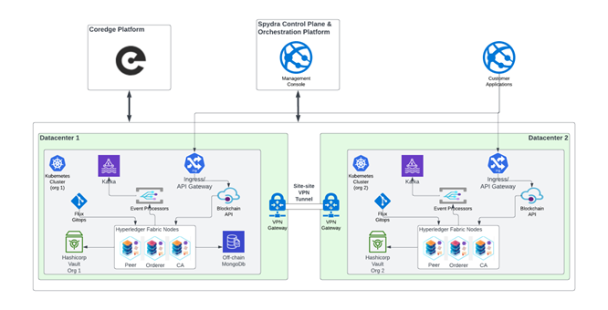

# Production Grade Enterprise Deployment of Hyperledger Fabric Whitepaper

## Abstract
This whitepaper provides an approach to deploying Hyperledger Fabric, a leading Open-Source blockchain framework, in enterprise environments using Coredge’s Cloud Orbiter platform. Hyperledger Fabric offers a robust and flexible platform for building distributed ledger solutions, enabling organizations to achieve secure, transparent, and efficient business processes.
Deploying and managing a Hyperledger Fabric production network spanning multiple organizations was time-consuming. The Cloud Orbiter platform made deployment, management, and operating the network seamless.
This whitepaper aims to equip readers with the knowledge and insights to deploy Hyperledger Fabric networks successfully. It explores the core concepts, architectural components, and key considerations involved in the deployment process. Organizations can leverage the power of Hyperledger Fabric to address complex business challenges and unlock new opportunities without worrying about managing the underlying infrastructure.

## Introduction
Blockchain technology has emerged as a transformative force, revolutionizing various industries by enabling secure, transparent, decentralized digital transactions. One prominent blockchain framework that has gained significant traction in enterprise settings is Hyperledger Fabric. Built on Open-Source principles and backed by the Linux Foundation, Hyperledger Fabric offers a robust and flexible platform for developing and deploying enterprise-grade blockchain networks. Hyperledger Fabric is preferred for enterprise blockchain solutions due to its unique architectural design and modular approach. Its core features, such as permissioned network governance, support for private channels, and flexible consensus mechanisms, make it well-suited for various use cases across industries. Whether it's supply chain management, financial services, healthcare, or government, Hyperledger Fabric offers a robust foundation for building secure and scalable blockchain networks.
Coredge provides a platform for a Hyperledger Fabric network to be deployed on any Kubernetes cluster with a single click. A network can be deployed across multiple Kubernetes clusters, which can span multiple locations and data centers. The Cloud Orbiter provides the following capabilities:

- Multi-region, multi-data center deployment of Hyperledger Fabric network.
- Management console for managing the network node, channels, applications etc.
- Full monitoring and visibility related to network performance.
- Document storage using a private network of Interplanetary File System (IPFS).
- Asset tokenization application to easily create and manage assets in the Fabric Blockchain.
- No code smart contract development using UI-based workflows.
- REST and GraphQL APIs to integrate with applications.

Coredge’s Cloud Orbiter provides a comprehensive solution to help you manage workloads more effectively. You can manage your entire application stack in one place using Coredge Kubernetes Platform (CKP), which features a powerful automation capability, robust security, and an intuitive user interface.
Cloud Orbiter helps you to streamline workflow and reduce complexity by managing applications, infrastructure, edge sites, and devices. It provides centralized management of your application deployment and infrastructure management needs. Coredge’s solution allows you to manage and monitor all your workloads and applications from one convenient location. 

Cloud Orbiter provides the following capabilities:
- Centralized infrastructure management.
- Application orchestration: Applications can be deployed on any cluster or VM, whether in the cloud, on-premises or at the edge, streamlining workflows and simplifying cluster life cycle management for bare metal servers or virtual machines 
- Monitoring, alert notification, KPIs, event logging, metering, and troubleshooting of workloads on infrastructure and applications with comprehensive observability features.
- Marketplace of applications and services to enhance flexibility and scalability in deploying and managing workloads.
- Central IAM and RBAC Controls: Efficiently manage user access and permissions with centralized Identity and Access Management and Role-Based Access Control for enhanced multi-tenancy support.

## Architecture Overview
The below diagram shows the overall solution which consists of the Hyperledger Fabric network deployed across multiple data centers and organizations.

The Hyperledger Fabric solution and related components are deployed on Kubernetes clusters. Each organization that is a part of the Blockchain network can decide which data center and region they want to host their nodes in. Organizations can also choose to have a dedicated Kubernetes cluster to host their resources or share the underlying cluster with other organizations that are part of the network.
The deployment process consists of the following high-level steps.
- Deploy Kubernetes cluster on your own DC or any public cloud using Cloud Orbiter or organizations can simply import existing Kubernetes clusters and start managing.
- Connect multiple data center networks using Cloud Orbiter secure connect or any other existing inter-connectivity solutions that already exist.
- Bootstrap the Kubernetes cluster with the initial network setup. This can be done using the simple step as search for Spydra addon on Cloud Orbiter and install which would install the required components to bootstrap the network.
- Once the network is bootstrapped, further configuration and maintenance of the network are done through GitOps using Flux which is deployed as a pod during the bootstrapping process.

<svg viewBox="0 0 700 220" width="100%" xmlns="http://www.w3.org/2000/svg" fontFamily="Inter, Segoe UI, sans-serif">
  <defs>
    <linearGradient id="wpStepBg" x1="0%" y1="0%" x2="0%" y2="100%">
      <stop offset="0%" stopColor="#0f172a"/>
      <stop offset="100%" stopColor="#1e293b"/>
    </linearGradient>
    <linearGradient id="wpStep1" x1="0%" y1="0%" x2="100%" y2="100%">
      <stop offset="0%" stopColor="#1d4ed8"/>
      <stop offset="100%" stopColor="#2563eb"/>
    </linearGradient>
    <linearGradient id="wpStep2" x1="0%" y1="0%" x2="100%" y2="100%">
      <stop offset="0%" stopColor="#065f46"/>
      <stop offset="100%" stopColor="#047857"/>
    </linearGradient>
    <linearGradient id="wpStep3" x1="0%" y1="0%" x2="100%" y2="100%">
      <stop offset="0%" stopColor="#7c3aed"/>
      <stop offset="100%" stopColor="#8b5cf6"/>
    </linearGradient>
    <linearGradient id="wpStep4" x1="0%" y1="0%" x2="100%" y2="100%">
      <stop offset="0%" stopColor="#b45309"/>
      <stop offset="100%" stopColor="#d97706"/>
    </linearGradient>
    <marker id="wpArr" markerWidth="8" markerHeight="8" refX="6" refY="4" orient="auto">
      <polygon points="0 0, 8 4, 0 8" fill="#475569"/>
    </marker>
  </defs>
  <rect width="700" height="220" fill="url(#wpStepBg)" rx="12"/>
  <text x="350" y="28" textAnchor="middle" fill="#f1f5f9" fontSize="14" fontWeight="700">Hyperledger Fabric Deployment Flow</text>
  <text x="350" y="44" textAnchor="middle" fill="#94a3b8" fontSize="9.5">Cloud Orbiter · Multi-Data Center · GitOps-Driven</text>

  <!-- Step boxes -->
  <rect x="28" y="62" width="140" height="70" rx="8" fill="url(#wpStep1)"/>
  <text x="98" y="84" textAnchor="middle" fill="#bfdbfe" fontSize="9" fontWeight="600" letterSpacing="0.5">STEP 1</text>
  <text x="98" y="99" textAnchor="middle" fill="#e0f2fe" fontSize="9.5" fontWeight="500">Deploy / Import</text>
  <text x="98" y="113" textAnchor="middle" fill="#bfdbfe" fontSize="8.5">Kubernetes Cluster</text>
  <text x="98" y="125" textAnchor="middle" fill="#93c5fd" fontSize="8">Cloud Orbiter · CKP</text>

  <line x1="168" y1="97" x2="188" y2="97" stroke="#475569" strokeWidth="2" markerEnd="url(#wpArr)"/>

  <rect x="188" y="62" width="140" height="70" rx="8" fill="url(#wpStep2)"/>
  <text x="258" y="84" textAnchor="middle" fill="#a7f3d0" fontSize="9" fontWeight="600" letterSpacing="0.5">STEP 2</text>
  <text x="258" y="99" textAnchor="middle" fill="#d1fae5" fontSize="9.5" fontWeight="500">Connect Networks</text>
  <text x="258" y="113" textAnchor="middle" fill="#a7f3d0" fontSize="8.5">Cloud Orbiter Secure</text>
  <text x="258" y="125" textAnchor="middle" fill="#6ee7b7" fontSize="8">Connect · Inter-DC Links</text>

  <line x1="328" y1="97" x2="348" y2="97" stroke="#475569" strokeWidth="2" markerEnd="url(#wpArr)"/>

  <rect x="348" y="62" width="140" height="70" rx="8" fill="url(#wpStep3)"/>
  <text x="418" y="84" textAnchor="middle" fill="#ddd6fe" fontSize="9" fontWeight="600" letterSpacing="0.5">STEP 3</text>
  <text x="418" y="99" textAnchor="middle" fill="#ede9fe" fontSize="9.5" fontWeight="500">Bootstrap Network</text>
  <text x="418" y="113" textAnchor="middle" fill="#ddd6fe" fontSize="8.5">Install Spydra Add-On</text>
  <text x="418" y="125" textAnchor="middle" fill="#c4b5fd" fontSize="8">via Cloud Orbiter</text>

  <line x1="488" y1="97" x2="508" y2="97" stroke="#475569" strokeWidth="2" markerEnd="url(#wpArr)"/>

  <rect x="508" y="62" width="162" height="70" rx="8" fill="url(#wpStep4)"/>
  <text x="589" y="84" textAnchor="middle" fill="#fef3c7" fontSize="9" fontWeight="600" letterSpacing="0.5">STEP 4</text>
  <text x="589" y="99" textAnchor="middle" fill="#fef9c3" fontSize="9.5" fontWeight="500">GitOps Management</text>
  <text x="589" y="113" textAnchor="middle" fill="#fde68a" fontSize="8.5">Flux · Continuous Delivery</text>
  <text x="589" y="125" textAnchor="middle" fill="#fcd34d" fontSize="8">Config · Maintenance · Updates</text>

  <!-- Bottom note -->
  <text x="350" y="160" textAnchor="middle" fill="#64748b" fontSize="9">Each organisation chooses its own data centre and Kubernetes cluster</text>
  <text x="350" y="175" textAnchor="middle" fill="#64748b" fontSize="9">Vault instance per org · TLS by default · Certificate Authority per organisation</text>
  <rect x="28" y="188" width="644" height="20" rx="4" fill="#0f2a3d" fillOpacity="0.6"/>
  <text x="350" y="202" textAnchor="middle" fill="#7dd3fc" fontSize="9">Spydra Control Plane &amp; Orchestration Platform · Hyperledger Fabric · Cloud Orbiter</text>
</svg>

## Security
Ensuring robust security and maintaining data privacy are critical considerations when deploying Hyperledger Fabric networks. As enterprise blockchain solutions handle sensitive information and facilitate trusted transactions, it is imperative to implement effective security measures and privacy controls. The Fabric network deployed inherently is secure by default and there are various features inbuilt that can be used to further enhance the security posture of the network:

- Every cluster or DC added to the network is secure by the Unified RBAC of Cloud Orbiter.
- Cloud Orbiter helps to achieve a Multi-Tenancy in Kubernetes and allows infrastructure admins to impose granular access permissions even on the namespace level.  
- Every organization decides where its resources are hosted. So, there is data isolation between the organizations in the blockchain by default.
- Every organization gets a vault instance by default which runs in the corresponding Kubernetes cluster. This vault is used to securely store all the certificates, keys, and credentials needed to run the solution.
- Organizations can also bring in their own Vault instead of using the default provided vault.
- All the communications between all the components are protected using TLS by default.
- Hyperledger Fabric participants (nodes, users, applications) need to authenticate using certificates. A certificate authority is provided by default per organization which is used to issue the certificates required for all entities within an organization.
- Organizations can bring their own Root certificate also instead of the default provided one.
- **Data Protection:** Cloud Orbiter provides essential data security features like pre-backup or post-backup triggers for custom operations, scheduled backups, and retention schedules.
- **Disaster Recovery:** lowers the amount of time it takes for infrastructure loss, data leakage, and service interruptions to recover.
- **Data Migration:** With Cloud Orbiter’s backup and recovery swiftly migrating the Kubernetes resources from one cluster to another provides cluster portability.
- **Zero Trust Security:** Cloud Orbiter ensures a high level of security for the managed infrastructure.
- **Scalable Multi-cluster Management:** Cloud Orbiter allows IT teams to efficiently manage multiple clusters at scale with governance and enterprise-grade security.
- **Continuous deployment:** Cloud Orbiter supports Continuous Delivery, allowing you to automate the deployment process and quickly roll out updates to your applications, infrastructure, and services.
- **Version control:** Cloud Orbiter platform uses Git as the source of truth for your infrastructure and application deployment, enabling version control for your deployments. You can easily track changes, rollbacks, and updates to your deployments with GitOps automation.
- **Application updates:** With GitOps automation, you can easily deploy updates to your applications, infrastructure, and services. This enables you to improve application reliability and scalability while reducing downtime and risk.

<svg viewBox="0 0 700 300" width="100%" xmlns="http://www.w3.org/2000/svg" fontFamily="Inter, Segoe UI, sans-serif">
  <defs>
    <linearGradient id="secBg" x1="0%" y1="0%" x2="0%" y2="100%">
      <stop offset="0%" stopColor="#0f172a"/>
      <stop offset="100%" stopColor="#1e293b"/>
    </linearGradient>
    <linearGradient id="secOrg1" x1="0%" y1="0%" x2="100%" y2="100%">
      <stop offset="0%" stopColor="#1e3a5f"/>
      <stop offset="100%" stopColor="#1e4976"/>
    </linearGradient>
    <linearGradient id="secOrg2" x1="0%" y1="0%" x2="100%" y2="100%">
      <stop offset="0%" stopColor="#1a3a2a"/>
      <stop offset="100%" stopColor="#1a4a32"/>
    </linearGradient>
    <linearGradient id="secCenter" x1="0%" y1="0%" x2="100%" y2="100%">
      <stop offset="0%" stopColor="#4c1d95"/>
      <stop offset="100%" stopColor="#6d28d9"/>
    </linearGradient>
  </defs>
  <rect width="700" height="300" fill="url(#secBg)" rx="12"/>
  <text x="350" y="26" textAnchor="middle" fill="#f1f5f9" fontSize="14" fontWeight="700">Security Architecture</text>
  <text x="350" y="42" textAnchor="middle" fill="#94a3b8" fontSize="9.5">Zero-Trust · Multi-Org Isolation · TLS Everywhere</text>

  <!-- Org A -->
  <rect x="22" y="56" width="190" height="200" rx="8" fill="url(#secOrg1)" fillOpacity="0.9"/>
  <text x="117" y="74" textAnchor="middle" fill="#bae6fd" fontSize="10" fontWeight="600">Organisation A</text>
  <text x="117" y="87" textAnchor="middle" fill="#7dd3fc" fontSize="8.5">Datacenter 1</text>
  <rect x="38" y="96" width="158" height="22" rx="4" fill="#0c2a4a" fillOpacity="0.8"/>
  <text x="117" y="111" textAnchor="middle" fill="#93c5fd" fontSize="9">Kubernetes Cluster (CKP)</text>
  <rect x="38" y="124" width="158" height="22" rx="4" fill="#0c2a4a" fillOpacity="0.8"/>
  <text x="117" y="139" textAnchor="middle" fill="#93c5fd" fontSize="9">Vault · Certificates · Keys</text>
  <rect x="38" y="152" width="158" height="22" rx="4" fill="#0c2a4a" fillOpacity="0.8"/>
  <text x="117" y="167" textAnchor="middle" fill="#93c5fd" fontSize="9">Certificate Authority (CA)</text>
  <rect x="38" y="180" width="158" height="22" rx="4" fill="#0c2a4a" fillOpacity="0.8"/>
  <text x="117" y="195" textAnchor="middle" fill="#93c5fd" fontSize="9">Fabric Peers · Orderers</text>
  <rect x="38" y="208" width="158" height="22" rx="4" fill="#0c2a4a" fillOpacity="0.8"/>
  <text x="117" y="223" textAnchor="middle" fill="#93c5fd" fontSize="9">RBAC · Namespace Isolation</text>

  <!-- Center: Cloud Orbiter -->
  <rect x="248" y="90" width="204" height="136" rx="8" fill="url(#secCenter)" fillOpacity="0.9"/>
  <text x="350" y="110" textAnchor="middle" fill="#ede9fe" fontSize="11" fontWeight="700">Cloud Orbiter</text>
  <text x="350" y="124" textAnchor="middle" fill="#c4b5fd" fontSize="8.5">Universal Control Plane</text>
  <rect x="262" y="132" width="176" height="18" rx="3" fill="#3b1b7a" fillOpacity="0.8"/>
  <text x="350" y="145" textAnchor="middle" fill="#ddd6fe" fontSize="8.5">Unified RBAC · Multi-Tenancy</text>
  <rect x="262" y="155" width="176" height="18" rx="3" fill="#3b1b7a" fillOpacity="0.8"/>
  <text x="350" y="168" textAnchor="middle" fill="#ddd6fe" fontSize="8.5">GitOps (Flux) · Continuous Delivery</text>
  <rect x="262" y="178" width="176" height="18" rx="3" fill="#3b1b7a" fillOpacity="0.8"/>
  <text x="350" y="191" textAnchor="middle" fill="#ddd6fe" fontSize="8.5">Backup · Disaster Recovery</text>
  <rect x="262" y="201" width="176" height="18" rx="3" fill="#3b1b7a" fillOpacity="0.8"/>
  <text x="350" y="214" textAnchor="middle" fill="#ddd6fe" fontSize="8.5">TLS · Zero Trust · Monitoring</text>

  <!-- Org B -->
  <rect x="488" y="56" width="190" height="200" rx="8" fill="url(#secOrg2)" fillOpacity="0.9"/>
  <text x="583" y="74" textAnchor="middle" fill="#bbf7d0" fontSize="10" fontWeight="600">Organisation B</text>
  <text x="583" y="87" textAnchor="middle" fill="#86efac" fontSize="8.5">Datacenter 2</text>
  <rect x="504" y="96" width="158" height="22" rx="4" fill="#0c2a1a" fillOpacity="0.8"/>
  <text x="583" y="111" textAnchor="middle" fill="#86efac" fontSize="9">Kubernetes Cluster (CKP)</text>
  <rect x="504" y="124" width="158" height="22" rx="4" fill="#0c2a1a" fillOpacity="0.8"/>
  <text x="583" y="139" textAnchor="middle" fill="#86efac" fontSize="9">Vault · Certificates · Keys</text>
  <rect x="504" y="152" width="158" height="22" rx="4" fill="#0c2a1a" fillOpacity="0.8"/>
  <text x="583" y="167" textAnchor="middle" fill="#86efac" fontSize="9">Certificate Authority (CA)</text>
  <rect x="504" y="180" width="158" height="22" rx="4" fill="#0c2a1a" fillOpacity="0.8"/>
  <text x="583" y="195" textAnchor="middle" fill="#86efac" fontSize="9">Fabric Peers · Orderers</text>
  <rect x="504" y="208" width="158" height="22" rx="4" fill="#0c2a1a" fillOpacity="0.8"/>
  <text x="583" y="223" textAnchor="middle" fill="#86efac" fontSize="9">RBAC · Namespace Isolation</text>

  <!-- Arrows -->
  <line x1="212" y1="156" x2="246" y2="156" stroke="#475569" strokeWidth="1.5" strokeDasharray="4 3"/>
  <line x1="452" y1="156" x2="486" y2="156" stroke="#475569" strokeWidth="1.5" strokeDasharray="4 3"/>

  <!-- TLS label -->
  <text x="229" y="150" textAnchor="middle" fill="#64748b" fontSize="7.5">TLS</text>
  <text x="469" y="150" textAnchor="middle" fill="#64748b" fontSize="7.5">TLS</text>

  <text x="350" y="278" textAnchor="middle" fill="#475569" fontSize="8.5">Each org controls its own data · Shared ledger via Hyperledger Fabric channels</text>
</svg>

### Conclusion
In conclusion, Hyperledger Fabric offers a robust and flexible framework for enterprises seeking to harness the potential of blockchain technology. **Coredge's Cloud Orbiter** platform together provides a simplified, secure and reliable way of deploying production-grade enterprise networks spanning multiple data centers and different organizational boundaries. With a solid understanding of the deployment process, architectural considerations, and security measures, organizations are well-equipped to embark on their own blockchain initiatives, driving digital transformation, and unlocking new possibilities in their respective industries.

---

[Download PDF](/downloads/whitepapers/Cloud%20Orbiter-Whitepaper.pdf)
